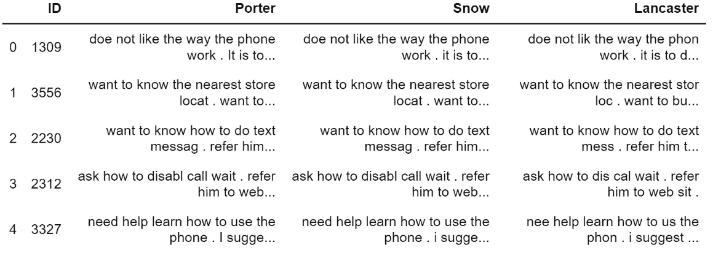

# 将文本特征并入分类项目

> 原文：<https://towardsdatascience.com/integrate-text-content-into-classification-project-eddd8e18a7e9?source=collection_archive---------41----------------------->

## 比较了波特、斯诺鲍和兰开斯特·斯特默斯。将评论整合到客户数据中，以提高模型的性能。


[图像来源](https://unsplash.com/photos/lud4OaUCP4Q)

# 内容表

*   [项目总结](#acad)
*   [数据](#aba4)
*   [文本挖掘](#e053)
*   [建模](#3206)
*   [结论](#dd58)

# 项目摘要

该项目旨在研究非结构化文本数据如何为机器学习分类项目增加价值。

我有来自一家公司的两个数据集。其中一个包含了所有客户的基本信息。customer 数据集也有 target 列，它指示客户是持有成员资格还是已经取消了成员资格。另一个数据集包含客户留给公司的评论。我的任务是将顾客的评论与顾客现有的信息结合起来，预测他们是否会取消或保留会员资格。

在这个项目中，我研究了如何使用自然语言工具包(NLTK)将文本挖掘技术整合到机器学习模型中，以提高二元分类的性能。

我在这个项目中使用了 Porter stemmer、Snowball stemmer、Lancaster stemmer、word_tokenize、CountVectorizer、TfidfTransformer、LabelEncoder、XGBClassifier 和 CatBoostClassifier。我选择 ROC 分数作为主要的评估标准。

点击[此处](#f49d)返回顶部

# 数据

客户数据集有 2070 条记录和 17 个变量，包括每个客户的 ID。评论数据集包含公司从每个客户那里收集的信息。

图 1 显示了目标列的频率。其中 1266 人是该公司的会员，804 人已经取消了会员资格。我认为这是非常平衡的数据，所以我没有应用过采样技术。


图 1 —目标的频率

因为我要计算 ROC 得分，所以我将目标值转换为二进制变量。代码如下:

```
# Encoding the Targetle = LabelEncoder()label = le.fit(customer["TARGET"]).transform(customer["TARGET"])
```

点击[此处](#f49d)返回页首

# 文本挖掘

首先，我必须标记注释。原始评论可能包含错别字、无关内容、冗余信息等，这些会增加计算负担并降低模型的效率。利用分词器将这些句子分解成单个的单词使我能够提取评论的核心信息。图 2 比较了原始注释和标记化注释。

```
# First, tokenize the comments
comment["TokenizedComments"]
        =comment["Comments"].apply(word_tokenize)comment.head()
```


图 2 —标记化的注释

为了减少高维度，我应用了三种不同的词干分析器:Porter、Snowball (Porter 2)和 Lancaster。图 3 显示了不同算法的输出。每一种都有利弊。我们可以看看这里:



图 3 —不同词干分析器的输出

> 1.看起来 Porter 倾向于保存原始内容的大写或小写
> 
> 2.兰卡斯特非常好斗。例如，对于 ID 3034，当其他两个保留单词“nee”时，Lancaster 将其转换为“nee”
> 
> 3.波特也很难识别简单的单词。例如，在大多数情况下，波特不知何故将“his”转换成了“hi”
> 
> 4.因此，我选择了 Snowball stemmer 来完成项目的剩余部分

词干化之后，我构建了术语-文档矩阵并删除了停用词。术语文档矩阵的维数是 2070×354。它可以告诉我们一个特定的单词是否存在于一个特定的文档中。

```
# Contruct term-document matrix
count_vect = CountVectorizer(stop_words='english',lowercase=False)TD_counts = count_vect.fit_transform(newTextData["Snow"])DF_TD_Counts=pd.DataFrame(TD_counts.toarray())DF_TD_Counts.columns = count_vect.get_feature_names()
```


图 4 —术语文档矩阵

然后，我从术语文档矩阵中构造了 TF-IDF 矩阵。有许多方法可以量化文档集合中的文本内容，比如可读性分数。在我之前的一篇博客中，我也写过关于计算[样板分数](/use-r-to-calculate-boilerplate-for-accounting-analysis-f4a5b64e9b0d)的内容，这也是一种量化文本内容的方法。TF-IDF 是最常见的量化方法之一，用于评估一个单词与文档集合中的一个文档的相关程度。图 5 是 TF-IDF 矩阵的一部分。

```
#Compute TF-IDF Matrix
tfidf_transformer = TfidfTransformer()tfidf = tfidf_transformer.fit_transform(TD_counts)DF_TF_IDF=pd.DataFrame(tfidf.toarray())DF_TF_IDF.columns=count_vect.get_feature_names()
```


图 5 — TFIDF 矩阵

在构建了 TF-IDF 矩阵之后，我将该矩阵与原始客户数据集相结合。组合数据集有 2070 条记录和 387 列。

点击[此处](#f49d)返回页首

# 建模

为了验证我构建的模型，比较原始数据和组合数据，并避免过度拟合，我将两个数据集分别以 4:1 的比例分为训练数据集和测试数据集。

```
# split data at 80% 20% for orginal data and combined datadata_train, data_test, label_train, label_test = 
     train_test_split (pd.get_dummies(data.drop(["ID"],axis=1), 
                       test_size = 0.2, random_state = 42)X_train, X_test, y_train, y_test = train_test_split(EncodeData.drop(["ID"],axis=1), label, 
                 test_size = 0.2, random_state = 42)
```

首先，我对没有 TF-IDF 矩阵的数据应用了 CatBoost 和 XGBoost。输出如图 6 和图 7 所示。

```
cat=CatBoostClassifier()
cat.fit(data_train,label_train)
cat_predictions = cat.predict_proba(data_test)
```


图 CatBoostClassifier 的分类报告

```
xgb = XGBClassifier()
xgb.fit(data_train,label_train)
xgb_predictions = xgb.predict_proba(data_test)
```


图 XGBClassifier 的分类报告

然后，我把同样的模型应用到综合数据中。CatBoost 和 XGBoost 的 ROC 得分分别为 ***0.917173*** 和 ***0.911844*** 。图 8 显示了 CatBoost 模型的对数损失如何随着学习轮次的增加而变化。


图 8-CatBoostClassifier 学习曲线

图 9 是 CatBoostClassifier 结合数据的分类报告，这也是我在这个项目中得到的最好的结果。


图 9-包含组合数据的 catboost 分类器的分类报告

点击[此处](#f49d)返回顶部

# 结论

我比较了三种不同的词干法:波特、雪球和兰卡斯特。兰开斯特比另外两个梗工更有侵略性。波特倾向于保留更多的信息，并且很难识别最基本的单词，比如“他的”斯诺鲍似乎落在了另外两个词干作者之间:不像兰开斯特那样咄咄逼人，但保持了基本的词。

量化文本特征并将其添加到机器学习模型中有助于捕捉原始数据中不会发现的信息。此外，TF-IDF 并不是唯一有帮助的方法。通过改变量化文本内容的方式，可以进一步改进模型。

你可以在这里找到代码和数据。

点击[此处](#f49d)返回页首

## 以前的文章:

[](https://medium.com/analytics-vidhya/analyzing-disease-co-occurrence-using-networkx-gephi-and-node2vec-53941da35a0f)

[简单加权平均集成|机器学习](https://medium.com/analytics-vidhya/simple-weighted-average-ensemble-machine-learning-777824852426)

[使用 R 计算用于会计分析的样板文件](/use-r-to-calculate-boilerplate-for-accounting-analysis-f4a5b64e9b0d)