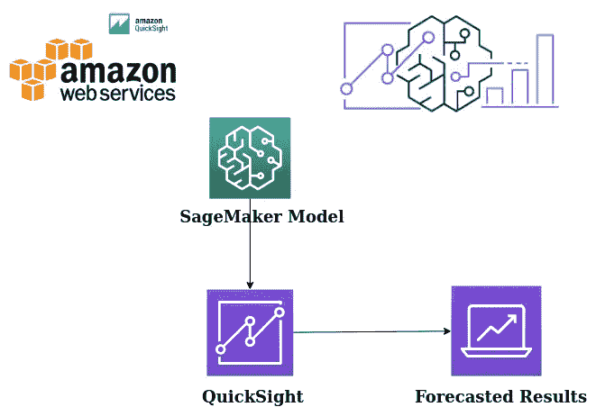
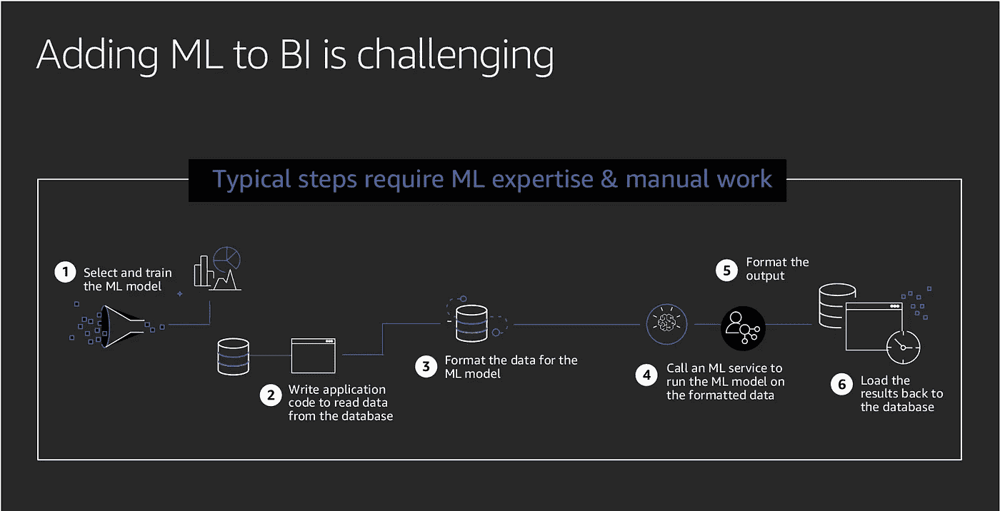
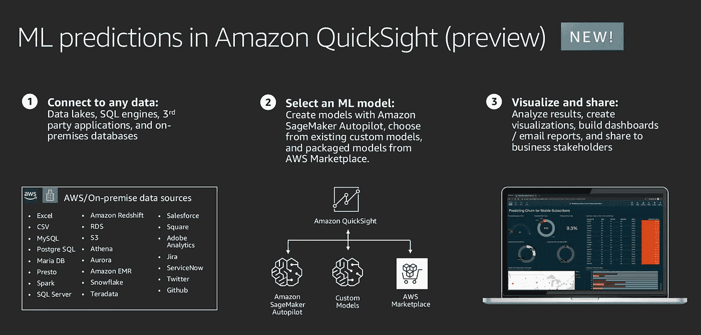
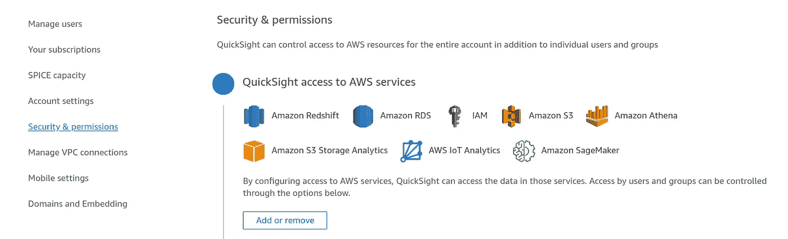
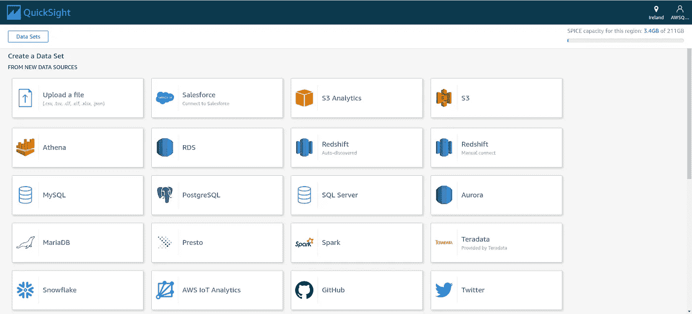
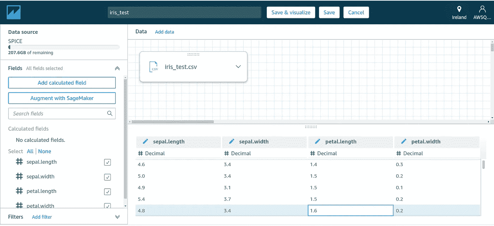
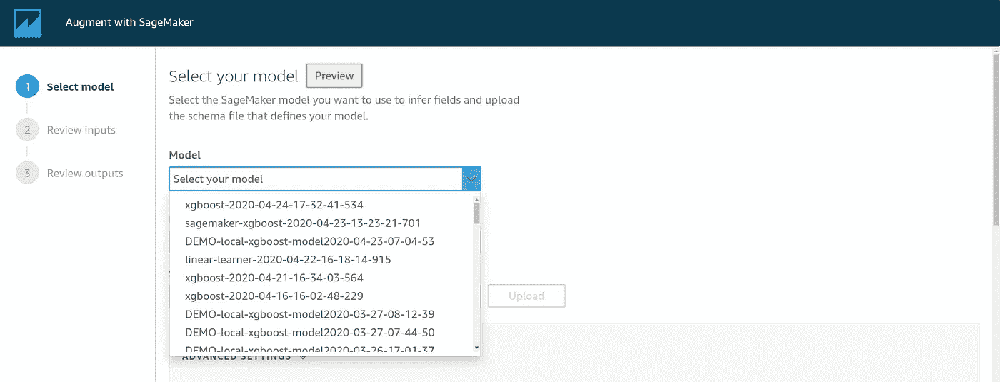
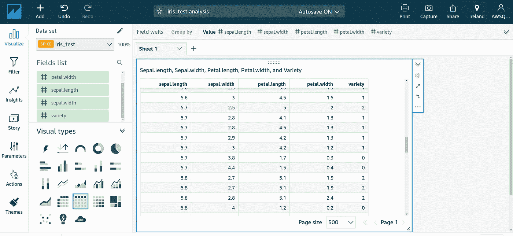

# 将亚马逊 SageMaker 机器学习模型与 QuickSight 集成。

> 原文：<https://towardsdatascience.com/integrating-aws-sagemaker-models-with-quicksight-acfe9e5e9cf1?source=collection_archive---------32----------------------->

## 使用 Amazon SageMaker 和 QuickSight 构建的增强机器学习模型概述。

您是否想过如何以更简单的方式将 ML 预测添加到您的 BI 平台中，并与商业客户分享？放心吧！AWS ML Insights 的一个用 SageMaker 增强的 QuickSight 已经覆盖了你！

假设您已经构建了一个优化的模型，并获得了 x%的精度。但是在实时场景中，将模型引入生产并分享商业见解是很重要的。

将 SageMaker 模型与 QuickSight 集成(使用 app.diagrams.net 设计)

将 ML 预测添加到 BI 的典型步骤需要开发人员参与更新结果。传统上，将来自训练模型的预测输入到 BI 工具中需要相当大的工作量。您必须编写代码将数据 ETL 到亚马逊简单存储服务(亚马逊 S3)，调用推理 API 来获得预测，将来自亚马逊 S3 的模型输出 ETL 到可查询的源，每当新数据可用时编排该过程，并为每个模型重复该工作流。推理端点使得模型的使用更加容易，但是代价是在不使用时可能会产生费用。最后，您使用像 Excel 这样的第三方工具来执行分析和报告预测，这使得向大量用户更新和共享结果变得困难。从模型中获取价值的端到端过程是无差别的，在模型的预测到达业务决策者手中之前，可能需要几天或几周的时间。

来源:AWS re:Invent 2019。

将 QuickSight 与 SageMaker 集成在一起，可以更轻松地添加预测、分享见解，同时减少开发人员的参与。QuickSight 中的 SageMaker 推理消除了管理数据移动和编写代码的需要。QuickSight 负责繁重的工作:从数据源中提取数据，对数据进行分块，通过 SageMaker 批处理转换作业运行数据，并清理和存储推理结果以进行可视化和报告。您只需将 QuickSight 指向您的数据和 SageMaker 模型，它就会管理端到端流程。QuickSight 还负责编排，因此您可以安排它在午夜有新数据时运行，或者以编程方式触发新的推理。

来源:AWS re:Invent 2019。

1.  您可以根据需要选择数据源。
2.  ML 模型可以从 AWS MarketPlace、SageMaker Autopilot(它自动为输入数据创建模型)或您的自定义模型中使用。

在这里，我将解释用 QuickSight 增强定制的虹膜分类模型。在扩充之前，确保 QuickSight 管理员授予进行 Sagemaker API 调用的权限。

向 QuickSIght 添加 SageMaker 权限。

# 涉及的步骤:

## 1 .连接到数据或上传数据

数据源

注意:您的数据必须只包含输入列，使用 SageMaker 增加的模型预测并追加输出列。

## 2.单击编辑设置和预览数据

## 3.点击用 SageMaker 增强

## **4。选择您的型号**

## 5.上传模式( **JSON 格式**)文件

**注意:**允许的数据类型有整数(整数值)、小数(浮点值)、字符串(日期、分类变量等)..)

## 6.映射输入和输出数据字段。

## 7.单击下一步，保存并可视化

**注意:**至少需要 4 分钟来执行批量转换作业，并将预测的输出附加到给定的测试数据集。

预测结果作为列追加。

关于构建定制模型、定义模式文件、添加 SageMaker 的详细说明可以在[这里](https://github.com/developers-cosmos/Explore-AWS-Quicksight/tree/master/Augment-Quicksight-with-Sagemaker)找到。

# 结论:

将 Amazon QuickSight 与 Amazon SageMaker 模型结合使用可以节省您管理数据移动和编写代码的时间。结果对于评估模型非常有用，当您对结果满意时，还可以与决策者分享。您可以在模型构建完成后立即开始。这样做可以展现数据科学家的预建模型，并使您能够将数据科学应用于数据集。然后，您可以在预测仪表板中分享这些见解。使用 Amazon QuickSight 无服务器方法，该过程可以无缝扩展，因此您不需要担心推理或查询能力。

# 最后的想法..

我将在试验其他 ML 见解时回复你，例如**预测时间序列和异常检测。**

# 取得联系

希望你觉得它很有见地。我很乐意听到你的反馈，以即兴发挥，使之更好！。如果你想联系，**在**[**LinkedIn**](https://www.linkedin.com/in/findtharun/)上联系我。感谢阅读！