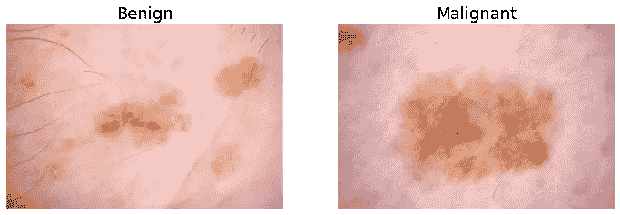
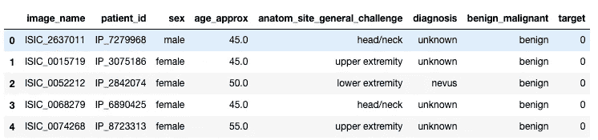
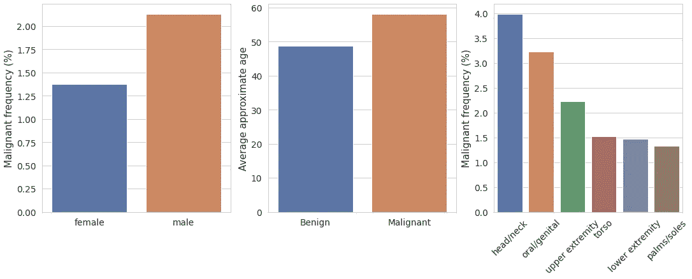
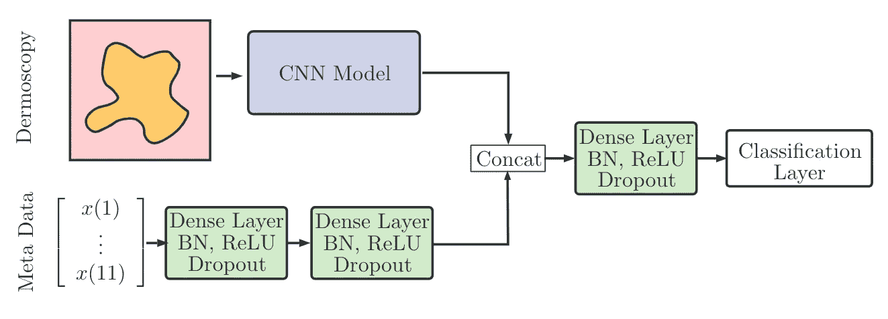
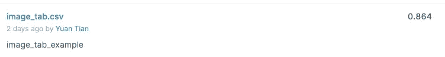

# 集成图像和表格数据用于深度学习

> 原文：<https://towardsdatascience.com/integrating-image-and-tabular-data-for-deep-learning-9281397c7318?source=collection_archive---------15----------------------->

## 使用 fastai 和 image_tabular 整合用于深度学习的图像和表格数据，并使用整合的数据训练联合模型


凯文·Ku 在 [Unsplash](/s/photos/machine-learning?utm_source=unsplash&utm_medium=referral&utm_content=creditCopyText) 上拍摄的照片。由[设计的图标被美化](https://www.iconfinder.com/ibrandify)。

我最近在 Kaggle 上参加了 [SIIM-ISIC 黑色素瘤分类](https://www.kaggle.com/c/siim-isic-melanoma-classification)竞赛。在这场比赛中，参与者被要求识别皮肤病变图像中的黑色素瘤。有趣的是，除了图像之外，它们还提供关于患者和解剖位置的元数据。本质上，对于每个示例，我们都有图像和结构化或表格数据。对于图像，我们可以使用基于 CNN 的模型，对于表格数据，我们可以使用嵌入和完全连接的层，正如我在以前关于 UFC 和英雄联盟预测的文章中所探讨的。很容易为每个数据形态建立两个独立的模型。但是，如果我们想建立一个联合模型，同时训练两种数据形态呢？比赛论坛里有鼓舞人心的讨论包括这个[的帖子](https://www.kaggle.com/c/siim-isic-melanoma-classification/discussion/155251)。在这篇文章中，我将演示如何集成这两种数据模式，并使用 fastai 和我专门为这些任务创建的 [image_tabular](https://github.com/naity/image_tabular) 库来训练一个联合深度学习模型。

# SIIM-国际标准行业分类数据集

SIIM-ISIC 黑色素瘤分类数据集可以在这里下载[。训练集由 32542 幅良性图像和 584 幅恶性黑色素瘤图像组成。请注意，这个数据集极度不平衡。下图显示了每个班级的一个例子。恶性病变似乎比良性病变更大、更弥散。](https://www.kaggle.com/c/siim-isic-melanoma-classification/data)



良性对恶性

如上所述，除了图像之外，还有如下所示的元数据:



作为熊猫数据框架的元数据

我们可以执行一些基本分析来调查这些特征中的一些是否与目标相关联。有趣的是，男性比女性更容易患恶性黑色素瘤，年龄似乎也是患恶性黑色素瘤的一个风险因素，如下图所示。此外，恶性黑色素瘤的频率在成像部位的位置之间不同，其中头/颈显示最高的恶性率。因此，这些特征包含有用的信息，将它们与图像结合可以帮助我们的模型做出更好的预测。这是有意义的，因为医生可能不仅会检查皮肤病变的图像，还会考虑其他因素以做出诊断。



元数据特征与目标相关联

# 方法

我们整合图像和表格数据的方法与 ISIC 2019 皮肤病变分类挑战赛获胜者采用的方法非常相似，正如他们在[论文](https://www.sciencedirect.com/science/article/pii/S2215016120300832)中所述，如下图所示。基本上，我们首先加载每个样本的图像和表格数据，分别输入 CNN 模型和完全连接的神经网络。随后，这两个网络的输出将被连接起来，并输入到另一个完全连接的神经网络中，以生成最终预测。



名词（noun 的缩写）Gessert，M. Nielsen 和 M. Shaikh 等人/ MethodsX 7 (2020) 100864

# 用 image_tabular 库实现

为了实现这个想法，我们将使用 Pytorch 和 [fastai](https://github.com/fastai/fastai) 。更具体地说，我们将使用 fastai 加载图像和表格数据，并将它们打包到 fastai LabelLists 中。

接下来，我们将使用 [image_tabular](https://github.com/naity/image_tabular) 库集成这两种数据形态，可以通过运行以下命令来安装:

```
pip install image_tabular
```

我们将使用来自 [image_tabular](https://github.com/naity/image_tabular) 的`get_imagetabdatasets`函数来集成图像和表格标签。

databunch 包含图像和表格数据，可用于训练和预测。

一旦数据准备就绪，我们就可以继续构建模型了。首先，我们需要创建一个 CNN 模型，在本例中是 resnet50，并使用 fastai 创建一个表格模型。我们将性别和解剖位置视为分类特征，并在表格模型中使用[嵌入](https://medium.com/@yuan_tian/predicting-league-of-legends-match-outcome-with-embeddings-and-deep-learning-b7d1446c710f)来表示它们。

我们现在准备构建一个联合模型，再次使用 [image_tabular](https://github.com/naity/image_tabular) 库。我们可以通过指定 layers 参数来自定义完全连接的层。

最后，我们可以把所有东西打包成一个 fastai 学习器，训练联合模型。

整个工作流程都详细记录在这个 Jupyter [笔记本](https://github.com/naity/image_tabular/blob/master/siim_isic_integrated_model.ipynb)里。

# 结果

在训练 15 个时期后，该模型在验证集上获得了约 0.87 的 ROC AUC 分数。我随后将训练好的模型在测试集上做出的预测提交给 Kaggle，得到了 0.864 的公开分数。肯定有很大的提升空间。



Kaggle 公共评分

# 摘要

在本文中，我们使用 fastai 和 image_tabular 来集成图像和表格数据，并构建了一个同时在两种数据模式上训练的联合模型。如上所述，有许多进一步改进的机会。比如可以尝试更高级的 CNN 架构比如 ResNeXt。另一个问题是，在连接之前，我们应该为图像和表格数据分配多少神经元，换句话说，我们应该如何决定这两种数据形式的相对重要性或权重？我希望这可以作为进一步试验和改进的框架。

# 源代码

SIIM-ISIC 黑色素瘤分类竞赛的 image_tabular 和 jupyter 笔记本的源代码可以在[这里](https://github.com/naity/image_tabular)找到。

# 感谢

[image_tabular](https://github.com/naity/image_tabular) 库依赖于神奇的 [fastai](https://github.com/fastai/fastai) 库，并受到 John F. Wu 的[代码](https://gist.github.com/jwuphysics/f19162d38e1b4fed0030b96411186c3a)的启发。

我是一名具有生物信息学和编程技能的免疫学家。我对数据分析、机器学习和深度学习感兴趣。

网址: [www.ytian.me](http://www.ytian.me/)
博客:[https://medium.com/@yuan_tian](https://medium.com/@yuan_tian)领英:[https://www.linkedin.com/in/ytianimmune/](https://www.linkedin.com/in/ytianimmune/)推特:[https://twitter.com/_ytian_](https://twitter.com/_ytian_)