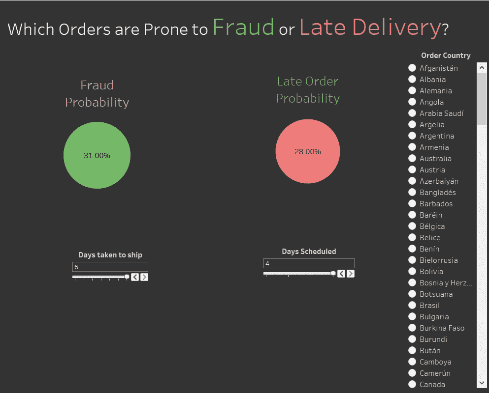
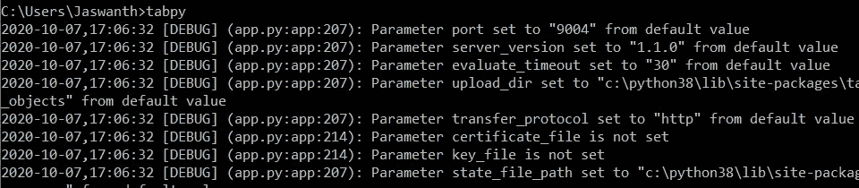
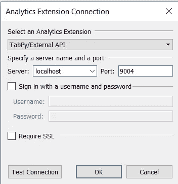
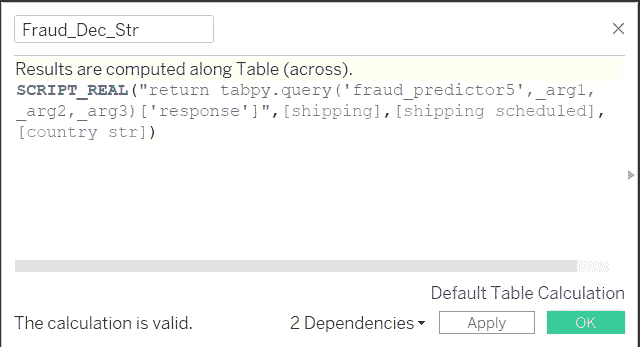
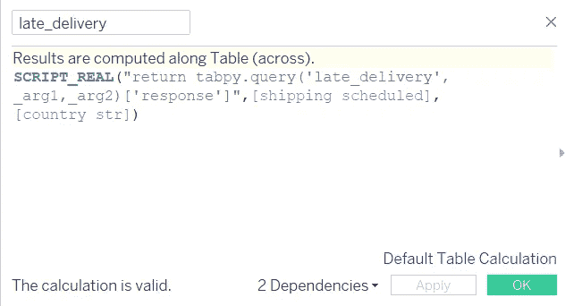

# 将机器学习模型与 Tableau 集成

> 原文：<https://towardsdatascience.com/integrating-machine-learning-models-with-tableau-b484c0e099c5?source=collection_archive---------12----------------------->

## 使用 TabPy 库将 Python 中训练好的机器学习模型直接部署到 tableau 中

[粘土银行](https://unsplash.com/@claybanks?utm_source=medium&utm_medium=referral)在 [Unsplash](https://unsplash.com?utm_source=medium&utm_medium=referral) 拍摄的照片

> **Tableau** 是快速创建交互式数据可视化的非常有效的工具，也是数据科学社区中的顶级工具。所有使用过 tableau 的数据科学家都知道 Tableau 对于数据可视化来说是多么强大和简单。

大多数数据科学家/分析师使用 tableau 来创建令人惊叹的可视化效果，并将可用数据用于演示。然而，对于任何数据科学家来说，以吸引人的方式向最终用户展示经过训练的机器模型与展示探索性数据分析一样重要。假设有一种方法可以直接在 Tableau 中可视化训练过的机器模型，使这个过程更加舒适。从 Jupyter 笔记本到 Tableau 部署训练有素的机器学习比你想象的要容易。这就是 TabPy 有用的地方。本文讨论了使用 **Jupyter notebook** 和 **TabPy** 部署机器学习模型的过程

## 数据

这个项目的数据集由 Fernando Silva 通过 Mendeley 数据仓库使用 Creative Commons 4.0 许可证透明地维护。该数据集由 DataCo Global 公司三年来使用的供应链的大约 18 万笔交易组成。数据集可以在这里[下载](https://data.mendeley.com/datasets/8gx2fvg2k6/5)，因为这是一家供应链公司。确保订单按时交付并防止欺诈至关重要。

我们在这里的目标是建立一个交互式仪表板，用最佳变量来预测欺诈和延迟交付发生的概率，以防止它们发生。

最终仪表板集成了 ML 模型。

## 数据清理和建模

数据集由 52 个变量组成。所有不需要的变量都将被删除，大纲视图也将被移除。在剩余的 40 个变量中，使用前向选择来选择预测欺诈和延迟交付的最佳变量。预测延迟交货的最佳变量是订单国家和为订单安排的装运日期。对于预测欺诈，最佳变量是运送订单所用的实际天数以及订单国家安排的运送天数。为了便于构建仪表板，选择了常见的优化变量。

我用了一个简单的随机森林模型来预测。除了随机森林，可以使用任何机器学习模型，包括复杂的神经网络模型。

## 将模型部署到场景中

Python 3 和 Anaconda 应该安装在设备上。如果你没有安装，你可以直接从他们的网站 [Anaconda](https://www.anaconda.com/products/individual) 和 [Python](https://www.python.org/downloads/) 免费安装。要将 python 环境与 Tableau 连接起来，有一个非常优秀的库叫做 Tabpy，我们需要先安装它。TabPy 运行在 anaconda 环境中，非常容易安装。要安装 TabPy，打开命令提示符并运行下面的命令`pip install tabpy`

一旦安装了 tabpy。我们还需要一个名为 tabpy _ client 的额外库，将 Jupyter 笔记本环境连接到 tableau，并直接部署机器学习模型。甚至这个库也可以使用下面的命令`pip install tabpy_client`安装

一旦成功安装了 tabby，您就可以通过运行`tabpy`来启动 tabby 环境

运行此程序后，您应该会看到一条消息，说明 tabpy 服务器成功启动，并且端口被设置为“9004 ”,类似于下图所示。

如果您在安装 tabby 时遇到任何问题，可以在[tabby GitHub](https://github.com/tableau/TabPy)页面上找到更多信息。

## 将 TabPy 服务器连接到 Tableau

成功安装 tabpy 库后，您可以在 Tableau 桌面中的 Tableau 应用程序设置帮助>设置和性能>管理分析扩展连接中轻松地将 TabPy 服务器连接到 Tableau。在服务器中选择本地主机，并输入端口号。

单击“测试连接”查看您的服务器连接是否成功。如果连接成功。然后你就可以开始把你的机器学习模型直接部署到 Tableau 上了。

1.  要将模型部署到 tableau 中，首先要使用 tabpy_client 将笔记本连接到 Tableau 服务器。
2.  单个函数应该以适合 Tableau 的格式定义。新变量 as _arg1，_arg2 是相对于已训练的机器学习模型中的变量计数来声明的。
3.  假设我们在仪表板中使用的任何变量都在字符串中。它们应该被转换成数字格式。

如果您在部署模型时遇到任何错误，请检查是否所有的库都是最新的。在 deploy 语句中使用“override = True”将会用一个新模型覆盖已经训练好的模型。如果您希望使用新数据再次训练现有模型，这可能会很有帮助。

一旦模型部署成功，就可以在 Tableau 中访问经过训练的模型。

1.  通过导入 CSV 文件将数据加载到 Tableau 中。
2.  接下来，应该使用模型部署代码中使用的相同名称来创建新参数。参数可以是字符串或数字格式，具体取决于您的模型。如果使用字符串，请确保编写了将字符串转换为数字格式的代码。
3.  最后，使用以下脚本创建一个新的计算字段，并传递参数以连接到 TabPy 服务器。

欺诈预测的 Tableau 脚本

延迟交货预测的 Tableau 脚本

根据输出选择 SCRIPT_REAL 或 SCRIPT_STR。一旦你输入脚本，如果你看到“计算是有效的”点击应用，它就完成了。机器学习模型已经准备就绪，现在您可以使用我们创建的参数和计算字段轻松创建交互式可视化。

数据和代码可以在我的 [Github 库](https://github.com/JaswanthBadvelu/tableau_integration)中找到。

希望那有用！非常感谢你读到这里。你真棒！如果你对这篇文章有任何问题，或者想要联系和交谈，请随时在 LinkedIn 上给我发信息[。我将非常乐意与您联系，并尽我所能提供帮助。](https://www.linkedin.com/in/jaswanth-badvelu/)

**错误修复**

有些人在 Linkedin 上联系我，说他们有时会得到“runtime error:Load failed:' Load failed:unsupported pickle protocol:5 '。我猜如果你尝试两次部署同一个 ML 模型，就会发生这种情况，解决这个错误的快速方法是从你的 pc 上删除已经保存的 pickle 模型，或者在 Jupyter notebook 和 Tableau 中用新的名称重新部署这个模型。