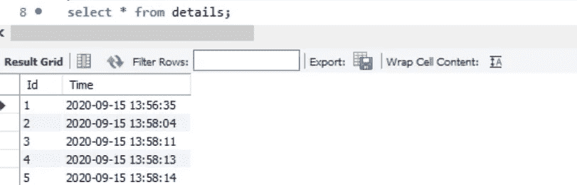

# 集成 Python 和 MySQL

> 原文：<https://towardsdatascience.com/integrating-python-with-mysql-4575248d5929?source=collection_archive---------24----------------------->


汉斯-彼得·高斯特在 Unsplash 上拍摄的照片

## 如何将数据动态加载到数据库中

数据分析师或数据科学家有很多机会使用 Python 和 SQL。Python 及其庞大的库支持为数据分析师提供了一根魔棒来操纵和可视化数据。同样，SQL 帮助我们存储数百万条记录，并与其他表建立关系，以实现最佳的数据管理。有些场景需要 Python 程序将数据直接加载到后端数据库中。例如，如果定期或随机动态修改数据帧，则将每次数据更新的 csv 文件上传到数据库是不可行的。在本帖中，我们将介绍如何将 Python 程序与 MySQL 数据库集成。

首先，我用 Python 创建了一个小数据集。它有两列，第一列存储索引，第二列存储时间戳。

```
from datetime import datetime # Current date time in local system 
col_1 = col_1+1 
col_2 = datetime.now()
print('ID:',col_1)
print('Timestamp:',col_2)
```


**在 MySQL 中创建表格**

同时，我们可以在 MySQL db 中创建一个表，用于存储我们在第一步中生成的数据。也可以在 MySQL 中从 python 本身创建一个表。因为这是一个一次性的过程，所以直接在数据库中创建表会更容易。

```
#Create table called details.
create table `details`(
Id int(20)  not null,
Time datetime null 
);
```


**连接 Python 和 MySQL**

首先，我们需要导入 mysql.connector 包，如果它不可用，那么我们需要使用下面的代码安装它

```
pip install mysql.connector
#or
!pip install mysql.connector
```

我们需要从 mysql.connector 导入错误代码。这将有助于在插入数据库时识别问题(如果有的话)。可能遇到的一些错误是主键空错误和重复条目(如果表设置了主键)。

我们需要在代码中指定我们的 MySQL 凭证。我们首先打开一个到 MySQL 服务器的连接，并将变量 connection 对象存储在变量 *cnct* 中。然后，我们使用连接的 cursor()方法创建一个新的游标。

我们将 insert 语句存储在变量 *sql_query* 中，变量 *info* 中的数据用于替换查询中的%s 标记。

execute 语句将执行存储在变量 *sql_query* 中的查询

一旦执行了上面的代码，让我们检查一下数据库，看看数据是否是动态加载的。


精彩！！数据已经加载。

现在让我们看看如果我运行代码 5 次，数据是如何加载到数据库中的。



每次运行代码或作业时，都会动态加载和刷新数据库。

**结论**

同样，我们可以从 Python 接口本身执行任何操作，如创建数据库或表、插入、更新、删除和选择操作，这将反映在 MySQL 数据库中。

事实证明，这种集成对于涉及不断变化的数据的场景非常有用。例如，经常从网站上搜集的数据，或者从 Twitter 或脸书 feeds 上获取的实时数据。

Jupyter 笔记本在 [Github](https://github.com/Sanjana-Ramankandath/Python_MySQL_integration/blob/master/Integration_Python_MySQL.ipynb) 上有售。

**参考:**

[1][https://dev . MySQL . com/doc/connector-python/en/connector-python-example-cursor-select . html](https://dev.mysql.com/doc/connector-python/en/connector-python-example-cursor-select.html)