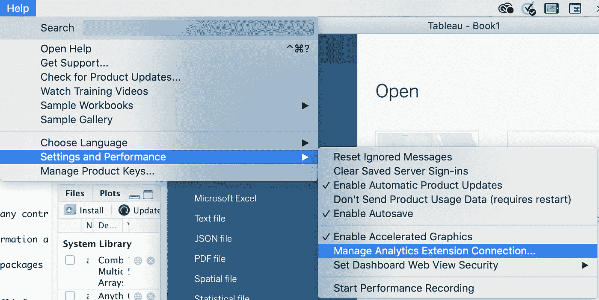
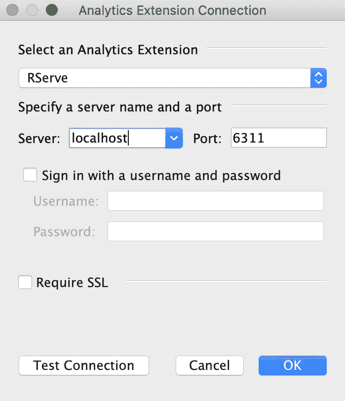
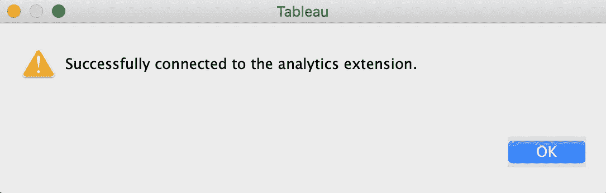
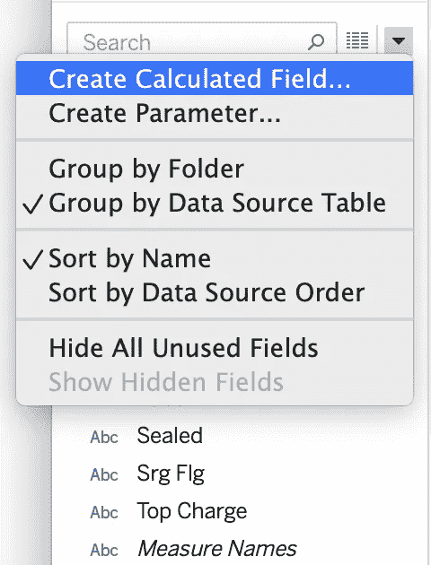
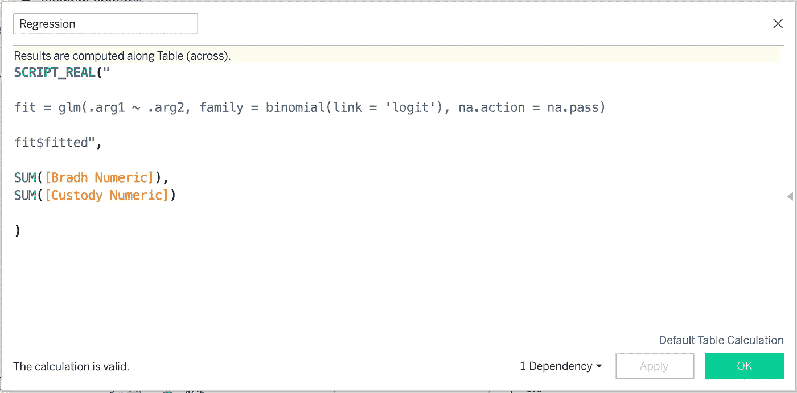
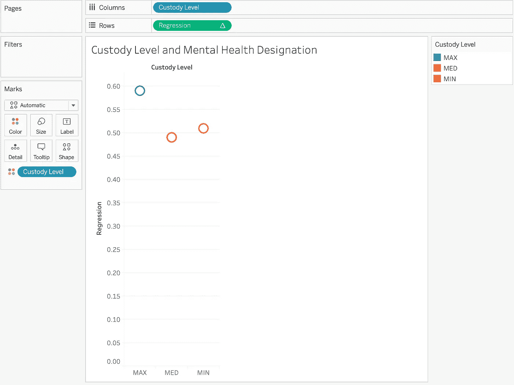
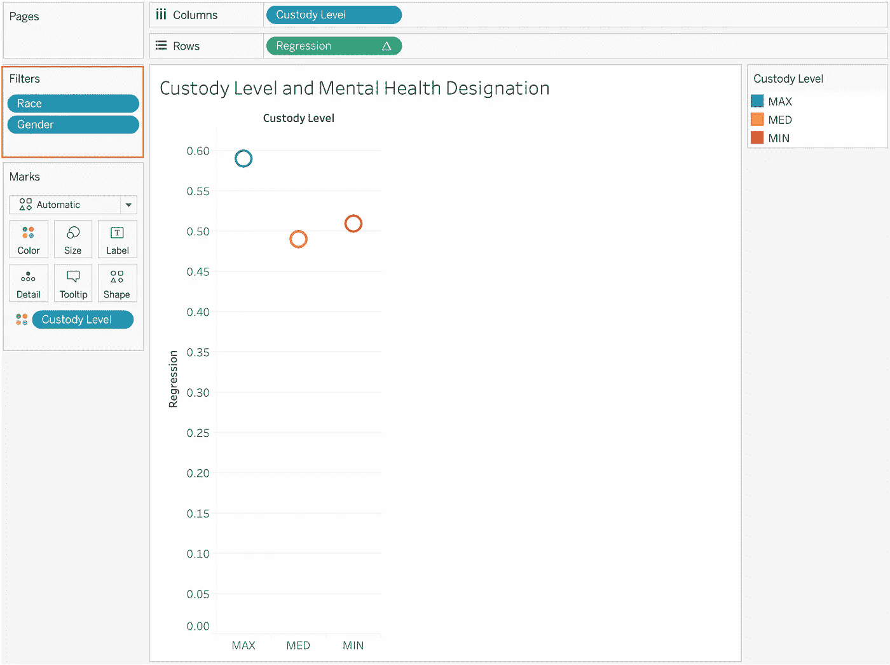
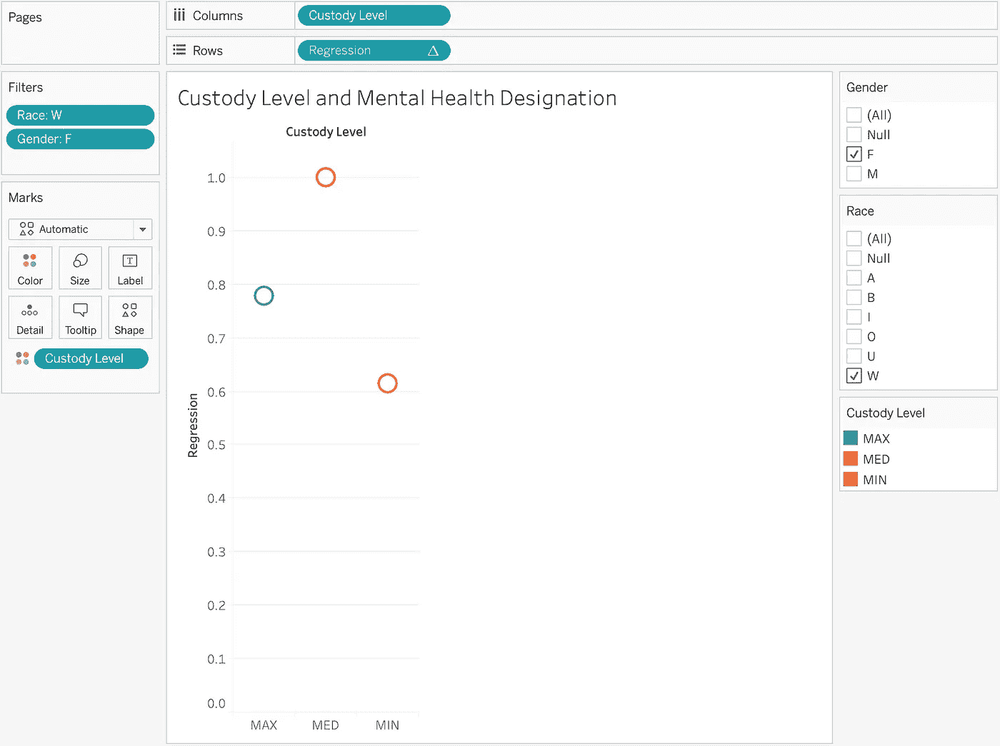

# 集成 Tableau 和 R 进行回归分析

> 原文：<https://towardsdatascience.com/integrating-tableau-and-r-for-regression-analyses-c3cac7e199cf?source=collection_archive---------34----------------------->

## 为什么这些工具结合在一起会更好

Tableau 在数据可视化领域掀起了风暴，这是有充分理由的。在其用户友好的界面中，可以快速创建漂亮而复杂的可视化效果、仪表板和报告，而无需任何编码经验。Tableau 对于交互式可视化的创建特别有用，因为只需几次点击就可以将过滤器添加到单个可视化或完整的仪表板中。然而，Tableau 的分析能力有限。计算字段功能允许计算简单的度量值，如平均值、总和以及日期差异，Tableau 具有一些用于添加回归线或识别聚类的内置功能。然而，对于任何类型的高级分析，Tableau 都有所欠缺。

另一方面，r 是由统计学家创造的，因此具有非凡的分析能力。从分析的角度来看，在 R 的内置函数和似乎无穷无尽的可用包列表中包含的函数之间，没有什么是不能做的。然而，R 中的可视化提出了更多的挑战。像 ggplot2 和 plotly 这样的包的开发已经显著地提高了 R 的数据可视化能力，但是这些包仍然没有 Tableau 的界面那么容易使用。在 R 中构建一个设计良好的交互式仪表板或可视化需要相当多的编码能力。即使对于那些具有编码专业知识的人来说，编写 R 代码来使仪表板中的一个图充当其他图的过滤器、添加说明性文本、为特定的可视化重构数据(在 Tableau 中通常甚至是不必要的)、调整仪表板中的图形大小、应用颜色或完成任何数量的其他任务(这些任务可以在 Tableau 的拖放环境中快速完成)也要花费更多的时间。

幸运的是，Tableau 能够连接到 R，使用户能够同时获得这两种工具的好处。为了演示这个过程及其有用性，我将通过一个使用 R 代码和 Tableau 可视化进行的样本回归分析。

# **步骤 1:在 Tableau 和 R 之间建立连接**

为了让 R 和 Tableau 一起使用，必须使用“Rserve”包建立连接。

首先，在 R 中安装“ [Rserve](https://cran.r-project.org/web/packages/Rserve/Rserve.pdf) ”包，第一个代码选项只是从 CRAN 安装 R 包的标准代码。我还包含了从 RForge 安装“Rserve”包的代码，因为 CRAN install 经常出错。

```
install.packages('Rserve')ORinstall.packages('Rserve',, "[http://rforge.net/](http://rforge.net/)", type = "source")
```

接下来，只需加载新安装的“Rserve”包:

```
library(Rserve)
```

在 R 中需要采取的另一个步骤是运行下面的命令，该命令设置一个套接字服务器并允许请求发送到 R:

```
Rserve(args = "--no-save")
```

Rserve 现在应该可以工作了，所以让我们切换到 Tableau。

在“帮助”下，单击“设置和性能”，然后单击“管理分析扩展连接”:



下面的“分析扩展连接”窗口应该会打开。选择“Rserve”作为分析扩展，选择“localhost”作为服务器，选择“6311”作为端口。输入完毕后，单击窗口左下角的“测试连接”按钮:



单击“测试连接”按钮后，您应该会收到以下消息，表明您的连接已成功建立:



如果你收到这条信息，那么你就可以走了。在本教程的剩余部分，我们将呆在 Tableau 中，尽管我们需要保持 R 运行以维持连接。

# 步骤 2:运行回归分析

我将在本教程中使用的数据来自 NYC OpenData，代表纽约市在押的囚犯。包括的变量表示属性，例如精神健康指定、种族、性别、年龄、监护级别、法律状态、密封状态、安全风险组成员资格、最高费用和违规标志。这些数据是公开的，可以在这里下载。

我很好奇监管级别(最低、中等或最高)是否能预测一个人是否有精神健康标志，并将创建一个逻辑回归模型，以精神健康标志作为我的结果，监管级别作为我的预测因素。在建立到 Tableau 的连接之前，我使用下面的 R 代码来准备这些数据，并编写一个包含已清理数据的 csv 文件:

```
library(tidyverse)data = read.csv("./Daily_Inmates_In_Custody.csv") %>% 
  mutate(
    bradh_numeric = ifelse(BRADH == "Y", "1", 
                           ifelse(BRADH == "N", "0", BRADH)),
    bradh_numeric = as.numeric(bradh_numeric),
    custody_numeric = ifelse(CUSTODY_LEVEL == "MIN", "0",
                             ifelse(CUSTODY_LEVEL == "MED", "1",
                             ifelse(CUSTODY_LEVEL == "MAX", "2", CUSTODY_LEVEL))
  ),
    custody_numeric = as.numeric(custody_numeric)) %>% 
  filter(
    custody_numeric == 0 | custody_numeric == 1 | custody_numeric == 2
  )write_csv(data, "./daily_inmates.csv")
```

一旦此文件连接到 Tableau(在 Tableau 中，单击“连接到数据”，选择“文本文件”，并导航到您的 csv)，我们将使用计算字段来创建我们的回归模型。从数据面板的下拉菜单中选择“创建计算字段”:



我将我的计算字段命名为“回归”在 SCRIPT_REAL()计算函数中，您可以在 R 中输入用于分析的代码。如果您熟悉在 R 中使用逻辑回归模型，那么下面的代码看起来会非常熟悉。在 Tableau 中要习惯的一个重要区别是，它不是将变量名直接输入到 glm()函数中。arg”占位符，变量在 glm()代码下指定(参见 Bradh Numeric 和保管数字)。一开始适应起来有点不直观，所以我建议在 R 中运行您的分析，这样您可以检查您的工作。

如果你的计算可以完成，你会看到“*计算是有效的。*“在左下角。如果你收到这条信息，请点击绿色的“确定”按钮。



现在，您将在屏幕的左侧看到您的计算字段(由#前的等号表示)，以及您的数值表元素。


# 步骤 3:可视化并探索您的回归结果

首先，让我们通过将“保管级别”药丸拖到列中，将“回归”药丸拖到行中，来可视化我们分析中包括的三个保管级别的拟合值。我还在颜色下添加了“保管级别”:



这些拟合值徘徊在 0.5 左右，表明监护水平不是一个人心理健康状况的重要预测指标。但这是 Tableau 真正闪光的地方。假设我们想看看这种关系在种族和性别上有什么不同。在 R 中，回答这个问题需要将种族和性别添加到我们的回归模型中，并根据得到的系数计算出特定人群的合适值。然而，在 Tableau 中，我们可以简单地将这些变量作为过滤器添加到我们的可视化中，并与产品进行交互，以查看哪里的关系更有趣。

将“种族”和“性别”药丸拖到过滤器框中，如下所示:



为了与这些过滤器互动，右击过滤器药丸并选择“显示过滤器”您会看到过滤器出现在屏幕上:


选中所有复选框后，回归拟合值保持不变，因为整个样本仍包含在分析中。然而，通过选择某些方框，很容易看到黑人女性的监护水平和精神健康状况之间的关系:


或者白人女性:



或者亚洲男人:


这些过滤器很容易看出，某些亚人群确实在监护水平和精神健康指定之间存在有意义的关系，并且这些关系在不同的种族和性别群体中非常不同。

*注:该数据集的数据字典不提供所包括的种族群体的描述。因此，我假设单字母的名称代表什么。也不清楚性别指标是否真正代表了性别，或者它是否真的捕捉到了性。

# **其他应用**

在这个例子中，我们使用逻辑回归分析来回答一个解释性问题(精神健康的定义如何因监护级别、种族和性别而不同？)，可视化服务于探索这种关系的主要目的。其他分析技术也可以采用类似的方法，如 k-means 聚类，因为 Tableau 的可视化功能提供了一种有用的方法来探索您的聚类在不同的数据子集内如何变化。

然而，Tableau 和 R 的集成具有超越简单探索的巨大潜力。例如，这些工具的集成对于地理空间分析特别有用，因为 Tableau 确实擅长制作地图，但缺乏这种高级的分析能力。此外，这些工具可以结合使用，以更好地可视化预测分析，如线性回归或时间序列分析。需要任何种类的高级分析，以及复杂的交互式可视化和仪表板的项目，可能会从 Tableau 和 r 的组合功能中受益。

Tableau 和 R 的优势可以很好地互补，学习如何一起使用它们可以最大化您的效率，同时增强您的数据可视化产品。