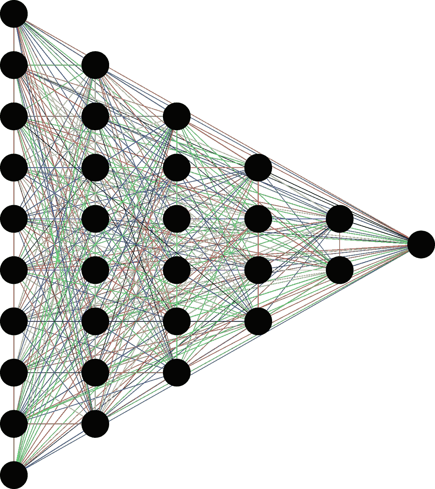

# 整合 Tensorflow 和 Qiskit 用于量子机器学习

> 原文：<https://towardsdatascience.com/integrating-tensorflow-and-qiskit-for-quantum-machine-learning-7fa6b14d5294?source=collection_archive---------31----------------------->

来源: [Pixabay](https://pixabay.com/vectors/neural-network-thought-mind-mental-3816319/)

# 概观

在标准深度学习库中存在两种流行的量子计算包集成:

1.  张量流和 Cirq 为[张量流量子](https://www.tensorflow.org/quantum)
2.  [Pytorch 和 Qiskit](https://qiskit.org/textbook/ch-machine-learning/machine-learning-qiskit-pytorch.html)

在本文中，我们将讨论在自定义 Keras 层中集成 Qiskit。

# 介绍

量子机器学习有一个有趣的应用，即使用量子层来帮助经典神经网络，这些量子层涉及经典无法实现的计算。学术界最近的工作强调了*量子辅助深度学习*的应用，它可以具有复杂的激活、更好的表示和其他在经典网络中无法实现的显著特征。

对于实现方面，这意味着找到一种在正常的深度神经网络中集成量子处理的方法。有几种方法可以实现这一点。在这里，我们讨论集成 Qiskit 作为 Keras 层的子类。让我们开始吧。

# 定义量子层

这显然取决于具体的应用。需要记住的是，这一层的输入和输出要保持一致。Tensorflow 2.x 中默认使用`eager_execution`,因此很自然地会使用`numpy`数组作为所有量子层的默认输入和输出。

样品量子层

这是一个任意的量子层，接收四个输入，输出一个长度为 4 的 numpy 数组。我们计算标准泡利算符的期望，创建一个列表，并返回它。这一层将根据底层应用程序的具体情况而变化。

# 与量子层相互作用

现在我们需要创建一个`Keras`层来整合我们之前定义的量子层。为此，我们需要扩展允许为 Keras 模型编写定制层的`tensorflow.keras.Layer`类。

子类层

该层根据训练的`batch_size`接收输入。因此，我们需要确保每个训练示例都通过量子层来创建输出，因此需要循环。

`tf.executing_eagerly()`很重要，因为它允许我们通过`inputs.numpy()`将默认输入`Tensor`转换成一个`numpy`数组。如果应用程序依赖于 Tensorflow 1.x，则可能会调用`tf.enable_eager_execution()`来启用急切执行。直观地说，急切执行允许我们在张量的值可用时访问它们。如果它被禁用，我们需要引入 tensorflow 的会话和执行图的复杂性。

# 构建模型

构建模型很简单。我们可以建立一个功能模型或顺序模型供我们使用。

模型工作流

用`run_eagerly`编译模型很重要。我观察到一些保存的模型在加载后不能像预期的那样工作，如果它们不是在`run_eagerly`设置为`True`的情况下编译的话。

# 保存和加载模型

保存照常进行。然而，加载要求您为我们创建的自定义层定义自定义类。

保存和加载模型

`custom_objects`允许您定义自定义对象。它需要一个字典，其中的`keys`对应于您拥有的定制层，它们的`values`对应于您希望定制层与之相关联的定制类。这有一个微妙的警告:在一些模型的不同训练会话之间，可以改变这些层的实现。如果你有一个在本文前面给出的量子层上训练的模型，可以加载这样一个模型，并在其他一些量子逻辑上重新训练它。

# 结论

这篇文章是使用 Qiskit 和 Tensorflow 建立一个工作的*量子辅助深度学习*架构的基本框架。有些事情需要注意:

1.  计算期望值是一个主要的瓶颈。对于大批量，可能会经历巨大的减速，因为我们已经完全放弃了经典深度学习中矩阵乘法的优势。
2.  期望值可能真的很小。可以使用适当的标量乘数来放大它们。

希望这将帮助您开始在 Tensorflow 网络中使用 Qiskit powered 层。祝您愉快:)