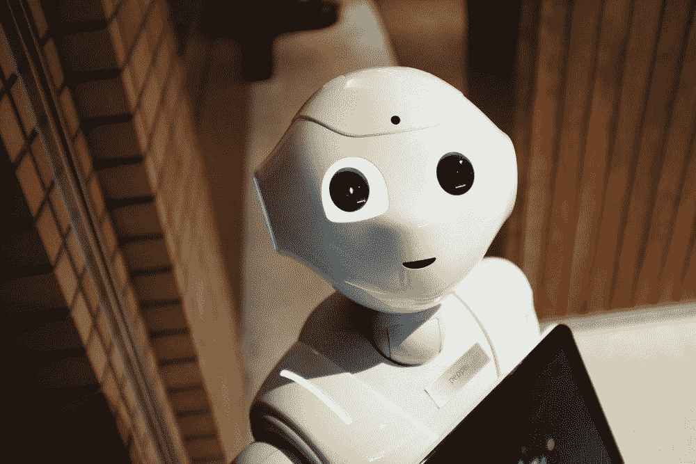

# AI 技术融入课堂:塞翁失马焉知非福？

> 原文：<https://towardsdatascience.com/integration-of-ai-technology-in-classroom-a-blessing-in-disguise-bfb4dce59071?source=collection_archive---------83----------------------->

## 意见

## 伦理辩论

斯蒂芬·道森在 [Unsplash](https://unsplash.com/s/photos/artificial-intelligence?utm_source=unsplash&utm_medium=referral&utm_content=creditCopyText) 上拍摄的照片

想象一下一个*未来主义的教室*，在那里你作为一名学生不必挣扎着每一秒都集中注意力。您可以获得定制的学习体验，因为该技术可以识别您的个人需求并相应地满足您的需求。你对某个主题缺乏理解的情况会被实时识别出来，你的讲座会被调整以适应你的学习曲线。

另一方面，想象一下在教室或演讲厅里，你的一举一动都被监视着。从你踏进这里的那一刻起。传感器和摄像机会跟踪你的每一个动作，并记录下来作为*“数据参考”*。您的隐私是毫无疑问的，您的实时敏感数据会受到损害，从而影响教学服务质量的提高。

最终你倾向于哪一方？

这两种情况就像一枚硬币的两面:整合和交错。*人工智能*又名*人工智能技术*已经成为改善和升级现有教育系统的焦点。它的主要目标是改善大多数学生当前的学习体验。这项技术的范围和能力是无限的，并且发展势头稳定。各种组织开展了一些研究，以了解人工智能技术对评估他们的能力、风险以及回答某些道德问题的影响。教室中人工智能的当前技术主要是数据敏感、模式识别和通过软件算法进行处理。这些数据可以很容易地整合到机器学习中，以建立一个更强大的平台。

Alex Kotliarskyi 在 [Unsplash](https://unsplash.com/s/photos/technology?utm_source=unsplash&utm_medium=referral&utm_content=creditCopyText) 上的照片

# AI 技术在课堂上我们还有多远？

我们大多数人都没有意识到，我们已经在我们目前的教育系统中集成了人工智能技术的微妙痕迹。例如，预装在 *blackboard(在线提交* *平台)*中的语法检查或抄袭软件就是人工智能的完美例子。这些软件可以很容易地检测出作业是否直接引用了他人的作品，而没有经过他们适当的引用或认可。很快，这种类似的软件就可以升级，以包括检测对等提交之间的转述作业的功能。他们甚至可能使用机器学习(ML)来识别同行之间的常见做法。

已经在许多国家使用的其他基于人工智能的教育模型项目包括:基于人工智能的教学模型，该模型包括实时监控和分析教师和学生在课堂上的表现。然而，在西方世界采用这种模式会引起争议和对隐私问题的担忧。此外，大多数学生可能不适应在教室环境中学习，而更喜欢按照自己的节奏学习。学生也可能有不同的学习风格，并可能不太适应特定讲座中提供的当前教学方法，因为它是实时发生的。因此，通过监控和分析实时表现来定量测量课堂表现可能不是一种合适的方法。

某些 K-12 教室已经在他们的教室中纳入了基于人工智能的项目。它为这些参与的学生提供了发展批判性思维能力的空间。正是这种批判性思维能力最终将发展成为一种高科技编程技能。学生和教育工作者都认为这种方法是积极的，并允许在课堂环境中进行更多的合作互动。

# 人工智能的未来在我们的教室里会是什么样子？

[亚历山大·奈特](https://unsplash.com/@agkdesign?utm_source=unsplash&utm_medium=referral&utm_content=creditCopyText)在 [Unsplash](https://unsplash.com/s/photos/ai?utm_source=unsplash&utm_medium=referral&utm_content=creditCopyText) 上拍照

教育机构正在考虑使用这项新技术来监控和收集学生的表现。它最终将允许量化单个学生的学习轨迹。定量研究将允许提前警告班上不及格的学生。人们可以很容易地争辩说，这些方法已经由真诚的教师亲自采用。然而，对于已经全神贯注于他们研究和课程教学职责的教师来说，这样的任务通常是耗时的。其次，当老师接近学生时，这也可能会侵犯学生的自尊。相反，让人工智能技术执行这样的任务可以允许早期检测(通过分析来自人工心理学的模式)，并且得出的结论可以通过更高的准确性(忽略人类偏差的影响)来超越。这些信息可以通过应用程序直接传递给学生，以便他们可以调整自己或采取必要的行动。

人工智能技术还可以通过分析之前课程学分和成绩的数据，为个别学生确定选修课程的最佳选择提供空间。这些可以很容易地辅以工业前景，最终最大限度地发挥学生的潜力。人工智能肯定可以补充顾问的角色，并且随着教室中学生人数的增长，人工智能将大有裨益。

将人工智能融入课堂的最大问题和挑战都与网络安全和信息隐私有关。因此，给学生个人选择这种技术应用的自由裁量权可以停止侵犯他们的隐私问题。人工智能的未来充满希望，技术进步的加速将确保我们最终都成为智能城市的一部分。

然而，你的看法是什么？请随意分享你的想法。

免责声明:本文中表达的观点是作者的唯一看法，并不反映出版物的意见或观点。