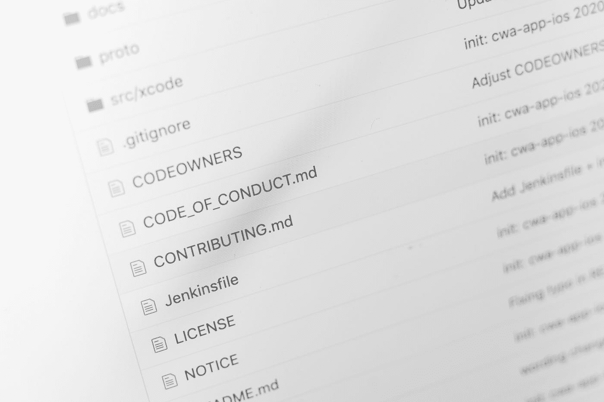

# 数据科学家的知识产权

> 原文：<https://towardsdatascience.com/intellectual-property-rights-for-data-scientists-edf987d7ee8f?source=collection_archive---------16----------------------->

## 可以说是知识产权法 101

卢克·迈克尔在 [Unsplash](https://unsplash.com?utm_source=medium&utm_medium=referral) 上的照片

D 数据科学家几乎总是使用他们没有编写的软件和他们不拥有的数据。正是由于开源，他们才能使用 Python 和 R 这样的编程语言，或者 Scikit-Learn 和 TensorFlow 这样的库，或者 SQLite 和 MongoDB 这样的数据库。这不应该被认为是理所当然的。事实上，考虑到知识产权在数据科学领域的重要性和无处不在性，我认为对它的讨论还不够。这就是我写这篇博文的原因。

我将尝试回答以下问题:

*   哪些知识产权适用于数据科学？
*   可以随机复制公开的 GitHub 代码吗，别人可以用你的吗？
*   谁拥有数据和存储数据的数据库？
*   为什么没有人给神经网络申请专利？

让我们从一个不同的问题开始，为什么知识产权会存在？这不是没有争议的。事实上，对于它们是否应该在如此大的范围内存在，存在着争论。

> 保护知识产权的主要社会目的是鼓励和奖励创造性工作。人们认为，知识产权刺激投资(时间和金钱)并导致创新。

知识产权的三个主要概念是*版权*、*商标*和*专利*。

版权授予原创作品的作者对(商业和非商业)发行的所有权和专有权。这项权利从产生之时起就存在，这意味着它不需要登记，尽管它可以登记。然而，作品必须固定在有形的介质中(例如在纸上或作为计算机上的比特)，所以你头脑中的想法不受保护。显然，除了书籍、绘画和音乐之外，计算机软件也受版权保护。当涉及到数据时，事情变得更加复杂(稍后会有更多的介绍)。然而，重要的是，只有表达本身受到保护，而不是其背后的想法。版权在作者死后至少 50 年内有效。

**商标**是一个公司(或其商品)区别于其他公司的标志。一个组织的 logo 是受商标保护的，但也可以是像耐克的 *Just Do It* 这样的一句话。商标不需要注册，而且可以无限期使用。然而，它与数据科学没有太大的关联。

**专利**相比之下，并不是自动存在的。它们需要应用程序。与版权和商标不同，专利保护的是思想和发明，而不是表达形式。哪些发明获得了专利，哪些不是，一般来说艺术多于科学。专利授予所有者对发明进行商业开发的专有权，期限通常为 20 年。一个著名的专利是 Swiffer 的湿地板片(见专利申请[这里](https://patentimages.storage.googleapis.com/04/c4/7a/841ce01b1a2c84/US9320407.pdf))。给软件申请专利也是可能的，但是以后会更多。

除了这三种，**商业秘密**也经常被认为是知识产权保护的一种方法，尽管不是一种正式的方法。未公开的代码或数据可能被视为商业秘密。

# 开源许可

知识产权不仅可以通过销售其保护的产品来商业化，还可以通过许可协议来放弃权利本身。换句话说，知识产权的所有者可以将他们的权利授予另一方，通常以版税作为交换(有时甚至是免费的)。这种协议可以专门授予另一方或多方(非排他性许可)。

在数据科学领域，许可非常重要，几乎无处不在。请记住，每一个软件都受版权保护。这意味着，原则上只有他们各自的作者才可以使用 Python、R、Scikit-Learn、TensorFlow 或任何其他软件。令人欣慰的是，开源许可在今天非常普遍。关于*开源的确切定义，请参见[这里的](https://opensource.org/osd)。大致说来，它的三大支柱是*

*   源代码是公开可访问的
*   该软件可以免费使用(没有版税)
*   可以用它制作衍生作品

虽然每个人都可以简单地为一个软件编写自己的开源许可证，但是有许多标准许可证被广泛使用。好处是对于它们包括哪些权利没有(或更少)混淆。根据作者授予的权限程度，开源许可证通常分为三类:

*   公有土地
*   许可许可证
*   版权所有许可证

## 公共领域(许可)

当一部作品的版权到期时，它就进入了公共领域，这意味着它不再有所有者。任何人都可以随心所欲地使用它。如果作者愿意，现有的版权是否可以转移到公共领域还存在争议。大多数人说不。因此，所谓的**公共领域等效许可证**被设计成授予与公共领域同等程度的权利。这些都是最不屑一顾的许可证，你可以想象。他们放弃尽可能多的权利；例如，他们通常甚至不要求你注明作者。最常见的公共领域等效许可证是 **Unilicense** 、 **Zero Clause BSD License** 、**Creative Commons Zero License**(CC0)和**Do the Fuck You Want To Public License**(WTFPL)。后者很好地概括了这一切。有了这样的许可证，你唯一不能做的事情就是声称作品是你的，因为它属于公共领域。公共领域的现代软件的一个例子是 SQLite。

以下是 CC0 许可证文本的示例。

> **CC0 许可**
> 
> 无版权
> 在法律允许的范围内，将作品与本契约相关联的人通过放弃其在全球范围内对该作品的所有权利，包括所有相关和邻接权，将该作品奉献给公共领域。
> 
> 您可以复制、修改、分发和执行作品，即使是出于商业目的，都无需征得许可。

## 许可软件许可

仅包含最小限制(如归属条款)的许可证被称为许可软件许可证。在属于这一类别的各种许可证之间，有一些微妙的(和一些显著的)差异。但粗略的说，他们都允许你自由使用和再分发软件，只要你在任何衍生作品中注明原作者的归属(归属条款)。然而，许可许可证的一个主要限制是，它们不保证软件的未来版本仍然可以公开获得，即软件可以在以后由作者拥有。最常见的许可软件许可证是**麻省理工学院许可证**。同样很常见的还有 **BSD 许可证**和 **Apache 2.0 许可证**。

数据科学家使用的许多软件都有某种许可的开源许可证，包括 Python、Julia、PyTorch 等等。Apache 软件基金会维护的项目值得特别关注，因为它们包括 TensorFlow、Hadoop 和 Spark。这里有一个例子。

> **麻省理工学院许可证**
> 
> 版权所有 2020 Andreas stffelbauer
> 
> 特此免费授予获得本软件和相关文档文件(“软件”)副本的任何人不受限制地经营本软件的权利，包括但不限于使用、复制、修改、合并、发布、分发、再许可和/或出售本软件副本的权利，并允许接受本软件的人按照下列条件这样做:上述版权声明和本许可声明应包含在本软件的所有副本或主要部分中。
> 
> 本软件按“原样”提供，不提供任何形式的担保[…]

## 版权所有许可

与许可软件许可证相反，所谓的左版权许可证是互惠的，因为它们要求任何衍生作品具有相同的许可证条款，即具有完全相同的版权许可证。一个主要的动机可能是确保软件保持自由，这在许可许可证下是没有保证的。GNU 通用公共许可证 (GPT)和 **AGPL** 是最常见的左版权许可证。受版权保护的最著名的软件是 Linux。

# 数据科学家和软件许可

您可能已经意识到，您不能简单地复制和使用您在 GitHub 上找到的任何代码。如果存储库中包含许可证，请检查允许您对代码做什么。但是如果没有许可证，代码仍然受到版权法的保护，不允许你复制它——代码是公开的这一事实没有任何区别。然而，话虽如此，你并没有因为一段无关紧要且显而易见的代码而侵犯版权；说一个简单的 for 循环；通常只有一种显而易见的编码方式。另外，记住受版权保护的只是代码，而不是背后的想法。因此，举例来说，只要你按照自己的方式去做，就没有什么可以阻止你构建一个新的张量流(就像 PyTorch 所做的那样)。

通常，当涉及到常见的数据科学工具时，数据科学家不必过于小心。只要他们有某种开源许可(他们通常都有)，你就可以开始了。当然，也有专有的数据科学软件如 MATLAB、SAS、Tableau，但你无论如何都不会在 GitHub 上找到那些。专有软件的许可通常更加个性化。

**如何开源自己的代码？**要开源您自己的库或项目，您首先必须考虑哪种许可证适合您的需求。GitHub 有一个专门的帮助页面(见[这里](https://help.github.com/en/github/creating-cloning-and-archiving-repositories/licensing-a-repository#disclaimer))。主要步骤非常简单:您需要做的就是将您的条款和条件作为许可文件包含在您的存储库中。同样，GitHub 让您只需点击几下鼠标就可以添加最常用的许可证。这就是为什么你会在很多 GitHub 仓库中找到 *license.md* 或 *license.txt* 文件。

照片由[马库斯·温克勒](https://unsplash.com/@markuswinkler?utm_source=medium&utm_medium=referral)在 [Unsplash](https://unsplash.com?utm_source=medium&utm_medium=referral) 拍摄

# 数据科学家的软件专利

如前所述，版权只保护计算机程序的文字表达，而不保护其背后的思想，后者通常更有价值。因此，许多公司想要开源的反面，即保护他们的代码。专利将是合理的解决方案。然而，给软件申请专利相对来说并不常见。首先，想想这样一个事实，专利要求完全公开源代码，这将允许其他人对其进行逆向工程。相比之下，简单地将代码保密(商业秘密)在许多情况下可能比专利更有效。

**神经网络等算法呢？**专利算法是一个更加微妙的问题，随着人工智能的进步，它将变得更加重要。这不仅是一个法律问题，尤其是一个道德问题。

原则上，事实是不可专利的，因为像神经网络这样的机器学习算法基本上是数学方法，所以它们不受保护。但是，应用到某个问题上，算法可能会成为专利的一部分。所以，是的，如果以正确的方式设计，为算法申请专利是可能的。例如，生成某种音频的深度学习算法可能是合格的。但这并不妨碍该网络应用于任何其他问题。

此外，我认为软件专利的执行非常困难，机器学习领域发展太快，许多专利不值得冗长的申请。或许一旦更强大的人工智能算法出现，专利将发挥更大的作用。但是，这也有伦理问题。

# 知识产权和数据

对于数据科学家来说，数据所有权显然是一个重要的话题，但它并没有被真正地讨论过很多。一般来说，版权适用于数据。然而，数据不同于软件或其他创造性的表达方式，因此值得仔细研究。

首先，任何受版权保护的东西都必须是创造性的。这排除了仅仅代表事实的数据，如天气、体育赛事或股票价格的数据——也许大多数存在的数据由于这个原因而免于保护。

版权保护除了创意，总是需要固定在某种有形的媒介上。就数据而言，这自然意味着**数据集**和**数据库**发挥着核心作用。事实上，数据库的版权必须与其内容(即数据)的版权区分开来。完全可以想象(甚至常见)的是，在数据库中组合数据的创造性方式享有版权保护，而数据本身却没有。例如，著名的 MNIST 数据集有版权(但作者将其公之于众)。

然而，就像软件一样，保护数据知识产权的最有效方法可能就是保密。不管有没有版权，这意味着其他人不能使用它。道德问题再次出现，尤其是涉及到个人数据的时候。

简而言之，虽然大多数数据不受版权保护，但数据的组织方式有时却受版权保护。然而，就数据而言，商业秘密可能比版权起着更重要的作用。

# **结论**

虽然我很想为数据科学家写更多关于知识产权的东西，但这是一个很大的话题，这篇博文只是一个介绍。特别是关于软件专利和数据所有权的部分需要更多的解释。事实上，例如，关于知识产权如何与机器学习和人工智能相关联，还有很多要说的。此外，我没有谈到版权和专利是否超越国界适用。我只涉及了一些伦理问题。这些只是我想更多了解自己的一些话题。