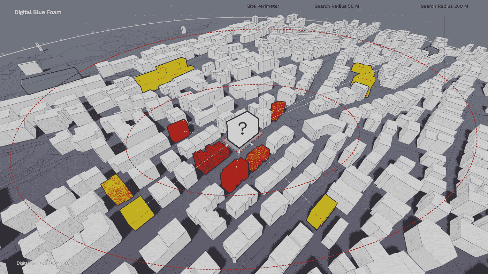
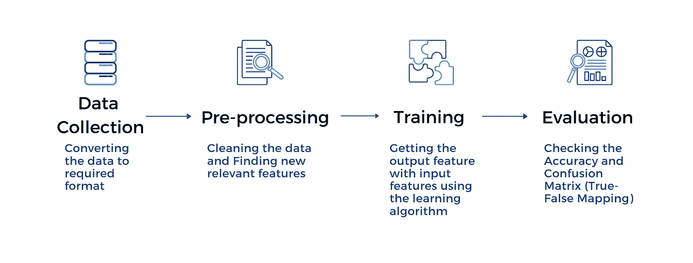
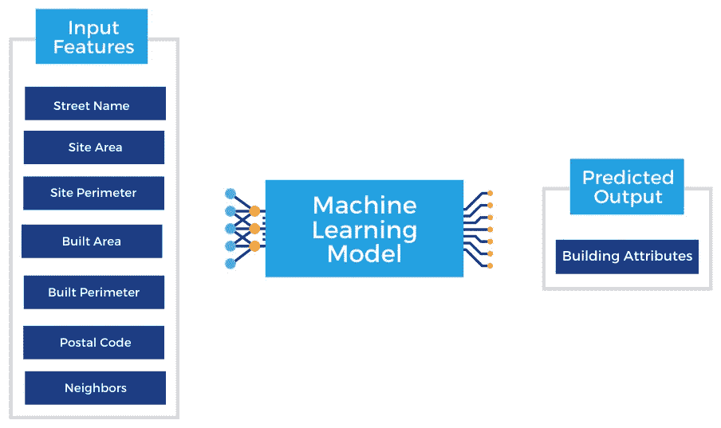

# 带有随机森林和开放街道地图的智能建筑简介

> 原文：<https://towardsdatascience.com/intelligent-architectural-briefs-with-random-forest-and-openstreetmaps-d577fc01f3ce?source=collection_archive---------37----------------------->

## 如何开始



我们能否根据位置数据创建一个建筑物预测系统？图片作者。

鲁特维克·德什潘德和塞杰尔·维贾伊·帕特尔

# 智能建筑简报

每一个建筑设计都是建筑师对客户简报的回应，这是一份包含项目所有要求的文件。它的工作是解释所有的设计约束和目标，并涵盖诸如建筑面积，潜在租户和建筑类型等主题[1]。要写一份好的简报，客户必须考虑各种因素，包括城市分区、现金流预测、土地价值以及隐性商业知识。甚至在画出一条线之前，一份好的简报就能影响财务可行性、可持续性，甚至建筑设计的质量。

在这篇文章中，我们将探讨如何应用机器学习(ML)来增强简报过程。目前，任何人都可以访问描述建筑类型、租户、财产价值和位置能源使用的免费数据宝库。使用 ML 可以识别这些数据集之间的隐藏关系，从而预测特定位置新建筑的需求。

在下一节中，我们将解释如何做到这一点。我们展示了如何用 Python 建立一个项目，从一个免费的数据源中学习，为一个假想的苏黎世开发项目做出基于位置的预测。

> 我们将展示如何用 Python 建立一个项目，从一个免费数据源中学习，为苏黎世的一个假想开发项目做出基于位置的预测。

# 入门指南

为了简单起见，下面的示例主要基于从上下文数据中提取的属性来预测建筑类型。要完成本教程，您需要注册 Jupyter Notebook，这是一个 web 应用程序，允许您创建和共享包含实时代码、等式、可视化和叙述性文本的文档。

*为了帮助你，我们在 GitHub 资源库* [*这里*](https://github.com/rutvik-deshpande/Intelligent-Architectural-Briefs/blob/main/Intelligent-Architectural-Briefs/notebook/Predicting-BuildingProgram.ipynb) *共享了这个项目的所有代码。*

# 公式化问题



ML 开发流程概述。图片作者。

第一步是想出一个你试图回答的好问题。这将需要一些数据科学的技术知识以及你给定主题的领域知识。一个正在进行的建筑辩论是是否采取“突出”或“适应”的位置。对于这个项目，我们采取了“合群”的方式。基于这种方法，我们需要考虑我们有什么可用的数据，以及 ML 模型可以提供什么类型的答案。

> 一个正在进行的建筑辩论是是否采取“突出”或“适应”的位置

# 数据收集

第二步是收集用于训练模型的数据。对于这个例子，我们使用 OpenStreetMaps(OSM)；一个协作性的免费全球制图 API，以 JSON 文件格式提供关于不同城市的 2D 和 3D 地理数据。OSM 是一个“结构化数据集”，这意味着坐标、街道名称、邮政编码、建筑物几何图形和建筑物属性等文本和数字元素都以表格格式组织。结构化数据使得训练机器学习模型变得更加容易。


OpenStreetMaps 搜索苏黎世，显示 2D 和 3D 上下文信息。图片作者。

由于我们的代码是用 Python 编写的，而 OpenStreetMap 的数据是以 JSON 格式存储的，所以第一步是将其转换成一种叫做“Pandas DataFrame”的 Python 数据结构。

```
# Inspect the OSM Datawith open(‘Desktop\osm-Zurich.json’, ‘r’) as f:# Loading the json datadata = json.load(f)# normalizing it and converting to pandas data framedata = pd.json_normalize(data)print(data.columns)# Columns> [‘highway’, ‘route’, ‘oneway’, ‘crossing’, ‘sidewalk’, ‘building’,‘building_3d’, ‘building_3d_random’, ‘craft’, ‘geological’,‘topography’, ‘contours’, ‘waterway’, ‘leisure’, ‘amenity’, ‘emergency’,‘cycleway’, ‘busway’, ‘bicycle_road’, ‘driving_side’, ‘embedded_rails’,‘historic’, ‘landuse’, ‘man_made’, ‘military’, ‘natural’, ‘office’,‘power’, ‘public_transport’, ‘railway’, ‘bridge’, ‘shop’, ‘sport’,‘tourism’, ‘telecom’, ‘place’]
```

# 预处理

第三步是处理我们的输入数据。我们必须清理数据，这意味着我们只使用与我们的设计问题相关的数据点。这个过程被称为特征工程[3]。OSM 数据包含各种各样的要素，找到正确且有用的要素是一项艰巨的任务。正如人们所说的“垃圾进来，垃圾出去”；因此，拥有正确的数据作为机器学习模型的输入是必要的一步。

目标变量是我们将使用数据中的其他输入要素进行预测的要素或变量。对于这个示例项目，我们关注的目标变量是*建筑属性类型*(即。建筑使用)。为了训练我们的机器学习模型，我们将使用 OpenStreetMap 数据的以下特征来预测新开发站点的目标变量。

1.  建筑周长
2.  相邻建筑的数量
3.  邮递区号
4.  行号代名
5.  发射阵地地域
6.  现场周界
7.  半径为 50 米、100 米和 200 米的建筑物数量

*我们将把点(建筑物的坐标)转换成*[](https://shapely.readthedocs.io/en/latest/manual.html)**的几何图形。Shapely 是一个 Python 包，用于平面数据的空间分析以及处理计算几何。**

```
*# Converting the points into shapely geometriesdf[‘geometry’] = df[‘points’].apply(lambda x : (Polygon(x)))# Extracting various features using “geometry”df[‘centroid’] = df[‘geometry’].apply(lambda x : x.centroid)df[‘perimeter’] = df[‘geometry’].apply(lambda x : x.length)df[‘Site’] = df[‘geometry’].apply(lambda x : x.minimum_rotated_rectangle)df[‘Site_Perimeter’] = df[‘Site’].apply(lambda x : x.length)df[‘Site_Area’] = df[‘Site’].apply(lambda x : x.area)df[‘area’] = df[‘geometry’].apply(lambda x : x.area)# Finding the number of neighbors at different distances using pySAL libraryrW = Rook.from_dataframe(df)df[‘neighbors’] = rW.cardinalities.values()dis_band = DistanceBand.from_dataframe(df, threshold = 200)df[‘neighbors_in_200’] = dis_band.cardinalities.values()dis_band1 = DistanceBand.from_dataframe(df, threshold = 100)df[‘neighbors_in_100’] = dis_band1.cardinalities.values()dis_band2 = DistanceBand.from_dataframe(df, threshold = 50)df[‘neighbors_in_50’] = dis_band2.cardinalities.values()*
```

**预处理后，数据被分成训练集和测试集，这两个集的每一个又被分成标签和特征。**

```
*# Divide the data into features and labels(Building Programs)y = df1[‘attributes.type’]df1.drop([‘attributes.type’],axis = 1, inplace = True)# Divide the dataset into training and testing data; X_train — training features, X_test — testing features, y_train — training labels, y_test — testing featuresX_train, X_test, y_train, y_test = train_test_split(df1, y, test_size=0.2)*
```

# *培养*

**

*在这个例子中，我们开发了一个 ML 模型，根据位置和周围的上下文信息来预测建筑物的属性。图片作者。*

*第四步，训练我们的机器学习模型。机器学习模型是一个经过训练的文件，可以识别数据集中要素之间的隐藏关系。训练是模型使用特殊算法分析部分数据集的过程。在这一步，输入特征(预测变量)被映射到我们预测的变量(目标变量)。然后将这些学习到的模式应用于测试数据的输入特征，以预测所需的结果，即标签。*

**我们使用“随机森林分类器”来分类(预测)一组离散值，在这种情况下，是特定位置的建筑物属性。虽然这里可以使用其他分类算法，但我们选择随机森林，因为它相对容易实现。随机森林的工作原理是基于训练数据的随机片段构建一组决策树。最终输出是每个单独决策树输出的平均值[4]。**

```
*# Fit the modelclf = RandomForestClassifier(random_state=0)param_grid = {‘n_estimators’: np.arange(50, 200)}grid_search = GridSearchCV(clf, param_grid=param_grid, cv=10, verbose=3, return_train_score=True)# Hyperparameter tuning using Grid Searchgrid_search.fit(X_train, y_train);*
```

**这里我们使用交叉验证和超参数调节梯度搜索的方法来确定模型训练的最佳参数。**

```
*# We want optimal number of estimators for the model, so this would be the parameter for Grid # Searchparam_grid = {'n_estimators': np.arange(50, 200)}grid_search = GridSearchCV(clf, param_grid=param_grid, cv = 5, verbose=3, return_train_score=True)# Hyperparameter tuning using Grid Searchgrid_search.fit(X_train, y_train);*
```

# *模型评估*

*一旦我们在训练数据上训练了 ML 模型，我们需要使用测试数据集来评估它。*

**在本例中，我们使用测试数据(X_test)的输入特征/变量来预测建筑物属性，即我们的目标变量(y_test)。该模型将从训练数据中学到的模式应用于测试数据。**

```
*# Predict the building programs for test data sety_pre = grid_search.predict(X_test)*
```

*最后一步是评估模型，以计算其准确性，这样我们就可以了解我们对预测结果的信心程度。*

```
*# Get the Accuracy Scoreprint(‘Accuracy: %.4f’ % accuracy_score(y_test, y_pred))*
```

*在这种情况下，预测准确率为 61.1 %。准确性是一种衡量标准，用于评估我们的机器学习算法基于输出所取得的成功。在这个示例中，准确性很低，因为我们在训练数据中仅使用了 100 个数据点。*

# *最终想法*

*这篇文章概述了一个初步的想法和一个例子来强调 ML 和开放数据可以在架构师-客户简报过程中使用。虽然我们已经提供了一个相对简单的例子，这里描述的方法可以进一步改进，并应用于预测设计概要的更具体和有用的方面。这可以扩展到建筑规模、理想租户和能源使用，形成简报推荐系统的基础。*

***N O T E S***

1.  *詹森，我叫安克尔。"包容性简报和用户参与:丹麦媒体中心案例研究."建筑工程与设计管理 7.1(2011):38–49。网络。*
2.  *关于融入与突出环境的更多信息，请参见“清晰的城市:让杰出的建筑融入日常环境”*
3.  *参见'特征工程'<[https://en . Wikipedia . org/wiki/Feature _ Engineering #:~:text = Feature % 20 Engineering % 20 is % 20 过程，as % 20 applied % 20 machine % 20 learning % 20 本身](https://en.wikipedia.org/wiki/Feature_engineering#:~:text=Feature%20engineering%20is%20the%20process,as%20applied%20machine%20learning%20itself)。>*
4.  *<https:>见“随机森林分类”</https:>*

*关于作者*

***鲁特维克·德什潘德**是 [Digital Blue Foam](https://www.digitalbluefoam.com/) 的机器学习和数据科学研究实习生，也是 [@NITRR](https://twitter.com/NITRR) 的建筑学学生。他对 AEC 行业的数据科学、机器学习和人工智能感兴趣。他还是一名计算设计、城市分析爱好者，也是一名卡格勒。*

***Sayjel Vijay Patel** 是 [Digital Blue Foam](http://www.digitalbluefoam.com) 的联合创始人兼首席技术官，也是迪拜设计与创新学院的创始助理教授。他毕业于麻省理工学院建筑与规划学院。Sayjel 因其为 3D 打印行业开发概念设计软件的研究获得了广受好评的红点设计奖*