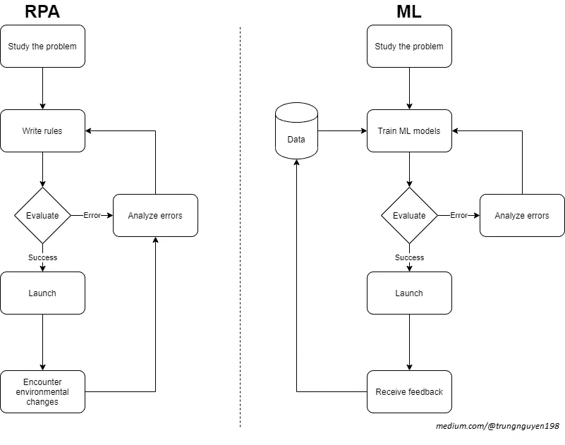
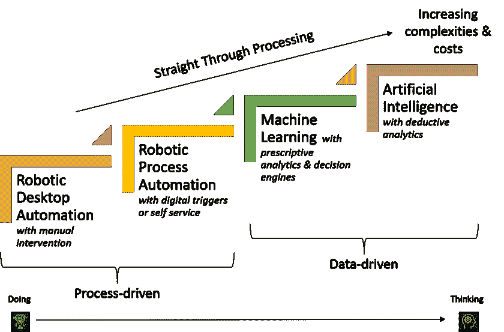
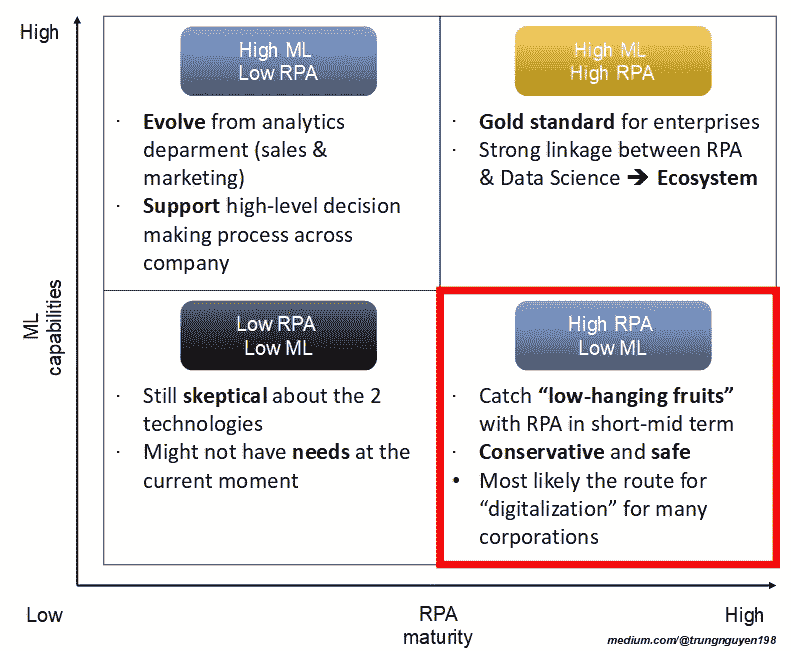
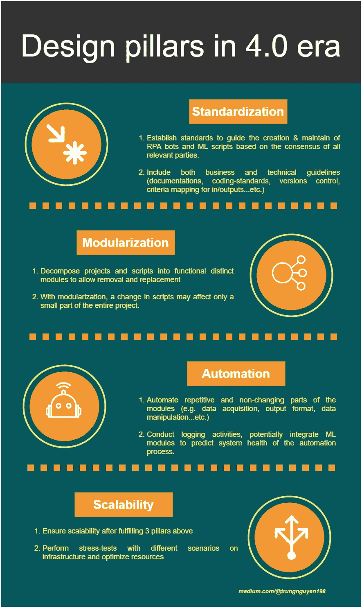
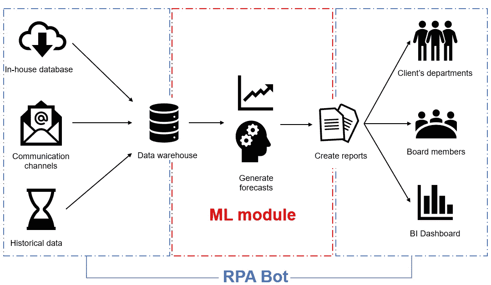
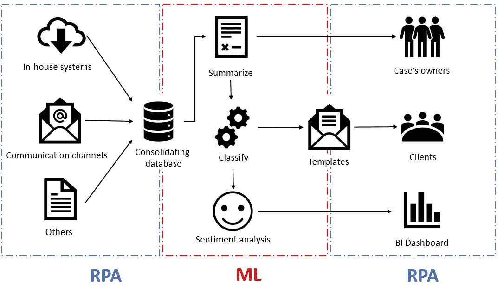

# 智能自动化 RPA 和数据科学之间的共生关系

> 原文：<https://towardsdatascience.com/intelligent-automation-a-symbiotic-relationship-between-rpa-and-data-science-632af34555e3?source=collection_archive---------35----------------------->

组织应该如何建立他们的自动化和分析任务组，同时避免“孤岛化”陷阱？

列宁·艾斯特拉达在 [Unsplash](https://unsplash.com?utm_source=medium&utm_medium=referral) 上的照片

在这篇文章中，第一部分是我试图澄清 RPA 和 AI 之间的误解。然后，我介绍了一个组织的技术采用图，这些组织正在开始这个“智能自动化”之旅。第 3 部分是我为 RPA 和数据科学这两个部门提出的合作框架。最后，第 4 部分通过提供协作用例来结束本文，在这些用例中，双方都可以发挥他们的真正潜力。

# 目录

[1。从 RPA 到数据科学(？)](#6052)
[2。RPA &数据科学采用图](#e99f)
[3。4.0 时代的设计](#e4ea)
[4。协作用例](#8cff)

# 1.从 RPA 到数据科学(？)

对于那些不知道什么是机器人过程自动化(RPA)的人来说，这里有一个来自 KPMG 的 3 分钟的简短介绍

RPA:它是如何工作的？来源:毕马威 Youtube 频道

> 总而言之，RPA 是可以轻松编程的软件，可以像人类工人一样跨应用程序执行基本任务。RPA 软件旨在减轻员工重复、简单任务的负担。
> 
> *来源*:[*Investopedia*](https://www.investopedia.com/terms/r/robotic-process-automation-rpa.asp)

RPA 和机器学习程序如何以不同的方式处理这些问题，如下所示:

**图一。**机器人流程自动化 vs 机器学习工作流程

> RPA 可以被认为是“基于规则”的软件机器人，需要从开发人员那里获得手动指令，而机器学习程序可以“学习变得更聪明”版本的自己。

任何精通 RPA 的人在其职业生涯中都至少见过一次下图 3 中的图表。这是一个渐进的图表，讲述了基于规则的软件机器人进化成为自主生物的故事，假设组织遵循正确的道路。虽然这对大众来说很容易理解，但我认为这不应该被用作“智能自动化”的标准蓝图。

**图二。**从流程驱动到数据驱动。由 [CFB 机器人](https://medium.com/u/a68344d749f9?source=post_page-----632af34555e3--------------------------------)上[T5【机器人过程自动化与人工智能的区别】](https://medium.com/@cfb_bots/the-difference-between-robotic-process-automation-and-artificial-intelligence-4a71b4834788)

原因如下:

1.  图表中“机器学习”(ML)和“人工智能”(AI)的定义具有误导性。我们大多数业内人士都会同意一个更“清晰”的版本，如下图 3 所示。简而言之，RPA 应该已经被归类为人工智能，或者更具体地说是“低级人工智能”。因此图 2 中**的线性关系不正确。**

**图 3。**深度学习如何是机器学习的子集，机器学习如何是人工智能(AI)的子集。照片由[avimanyu 786](https://commons.wikimedia.org/wiki/File:AI-ML-DL.png)/[CC BY-SA](https://creativecommons.org/licenses/by-sa/4.0)

2.这并不意味着你的公司必须先有 RPA，然后再向“ML & AI”前进。许多组织已经开始同时投资这两个领域。然而，在大多数情况下，负责这两个工具包的部门并没有紧密合作。

> “智能模块”有一个价格标签:它们通常是“黑匣子”，成本很高！

3.许多 RPA 提供商现在已经将 ML“模块”注入到他们的工具中，以便客户可以体验“智能自动化”。对于希望部署智能 RPA 机器人而无需在数据科学能力上投入大量资金的客户来说，这是一个很好的方法。然而，常见的情况是，这些模块通常以“**黑盒**”的形式出现——这意味着客户端的定制程度很低，必须依赖于提供者。因此，从长远来看，这可能会导致成本增加和失控。

> RPA 开发人员不是被雇佣来构建机器学习代码的(或者至少…现在还不是)

4.这扩展了上面的原因(3):大多数时候，RPA 提供商免费创建智能模块，并允许客户定制它们(例如， [UiPath Marketplace](https://connect.uipath.com/marketplace) ，在那里人们可以共享和重用智能活动)。虽然组织可以培训已经熟悉标准化流程的员工(或雇用外部人员)成为 RPA 开发人员，但对于这些人来说，调试或从头构建定制智能模块以完成预测任务是一项挑战— ***您需要数据分析师/科学家来完成这项任务*** *。*

在进入下一部分之前，我强烈推荐大家阅读*CFB 机器人的《机器人过程自动化和人工智能的区别》，他们从不同的角度解释了**图 1** 。*

# *RPA 和数据科学采用图*

**

***图 5。** RPA &数据科学采用图*

*我在上面创建了一个简单的地图，旨在可视化组织在通往真正智能自动化的道路上的旅程:*

## *低 RPA —低 ML*

*   *这个方框代表仍然对这两个工具包持怀疑态度的组织。也许他们没有看到他们的行业对技术的需求，或者他们只是喜欢等待其他结果。*
*   *此处列出了针对 RPA 和数据科学开展试点案例的组织。许多项目处于酝酿阶段，还没有向整个组织发布。*
*   *此时，根据[“创新扩散”](https://www.investopedia.com/terms/d/diffusion-of-innovations-theory.asp)理论，它们可以被归类为“后多数”或“落后者”。*

## *高 RPA —低 ML*

*   *这一部分的公司通常是保守的，喜欢走稳定的道路。他们已经成功地让员工加入 RPA-train(以及法律和合规部门),并拥有合适的基础设施和专家。*
*   *RPA 是一种简单明了的技术，可以很容易地向人们解释，而数据科学(尤其是“机器学习和深度学习”)听起来仍然“神秘”和“难以”理解。RPA 可以通过**可衡量的 KPI(ROI)**快速产生结果*
*   *于是，这就是中短期内容易捕捉且性价比极高的“*低挂果实*”。*

> *RPA 可以通过**可衡量的 KPI(如 ROI)** 快速产生结果*

## *低 RPA —高 ML*

*   *这是一个有趣的盒子:属于这里**的组织不一定忽视**RPA 的存在。他们中的许多人被组织的文化或法律(例如法律、工会、合规……)所禁止。*
*   *如上所述，RPA 是一种简单明了的技术，这也意味着每个人都可以理解它的工作原理。工人们害怕被取代，这已经在许多地方发生了。因此，如果这个机构没有一个关于如何获得每个人支持的可接受的计划，这可能是一个**的艰难旅程**。*
*   *另一方面，这些机构的高级分析能力已经建立起来，因为它们是从通信、营销和销售等其他部门发展而来的。该组织中的数据科学家/分析师/工程师可能会专注于描述性和预测性任务，但会留在各自的部门中支持高级决策流程。*

> *作为许多行业中数据科学项目的本质，在大多数情况下，结果需要很长时间来通过活动和反馈进行验证(细分或预测的情况)。*

## *高 RPA —高 ML*

*   *截至 2020 年，我相信有一些公司已经达到了这个**黄金标准**。他们已经成功建立了高级分析和自动化任务组。*
*   *数据科学部门帮助开发**认知模块**，而 RPA 部门**推出机器人**进行测试，并将结果反馈到循环中，以更智能地训练 ML 模块。*
*   *这需要两个部门之间的紧密合作:可以建立不同的敏捷团队(任务组),共同关注和处理来自内部客户的一些特定请求。或者构建一个中央 RPA 中心，让一些专门的数据科学家/分析师坐在同一个地方。*

# *4.0 时代的设计支柱*

*那么，我们如何确保这两个部门之间以及他们与客户之间的合作呢？下面的信息图展示了工业化 4.0 时代的四大设计支柱。遵循这些支柱不仅可以帮助 RPA 和数据科学这两个部门使用共同语言，还可以建设性地向业务客户展示他们的项目。*

**

*4.0 时代的设计支柱*

# *协作用例*

*在这一部分，我解释了两个用例，它们代表了这两个部门如何和谐地一起工作。*

## *每周预测报告*

**

*发送每周预测报告*

*在这个假设的用例中，业务客户希望每周将所有的**销售预测报告**发送给他们**。**输入包含历史数据、沟通材料(新闻稿、财务报表等)。)，以及内部数据(CRM)。*

*   ***RPA 部门**创建机器人**将数据**收集到一个合并的地方→ **将数据**转发到**财务部**手动执行预测 ***离线*** → **通过电子邮件将预测结果**自动发送给客户**将输入内容反馈到** **仪表板**。*

> *财务部门手动离线准备预测报告**可以由 RPA 部门在数据科学团队的帮助下构建的预测模块**取代**。***

*   *数据科学部门也可以自己搭建**数据采集**模块。然而，他们往往没有正确的权限访问所有的原始数据(由于敏感性或隐私问题)。RPA 团队(已经获得法律部门的许可)可以从程序接口获取数据(从邮箱读取电子邮件、从 SAP 系统下载文件等)。)因此，轻松构建提取脚本。*
*   *当**预测结果**被**最终确定**时，RPA 团队可以创建机器人**每周**将这些报告直接发送给客户**。在一些迭代之后，**真实数据被再次反馈到 ML 模块**以重新训练算法。因此，这是一个循环，一旦它完成，维护将是最低限度的优化成本。***

## *总结和报告*

**

*对文件进行汇总和分类，然后向客户发送反馈和报告*

*此用例扩展了上面的用例，其中业务客户希望**汇总**、**分析**、**的所有沟通材料，并将其放入各自的模板**(例如，财务报告、时事通讯、特定主题格式……等。)和**用于 KPI 查看的仪表板。***

*在这里，RPA 部门将负责输入和输出流，而数据科学部门构建 `*natural language processing scripts*`来处理需求。*

*在测试了针对`*sentiment analysis*`和`*text classification*` *、*的解决方案后，数据科学团队可以将其 ML 模块集成到 RPA 工作流中。RPA 团队只需自定义模块的输入和输出即可正常工作。*

*最后，当计算结果时，RPA 机器人可以将它们放入模板中，并自动向相应的客户端发送电子邮件。还可能为他们提供一个交互式反馈链接，将数据反馈给工作流。*

# *关闭*

*组织可以通过多种方式开始他们的数字化之旅，其中之一就是建立数据科学和流程自动化部门。然而，为了确保两个部门之间的合作，机构需要定义明确的职责，让合适的人参与进来，并实施共同的工作框架。*

*感谢阅读！如果你能留下回复，我会很高兴，我们可以进一步讨论这个话题。*

# *放弃*

*本文中表达的所有观点都是我个人的观点，不代表我曾经、现在或将来隶属的任何实体的观点。*