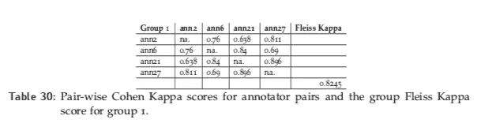
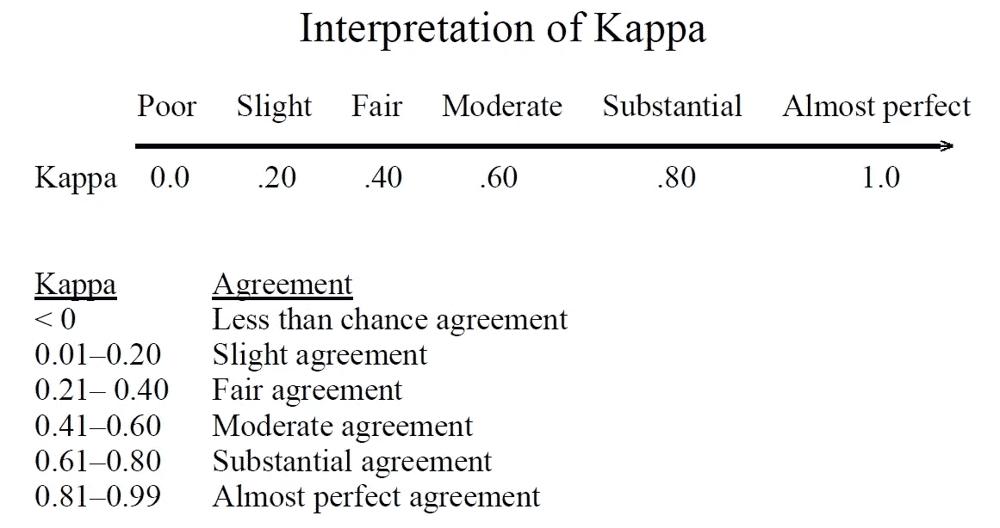

# 注释者间协议(IAA)

> 原文：<https://towardsdatascience.com/inter-annotator-agreement-2f46c6d37bf3?source=collection_archive---------4----------------------->



作者图片

## 分类标注的成对 Cohen kappa 和群 fleiss kappa(𝜅)系数

在这个故事中，我们将探索注释者间协议(IAA ),这是对多个**注释者**为某个类别做出相同的**注释**决定的一种度量。受监督的自然语言处理算法使用带标签的数据集，该数据集通常由人来注释。一个例子是我硕士论文的注释方案，其中推文被标记为辱骂性的*或非辱骂性的*。**

**IAA 向您展示了您的注释准则有多清晰，您的注释者对它的理解有多一致，以及注释任务的可重复性有多高。这是分类结果的验证和重现性的重要部分。**

***准确性*和 *F1 得分*没有考虑到**人们注释实例时很可能出现的**期望机会一致。考虑预期机会协议的措施:**

*   **科恩的𝜅:两个注释者用一个类别注释每个实例**
*   **弗莱斯的《𝜅:》每一个例子都用一个类别进行了注释《𝑛时报》**

**这个故事涵盖了注释的最佳实践，并探索了定性注释的两个 IAA 度量标准:Cohen 和 Fleiss 的 kappa。Cohen kappa 是在一对注释者之间计算的，而 Fleiss 的 kappa 是在一组多个注释者之间计算的。**

****

**Kappa 统计定义**

# **注释设置**

**监督学习是基于示例输入-输出对学习将输入映射到输出的函数的机器学习任务。它从由一组训练样本组成的带标签的训练数据中推断出该函数。**

**在注释数据时，最好让多个注释者注释同一个训练实例来验证标签。当多个注释者注释数据的相同部分时，我们能够计算观察者之间的一致或 IAA。**

**为了我的硕士论文，我和 44 个本科生一起工作，分成 11 组。每个人都标注了 100 条独特的推文和 50 条重叠的推文，其他三个小组成员也标注了这些推文。这导致四个不同的注释者发布了 50 条带注释的 tweet，一个注释者发布了 400 条 tweet。**

# **科恩卡帕**

**Cohen 的 kappa 系数( *κ* )是一个统计量，用于度量标注者之间对于定性(分类)项目的可靠性。这是一个比简单的百分比协议计算更稳健的衡量标准，因为 *κ* 考虑了协议偶然发生的可能性。它是两个标注器之间成对的可靠性度量。**

**科恩的卡帕统计量是两个评价人之间的一致，其中 *Po* 是评价人之间相对观察到的一致(等同于准确度)，而 *Pe* 是机会一致的假设概率。下面是该评估指标的编程实现。**

****注意**注释列表必须按照相同的索引排序。`ann1[0]`和`ann2[0]`应该代表同一个带注释的实例(tweet)。**

# **弗莱斯卡帕**

**Fleiss' kappa 是一种统计方法，用于在给几个项目分配分类评级或对项目进行分类时，评估固定数量的评价人之间的一致性的可靠性。它是 Scott 的 pi (𝜋)评估度量的一种推广，将两个标注器扩展到多个标注器。斯科特的 pi 和科恩的 kappa 只适用于两位评分者，而弗莱斯的 kappa 适用于任何数量的评分者，他们对固定数量的项目进行分类评分。除此之外，并不是所有的评定者都需要对所有项目进行注释。**

**感谢 [Skylander86](https://gist.github.com/skylander86/65c442356377367e27e79ef1fed4adee) 对用 Python 实现 Fleiss kappa 的贡献。我只是复制了他的代码，并添加了注释来解释发生了什么。**

# **Kappa 统计解释**

**如果评定者完全同意，那么 *κ = 1* 。如果评定者之间没有达成一致(除了偶然预期的情况)，那么 *κ ≤ 0* 。**

****

**卡帕诠释，[来源](https://www.ncbi.nlm.nih.gov/pubmed/15883903)**

# **摘要**

*   **Cohen kappa 只有两个注释器，每个注释器注释每个项目。**
*   **由于机会协议的计算方式，科恩的𝜅比斯科特的𝜋信息量更大:后者对每个评分者使用一种分布，而前者使用不同的分布。**
*   **弗莱斯的卡帕是斯科特的𝜋对两位编码员的延伸(不是科恩的𝜅).**
*   **Fleiss 的 kappa 可以有任意数量的注释器，每个项目不一定都由每个注释器进行注释！**

**在下面的包中也有 Cohen 和 Fleiss 的 kappa 统计的实现，所以您不必为它们编写单独的函数(尽管这是一个很好的实践！).**

```
**import sklearn
from sklearn.metrics import cohen_kappa_scoreimport statsmodels
from statsmodels.stats.inter_rater import fleiss_kappa**
```

**希望这个故事向您展示了如何计算 IAA 来验证您的结果并提高您的实验的可重复性！完整的脚本可以在[这里](https://github.com/LouisdeBruijn/Medium/tree/master/IAA)找到。**