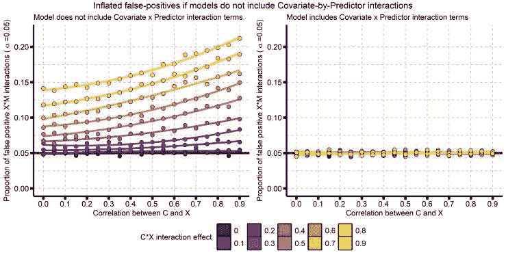

# 干扰分析——对控制变量进行适当调整(第 4 部分)

> 原文：<https://towardsdatascience.com/interaction-analyses-appropriately-adjusting-for-control-variables-d34dfbdd781a?source=collection_archive---------48----------------------->

## 交互分析中夸大的假阳性，以及如何消除它们。

[这最初发布在我的[博客](https://davidbaranger.com/2019/08/06/interaction-analyses-interpreting-effect-sizes-part-2/)

在本系列的前几篇文章中，我谈到了交互分析的计算能力([第 1 部分](https://medium.com/@dbaranger/interaction-analyses-power-part-1-39772b6a1970))，解释交互效应大小([第 2 部分](https://medium.com/@dbaranger/interaction-analyses-interpreting-effect-sizes-part-2-e532c1e8a179))，以及交互需要多大的样本量([第 3 部分](https://medium.com/@dbaranger/interaction-analyses-how-large-a-sample-do-i-need-part-3-2b49b20d0810))。在这里，我要谈谈一个我非常关心的问题——控制变量！

“什么？”你问，“交互控制变量不是和其他回归一样吗？”答案很简单……**不会！**

假设你有一个回归— *Y ~ X + C* 。这是我的“控制”变量——这些变量代表了我们想要考虑的潜在影响。如果我们想要测试一个交互，也就是“适度”，我们的回归可能看起来像这样— *Y ~ X*M + X + M + C* 。x * M’是我们感兴趣测试的交互作用。但是我们还没完！我们还没有对控制变量的所有可能影响进行调整。直觉上，由于我们的假设是相互作用，我们需要控制潜在的替代相互作用。我们最终的回归方程应该是这样的——***Y ~ X * M+X+M+C * X+C * M+C****。*

我第一次意识到这个问题是因为 Matthew Keller 博士的一篇关于 x 基因环境分析的统计控制的优秀文章。他引用了 1992 年由[赫尔、泰德里和赫恩](https://journals.sagepub.com/doi/abs/10.1177/0146167292182001?casa_token=yzJQosONeJ8AAAAA:Bo_9reJE9U28bFIjYwqfxee6QN_m9OaLFm9AyOP0Ev0qW8lxi_O7uibd3oDvEHMVwh2V3UHpJ5uG)撰写的一篇文章，该文章指出了这个问题(这是我所知道的关于这个问题的最古老的文章)。还有一篇由 [Yzerbyt、Muller 和 Judd](https://www.sciencedirect.com/science/article/pii/S0022103103001598?casa_token=zVdO4bJas18AAAAA:VoaGfpIlBDZ8YbQsfZ5dZ05dVCfIkAgy9xFGl4frF-WrOZOFM0JUJjiUzYXQOZ3kqexDNUK1) 于 2004 年撰写的优秀论文，在我看来，这篇论文对驱动这些额外控制的必要性的潜在因素给出了最好的解释。

真的，你应该去看看 Yzerbyt、Muller 和 Judd 的论文。简而言之，在两种情况下，不包含*而不包含*协变量 x 预测因子交互项的回归模型将具有*增加的假阳性* : (1)当协变量和预测因子相关时，以及(2)当协变量 x 预测因子交互本身与因变量 y 相关时。这里我复制了它们的*图 1* ，显示了这些影响:

模拟数据，所有变量都是连续的，正态的。模拟样本量 N=200，X 和 M 的主效应 r=0.2，X 和 M 不相关，X*M 交互效应 r=0。c 具有 r=0 的主效应，并且与 M (r=0)不相关。每个点代表 10，000 次模拟中假阳性的比例，总共 190 万次模拟。代码在[这里](https://pitt.box.com/s/xfxt37uw7ikn1p11xcnvj7r1xczvz3yd)可用。

该图清楚地表明了假阳性(I 型错误；当真实效应为 0 时，检测到显著效应)随着协变量和预测因子之间的相关性增加，以及随着协变量 x 预测因子交互作用的影响增加而增加。这是个问题吗？我真的觉得是。即使是 6%的假阳性率对任何个人发现来说都是一个巨大的问题，并且在一个领域或知识体的水平上，可能导致高度偏见的文献。(注意这不是特定领域的，这适用于任何交互分析，所以我在这里不只是谈论心理学或神经科学)。我没有关于这个问题有多大的可靠数据，但是我已经阅读和评论了很多不包括这些额外协变量的论文。

最简单的解决方法是在你的模型中包含所有的预测协变量交互作用！当然，这种解决方案的一个不利方面是，这将使*模型中的协变量数量增加两倍*——如果你有 5 个协变量，现在你将有 15 个！如果你的自由度很少，这可能是一个问题，尽管老实说，如果你的 *df* 很少，额外的 10 个变量会产生很大的差异，你可能[一开始就不应该测试交互](https://davidbaranger.com/2019/08/06/interaction-analyses-how-large-a-sample-do-i-need-part-3/)。您可能会想，如果您要测试每个协变量的潜在偏差源，并且只包含重要的附加项，会怎么样？很清楚为什么这不会起作用，因为(1)首先你必须对每个统计测试进行校正(例如在我的 5 个初始协变量的例子中的 20 个，C 和 X/M 之间的相关性，加上 C*X 和 C*M 相互作用的影响)，在这一点上(2)图 2 清楚地表明，你很可能*没有能力*检测仍然会使你的结果产生偏差的影响( [Yzerbyt、Muller 和 Judd](https://www.sciencedirect.com/science/article/pii/S0022103103001598?casa_token=zVdO4bJas18AAAAA:VoaGfpIlBDZ8YbQsfZ5dZ05dVCfIkAgy9xFGl4frF-WrOZOFM0JUJjiUzYXQOZ3kqexDNUK1) 所以不能保证你能只包括潜在的偏见来源。唯一的解决方法是包含所有的交互协变量。

现在，*如何*为您的分析生成协变量？据我所知，像 SPSS 和 GraphPad 这样的即插即用的统计软件并没有提供一种简单的方法来动态地生成这些变量，尽管你当然可以手动地一个接一个地生成它们(或者如果你知道如何在 SPSS 中编写脚本，它应该也很快)。然而，我开始真正欣赏 **R** 的一点是，这些交互协变量可以直接在你的回归模型中指定。例如，代替:

lm(Y~ X:M + X + M + C)

你会写:

lm(Y~ X:M + X + M + C + C:(X+M))

真的就这么简单！