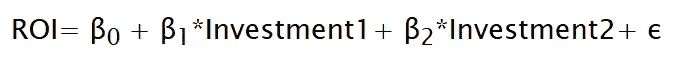
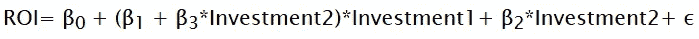
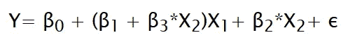
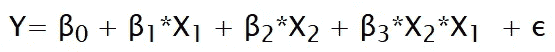
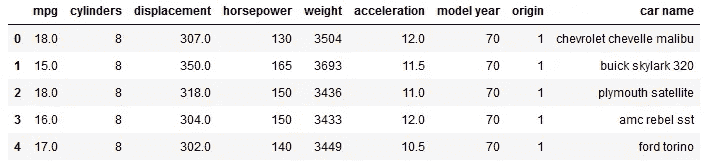
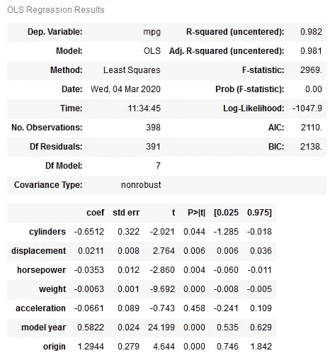

# 多元回归中的交互效应

> 原文：<https://towardsdatascience.com/interaction-effect-in-multiple-regression-3091a5d0fadd?source=collection_archive---------8----------------------->

## 了解交互效应以及如何使用 Python sklearn 库在数据集中识别交互效应。


图片来源:[www.pixabay.com](https://pixabay.com/images/id-3286017/)

# **什么是互动效应？**

互动效应不仅存在于统计学中，也存在于市场营销中。在市场营销中，这个相同的概念被称为协同效应。交互效应是指两个或更多的特征/变量组合在一起，与单独的单个变量的总和相比，对一个特征具有明显更大的影响。当我们试图研究几个变量对单个响应变量的影响时，在回归中理解这种影响是很重要的。

线性回归方程可以表示如下:


这里，我们试图找到自变量(X₁和 X₂)与响应变量 y 和ε之间的线性关系是不可约误差。为了检查预测变量和反应变量之间是否有任何显著的统计关系，我们进行了假设检验。如果我们对预测变量 X₁进行测试，我们将有两个假设:

零假设(**h₀**):x₁和 y 之间没有关系(β₁ = 0)

另类假设(**h₁**):x₁and y(β₁≠0)之间有关系

然后，我们根据 p 值决定是否拒绝零假设。假设零假设为真，p 值是测试结果的概率。

例如，如果我们在测试结果中得到非零值的β₁，这表明 X₁和 y 之间存在关系。但如果 p 值很大，这表明即使零假设实际上为真，我们也很有可能得到非零值的β₁。在这种情况下，我们无法拒绝零假设，并得出结论，预测和反应变量之间没有关系。但是，如果 p 值很低(通常 p 值截止值被认为是 0.05)，那么即使β₁的非零值很小，也表明预测值和响应变量之间存在显著关系。

如果我们得出 X₁和 y 之间有关系的结论，我们认为 X₁每增加一个单位，y 就增加/减少β₁个单位。在上面的线性方程中，我们假设 X₁对 y 的影响与 X₂.无关这也称为线性回归中的**加法假设**。

但是如果 X₁对 y 的影响也依赖于 X₂呢？我们可以在许多商业问题中看到这种关系。例如，我们想找出两种不同投资类型的投资回报率。本例的线性回归方程为:



在这个例子中，如果我们部分投资于这两种类型的投资，而不是完全投资于其中一种，可能会有更大的利润。例如，如果我们有 1000 单位的资金进行投资，将 500 单位的资金同时投资于这两种投资，与将 1000 单位的资金全部投资于其中一种投资相比，可以获得更大的利润。在这种情况下，投资 1 与投资回报的关系将取决于投资 2。这种关系可以包含在我们的等式中，如下所示:



在上面的等式中，我们包括了投资 1 和投资 2 之间的“相互作用”,用于预测总投资回报。对于任何线性回归方程，我们都可以包括这样的相互作用



上述等式可以改写为:



这里，β₃是相互作用项的系数。同样，为了验证回归中交互作用的存在，我们进行假设检验并检查我们系数的 p 值(在这种情况下是β₃).

# **使用 sklearn 在数据集中查找交互术语**

现在让我们看看如何验证数据集中交互作用的存在。我们将使用自动数据集作为我们的例子。数据集可以从[这里](https://www.kaggle.com/uciml/autompg-dataset)下载。让我们看一下数据集

```
import pandas as pd
data = pd.read_csv('data/auto-mpg.csv')
```



将数据集转换为数字并填充缺失的值

```
#removing irrelevant 'car name' column
data.drop('car name',axis=1,inplace=True)
#converting all columns to numeric
for col in data.columns:
    data[col] = pd.to_numeric(data[col], errors ='coerce')
#replacing missing values in horsepower with its median
horse_med = data['horsepower'].median()
data['horsepower'] = data['horsepower'].fillna(horse_med)
```

让我们在这个数据集上拟合一个 OLS(普通最小二乘法)模型。该模型存在于 statsmodels 库中。

```
from statsmodels.regression import linear_model
X = data.drop('mpg', axis=1)
y = data['mpg']
model = linear_model.OLS(y, X).fit()
```

从这个模型中，我们可以得到系数值，以及它们是否在统计上有意义，以包括在模型中。

```
model.summary()
```

下面是模型摘要的快照。



在上面的模型总结中，我们可以看到除了**加速度、**之外，其他所有特征的 p 值都小于 0.05，具有统计学意义。即使**加速度**独立对 **mpg 的预测没有帮助，**我们也有兴趣找出**加速度**在与其他变量相互作用后是否对 **mpg 有影响。**此外，我们有兴趣了解所有重要交互术语的存在。

我们首先需要创建所有可能的交互项。通过使用 sklearn 库中的**多项式特性**，这在 python 中是可能的

```
from sklearn.preprocessing import PolynomialFeatures#generating interaction terms
x_interaction = PolynomialFeatures(2, interaction_only=True, include_bias=False).fit_transform(X)#creating a new dataframe with the interaction terms included
interaction_df = pd.DataFrame(x_interaction, columns = ['cylinders','displacement','horsepower','weight','acceleration','year','origin',
                                                       'cylinders:displacement','cylinders:horsepower','cylinders:weight','cylinders:acceleration',
                                                       'cylinders:year','cylinders:origin','displacement:horsepower','displacement:weight',
                                                       'displacement:acceleration','displacement:year','displacement:origin','horsepower:weight',
                                                       'horsepower:acceleration','horsepower:year','horsepower:origin','weight:acceleration',
                                                       'weight:year','weight:origin','acceleration:year','acceleration:origin','year:origin'])
```

当创建了包括交互项的新数据框架时，我们可以为其拟合新的模型，并查看哪些交互项是重要的。

```
interaction_model = linear_model.OLS(y, interaction_df).fit()
```

现在我们只需要那些统计上有意义的相互作用项(p 值小于 0.05)

```
interaction_model.pvalues[interaction_model.pvalues < 0.05]
```


正如我们所看到的，存在交互项。另外，**加速度**本身并不重要，但是它与**马力**和**年份**的相互作用被证明对于 **mpg 的预测非常重要。**

值得注意的是，在上面的例子中，加速度**的 p 值**很高，但它包含在交互项中。在这种情况下，我们必须将**加速度**的**主效应**包括在模型中，即**加速度**的系数，即使由于**等级原则它在统计上不显著。**等级原则规定，如果在交互项中有两个特征 X₁和 X₂，我们必须在模型中包括它们的 coefficients(β₁和β₂，即使与它们相关的 p 值非常高。