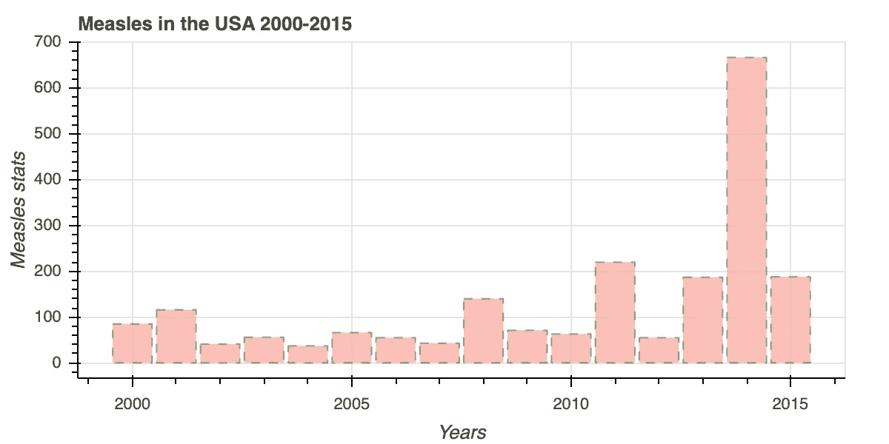
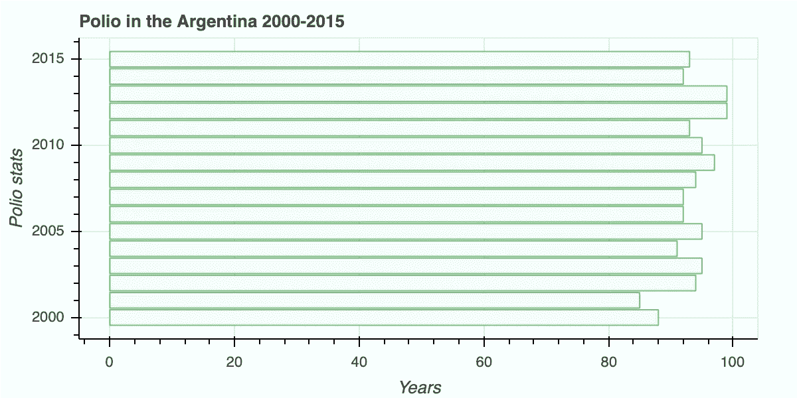
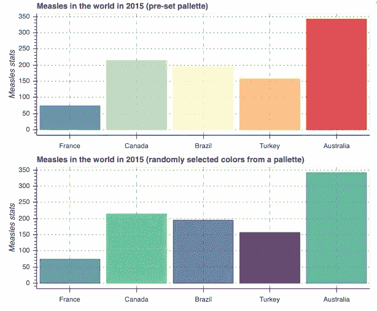
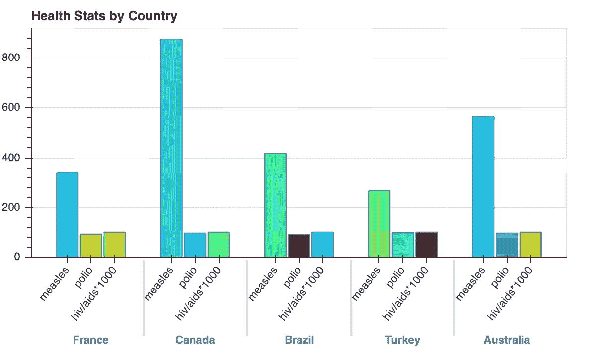
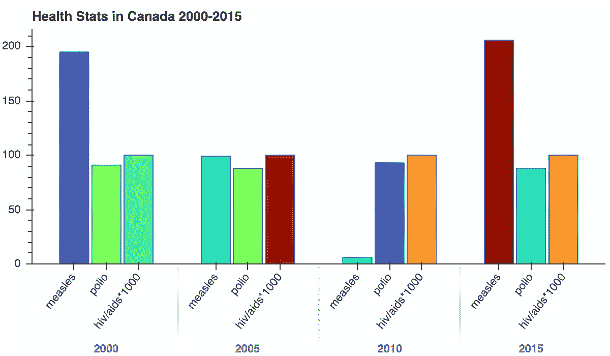
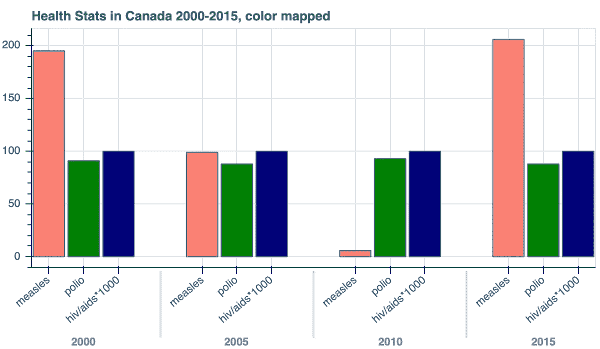
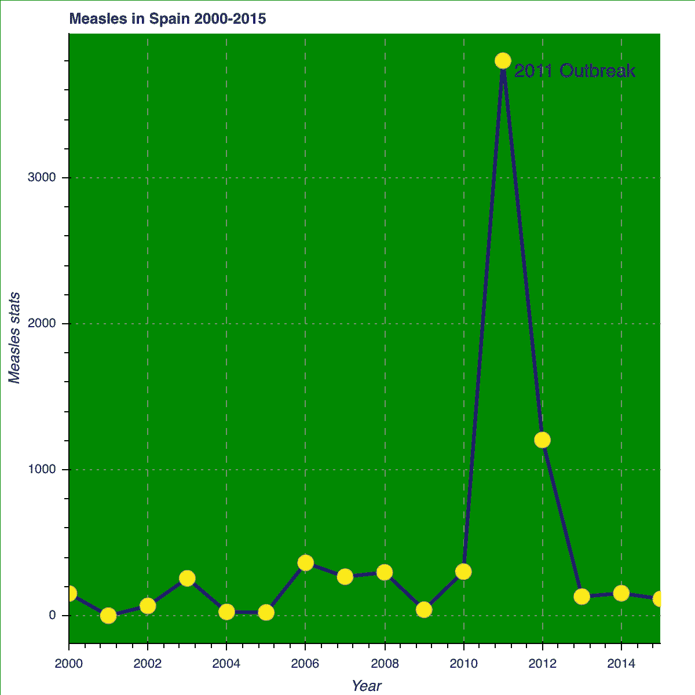
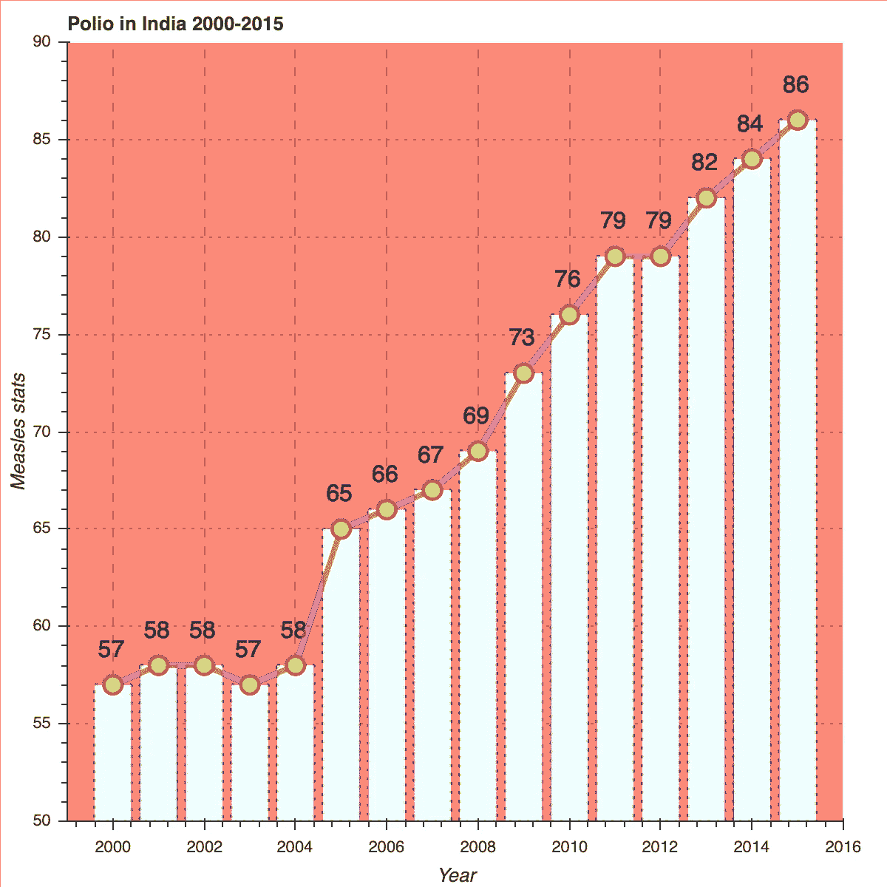

# 带有散景的交互式条形图

> 原文：<https://towardsdatascience.com/interactive-bar-charts-with-bokeh-7230e5653ba3?source=collection_archive---------20----------------------->


照片由[戴恩·托普金](https://unsplash.com/@dtopkin1?utm_source=medium&utm_medium=referral)在 [Unsplash](https://unsplash.com?utm_source=medium&utm_medium=referral) 上拍摄

## 和其他视觉增强技术

## 介绍

这篇文章是我的散景爱情故事的第二部分。完整的故事(包括 Jupyter 笔记本和所有文件)在我的 [Github](https://github.com/ikviatkovski/bokeh_demo.git) 上。故事的第一部分在媒体文章[“使用散景的简单数据可视化技术”](/top-5-simple-techniques-for-data-visualization-using-bokeh-a7fa4e05d6e6)中有所描述。


[马里奥·高](https://unsplash.com/@mariogogh?utm_source=medium&utm_medium=referral)在 [Unsplash](https://unsplash.com?utm_source=medium&utm_medium=referral) 上的照片

## 条形图

没有可视化，你的数据故事是不可能完整的，条形图可以说是最受欢迎的分类数据表示类型之一。这种类似乐高积木的图形有无数种类型、调色板和风格，这就是为什么我决定为它们写一篇单独的文章。

让我们从简单的垂直和水平条形图开始。我们马上会谈到更复杂的问题。

用散景绘制条形图非常简单。像往常一样，我们需要指定一种图表类型(或者选择一种字形)并将数据传递给绘图函数。让我们使用相同的联合国世界卫生保健指标数据库创建一个垂直条形图，显示 2000-2015 年间美国麻疹发病率的变化。

```
# Creating a list of categories
years = data[data['country']=='United States of America']['year']#Creating the list of values
values = data[data['country']=='United States of America']['measles']# Initializing the plot
p = figure( plot_height=300, 
           title="Measles in the USA 2000-2015",
          tools=TOOLS)#Plotting
p.vbar(years,                            #categories
      top = values,                      #bar heights
       width = .9,
       fill_alpha = .5,
       fill_color = 'salmon',
       line_alpha = .5,
       line_color='green',
       line_dash='dashed'

  )#Signing the axis
p.xaxis.axis_label="Years"
p.yaxis.axis_label="Measles stats"show(p)
```

瞧啊。



完全以同样的方式，我们可以创建水平条形图。让我们以阿根廷 2000-2015 年报告的脊髓灰质炎发病率为例进行说明。

```
# Creating a list of categories
years = data[data['country']=='Argentina']['year']#Creating the list of values
values = data[data['country']=='Argentina']['polio'].values# Initializing the plot
p = figure( plot_height=300, 
           title="Polio in the Argentina 2000-2015")#Plotting
p.hbar(years,
       left = 0,
       right = values,
       height = .9,
       fill_color = 'azure',
       line_color='green',
       line_alpha=.5

  )p.xaxis.axis_label="Years"
p.yaxis.axis_label="Polio stats"show(p)
```

代码超级直观；我们只需要记住我们是在练习单杠。



我们的条形图以一种非常简单的方式呈现，它们肯定可以从一些附加的构成中受益。

## 条形图样式

有关一些可用调色板的列表，请访问[散景调色板文档](https://docs.bokeh.org/en/latest/docs/reference/palettes.html)。为了配合散景使用它们，我们需要专门导入它们。

让我们来看看 2015 年一些国家的麻疹数据——我们将使用预设调色板和随机选择的颜色来绘制两个图表，并且我们将使用*gridplot*技术。

## 调色板和网格图

```
#Importing a pallettefrom bokeh.palettes import Spectral5, Viridis256, Colorblind, Magma256, Turbo256# Creating a list of categorical values values = data[(data['year']==2015)&(data['country'].isin(countries))]['measles']# Set the x_range to the list of categories abovep1 = figure(x_range=countries,
           plot_height=250, 
           title="Measles in the world in 2015 (pre-set pallette)")# Categorical values can also be used as coordinatesp1.vbar(x=countries, top=values, width=0.9,
      color = Spectral5, fill_alpha=.75)# Set some properties to make the plot look betterp1.yaxis.axis_label="Measles stats"
p1.xgrid.grid_line_color='gray'
p1.xgrid.grid_line_alpha=.75
p1.xgrid.grid_line_dash = 'dashed'
p1.ygrid.grid_line_color='blue'
p1.ygrid.grid_line_alpha = .55
p1.ygrid.grid_line_dash = 'dotted'p2 = figure(x_range=countries,
           plot_height=250, 
           title="Measles in the world in 2015 (randomly selected colors from a pallette)")# Categorical values can also be used as coordinatesp2.vbar(x=countries, top=values, width=0.9,
      color = random.sample(Viridis256,5), fill_alpha=.75)# Set some properties to make the plot look betterp2.yaxis.axis_label="Measles stats"
p2.xgrid.grid_line_color='gray'
p2.xgrid.grid_line_alpha=.75
p2.xgrid.grid_line_dash = 'dashed'
p2.ygrid.grid_line_color='blue'
p2.ygrid.grid_line_alpha = .55
p2.ygrid.grid_line_dash = 'dotted'p = gridplot([[p1,None],[p2,None]], toolbar_location='right')
show(p)
```

这是结果:



这个情节看起来比我们开始时的要友好得多。对颜色和调色板的实验永无止境。

## 分组条形图

有时我们需要绘制分组条形图。例如，我们可能需要对一些国家的健康指标进行分组。为此，我们需要从 bokeh.models 模块导入一个特殊的过程— FactorRange。让我们看看 2014 年国家名单中麻疹、脊髓灰质炎和艾滋病毒/艾滋病*1000 的数据。

```
from bokeh.models import FactorRange#List of used statisticsstats = ['measles','polio','hiv/aids*1000']#Creating a dictionary of our datamdata = {'countries' : countries,
        'measles'   : data[data['year']==2014][data['country'].isin(countries)]['measles'],
        'polio'   : data[data['year']==2014][data['country'].isin(countries)]['polio'],
        'hiv/aids*1000'   : data[data['year']==2014][data['country'].isin(countries)]['hiv/aids']*1000}# Creating tuples for individual bars [ ("France", "measles"), ("France", "polio"), ("France", "hiv/aids*1000"), ("Canada", "measles"), ... ]x = [ (country, stat) for country in countries for stat in stats ]
counts = sum(zip(mdata['measles'], mdata['polio'], mdata['hiv/aids*1000']), ())#Creating a column data source - Bokeh's own data type with the fields (Country,[stats],[values],[colors]) source = ColumnDataSource(data=dict(x=x, counts=counts, color=random.sample(Turbo256,15)))#Initializing our plotp = figure(x_range=FactorRange(*x), plot_height=350, title="Health Stats by Country")#Plotting our vertical bar chartp.vbar(x='x', top='counts', width=0.9  ,fill_color='color',  source=source)#Enhancing our graphp.y_range.start = 0
p.x_range.range_padding = 0.1
p.xaxis.major_label_orientation = .9
p.xgrid.grid_line_color = Noneshow(p)
```

情节是这样的:



我们也可以使用无数种可能的内置方法来根据我们的喜好调整视觉效果。

## 颜色转换

我们经常对预设或随机的调色板不满意，我们需要使用一些额外的色彩映射。我们用 bokeh.transform 模块导入的 factor_cmap 函数就是这种情况。我们来看看加拿大分别在 2000 年、2005 年、2010 年和 2015 年的麻疹、脊髓灰质炎和艾滋病*1000 的数据。

```
from bokeh.transform import factor_cmap#List of used statisticsstats = ['measles','polio','hiv/aids*1000']
years = ['2000','2005','2010','2015']#Creating a dictionary of our datamdata = {'years' : years,
        'measles'   : data[data['country']=="Canada"][data['year'].isin(years)]['measles'],
        'polio'   : data[data['country']=="Canada"][data['year'].isin(years)]['polio'],
        'hiv/aids*1000'   : data[data['country']=="Canada"][data['year'].isin(years)]['hiv/aids']*1000}# Creating tuples for individual bars x = [ (year, stat) for year in years for stat in stats ]
counts = sum(zip(mdata['measles'], mdata['polio'], mdata['hiv/aids*1000']), ())#Creating a column data source source = ColumnDataSource(data=dict(x=x, counts=counts, color=random.sample(Turbo256,12)))#Initializing our plot with random colorsp1 = figure(x_range=FactorRange(*x), plot_height=350, title="Health Stats in Canada 2000-2015")#Plotting our vertical bar chartp1.vbar(x='x', top='counts', width=0.9  ,fill_color='color',  source=source)#Enhancing our graphp1.y_range.start = 0
p1.x_range.range_padding = 0.1
p1.xaxis.major_label_orientation = .9
p1.xgrid.grid_line_color = None#Creating a new column data source without set colors 

source1 = ColumnDataSource(data=dict(x=x, counts=counts))#Initializing our plot with synchronized fill colors with factor_cmapp2 = figure(x_range=FactorRange(*x), plot_height=350,
            title="Health Stats in Canada 2000-2015, color mapped"
           )p2.vbar(x='x', top='counts', width=0.9,
        source=source1,
       fill_color=factor_cmap('x', palette=['salmon', 'green', 'navy'], 
factors=stats, start=1, end=2))p2.xaxis.major_label_orientation = .7
p=gridplot([[p1,None],[p2,None]], toolbar_location='right')show(p)
```

我们在这里——第一个图表有一些随机的颜色，第二个是颜色因素:



尽管第一个看起来更怪异，但第二个在色彩映射统计时有更清晰的信息。

## 向视觉效果添加标签

在散景中绘制单个标签非常简单，不需要任何特殊的技巧。我们只需要从 bokeh.models.annotations 模块导入 Label 类，它的语法非常简单。人们只需要知道散景使用一个单独的图层来绘图，另一个图层来标记，等等。我们将使用 add_layer()方法来组装我们的视觉效果。让我们看一个例子，并创建一个 2000-2015 年西班牙麻疹的图表。

```
from bokeh.models.annotations import Label#Initializing our plotp = figure(x_range=(2000,2015), title='Measles in Spain 2000-2015')#Plotting a linep.line(data[data['country']=='Spain']['year'],
      data[data['country']=='Spain']['measles'],
       line_color='navy',
      line_width=3)#Plotting data points as cirlesp.circle(data[data['country']=='Spain']['year'],
      data[data['country']=='Spain']['measles'],
        radius=.2,
        fill_color='yellow',
        line_color='salmon')#Instance of Label class as our 2011 Measles Outbreak labellabel = Label(x=2011, 
              y=max(data[data['country']=='Spain']['measles']),
              x_offset=10, 
              text="2011 Outbreak",
              text_baseline="top")#Adding a layout with our label to the graphp.add_layout(label)#Styling the graphp.xaxis.axis_label = 'Year'
p.yaxis.axis_label = 'Measles stats'
p.xgrid.grid_line_dash = 'dashed'
p.xgrid.grid_line_color ='gray'
p.ygrid.grid_line_dash ='dotted'
p.ygrid.grid_line_color = 'gray'
p.background_fill_color='green'
p.background_fill_alpha=.05show(p)
```

瞧啊。



添加一个“自定义”标签真的很简单。散景的美妙之处在于，添加一整套标签并没有多一点困难。让我们看看 2000-2015 年印度的脊髓灰质炎的例子，并尝试给每个数据点添加值。我们只需要使用 ColumnDataSource 类的一个实例，并从 bokeh.models 模块导入 LabelSet 类。

```
from bokeh.models import LabelSet#Instance of ColumnDataSourcesource = ColumnDataSource(data=dict(
    x=data[data['country']=='India']['year'],
    y=data[data['country']=='India']['polio'],
    labels=data[data['country']=='India']['polio'].values))#Initializing our plotp = figure(x_range=(1999,2016),
           y_range=(50,90),
           title='Polio in India 2000-2015')#Plotting data points as vertical barsp.vbar(x = 'x',
         top = 'y',
       width = .8,
        fill_color='azure', fill_alpha = 1,
        line_color='navy', line_alpha=.25,
         line_width=2, line_dash='dotted',
        source=source)#Plotting a linep.line(x = 'x',
       y = 'y',
       line_color='red',line_width=4,
       line_alpha=.5,
      source=source)#Plotting data points as circlesp.circle(x='x',y='y', 
         radius=.2, 
         fill_color='yellow', line_color='red', line_width=2,
         source=source)#Instance of the LabelSet classlabels = LabelSet(x='x',            #positions of labeled datapoints
                  y='y', 
                  text='labels',          #labels' text
                  level='glyph',          #labeling level
                 x_offset=-10, y_offset=15, #move from datapoints
                  source=source, 
                  render_mode='canvas',
                 text_baseline='bottom'   #relative position to datapoints
                 )p.add_layout(labels)p.xaxis.axis_label = 'Year'
p.yaxis.axis_label = 'Measles stats'
p.xgrid.grid_line_dash = 'dashed'
p.xgrid.grid_line_color ='gray'
p.ygrid.grid_line_dash ='dotted'
p.ygrid.grid_line_color = 'gray'
p.background_fill_color='salmon'
p.background_fill_alpha=.05show(p)
```

就是这样:



## 其他互动技术

有相当多的其他互动技术可以真正重塑你的形象，给你的数据驱动的故事一个全新的维度。仅举几个例子——与平移链接、与刷动链接、悬停等。其中一些在 Github 上相应的[项目的笔记本](https://github.com/ikviatkovski/Bokeh_Demo_Project/blob/master/Code/3%20Bar%20Charts%20and%20Enhancement%20Techniques.ipynb)中有说明。

散景确实是灵感的无尽源泉。我对它的简单性、流畅的学习曲线和精彩的互动视觉效果赞不绝口。！