# 用 Plotly 实现交互式篮球数据可视化

> 原文：<https://towardsdatascience.com/interactive-basketball-data-visualizations-with-plotly-8c6916aaa59e?source=collection_archive---------12----------------------->

## 使用 hexbin shot 图表分析体育数据，使用 Plotly 和 Plotly Express 分析气泡图(源代码&我的 [GitLab repo](https://gitlab.com/jphwang/online_articles) 中包含的所有 30 支球队的数据)

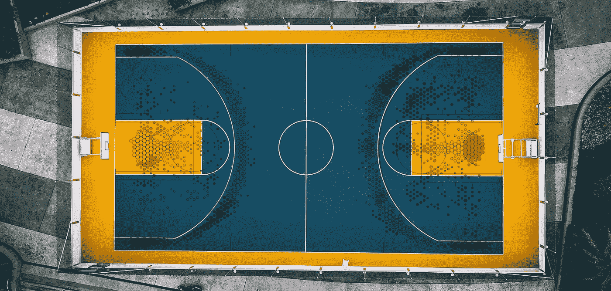

由 [Izuddin Helmi Adnan](https://unsplash.com/@izuddinhelmi?utm_source=unsplash&utm_medium=referral&utm_content=creditCopyText) 在 [Unsplash](https://unsplash.com/s/photos/basketball?utm_source=unsplash&utm_medium=referral&utm_content=creditCopyText) 上拍摄的原始照片

> 这篇文章主要是关于观想的。它只会包括非常粗略的篮球信息——基本上，如果你知道它是什么，你会没事的。

我最近一直在摆弄篮球数据分析和可视化，用 matplotlib 绘图。它很强大，但 Plotly 是我通常选择的可视化软件包。

在我看来，Plotly 实现了功能和可定制性的正确平衡，以合理、直观的语法编写，具有很高的文档和开发速度。

所以我最近把我的篮球可视化脚本移植到了 Plotly，取得了很好的效果。在这篇文章中，我想分享一些，包括使用 Plotly 和 Plotly Express 的例子。

> 我在我的[git lab repo here](https://gitlab.com/jphwang/online_articles)(**basketball _ plots**目录)中包含了这方面的代码，所以请随意下载并使用它/改进它。

# 在开始之前

## 数据

由于这篇文章主要是关于可视化，我将在我的 repo 中包括所有 30 支球队和联盟平均水平的预处理数据输出。

## 包装

我假设您熟悉 python。即使你相对较新，这个教程也不应该太难。

你需要用一个简单的`pip install plotly`来安装它(在你的虚拟环境中)。

# 气泡图一闪而过—使用 Plotly Express

NBA 职业篮球运动员从篮筐右侧投篮，越过离篮筐约 24 英尺的三分线。我想了解距离如何影响投篮的准确性，以及球员从每个距离投篮的频率，并看看是否有一种模式。

这是一个相对简单的练习，所以我们使用 Plotly Express。Plotly Express 是一个相当新的包，它是关于更快更有效地制作图表，所以你可以专注于数据探索。([你可以在这里了解更多信息](https://plot.ly/python/plotly-express/))

我有一个整个赛季(2018-2019 赛季)所有拍摄地点的数据库，大约有 220，000 张照片。该数据库包括每个镜头的位置，以及它是否成功。

利用这些数据，我制作了一个摘要(`league_shots_by_dist.csv`)，其中包括在 1 英尺(最长 32 英尺)的箱子中按距离分组的镜头，以及`shots_made`、`shots_counts`、`shots_acc`和`avg_dist`列。

让我们来研究一下这些数据，只需加载以下数据:

```
import pandas as pd
grouped_shots_df = pd.read_csv('srcdata/league_shots_by_dist.csv')
```

然后在导入包之后，运行下面的两行代码就会在浏览器上神奇地打开一个交互式散点图。

```
import plotly.express as px
fig = px.scatter(grouped_shots_df, x="avg_dist", y="shots_accuracy")
fig.show()
```

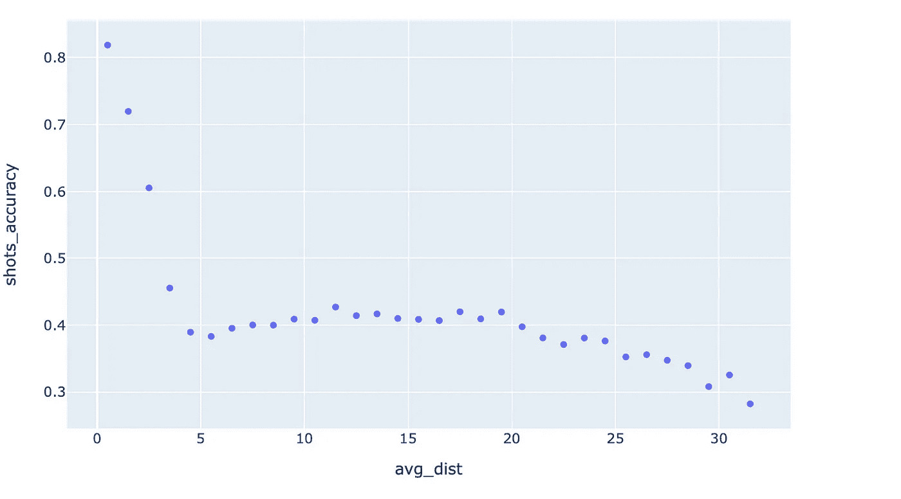

简单的散点图，只有两行代码

要查看玩家从每个距离射击的频率，让我们添加频率数据:只需将`shots_counts`值传递给`‘size'`参数，并指定最大气泡大小。

```
fig = px.scatter(grouped_shots_df, x="avg_dist", y="shots_accuracy", size="shots_counts", size_max=25)
fig.show()
```

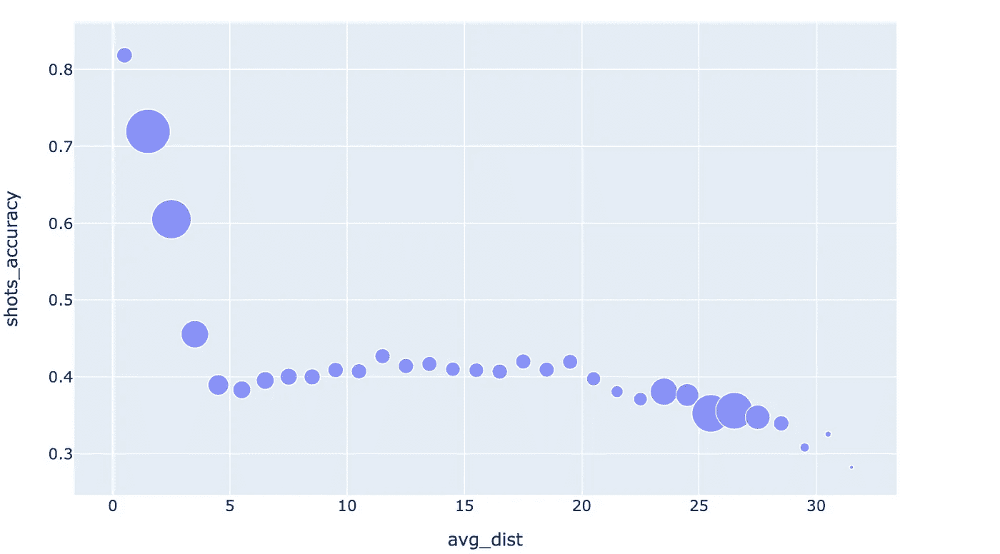

简单的气泡图，仍然只有两行代码

这很有趣。频率(气泡大小)降低，然后再次回升。这是为什么呢？嗯，我们知道，随着我们走得更远，有些是两分球，有些是三分球，有些是两者的混合。所以让我们试着用镜头类型来给变量着色。

```
fig = px.scatter(grouped_shots_df, x="avg_dist", y="shots_accuracy", size="shots_counts", color='shot_type', size_max=25)
fig.show()
```

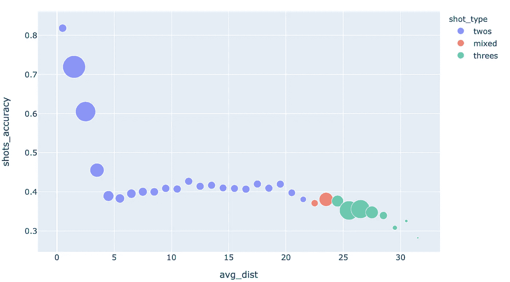

气泡图，仅仅两行代码就包含了类别— **和**！

啊，在那儿。看起来随着球员试图利用三分线，投篮频率增加了。

> 编辑:[这里有一个现场演示](https://demo.hindsights.io/basketball_plots_simple_scatter.html)

试着将你的鼠标移动到每一个点上——你会愉快地得到一个文本工具提示！你甚至不需要设置任何东西。

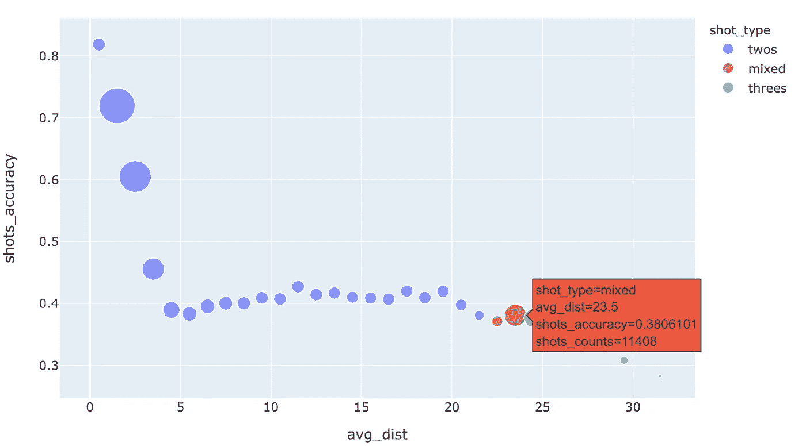

详细信息的默认鼠标悬停工具提示

移动你的光标，观察各个点，数据告诉我们，在距离篮筐 5 到 10 英尺的范围内，投篮的准确性没有太大的变化。通过投三分球，球员们用大约 15%的命中率下降来换取 50%以上的三分球奖励。三分球比这些‘中端’两分球更受欢迎是有道理的。

这不完全是一个突破性的结论，但它仍然能够让我们自己看到它。

但更重要的是，这不是简单得让人抓狂吗？**我们只用两行代码就创建了最后一个图表！**

只要你有一个经过预处理的“整洁”的日期框架，Plotly Express 就可以像这样快速地进行可视化，你可以从中工作。这是一个很棒的数据探索工具。

# Hexbin 图，带 Plotly

让我们来看另一个图表，叫做赫克斯宾图表。我在其他地方讨论过，但是 hexbin 图表允许基于区域的数据可视化，通过将整个区域划分为六边形大小的网格，并按颜色(有时也按大小)显示数据，就像这样。

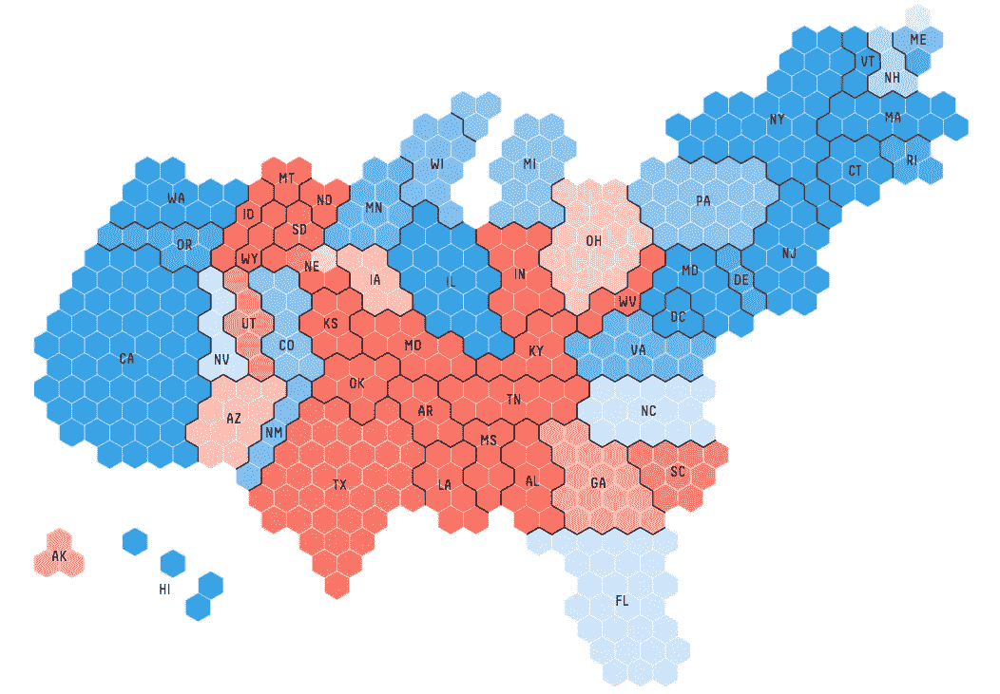

选举报道中的 hexbins([信息是美丽的](https://www.informationisbeautifulawards.com/showcase/2496-2016-election-forecast) / fivethirtyeight)

虽然 Plotly 本身没有提供从基于坐标的数据点编译 hexbin 数据的函数，但这对我们来说并不重要，因为 a) `matplotlib`确实([在这里](https://matplotlib.org/api/_as_gen/matplotlib.pyplot.hexbin.html)`[matplotlib](https://matplotlib.org/api/_as_gen/matplotlib.pyplot.hexbin.html)`读取由 `[*Polycollection*](https://matplotlib.org/api/_as_gen/matplotlib.pyplot.hexbin.html)` [返回的数据，如果你感兴趣的话)，b)我将提供数据集供这里使用。](https://matplotlib.org/api/_as_gen/matplotlib.pyplot.hexbin.html)

好了，让我们直接进入六邻体蛋白数据的可视化:

## 我们的第一张拍摄图表

我已经把数据保存成字典格式了。只需加载以下数据:

```
import pickle
with open('srcdata/league_hexbin_stats.pickle', 'rb') as f:
    league_hexbin_stats = pickle.load(f)
```

字典包含这些键(自己用`print(league_hexbin_stats.keys())`查看:

```
['xlocs', 'ylocs', 'shots_by_hex', 'freq_by_hex', 'accs_by_hex', 'shot_ev_by_hex', 'gridsize', 'n_shots']
```

重要的有:x & y 位置数据`xlocs`、`ylocs`、频率数据`freq_by_hex`和精度数据`accs_by_hex`。其中每一个都包括来自每个六边形的数据，除了准确性数据，我已经平均到“区域”中以消除局部变化。你看了剧情就知道我的意思了。

> 注意:X/Y 数据是最初根据标准坐标系捕获的。我以此为基础。基本上，边缘的中心在(0，0)，X & Y 坐标中的 1 看起来是 1/10 英尺。

让我们把它们画出来。这次我们将使用`plotly.graph_objects`，因为它给了我们额外的灵活性。这会导致编写稍微长一点的代码，但是不要担心——它仍然不是很长，而且完全值得。

让我们过一遍。前几行很明显——我只是给了几个值新的名称，这样我可以更容易地重用绘图代码。`go.Figure()`创建并返回一个新图形，我们将其分配给`fig`。

然后我们添加一个新的散点图，使用`markers`模式(即没有线条)，我们为这些标记指定参数，包括传递数组/列表作为我们的大小和颜色。

`sizeref`参数给出了一个参考尺寸来缩放其余的尺寸——我基本上只是用它来得到正确的尺寸，而`sizemode`指的是尺寸如何工作——尺寸是否应该根据面积或直径而变化。

惯例是应该使用“面积”,因为根据变量改变直径会使面积改变该值的平方，并且会夸大差异。

我们还将标记符号指定为一个`hexagon`(毕竟这是一个 hexbin 图)，并在六边形的外部添加一个`line`以产生视觉效果。

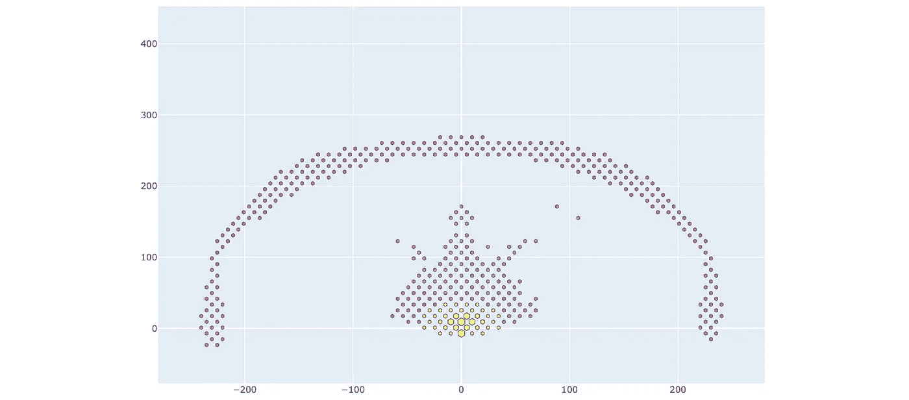

我们第一张精心拍摄的图表(或者抽象艺术，我不确定)

看起来…几乎像一张射击图(或者来自我们外星领主的信息)，尽管很明显有问题。法院在哪里，为什么比搞笑？不可能知道这些颜色意味着什么。鼠标悬停工具提示只显示 X-Y 坐标，这不是很有帮助。

让我们来解决这些问题:

## 给我画一幅画

幸运的是，Plotly 提供了一组方便的命令来绘制你想要的任何东西。通过使用方法`fig.update_figure`，并向`shapes`参数传递一个列表，可以很容易地画出您想要的任何东西。

我根据这张[方便的维基百科图](https://upload.wikimedia.org/wikipedia/commons/6/6c/Basketball_courts.svg)设计了球场的尺寸，球场是由矩形、圆形和线条混合而成的。我不会讲述这些平凡的细节，但这里有几件事你可能会感兴趣:

*   有一件事我很难解决，那就是绘制 SVG 弧线，但是 plotly 论坛上的这篇文章[帮助了我。原来 plotly.js 本身并不支持 arcs！](https://community.plot.ly/t/arc-shape-with-path/7205/5)
*   Plotly 允许我固定 x 和 y 的比例——我在这里禁用了缩放，但如果没有，您可以使用`yaxis=dict(scaleanchor=”x”, scaleratio=1)`将 y 轴固定到 x 轴。

draw_plotly_court 函数

运行与上面相同的命令，但是简单地在`fig = go.Figure(),`和`fig.add_trace(...`之间插入`draw_plotly_court(fig)`，我们得到:

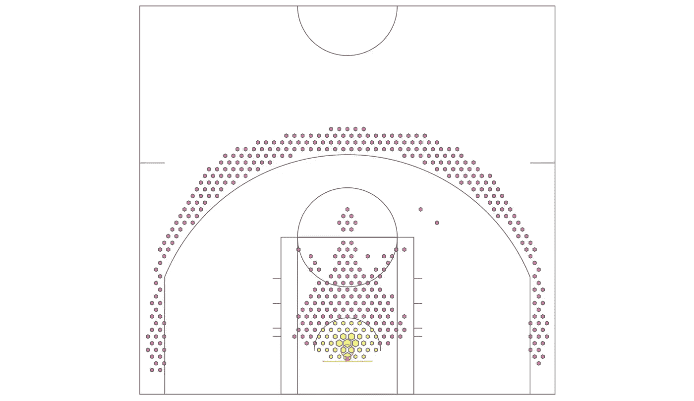

draw _ plotly _ 法庭在行动

## 将手指放在秤上

虽然有了很大的改进，但我们不能充分利用这些数据。颜色比例和尺寸比例都不太好。

为了解决这些问题，我们将:

*   通过手动将值限制为我的`max_freq`值，用列表理解来“剪辑”频率值。
*   引入不同的色标。我想使用“连续”标度，因为它显示变化的正值。[本页](https://plot.ly/python/plotly-express/#builtin-color-scales-and-sequences-and-a-way-to-see-them)显示了 Plotly 附带的所有标准调色板。我选择了“`YlOrRd`”。


YlOrRd 色阶

*   指定颜色的最大/最小值，以及
*   在图上添加图例。我选择只指定顶部/底部刻度值，并添加字符`+`和`-`来表示它们被裁剪。

运行下面的代码，你应该能够生成这个图表。

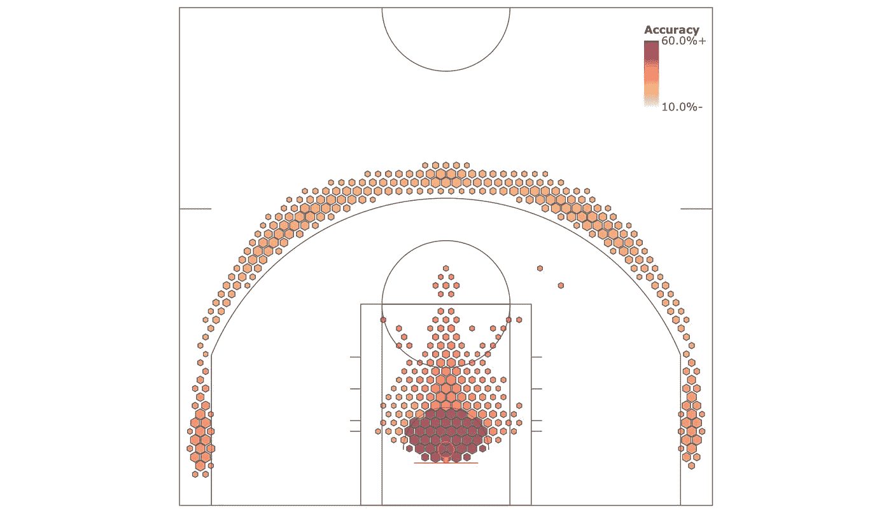

我们的拍摄图表，带有图例，和更好看的六边形。

## 工具提示

如果你将鼠标移到图表上，即使在我的 hexbin 数据中频率值为零的区域，你也会得到提示(见右下图)。此外，工具提示数据目前不是很有用——它只是 X&Y 坐标。我们能做什么？

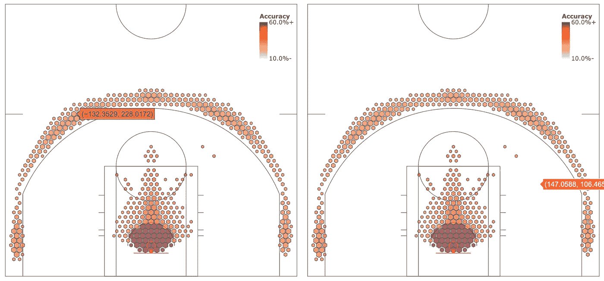

无用的工具提示

首先，让我们在频率为零的地方不要有任何值。

我写了一个简单的函数`filt_hexbins`来过滤 hexbin 数据，这样如果频率数据为零，它就从所有相同长度的数组中删除那些值。

对于工具提示，我们简单地将一个文本列表传递给参数`text`。同样将`hoverinfo`参数值更改为`text`，您就可以开始了！文本字符串可以包含基本的 HTML，如`<i>`、`<b>`或`<br>`标签，所以也要尝试一下。

把它们放在一起，我们得到了这个代码，这个图表，带有改进的、信息丰富的工具提示。这意味着您可以将鼠标移动到任何值(或散点图)上，并获得任何数量的不同信息！漂亮。

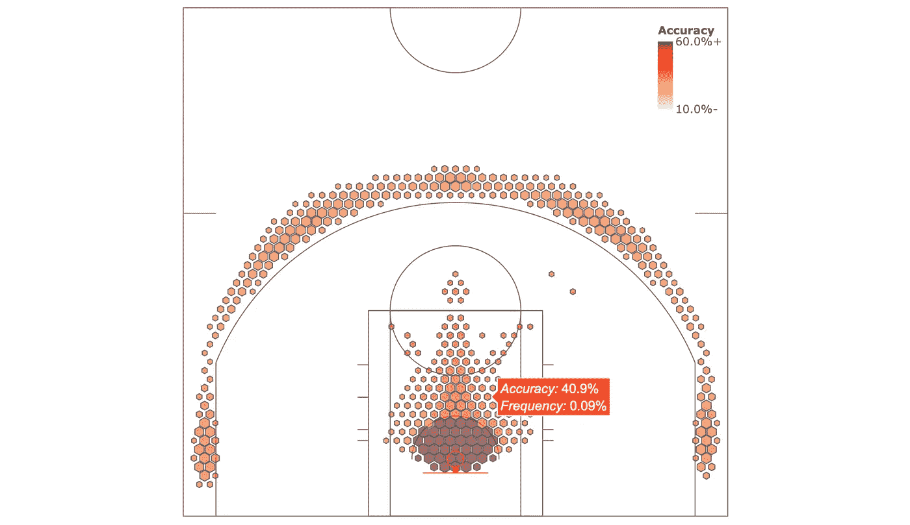

## 比较数据集+将位图添加到图形中

为了完整起见，让我们看最后一个例子，我们将一个球队的数据与联盟平均数据进行比较。这个例子也能让我们看到不同的色阶，这非常方便。

我们还将在图中添加一个团队徽标的位图来完成外观。

加载数据，就像我们以前做的那样，但是这次加载 Hoston 火箭的文件。

```
teamname = 'HOU'
with open('srcdata/hou_hexbin_stats.pickle', 'rb') as f:
    team_hexbin_stats = pickle.load(f)
```

对于这个图，我们将保留原始的团队数据，除了射击精度。我们将把投篮命中率数据转换为相对数据，这意味着我们将把它与联盟平均水平进行比较。

为此，我们使用:

```
from copy import deepcopy
rel_hexbin_stats = deepcopy(team_hexbin_stats)
base_hexbin_stats = deepcopy(league_hexbin_stats)
rel_hexbin_stats['accs_by_hex'] = rel_hexbin_stats['accs_by_hex'] - base_hexbin_stats['accs_by_hex']
```

你可能想知道为什么我要用`deepcopy`。原因是由于 python 的工作方式，如果我只是简单地将`team_hexbin_stats`复制到`rel_hexbin_stats`，那么对`rel_hexbin_stats` 中的值的任何修改也会应用到原始字典中([在这里阅读更多信息](https://docs.python.org/3.8/library/copy.html))。

我本可以修改`team_hexbin_stats`，因为我们不会在本教程中再次使用它，但这只是一个糟糕的做法，会导致混乱。

使用修改后的`rel_hexbin_stats`，我们可以继续进行剩余的处理——现在您已经知道该流程了。唯一的变化是颜色图，一个发散图`RdYlBu_r`(反过来，因为我想红色是“好的”)，并改变比例从-10%到 10%，因为我们显示相对百分比。


RdYlBu 颜色图

最后，让我们添加团队标志。Basketball-reference 有一个方便的、标准化的 URI 结构用于球队标志，所以我只引用那些带有“teamname”变量的标志。然后，用`.add_layout_image`方法添加你想要的图像，指定它的大小、位置和图层顺序，这是一件简单的事情。

该版本的全部代码如下所示:

看看这些拍摄图表——太棒了！我不能在这里嵌入一个互动版本，但我对他们的结果很满意。

> (编辑:[这里有一个现场演示(针对 TOR)](https://demo.hindsights.io/basketball_plots_tor_shotchart.html)——也针对 [GSW](https://demo.hindsights.io/basketball_plots_gsw_shotchart.html) 、 [HOU](https://demo.hindsights.io/basketball_plots_hou_shotchart.html) 、 [SAS](https://demo.hindsights.io/basketball_plots_sas_shotchart.html) 和 [NYK](https://demo.hindsights.io/basketball_plots_nyk_shotchart.html) )


去年 NBA 总决赛两队的投篮得分表。

如您所见，使用 Plotly 绘制空间数据非常简单。此外，在 Plotly Express 和 Plotly 之间，您有一系列选项可以满足您的需求，无论是快速和肮脏的数据探索，还是为您的客户定制的深度可视化。

你自己试试吧，我已经标出了决赛的队伍，但是你可以在回购中看看你自己的队伍。我把所有团队的数据都放在里面了。我想你会对 Plotly 如此简单地实现可视化印象深刻，同时又非常强大和灵活。

以上是我的全部内容——我希望你会觉得有用，如果你有任何问题或意见，请打电话给我！

> 我不确定为这样的教程构建 python 文件的最佳方式是什么，但是我已经将所有内容都写在了一个文件中，所以您可以根据自己的喜好添加注释/取消注释，然后继续学习。

如果你喜欢这个，比如说👋/在 [twitter](https://twitter.com/_jphwang) 上关注，或关注更新。我上周还写了关于用 Plotly 制作交互式地图的文章。

[](/interactive-maps-with-python-pandas-and-plotly-following-bloggers-through-sydney-c24d6f30867e) [## Python、pandas 和 Plotly 的交互式地图:跟随博主穿越悉尼

### 在这篇文章和其他几篇文章中，我将探索 Python 和 Plotly，把一些不同的看起来很棒的…

towardsdatascience.com](/interactive-maps-with-python-pandas-and-plotly-following-bloggers-through-sydney-c24d6f30867e)