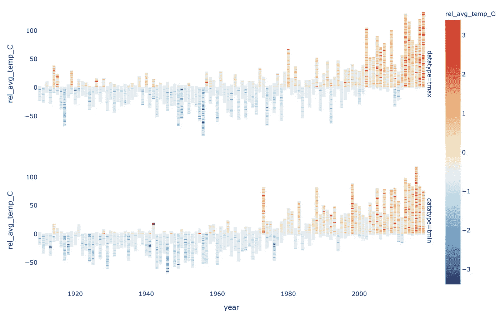

# 用 Python & Plotly 实现交互式气候数据可视化

> 原文：<https://towardsdatascience.com/interactive-climate-data-visualizations-with-python-plotly-de0472490b09?source=collection_archive---------15----------------------->

## 使用 plotly 可视化时间序列数据，包括条形图(柱形图)和子图(源代码和数据在我的 [GitLab repo](https://gitlab.com/jphwang/online_articles) 中)


肯里克·米尔斯在 [Unsplash](https://unsplash.com/s/photos/weather?utm_source=unsplash&utm_medium=referral&utm_content=creditCopyText) 上拍摄的原始照片

条形图(确切地说是柱形图)是非常非常有效的数据可视化形式。它们在感觉上很棒，通常不需要像一些不寻常的情节那样多的解释。支线剧情并不经常被提及，但是它们会非常强大和有效。以某种方式使用，它们可以让我们在 4 维中展示数据，因为二维图表可以是二维网格。有时，它们只是允许我们在一个图形中很好地展示多个图形。

我最近一直在看澳大利亚气象局的气温数据。美国气象局提供了大量高质量的数据，许多气象站的温度观测可以追溯到 1910 年。

在这里，我将分享如何使用 Python 和 Plotly / Plotly Express 创建这样的图，使用这个温度数据集。


*和往常一样，我在我的*[*git lab repo here*](https://gitlab.com/jphwang/online_articles)*(****climate _ data****目录)中包含了这方面的代码，所以请随意下载并使用/改进它。*

# 在开始之前

## 数据

原始数据来自 BOM 的 [ACORN-SAT 数据集](http://www.bom.gov.au/climate/data/acorn-sat/)。这是一个高质量的数据集，我根本不用做太多的预处理。尽管如此，该数据集相对较大，包含一百年来来自一百多个站点的每日观察结果——所以我在 git repo 中提供了一个经过处理的数据集文件。

## 包装

我假设您熟悉 python。但是，即使你相对较新，这个教程不应该太棘手。如果你有什么不确定的，可以随时在推特上或这里联系。

你需要用一个简单的`pip install [PACKAGE NAME]`将`plotly`和`pandas.`安装到你的虚拟环境中。

# Plotly Express 条形图

## 数据

数据集包括来自多个气象观测站的数据。为了对数据有所了解，让我们加载它，快速浏览一下，然后绘制一个站的数据。

像往常一样，用以下内容加载数据:

```
import pandas as pd
flat_avg_df = pd.read_csv('climate_data/srcdata/flat_avg_data.csv', index_col=0)
```

`index_col`参数向`pandas`指定哪一列将被用作索引。

不使用该参数加载 CSV 文件会导致索引列重复，从而产生如下输出。注意重复的索引列，其中索引列已经保存为`‘Unnamed: 0’`。

请注意重复的索引列

除此之外，列应该是直截了当的。`avg_temp_C`显示的是年平均温度，`rel_avg_temp_C`是一个相对的数字，是该站点的中值，我还包括了站点名称字符串、年份和数据类型。`datatype`为`tmax`或`tmin`，表示是否与日最高或最低温度有关。

## 简单条形图

现在，让我们只绘制一个站点的`tmax`数据。我们将根据站点名称(到`simple_df`)过滤数据帧，并将其传递给 Plotly Express。

```
import plotly.express as px
simple_df = flat_avg_df[(flat_avg_df.site_name == 'ALBANY AIRPORT') & (flat_avg_df.datatype == 'tmax')]
fig = px.bar(simple_df, x='year', y='rel_avg_temp_C', color='rel_avg_temp_C')
fig.show()
```


就像那样，我们可以看到奥尔巴尼机场测量的年相对温度。

自 1910 年开始测量以来，这一数字呈上升趋势。但是这种情况是否到处都存在呢？如果我们选择多个地点呢？看起来怎么样？

# 支线剧情

## 用 Plotly Express

支线剧情允许你在一个图形中包含多个情节。Plotly 允许创建支线剧情，无论是快速版还是经典版。

正如你所料，Plotly Express 更快更容易使用，尽管控制更少。让我们开始吧。

“情节表达”子情节功能基于其`facet_row`和`facet_col`参数，允许使用这些分类变量创建子情节。让我们将来自不同站点的数据放在行上，将 tmin / tmax 值放在列上。

运行`len(flat_avg_df.site_name.unique())`，它告诉我们有 112 个唯一的名字——现在可能有太多的行需要查看。我将只选择前 5 个名字，并像这样绘制数据:

```
site_names = flat_avg_df.site_name.unique()
short_df = flat_avg_df[flat_avg_df.site_name.isin(site_names[:5])]
fig = px.bar(short_df, x='year', y='rel_avg_temp_C', color='rel_avg_temp_C', facet_row='site_name', facet_col='datatype')
fig.show()
```


这难道不是非常高效吗！

x 轴是共享的，并且很好地对齐，这使我们可以快速看到哪些数据点丢失了。例如，右下角的数据(来自 Scone 机场)可能只是从 1963 年开始的。我们的 Y 轴刻度和彩色轮廓刻度也是统一的，便于比较。

当然，这在视觉上有点混乱——但是记住，我们只用了 4 行代码就创建了它。我们可以清理它，但我们现在不会这样做。我想强调我们可以多快地可视化，比较数据集以及数据本身的质量和属性。

这种方法的一个限制是子情节行和列需要与特定的分类变量相关联。为了使用 Plotly Express 绘制来自 10 个不同站点的数据，我可以创建一个新列，比如说叫做`subplot_cols`，根据要放入列中的图分配值(比如`1`或`2`，并传递参数`facet_col=’subplot_cols'`。我也必须对行做同样的事情。

这很好，但这实际上是一种变通方法，而不是按照预期使用该特性。毕竟，Plotly Express 是用于探索性分析和组织良好的数据。它不是最灵活的工具。

所以，接下来让我们看看如何用常规情节来生成支线剧情，这会给我们更多的灵活性。

## 与(经典)情节地

在 Plotly 中创建支线剧情的最基本语法如下:

```
fig = make_subplots(rows=n_rows, cols=n_rows)  # Create subplot grid
# Add subplot trace & assign to each grid
fig.add_trace(
    go.Bar(
        x=[X_DATA],
        y=[X_DATA],
    ),
    row=[SUBPLOT_ROW], col=[SUBPLOT_ROW],
)
```

你会看到`add_trace`功能需要为每个使用的支线剧情重复。优选地，使用循环而不是手动添加轨迹。尤其是随着支线剧情数量的增长。

让我们从小处着手。我们将创建一个 2 乘 2 的子绘图网格，并绘制来自前四个站点(按站点名称)的数据，仅绘制`‘tmax’`值。

我们之前看到，并不是某些台站明显缺少某些年份的数据。这在上面并不重要，因为 Plotly Express 通过省略来处理丢失的数据，但在这里我们不能这样做。我们将传递一个列表或者一个数组作为 Y 值，跳过这些值将会导致数据错位。

当我们处理相对值时，让我们用零填充缺失的数据。(这是否是最好的做法还有待商榷，但我们可以改天再讨论。)当我们将数据传递给绘图时，我们必须记住这样做。

因此，让我们对每个子图进行循环，每个循环 a)收集要绘制的年份的 Y 数据(温度)，并将该数据*从循环内部传递到 plottly*。这相对来说很简单，请看下面的代码片段:

在这里，我创建了一个名字列表(`site_names` ) &一个年份列表(`year_list`)。我对年份列表进行排序，然后循环遍历子情节的数量(`4`)，用一个内部循环遍历这一年，当没有这一年的数据时，我简单地指定一个零值。

最后，我使用数据添加一个简单的轨迹到我们的图中，使用`.add_trace`方法。我已经参数化了第&行的列号(末尾的+1 确保数字从 1 和 1 开始，而不是从 0 和 0 开始)。


不幸的是，作品越多，支线剧情越好。

所以，不幸的是，我得说这看起来更糟。我们以相同的格式绘制了相同的数据，但是颜色现在没有意义，轨迹名称也消失了，我们使用了大约 25 行代码。哦。

但是让我们继续前进——它会变得更好，我保证。

简单地添加支线剧情标题、标记说明、添加公共 y 轴参数和更新布局以隐藏无意义的图例会产生奇迹:

```
fig = make_subplots(
    rows=2, cols=2,
    subplot_titles=site_names
)
go.Bar(
    ...
    marker=dict(color=temp_vals, colorscale='RdYlBu_r'),
),
fig.update_yaxes(tickvals=[-2, 0, 2], range=[-2.5, 2.5], fixedrange=True)
fig.update_layout(showlegend=False)
```


看看这有多好！

接下来，让我们扩展这个概念，建立我们的下一个图表，尽可能多的支线剧情。

这些修改看起来很冗长，但实际上并不冗长。我所做的是:

*   在我们的子情节中参数化行数和列数(`subplot_rows = …`)
*   参数化图形的高度和宽度(`height=120 * subplot_rows, width=230 * subplot_cols`)，以保持子图大小一致，而不是随着行数或列数的变化而缩小或放大。
*   根据观察次数对站点名称(`names_by_obs = …`)进行排序，这样我们可以优先绘制数据最多的站点
*   减少支线剧情之间的间距(`horizontal_spacing=…`)，以及
*   缩小字体大小(`font=dict(...`)。


性感支线剧情！

编辑:这篇文章的早期版本使用了下面的代码来设置标题——因为我不知道有一种方法可以访问这些代码:

```
for i in fig['layout']['annotations']:
    i['font'] = dict(size=10, color='#404040')
```

相反，您可以这样使用:

```
fig.update_annotations(patch=dict(font=dict(size=10, color='#404040')))
```

但是，如果您*确实*需要手动访问这些属性中的任何一个，那么`fig`对象允许您非常容易地做到这一点，这很好。

# Plotly Express 的堆积条形图

这会让你大吃一惊的。我假设您仍然将主数据帧加载到内存中。好吧。准备好了吗？只需运行这段代码:

```
fig = px.bar(flat_avg_df, x='year', y='rel_avg_temp_C', color='rel_avg_temp_C')
fig.show()
```


当我看到这个情节时，我只是头晕。是的，它并不完美。但是在仅仅两行代码中，我就能可视化整个年度数据集，显示 112 个站的温度变化的年度总趋势。

只是为了比较，我用常规 Plotly 重新创建了这个，用了大约 30-40 行代码，主要是在数据和格式上。(我这里没收录。)

在这个图中，我叠加了 tmax 和 tmin 值，这并不理想。让我们把他们分开。此外，由于我们正在绘制温度，让我们坚持红色=热，蓝色=冷的惯例，确保色标的中点在零。(你会注意到上面的零与刻度的中点不太一致)



现在有了美味的支线剧情！

老实说，我对这个样子非常满意。但是有几个大问题——我将温度叠加到没有任何意义的数字上，虽然 Plotly Express 处理缺失的数据，但其中一些堆栈由比其他更多的观察值组成，这扭曲了输出。

数据可视化不仅仅是制作漂亮的图片，*它是向读者传达信息*。我们可以做得更好；让我们将温度归一化，以表示一个合理的值，比如每年气象观测站的冷热变化之和。

我在数据框中创建了一个新列，其中温度值除以当年的样本数:

一旦完成，我们可以像以前一样简单地绘制它，唯一的变化是`y=’norm_rel_avg_temp_C’`。


您可以看到，图像左侧的数字(更远的过去)已被放大，以说明样本较少的事实。

作为最后一步，我们包括格式元素——图形标题、轴标题、图例标题和注释。图例的大小会随边框一起调整，并按比例缩小。这是结果:


很好，不是吗？我对结果很满意。[这里是互动版](https://jolly-snyder-46e349.netlify.com/202001_climate/aus_weather_aggregate_trend_subplot.html)。

条形图是数据可视化工具箱中非常重要的工具。条形图允许对值进行简单的比较，在需要时将值组合在一起，并且易于理解。

支线剧情没有那么关键，但是有很高的实用性。任何看过 pairplots 的人都可以证明这一点。我个人也发现，我经常有最好的可视化数据分割，并经常想使用支线剧情。“Plotly Express”功能允许通过功能生成子图，节省了大量时间，因为它减少了可视化某些分类变量的效果所需的工作。

常规 Plotly 的支线剧情功能更强大，但也更冗长。它允许像用 Plotly 的支线剧情操纵网格大小这样的事情，所以如果你对进一步定制支线剧情布局感兴趣，你可能希望探索那个选项。

我希望以上内容对你展示使用 Plotly / Plotly Express 可以轻松创建的好看的可视化效果是有用的。尝试使用参数——列数、行数、色彩映射表、字体大小等等。我发现我通过这种方式学到了很多东西。

如往常一样，如果你有任何问题或意见，打电话给我。

如果你喜欢这个，比如说👋/关注 [twitter](https://twitter.com/_jphwang) ，或关注更新。我还写了一些关于用 Plotly 制作交互式地图和可视化篮球数据的文章。

[](/interactive-basketball-data-visualizations-with-plotly-8c6916aaa59e) [## 用 Plotly 实现交互式篮球数据可视化

### 用 hexbin shot 图表分析体育数据，用 Plotly 和 Plotly Express 分析气泡图(源代码&我自己的数据…

towardsdatascience.com](/interactive-basketball-data-visualizations-with-plotly-8c6916aaa59e) [](/interactive-maps-with-python-pandas-and-plotly-following-bloggers-through-sydney-c24d6f30867e) [## Python、pandas 和 Plotly 的交互式地图:跟随博主穿越悉尼

### 在这篇文章和其他几篇文章中，我将探索 Python 和 Plotly，把一些不同的看起来很棒的…

towardsdatascience.com](/interactive-maps-with-python-pandas-and-plotly-following-bloggers-through-sydney-c24d6f30867e)