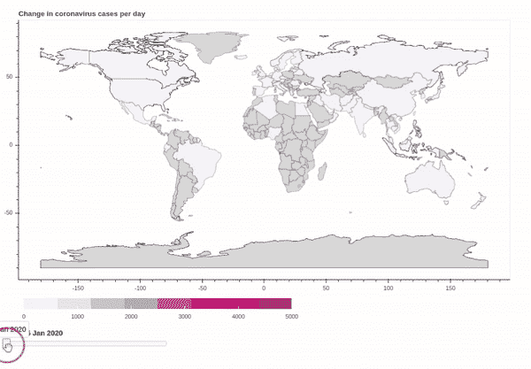
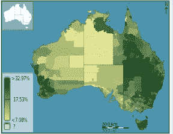
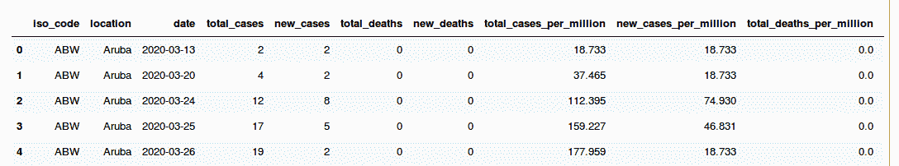
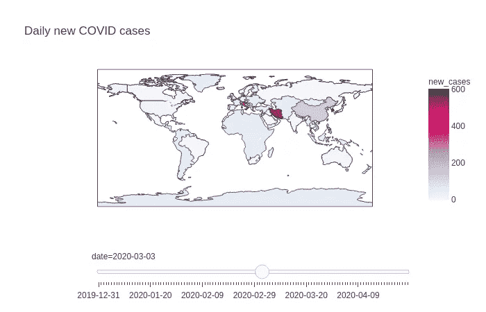
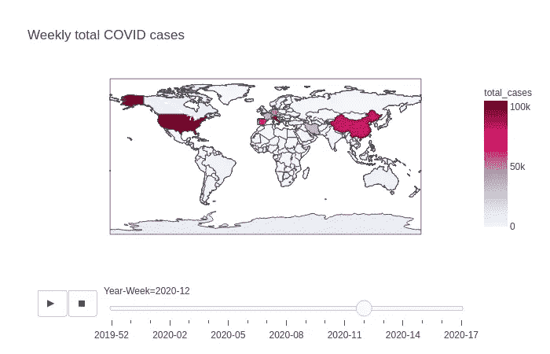
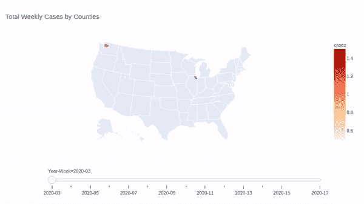

# 交互式新冠肺炎可视化使用 Plotly 与 4 行代码

> 原文：<https://towardsdatascience.com/interactive-covid-19-visualizations-using-plotly-with-4-lines-of-code-fa33b334ab84?source=collection_archive---------32----------------------->

## 用数据做很酷的事情！

# **简介**

在这个技术时代，数据是新的石油。世界各地的组织都在转变他们的环境、流程和基础架构，变得更加以数据为导向。一个主要原因是，数据分析和机器学习让组织了解如何更好地运营业务。通过新冠肺炎推动远程工作将加速这种技术和数据化的趋势。

分析的很大一部分是将数据以有意义的形式呈现给相关决策者，以便他们可以轻松理解这个故事。传统上，组织使用像 Tableau 这样的软件来展示很酷的交互式仪表盘。在这篇博客中，我们展示了像 [Plotly Express](https://plotly.com/python/plotly-express/) 这样的开源库可以用来做同样的事情，只需要几行代码。我们也在[散景](https://docs.bokeh.org/en/latest/index.html)中编码了这一切，但是发现代码相当复杂。另一方面，Plotly 有内置的功能，允许用参数改变许多事情。

我们已经使用了疾病控制中心关于冠状病毒的数据来生成交互式图表。请参见以下各国冠状病毒病例每日变化图。这是一个非常有趣的图表，显示了哪些国家已经达到峰值，而每日病例数开始减少。完整代码可在 [Github](https://github.com/priya-dwivedi/Deep-Learning/blob/master/COVID19_Plotly_Visualization/COVID-19_visualizations-plotly.ipynb) 上获得。我希望你拉它，给它一个镜头。

在[深度学习分析](https://deeplearninganalytics.org/)，我们非常热衷于使用数据科学和机器学习来解决问题。如果您是一家医疗服务公司，并且正在寻找数据科学帮助来应对这场危机，请通过此处的[联系我们](https://deeplearninganalytics.org/contact-us/)。



通过这个博客创造的日常案例中的新冠肺炎变化

# 可视化您的数据

数据可视化是以有趣、准确和易于理解的方式呈现数据的“艺术”。有许多类型的可视化应用于所有行业；最常见的有条形图、饼图、线图和直方图。但是在许多情况下，这些基本的可视化并不足以有效地呈现数据。所以越来越多的分析师倾向于可视化，如柱状图、时间序列图、热图、径向树、单词云等。

在这篇博客中，我们将探索一种称为 choropleths 的特定类型的可视化，并展示如何用 python 创建这些可视化，只需几行代码。

## **Choropleths**

地图是专题地图，其中不同的区域在地图上用阴影表示，以显示不同的统计数据。下面是截止到 2011 年，一部分澳大利亚人被认为是英国圣公会教徒的 choropleth 地图。此图来自 [*维基百科*页面](https://en.wikipedia.org/wiki/Choropleth_map)。



澳洲圣公会人口分布图—[https://en.wikipedia.org/wiki/Choropleth_map](https://en.wikipedia.org/wiki/Choropleth_map)

Choropleths 可以是任何粒度:小到一个街区，大到整个世界，这取决于需要投影的内容。

在这篇博客中，我们将探索如何使用 [Plotly Express 库在 python 中创建 choropleth。我们将对世界各国的案例进行可视化处理，然后深入研究美国的案例。所以让我们开始吧！](https://plotly.com/python/plotly-express/)

# 代码走查

首先，我们将安装运行这段代码所需的依赖项:pandas 和 plotly

```
pip install pandaspip install plotly
```

## 下载新冠肺炎数据

一旦我们下载了这些库，我们将下载并加载数据。这篇博客中使用的数据来自名为[ourworldindata.org](https://ourworldindata.org)的网站。这里提供的数据每天都在更新。您可以使用 wget 下载数据，如下所示:

```
!wget [https://covid.ourworldindata.org/data/owid-covid-data.csv](https://covid.ourworldindata.org/data/owid-covid-data.csv)
```

请跟随我的 [Github](https://github.com/priya-dwivedi/Deep-Learning/blob/master/COVID19_Plotly_Visualization/COVID-19_visualizations-plotly.ipynb) 链接中的代码

上述代码的输出是数据的前 5 行，如下所示:



新冠肺炎数据

该数据集包含国家代码、位置、日期、总病例数、新病例数、总死亡数、新死亡数和每百万病例数等信息。

我们希望删除对应于国家“World”的条目，它是所有国家的总和，并按日期对数据进行排序。

```
df = pd.read_csv('owid-covid-data.csv')
## Drop rows corresponding to the World
df = df[df.location != 'World']
## Sort df by date
df = df.sort_values(by=['date'])
```

## 使用 Plotly Express 绘制 Chloropeths 图

制作 choropleth 地图需要两种主要的输入:

1.  通过 GeoJson 文件提供的几何信息，该文件包含您正在打印的州、地区、国家的坐标
2.  包含几何值的数据框

Plotly 已经为世界和美国地图建立了几何图形，我们将在这里使用它们。

要创建每日新新冠肺炎确诊病例的交互式文字地图，命令为:

```
fig = px.choropleth(df, locations="iso_code",
                    color="new_cases",
                    hover_name="location",
                    animation_frame="date",
                    title = "Daily new COVID cases",
                   color_continuous_scale=px.colors.sequential.PuRd)fig["layout"].pop("updatemenus")
fig.show()
```

这里:

*   df-包含 COVID 数据的数据框
*   位置—国家通过其 iso 代码来识别。Plotly 能够使用 iso 代码获取地理数据
*   颜色—我们要绘制的列。这里有新病例
*   animation_frame:要运行动画的列。在我们的情况下，这是日期
*   color _ continuous _ scale 允许 plotly 在滑块移动时连续改变轴和颜色
*   图[“布局”]。pop("updatemenus") —这将创建一个可以手动切换的日期滑块。如果该行被注释掉，则该图有一个视频类型的开始、停止按钮

## 在世界地图上显示新冠肺炎新病例和总病例

下图显示了 2020 年 3 月 2 日的产量。这是一个触发点，中国的新病例增长率正在放缓，但伊朗、意大利和韩国的新病例增长率却在上升。



从 Plotly express 输出

在笔记本中，我还添加了一个到第**周**的总累积病例图。为此，我们添加了另一行代码来添加熊猫的周数

```
df['new_date'] = pd.to_datetime(df['date'])
df['Year-Week'] = df['new_date'].dt.strftime('%Y-%U')
```



4 月初按国家分列的病例总数

看看这个，很难相信美国一个月前只有大约 10 万个病例！。

## 按县和州可视化美国案例

要为我们添加数据，我们需要两样东西— 1。具有美国州和县级数据的数据源和 2。州和县的地理制图

美国新冠肺炎的数据来自[新冠肺炎纽约时报-数据](https://github.com/nytimes/covid-19-data)。感谢《纽约时报》将其公之于众，供分析师使用。您可以使用下载数据

```
!git clone [https://github.com/nytimes/covid-19-data.git](https://github.com/nytimes/covid-19-data.git)
```

我们可以使用下面的脚本获取各县的地理数据。该数据包含美国所有县的多边形坐标。

```
from urllib.request import urlopen
import json
with urlopen('[https://raw.githubusercontent.com/plotly/datasets/master/geojson-counties-fips.json'](https://raw.githubusercontent.com/plotly/datasets/master/geojson-counties-fips.json')) as response:
    counties = json.load(response)
```

我们可以使用下面的命令来绘制所有的案例。与我们以前的图的主要区别是，我们使用不同的县 FIPS 代码，而不是像以前一样使用 iso 国家代码。

```
df_us_week = df_us_week.sort_values(by=['Year-Week'])
fig = px.choropleth(df_us_week, 
                       geojson=counties, 
                      locations='fips', 
                      color='cases',
                     color_continuous_scale="Viridis",
                     title = "Total Weekly Cases by Counties",
                     scope="usa",
                     animation_frame="Year-Week",
                          )
fig["layout"].pop("updatemenus")
fig.show()
```

输出如下。它显示了严重的影响局限于几个县。



美国各县每周病例总数

[Github 链接](https://github.com/priya-dwivedi/Deep-Learning/blob/master/COVID19_Plotly_Visualization/COVID-19_visualizations-plotly.ipynb)也有关于创建州级可视化的细节。

# 结论

令人惊讶的是，使用 Plotly Express 可以轻松地绘制地图。如果您有自定义地图，也可以使用 geojson 数据在其上进行绘制。这个在这里[解释。](https://plotly.com/python/choropleth-maps/)

我希望您尝试一下代码，并创建更多有趣的可视化效果。

在[深度学习分析](https://deeplearninganalytics.org/)，我们非常热衷于使用机器学习来解决现实世界的问题。我们已经帮助许多企业部署了创新的基于人工智能的解决方案。如果您看到合作的机会，请通过我们的网站[这里](https://deeplearninganalytics.org/contact-us/)联系我们。这篇博客是由 Priya Dwivedi 和 Faizan Khan 写的。

# 参考

*   [Plotly Express chlopeths 可视化](https://plotly.com/python/choropleth-maps/)