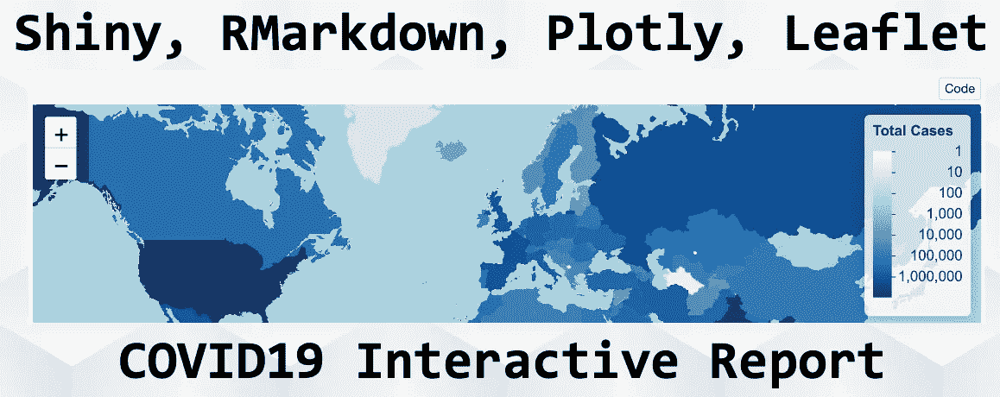
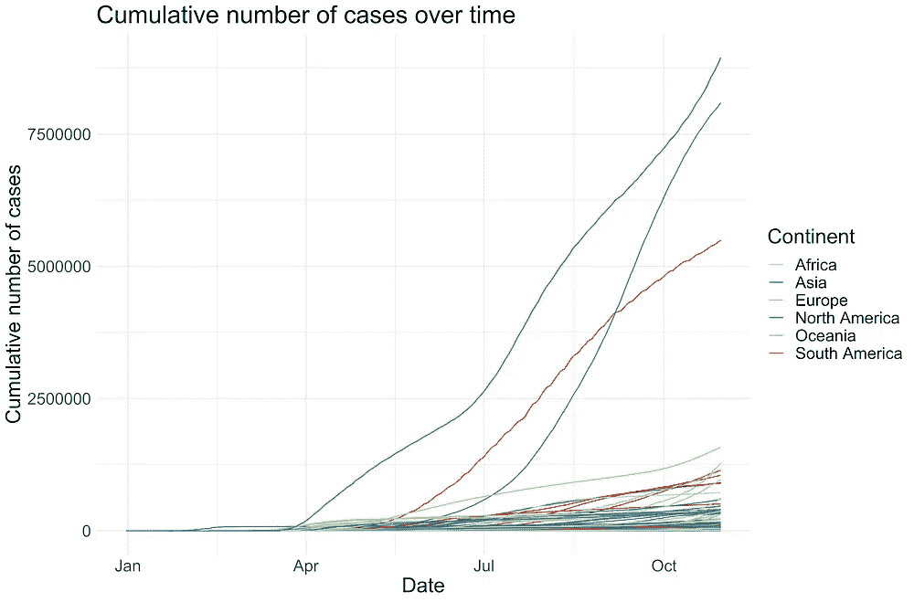
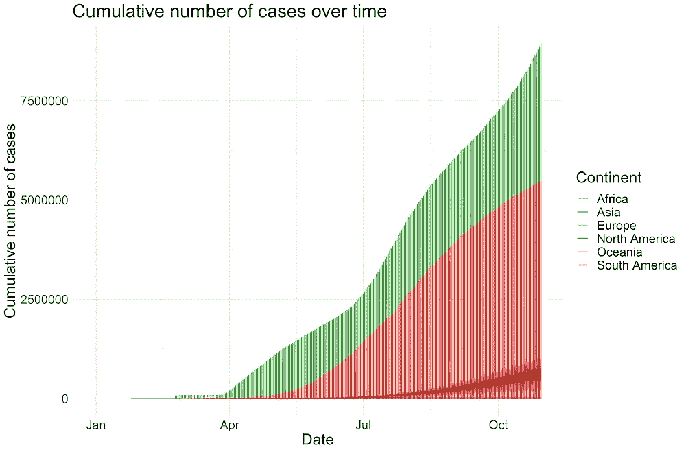
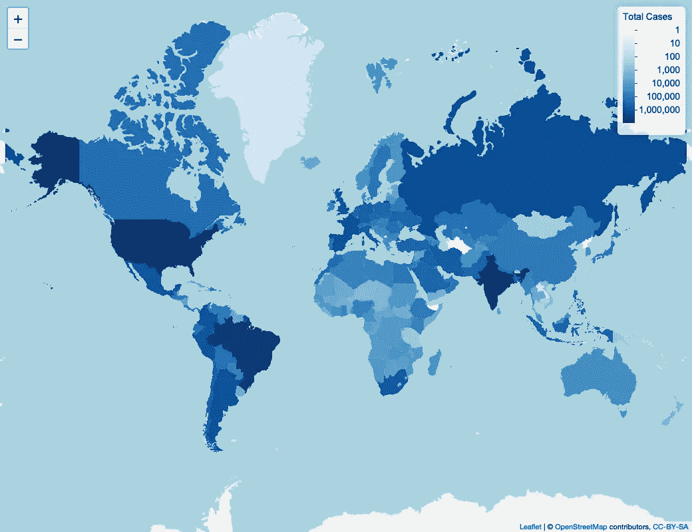
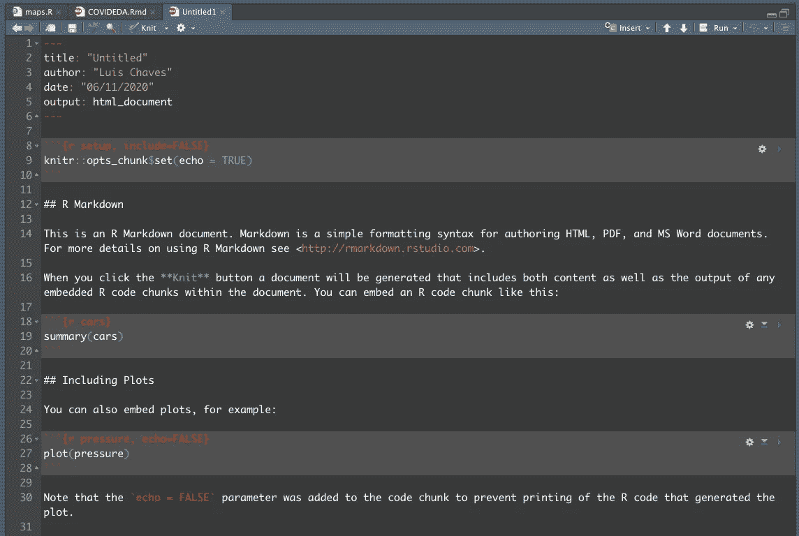
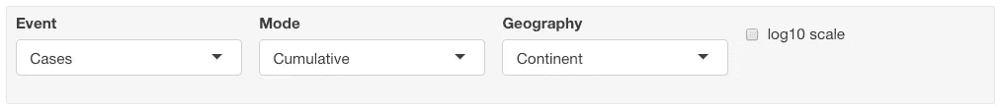
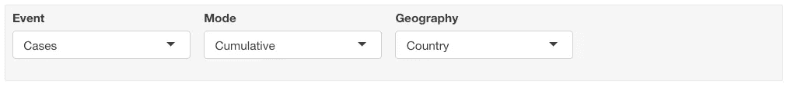
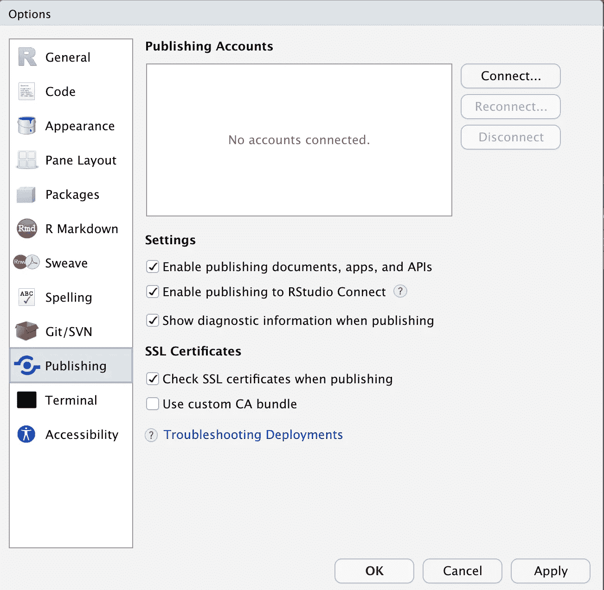
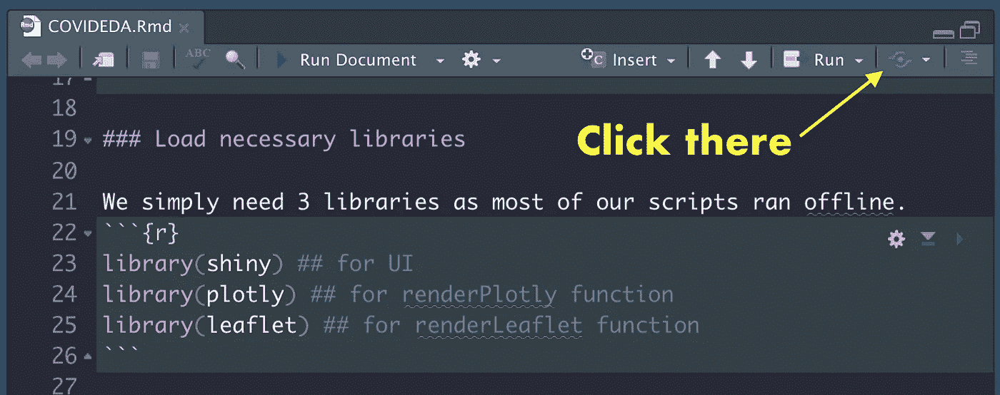
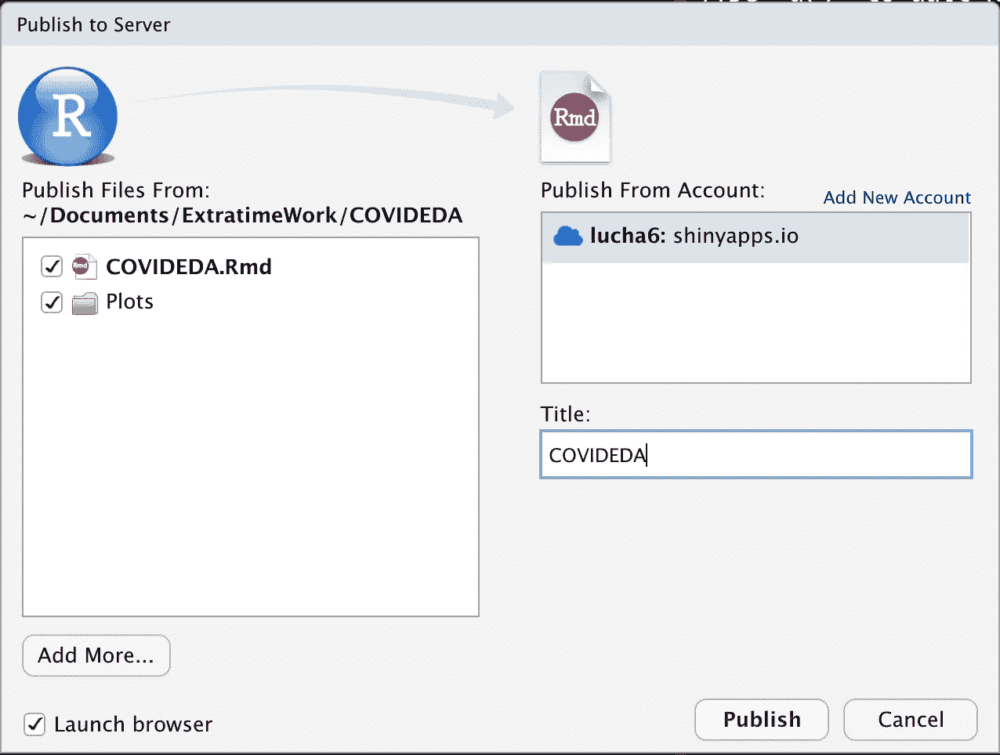

# 交互式新冠肺炎报告，包含 RMarkdown、Plotly、传单和 Shiny

> 原文：<https://towardsdatascience.com/interactive-covid19-report-with-rmarkdown-plotly-leaflet-and-shiny-c6a716af7d9b?source=collection_archive---------20----------------------->

## 了解如何制作适用于新冠肺炎及其他地区的交互式报告！

*本帖是* ***第三部分*** *一系列* ***第四部分*** *。请参考* [***第 1 部分***](/create-an-interactive-covid-19-report-using-r-host-it-for-free-and-automate-its-update-41a5bdd46e9d) *了解系列概述，* [***第 2 部分***](https://rpubs.com/lucha6/covid-cleaning-owid-data) *了解数据源和次要数据清理，* ***第 3 部分*** *了解可视化的创建、报告的构建以及将文档部署到 ShinyApps.io 和* *[【项目回购】](https://github.com/lc5415/COVID19)*

*该系列的每篇文章都是独立的，也就是说你不需要阅读整个系列来充分利用它。*

**

# *目录*

*[目标](#40b8)
∘ [要求](#b27b)
[数据输入](#2ed4)
[地块](#ebaa)
∘ [树状图](#3a35)
∘ [折线图](#d6a4)
∘ [地图图](#024b)
∘ [够了！](#2e61)
[制作闪亮的报告](#d647)
∘ [撰写报告](#0748)
∘ [上传你的文档到云端](#02e7)
∘ [发布你的 app](#ae3b)
[结论](#df79)*

# *目标*

*在本教程中，我们将学习如何制作 7 种图表来说明 COVID19 在各国的进展。然后，我们会将这些整合到一个 RMarkdown 文档中，并免费发布一个交互式副本！—使用 RStudio 场所。*

## *要求*

*使用`R`、`dplyr`和`ggplot`的经验是有用的，但不是必需的。在我所有的写作/编码过程中，我试图让脚本尽可能的易读。*

# *数据输入*

*首先，今天我们将使用两个数据集:*

*   ***每日**按国家统计的确诊 COVID 病例和 COVID 死亡人数(从现在开始我们称之为 COVID 事件)。要了解这个数据集的样子，请查找下面的截断表:*

*10 月 25 日欧洲 COVID19 事件每日统计*

*   ***累计**按国家统计的确诊 COVID 病例和 COVID 死亡数。再次找到下表的删节版本:*

*截至 10 月 25 日，欧洲 COVID19 事件的累计计数*

****注:*** *以上表格出于可视化目的被截断，实际表格包含从 2019 年 12 月 31 日起以及全球大多数国家/地区的数据。**

# *情节*

*我将带您浏览我们将要制作的 7 张图表。每个地块的过程都是一样的:*

1.  *检查绘图功能的输入格式*
2.  *操作输入数据以获得正确的格式*
3.  *设计情节*

*不同地块之间的数据可能会有一些重叠，但这没关系。我在这里的目的是展示每个情节是如何独立完成的。*

## *树形图*

*树形图非常适合表示层次结构和“父”中每个“子”元素的大小。在这里，我们按国家绘制 COVID 事件，这些事件可以进一步按洲分组，而洲又可以按世界的一部分分组。下面我们来看看如何用 Plotly 做出下面的剧情。*

*10 月 30 日 COVID 死亡的树形图示例*

*在我们的树形图中，每个方框的大小将与每个国家最近日期的事件数量成比例，因此我们将使用**累积**表。*

*在仔细阅读了 [Plotly R Treemap 文档](https://plotly.com/r/treemaps/)之后，两件事情变得很清楚。首先，我们需要树形图中的所有元素(国家、大洲、世界)都有相应的值，目前我们只有国家级的汇总数据，我们需要汇总每个大洲的数据，并在全球范围内进行汇总。其次，我们需要一个*新列*来指示每个元素的父元素:*例如，西班牙、欧洲；对欧洲，对世界，对世界，什么都不是。另外，我们将把每个元素称为*标签*，因为国家、大陆和“世界”都需要在同一列中。**

*下面是注释脚本，用于将数据转换为正确的规格:*

*现在我们有了正确格式的数据，绘制图表就非常容易了:*

*`hoverinfo`参数负责当鼠标悬停在任何特定元素上时显示的数据。这里的规范是说:*

*   *`value`显示特定元素的值(即死亡人数/病例数)。*
*   *`percent parent`:显示当前子值占父值的百分比(如西班牙死亡人数/欧洲死亡人数)。*
*   *`percent root`:显示当前子值占根值的百分比(如西班牙死亡人数/世界死亡人数)。*

*你可以在[文档部分](https://plotly.com/r/reference/#treemap-hoverinfo)阅读更多关于悬停选项的信息。*

*最后，我们希望实际上将这些图存储为 RDS 对象，以便在我们闪亮的应用程序加载时加载它们，而不是在运行时计算它们。为此，我们使用以下代码:*

****注意:*** 你可能会发现简单地保存`plot_ly(...)`函数的输出就成功了。当我第一次开始做这个项目时，我发现它不起作用。对我来说，使用`plotly_build()`功能修复它。*

## *折线图*

*在这里，我们将制作经典的线形图，描述一段时间内各个国家或大洲的事件数量。在这种情况下，我们不会直接制作`plotly`图。相反，我们将使用`ggplot2`和`ggplotly`函数来将它们转换成交互式图形。我们将制作如下图:*

*是的，这很荒谬，**截至 2020 年 11 月，大洋洲大约有 3 万例确诊病例***

*首先，让我们用**累积**表制作我们的`ggplot`:*

*如果你不熟悉`ggplot2`，一个情节的所有这些台词可能看起来很多。虽然看起来是这样，但我相信这有助于构建情节，并使代码可读性更高。*此外，*`group`美学(在`aes()`功能内)在初学者`ggplot`教程中不常介绍。在我们的特殊情况下，这是非常重要的。*如果我们不指定它，* `ggplot` *会认为我们线状图的分组变量是* `*continent*` *，会做出一个非常混乱的图*，比较见下图:*

****

***左:**使用群组美学修正剧情**。**右:**绘图不正确，**未使用** **分组**，ggplot2 认为分组变量是洲***

*好了，现在我们已经做好了`ggplot`，我们可以用`ggplotly()`把它变成一行`plotly`图。此外，假设我们已经将`ggplot`存储为变量，我们可以进一步修改它，例如以 log10 标度显示 y 轴。最后，我们将通过`plotly_build()`函数传递新的情节，以便能够存储它。*

*我从这个项目的 [GitHub 库](https://github.com/lc5415/COVID19)中可以看到的**累积**数据集制作了另外 6 个线图(包括按洲划分的事件曲线，有和没有 log10 标度)。所有这些图的代码遵循相同的结构。*

*再次遵循相同的原则和几乎相同的代码，我从**每日**数据集中制作了另外 6 幅图，如下图所示。仓库中也有相关的代码。*

*看到这里，我们可以清楚地看到为什么新闻媒体使用均线！此外，欧洲表现糟糕。*

## *地图图表*

*信不信由你，我不会在这里使用`plotly`地图功能。我以前用它们创建过地图，但是我不推荐使用它们。我偶然发现了几个 bug([【1】](https://community.plotly.com/t/animated-map-not-showing-countries-with-na-values/42965)[【2】](https://community.plotly.com/t/slider-and-play-pause-buttons/7288))而 [plotly 社区](https://community.plotly.com/)一直很没反应。因此这里我们将使用 [**传单**](https://leafletjs.com/) 。与 Plotly 不同，fleet 只关注地图，因此他们是制作地图的更好的工具。*

*由 RStudio 团队自己构建的 [R 传单包](https://rstudio.github.io/leaflet/)有 R 的感觉，更特别的是有`dplyr`和`ggplot`的感觉，地图可以通过图层构建。让我们跳到代码。我将介绍如何制作一个简单的静态地图。制作一个有时间表的要复杂得多，因此我将在以后的独立文章中专门讨论这个问题。*

*首先，我们需要一个带有国家边界的 GeoJSON 文件。GeoJSON 文件是一种用于存储地理边界的标准(尽管还有更多，如 shapefiles)。我从 [datahub.io](https://datahub.io/core/geo-countries#data) 下载了国家 GeoJSON 文件。幸运的是，现在国家的边界没有太大的变化，因此我们只需要下载并处理这个文件一次。对于我们的使用来说，这是一个相当大的文件(23MB)，因此我们将使用一个小技巧来减小它的大小。这将大大改善我们闪亮文档的加载时间(我们很聪明，我们提前考虑)。由于边界中的所有细节(例如海岸线的分辨率)，文件的大小非常大。我们可以使用`[rmapshaper](https://cran.r-project.org/web/packages/rmapshaper/vignettes/rmapshaper.html)` [包](https://cran.r-project.org/web/packages/rmapshaper/vignettes/rmapshaper.html)和更广泛的`mapshaper`工具来使我们的地图更粗糙，文件更小。下面的*是在 r 内部完成所有这些工作的脚本。**

**`world_geojson`对象包含两个感兴趣的主要元素:*数据*和*多边形*。在这个阶段，*数据*元素只包含两列，ISO 代码和相应的地区名称。polygons 元素包含为每个区域绘制多边形所需的信息。我们将首先合并*数据*元素和累积数据集。接下来，我们将手动移除累积数据集中没有可用数据的多边形。这最后一步是必要的，因为数据和多边形是通过位置而不是某种标识符匹配的，如果我们不执行这最后一步，美国将出现在欧洲，法国将出现在非洲或亚洲，等等。**

**将地理文件与普通数据框合并**

***注意:*我们只绘制了每个地区的最新可用数据(第 6-9 行)**

**现在，我们要做的就是使用`leaflet`绘图。正如我之前所说，R 中的传单支持分层构建，使用`magrittr`管道操作符(`%>%`)。首先，我们要定义一个合适的调色板，我选择了**蓝色**，它用白色代表低值，随着值的增加使用越来越浓的蓝色。然后，我们将使用`leaflet()`初始化主地图，就像我们经常使用`ggplot()`一样，并添加*图块*，这是地图格式的传单行话(海洋和陆地的颜色……—在本演示中探索不同的图块)。**

**初始化传单地图并绘制图块**

**现在，我们终于要看看地图上方的数据了。我们将添加多边形，并根据截至 10 月底每个国家的病例数按比例给它们上色。**

**向传单地图添加多边形**

**注意，我已经按照它们的对数 10 的情况按比例给这些区域着色，否则，差异是如此之大，以至于色标是没有用的。我们还使用了`[ezplot](https://github.com/wkostelecki/ezplot)` [包](https://github.com/wkostelecki/ezplot)中的`ez_labels()`函数，该函数将大数转换成可读格式(例如 86453625 到 86.4M)。**

**最后，我们将在地图上添加一个图例并保存文件，以便以后加载。**

**添加图例并将地图另存为 HTML 微件**

**在这之后，我们的地图看起来如下。它也是交互式的，你可以通过悬停在地图上获得更多的细节(虽然这在 Medium 中不起作用，但当我们在 Shiny 服务器上发布文档时它会起作用)。**

****

**传单地图**

## **够了阴谋！**

**绘图是伟大的，但也是无止境的，而且非常依赖于上下文。上面我已经展示了如何绘制常见和不常见的图来说明 COVID 事件随时间的变化，但是您可以想象出更多的方法来做到这一点！**

# **做一份精彩的报告**

**RMarkdown 文档(`.Rmd`)是超级通用的文件，允许你在一个地方编写直观的 Markdown 文本和可执行的 R 代码块。它们类似于 Jupyter 笔记本，但存储为纯文本文档，而不是 JSON 语法。RMarkdown 文档支持一系列输出格式，包括 PDF、HTML、Word 和 beamer 幻灯片。它们还支持 Latex 和 HTML，后者由文档编译器 [pandoc](https://pandoc.org/) 提供支持。所有 RMarkdown 文档都以这样的标题开始:**

```
**---
title: "Title of my document"
author: "<Name-of-Author"
date: "<Today's date>"
output: html_document
---**
```

**如果您使用 RStudio，您可以通过**文件>新建文件> RMarkdown…** 创建 RMarkdown 模板**

****

**RStudio 中的默认 RMarkdown 模板**

**您可以通过点击**编织**选项来可视化呈现的文档，此外，您还可以为单个`.Rmd`文档设置多种输出格式(如`html_document`、`pdf_document`、 `word_document`)。我喜欢的输出格式是`html_document`，它允许与 Plotly 和传单对象以及可搜索的表格进行交互。HTML 不支持的一点是实际的用户界面，用户在前端修改一些东西，这会触发后端的变化，并导致前端的更新。**

**在现代网络中，JavaScript 支持这一点，但是作为一名 R 程序员，你可能不想或者没有时间去学习它，这就是为什么**我们要使用 Shiny！**这篇文章不是初学 Shiny 的教程，但希望它能激励你认真学习 Shiny。你可以在 RStudio 的网站找到[初学者资料。](https://shiny.rstudio.com/tutorial/)**

**Shiny 结合 RMarkdown 的神奇之处在于，您只需将这一行添加到 RMarkdown 标题中，您的文档就会像一个闪亮的 UI 一样工作:**

```
**runtime: shiny**
```

****就是这样！现在让我们写我们的文档。****

## **写报告**

**我们将首先加载我们以前制作的所有情节，然后设计非常基本的用户界面。**

**既然我们已经加载了绘图，我们只需要设计闪亮的 UI，它由输入元素和对输入变化做出反应的呈现函数组成。**

**输入块看起来像这样:**

**闪亮输入功能示例**

**第一个参数是输入 ID， **Shiny** 将用它来引用这个输入处理程序。接下来是这个输入句柄的标签(`label`)，它将出现在文档中句柄的正上方，然后是可能的选择(`choices`)，最后是默认选择(`selected`)。还有其他输入处理功能，如:`fileInput()`、`dateInput()`、`sliderInput()`、`checkboxInput()`等。**

**一旦我们准备好了输入处理函数，我们只需要一个处理输入的`render*()`函数，比如`renderPlotly()`、`renderImage()`、`renderText()`或者其他。如下图所示，布局和逻辑非常简单直观:**

**Shiny 中的渲染函数示例**

**我可以就此打住，但我将给出最后一个例子来说明如何用几行代码轻松处理更复杂的逻辑。如果您不感兴趣，请跳到*最后一节，我们将把闪亮的文档部署到云中。***

**我们之前制作的线图为构建更复杂的逻辑提供了一个很好的例子。我们可以处理图的模式(每日/累积)，另一个用于地理(国家/大陆)，另一个用于事件类型(死亡/病例)，最后一个用于在选择大陆地理时启用 log10 比例:**

**处理多种情况的逻辑稍微复杂一些**

**在这里，我们将利用我们的图形名称是标准化的这一事实，使逻辑更加简洁(见下文)。**

**表格显示了我们的线图名称是如何标准化的**

**根据输入，我们将使用`ifelse()`函数构建一个对应于其中一个图名的字符串。地理位置选择的逻辑更加特殊，因为如果选择了**“大陆”**，我们将创建一个复选框来启用 log10 比例。为了做到这一点，我们使用了所谓的*条件面板*，如下一个代码块中所示，此外，我们将把所有的输入处理程序包装在一个`inputPanel()`中，这将使它们看起来非常整洁:**

**只有在选择了洲视图的情况下，才会显示条件面板**

**这产生了如下所示整齐的面板:**

********

**请注意，log10 比例复选框仅在地理位置设置为“大陆”时才可用**

**下面是根据用户选择的输入获取正确图形的逻辑:**

**我再次邀请您访问云中的 [**live 文档**，因为这将是了解 UI 体验的最佳方式。你也可以在 GitHub](https://lucha6.shinyapps.io/covideda/) 中找到`[.Rmd](https://github.com/lc5415/COVID19/blob/master/COVIDEDA.Rmd)`[文档的源代码。](https://github.com/lc5415/COVID19/blob/master/COVIDEDA.Rmd)**

## ****将您的文档上传到云端****

****设置 shinyapps.io 账户****

**如果您已经做到了这一步，我希望您已经从这篇文章中获得了一些有用的知识。剩下要做的就是将我们的文档上传到 RStudio 服务器。如果是第一次这样做，您需要先[创建一个帐户](https://www.shinyapps.io/admin/#/signup)。**

**设置完成后，您需要将闪亮的证书添加到 RStudio 或 R 会话中。您可以通过 RStudio 或终端来完成此操作:**

****通过 RStudio 连接到 Shiny****

*   **打开顶部边栏上的 RStudio >偏好设置。**
*   **转到**发布**，面板应该如下图所示**

****

*   **然后点击**连接…** 并点击 **ShinyApps.io** 。RStudio 将从那里指导您。您基本上需要从您的帐户中检索一个令牌，并将其粘贴到 RStudio 中。**

****通过端子**连接到闪亮**

*   **登录 shinyapps.io**
*   **点击工具条上的**账户>代币****
*   **点击**+添加令牌**，然后**显示****
*   **最后，复制 shinyapps.io 页面显示的代码块，看起来应该是这样的:**

```
**rsconnect::setAccountInfo(name=<user-name>,
			  token=<token>,
			  secret=<SECRET>)**
```

## **发布您的应用**

****来自 RStudio****

********

**1 —单击蓝色的发布按钮，如图所示。**

**像这样的一个窗口应该会打开，你可以给你的 ShinyApp 取任何你想要的名字，这里是 *COVIDEDA* 。在左侧，您可以看到将要上传到服务器的文件和目录。**

**3 —点击**发布****

****来自端子****

**您也可以使用以下命令从 R 控制台上传应用程序:**

**从你的文档(或应用程序)首次发布的那一刻起，一个名为`rsconnect/`的文件夹将在你的项目目录中创建。每次您再次遵循这些步骤，您将能够更新您的文档！你可以点击这个链接访问我的报道:【https://lucha6.shinyapps.io/COVIDEDA/**

# **结论**

**在本文中，我展示了如何创建一个交互式报告来研究 COVID19 数据。我们用`ggplot`、`plotly`和`leaflet`制作了一些很酷的剧情。我们还学习了如何在 RMarkdown 和 Shiny 的帮助下部署 100%交互式文档。下一篇文章将介绍如何自动更新数据集、绘图和部署文档，而无需我们打开电脑！😮🙃**