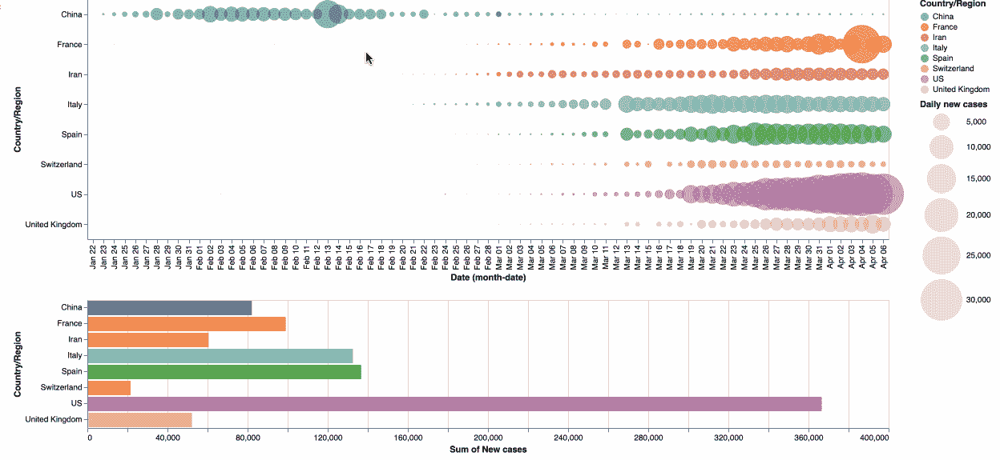
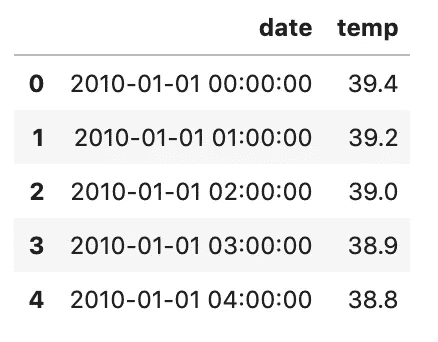
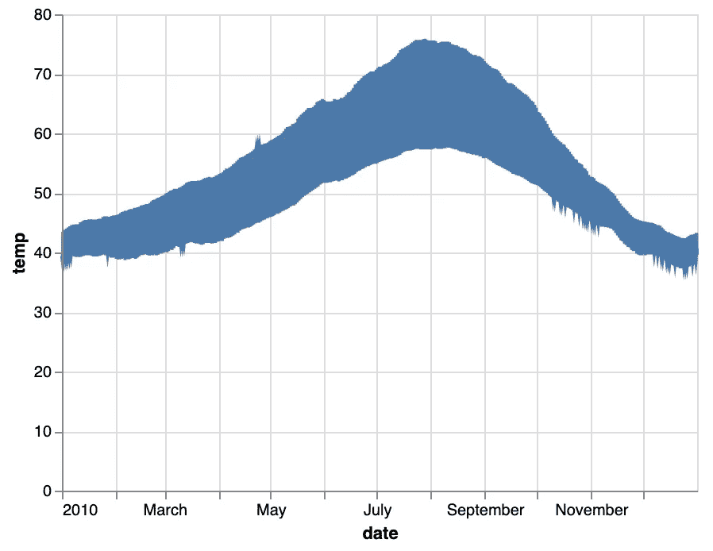
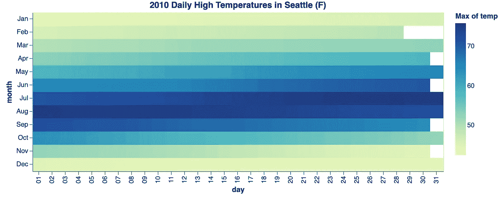
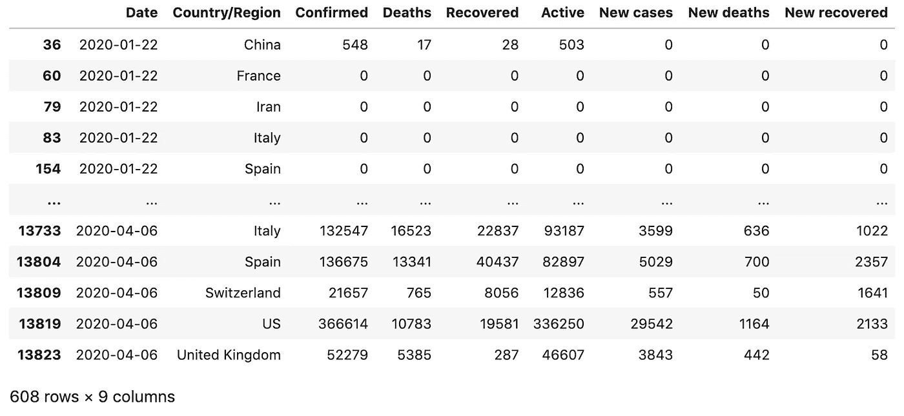
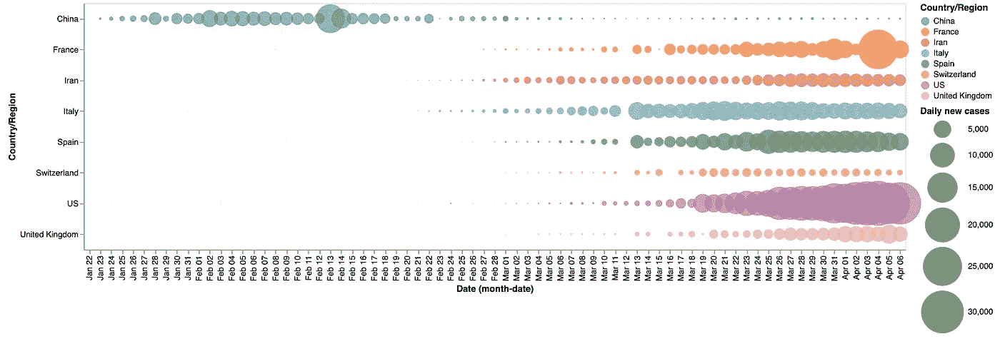
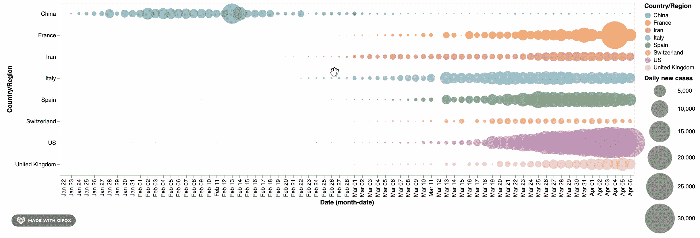
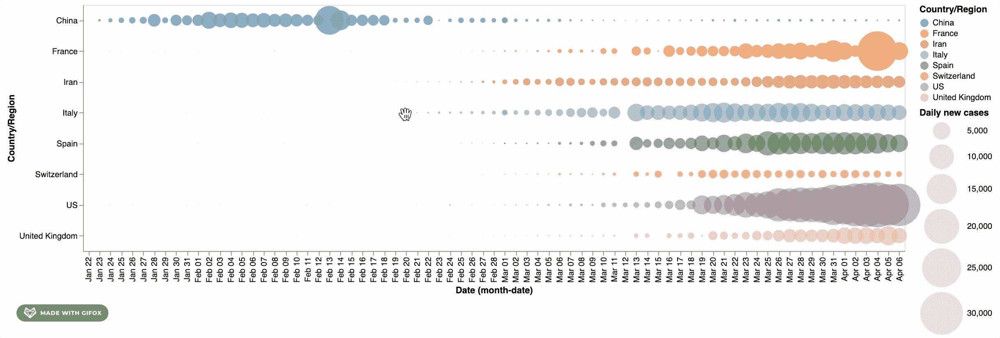
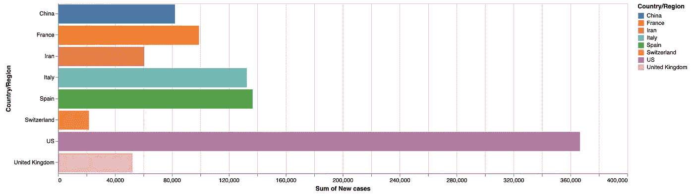
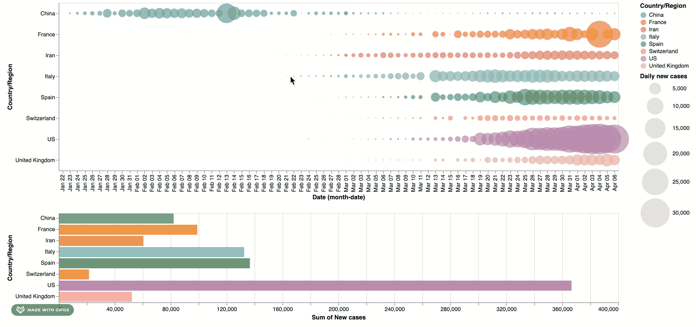

# 探索冠状病毒传播的交互式数据可视化

> 原文：<https://towardsdatascience.com/interactive-data-visualization-for-exploring-coronavirus-spreads-f33cabc64043?source=collection_archive---------28----------------------->

## 使用 Altair 创建不到 30 行代码的交互式复合图表

# 一个简单的例子

在我们进入细节之前，我想向您展示一个不到 30 行代码的交互式复合图表，用于探索冠状病毒的传播。

*   最上面的一个显示的是*每日新病例*
*   底部显示的是*选择区域*的*新增病例总数*。



利用牛郎星探索冠状病毒传播的交互式数据可视化

这个图表是用 Python 数据可视化库 Altair 创建的。Altair 是 Python 的声明式统计可视化库，基于 [Vega](http://vega.github.io/vega) 和 [Vega-Lite](http://vega.github.io/vega-lite) 。Altair 提供了强大而简洁的可视化语法，使您能够快速构建各种各样的统计可视化。

下面是文章大纲:

*   安装和基本指南
*   牛郎星的时间和日期
*   逐步构建探索冠状病毒传播的交互式图表

# 安装和基本指南

关于 Altair 安装的细节和基本概念，可以看看:

[](/python-interactive-data-visualization-with-altair-b4c4664308f8) [## 用 Altair 实现 Python 交互式数据可视化

### 用不到 20 行代码创建交互式图表。

towardsdatascience.com](/python-interactive-data-visualization-with-altair-b4c4664308f8) 

以下是以上介绍的要点:

1.  Altair 有很多依赖项，我强烈建议创建一个新的虚拟环境。
2.  激活您的虚拟环境，并运行`pip install altair vega_datasets`来安装 Altair 以及 [vega_datasets](https://github.com/altair-viz/vega_datasets) 中的示例数据集。
3.  Altair 创建图表只需要三个主要概念:**数据**、**标记**和**编码**。牛郎星中的**数据**是围绕熊猫数据框架建立的。**标记**是点、线、面积、散点图、直方图、地图等各种图表。**编码**是数据到视觉属性的映射，如轴、标记颜色、标记形状等。

对于创建虚拟环境的教程，你可以看看:

[](/create-virtual-environment-using-virtualenv-and-add-it-to-jupyter-notebook-6e1bf4e03415) [## 使用“virtualenv”创建虚拟环境，并将其添加到 Jupyter 笔记本中

### 你是机器学习工程师，正在使用 Python 和 Jupyter Notebook 吗？在这篇文章中，你会看到为什么…

towardsdatascience.com](/create-virtual-environment-using-virtualenv-and-add-it-to-jupyter-notebook-6e1bf4e03415) [](https://medium.com/analytics-vidhya/create-virtual-environment-using-conda-and-add-it-to-jupyter-notebook-d319a81dfd1) [## 使用“conda”创建虚拟环境，并将其添加到 Jupyter 笔记本中

### 你正在使用 anaconda 和使用 Jupyter Notebook 和 Python 吗？在这篇文章中，你将看到如何创建虚拟的…

medium.com](https://medium.com/analytics-vidhya/create-virtual-environment-using-conda-and-add-it-to-jupyter-notebook-d319a81dfd1) 

# 牛郎星的时间和日期

在我们开始用 Altair 制作交互式时间序列图之前，最好先了解一下 Altair 是如何处理时间和日期的。

处理时间和日期通常是数据分析和可视化的挑战之一。了解以下基本用法，应该足以让你用 Altair 创建一个时序图。

## **时间和日期的数据类型**

牵牛星的设计是为了更好地与[熊猫系列](https://pandas.pydata.org/pandas-docs/stable/timeseries.html)配合使用。当您将数据指定为 pandas 数据帧时，数据类型由 Altair 自动确定。

例如，下面是一个包含西雅图每小时测量温度的数据集:

```
import altair as alt
from vega_datasets import data**source = data.seattle_temps()
source.head()**
```



西雅图测得的每小时温度示例

下面是一个创建简单折线图的示例

```
alt.Chart(source).mark_line().encode(
    **x='date'**,
    **y='temp'**
)
```

通过执行上面的代码，它应该会给你一个如下的图表。



您会注意到 Altair 已经自动为您确定了数据类型。由于在短时间内压缩了大量的数据点，情节过于繁忙；我们可以通过使用[时间单位转换](https://altair-viz.github.io/user_guide/transform/timeunit.html)让它变得更清楚一点。

Altair 支持的基本数据类型如下:

*   `quantitative`:简写码 **Q** ，连续实数值。
*   `nominal`:简写代码 **O** ，离散订购数量。
*   `ordinal`:简写代码 **N** ，离散订购数量。
*   `temporal`:速记代码 **T** ，一个时间或日期值。

因此，如果您手动为每个列指定数据类型，则等效于:

```
alt.Chart(source).mark_line().encode(
    **x='date:T'**,
    **y='temp:Q'**
)
```

## 时间单位转换

随着对数据类型的理解。让我们转到[时间单位转换](https://altair-viz.github.io/user_guide/transform/timeunit.html)，它可以用来离散化 Altair 中的日期和时间。

让我们通过离散化使西雅图温度图更清晰一点，例如，按月(在日期上应用[时间单位转换](https://altair-viz.github.io/user_guide/transform/timeunit.html)函数`month()`)并仅绘制月平均温度:

```
alt.Chart(temps).mark_line().encode(
    x='**month(date):T**',
    y='**mean(temp):Q**'
)
```


多个时间单位可以组合在一个图中，以生成有趣的数据视图；例如，这里我们使用[时间单位转换](https://altair-viz.github.io/user_guide/transform/timeunit.html)函数`date()`和`month()`提取月份和日期，给出西雅图全年的温度概况:

```
alt.Chart(source).mark_rect().encode(
    x = **alt.X('date(date):O', title='day')**,
    y = **alt.Y('month(date):O', title='month')**,
    color='max(temp):Q'
).properties(
    title="2010 Daily High Temperatures in Seattle (F)"
)
```



西雅图温度时间单位转换示例

# 逐步构建探索冠状病毒传播的交互式图表

利用 Altair 的基本知识以及它如何处理时间和日期，让我们制作一个交互式图表来探索冠状病毒的传播。

## 数据

用于这种数据可视化的数据是由**约翰·霍普金斯大学系统科学与工程中心**(JHU·CSSE)提供的，他们在公共 [Github 页面](https://github.com/CSSEGISandData/COVID-19)上分享了他们的数据。约翰霍普金斯 CSSE 汇总了主要来源的数据，如世界卫生组织、国家和地区公共卫生机构。这些数据免费提供，并且每天更新。

对于本教程，我已经完成了[数据处理](/covid-19-data-processing-58aaa3663f6)，它运行以下步骤:

1.  将原始确认、死亡和恢复的 CSV 数据合并到一个数据框架中。
2.  由于 ships 中缺少值、错误的数据类型和案例，执行数据清理。
3.  增加一个名为 ***活动*** 的活动案例列，由`active_case = confirmed — deaths — recovered`计算。
4.  将数据聚集到`Country/Region` wise 中，并按`Date`和`Country/Region`分组。
5.  添加当日明智 ***新增病例******新增死亡病例*** 和 ***新增痊愈病例*** 扣除前一日相应的累计数据。

而这里是数据处理后的样子(可以从我的 [Github Gist](https://gist.github.com/BindiChen/cd911af6eb6205038d3aff036d20fb20) 下载)。


数据处理后的[covid _ 19 _ clean _ complete . CSV](https://gist.github.com/BindiChen/cd911af6eb6205038d3aff036d20fb20)

注意 ***确认*** ， ***死亡*** ， ***痊愈*** ， ***活跃*** 都是累计数据。 ***新增病例*** ， ***新增死亡病例*** 和 ***新增痊愈病例*** 均为日明智数据。该数据帧按 ***日期*** 和 ***国家/地区*** 分组。

## 构建交互式图表

首先，让我们导入库并加载数据，

```
import pandas as pd
import altair as altfull_clean_data = pd.read_csv('covid_19_clean_complete.csv', **parse_dates=['Date']**)
```

有将近 200 个国家/地区，如果我们把它们都显示出来，图表会很忙。所以让我们列一个我们想去探索的国家的清单。

```
countries = ['US', 'Italy', 'China', 'Spain', 'France', 'Iran', 'United Kingdom', 'Switzerland']selected_data = full_clean_data[full_clean_data['Country/Region']**.isin(countries)**]
```



从 covid_19_clean_complete.csv 中选择的国家

让我们创建一个圆形图表来显示当天的 ***新增案例*** 、

```
alt.Chart(selected_data).**mark_circle()**.encode(
    **x='Date',**
    **y='Country/Region',
    color='Country/Region',
    size='New cases:Q'**
).properties(
    width=1000,
    height=300,
)
```

上面的结果应该是一个图表，让您可以看到每天的新情况。


基本圆图

由于默认的圆形大小刻度，图表并不突出；我们可以用`alt.Size()`把它放大一点。

```
alt.Chart(selected_data).mark_circle().encode(
    x='monthdate(Date):O',
    y='Country/Region',
    color='Country/Region',
    **size=alt.Size('New cases:Q',
        scale=alt.Scale(range=[0, 3000]),
        legend=alt.Legend(title='Daily new cases')**
    ) 
)
```

这是结果



具有自定义圆形大小的基本圆形图

接下来，我们将使用`[**selection_interval()**](https://altair-viz.github.io/user_guide/generated/api/altair.selection_interval.html#altair.selection_interval)`函数创建一个区间选择:

```
interval = alt.selection_interval()
```

我们现在可以通过设置`selection`属性将这个间隔绑定到我们的图表上:

```
alt.Chart(selected_data).mark_circle().encode(
    x='monthdate(Date):O',
    y='Country/Region',
    color='Country/Region',
    size=alt.Size('New cases:Q',
        scale=alt.Scale(range=[0, 3000]),
        legend=alt.Legend(title='Daily new cases')
    ) 
).properties(
    width=1000,
    height=300,
    **selection=interval**
)
```

上面的结果是一个图表，它允许您单击并拖动来创建一个选择区域，并在创建区域后移动该区域。这很整洁，但是选择实际上还没有做任何事情。



要使用这个选项，我们需要在图表中以某种方式引用它。这里，我们将使用`[**condition()**](https://altair-viz.github.io/user_guide/generated/api/altair.condition.html#altair.condition)`函数来创建一个条件颜色编码:我们将把颜色绑定到选择中的数据的`"Country/Region"`列，并将选择之外的数据的颜色设置为`"lightgray"`:

```
alt.Chart(selected_data).mark_circle().encode(
    x='monthdate(Date):O',
    y='Country/Region',
    **color=alt.condition(interval, 'Country/Region', alt.value('lightgray')),**
    size=alt.Size('New cases:Q',
        scale=alt.Scale(range=[0, 3000]),
        legend=alt.Legend(title='Daily new cases')
    ) 
).properties(
    width=1000,
    height=300,
    selection=interval
)
```



接下来，我们创建一个`mark_bar()`图表来显示新案例的总和:

```
alt.Chart(selected_data).mark_bar().encode(
    y='Country/Region',
    color='Country/Region',
    x='sum(New cases):Q'
).properties(
    width=1000,
)
```



显示新案例总数的条形图

为了将条形图与之前的散点图关联起来，我们需要使用`transform_filter()`并传递同一个`interval`。此外，为了合成多选图表，我们还需要为它们分别创建变量，并使用合成多选`&`。

```
interval = alt.selection_interval()**circle** = alt.Chart(selected_day_wise).mark_circle().encode(
    x='monthdate(Date):O',
    y='Country/Region',
    color=alt.condition(interval, 'Country/Region', alt.value('lightgray')),
    size=alt.Size('New cases:Q',
        scale=alt.Scale(range=[0, 3000]),
        legend=alt.Legend(title='Daily new cases')
    ) 
).properties(
    width=1000,
    height=300,
    selection=interval
)**bars** = alt.Chart(selected_day_wise).mark_bar().encode(
    y='Country/Region',
    color='Country/Region',
    x='sum(New cases):Q'
).properties(
    width=1000
)**.transform_filter(
    interval
)****circle & bars**
```

而且，就是这样。这是输出



探索冠状病毒传播的交互式数据可视化

这是完整的代码:

# 尽情享受吧！

仅此而已。感谢阅读。

关于使用 Altair 创建交互式数据可视化的介绍，您可以看看

[](/python-interactive-data-visualization-with-altair-b4c4664308f8) [## 用 Altair 实现 Python 交互式数据可视化

### 用不到 20 行代码创建交互式图表。

towardsdatascience.com](/python-interactive-data-visualization-with-altair-b4c4664308f8) 

对于新冠肺炎数据处理

[](/covid-19-data-processing-58aaa3663f6) [## 新冠肺炎数据处理

### 下载、加载、合并、清理和聚合新冠肺炎时间序列数据的分步指南

towardsdatascience.com](/covid-19-data-processing-58aaa3663f6)