# 用 Pygal 实现 Python 中的交互式数据可视化

> 原文：<https://towardsdatascience.com/interactive-data-visualization-in-python-with-pygal-4696fccc8c96?source=collection_archive---------11----------------------->

## 用数据讲故事

## 一步一步的教程，创造惊人的可视化

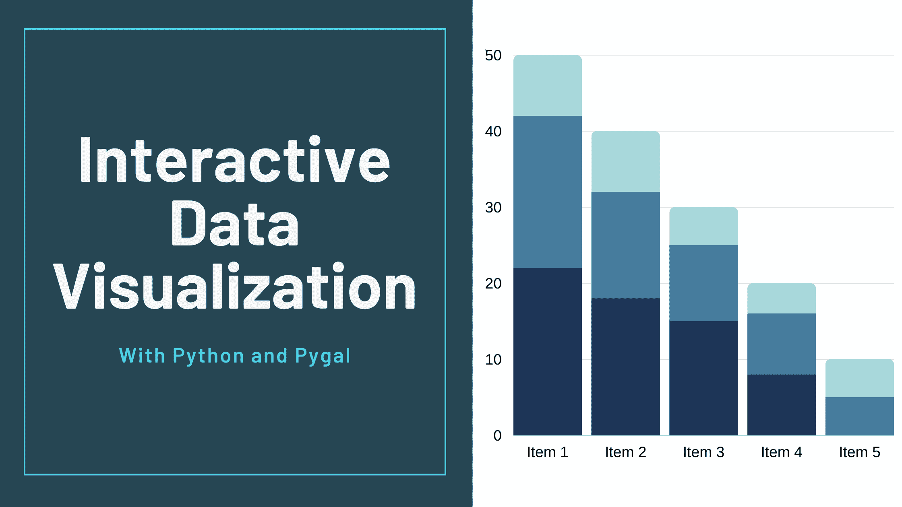

作者提供的图片(使用 [Canva](https://www.canva.com/) 制作)

我们需要处理、分析和探索的数据量；随着我们周围技术的进步，这个数字只会越来越大。现在，想象一下，必须盯着电子表格中的数千行数据，试图找到隐藏的模式并跟踪数字的变化，这对您的分析后解释可能是有用的。

听起来不好玩，是吧？

这就是数据可视化的用武之地。拥有信息的可视化摘要比浏览电子表格的行更容易识别模式和趋势。人类是视觉动物，我们对视觉刺激的互动和反应更好，可视化数据是让我们更容易更好地理解我们的数据的一种方式。由于数据分析的目的是获得洞察力和发现模式，可视化数据将使其更有价值和易于探索。即使一个数据科学家可以在没有可视化的情况下从数据中获得洞察力，但在没有可视化的情况下向他人传达它的意义将更具挑战性。不同类型的图表和图形使交流数据结果更快、更有效。

可视化数据的重要性不仅仅在于简化数据的解释。可视化数据有很多好处，例如:

1.  显示数据随时间的变化。
2.  确定相关事件的频率。
3.  指出不同事件之间的相关性。
4.  分析不同机会的价值和风险。

在本文中，我将讨论一个 Python 库，它可以帮助我们创建引人注目、令人惊叹的交互式可视化效果。图书馆是 Pygal。

事不宜迟，让我们开始吧…

# 臀的

当谈到用 Python 可视化数据时，大多数数据科学家都选择臭名昭著的 Matplotlib、Seaborn 或 Bokeh。然而，经常被忽略的一个库是 Pygal。Pygal 允许用户使用 Flask 或 Django 创建漂亮的交互式图形，这些图形可以转换成具有最佳分辨率的 SVG，以便打印或显示在网页上。

## 熟悉 Pygal

Pygal 提供了各种各样的图表，我们可以用来可视化数据，准确地说，Pygal 中有 14 种图表类别，如直方图、条形图、饼图、树形图、量表等等。

要使用 Pygal 的魔法，我们首先需要安装 Pygal。

```
$ pip install pygal
```

让我们绘制第一张图表。我们将从最简单的图表开始，一个条形图。要使用 Pygal 绘制条形图，我们需要创建一个 chart 对象，然后向其中添加一些值。

```
bar_chart = pygal.Bar()
```

我们将画出从 0 到 5 的阶乘。这里我定义了一个简单的函数来计算一个数的阶乘，然后用它来生成一个从 0 到 5 的阶乘列表。

```
def factorial(n):
    if n == 1 or n == 0:
        return 1
    else:
        return n * factorial(n-1)
fact_list = [factorial(i) for i in range(11)]
```

现在，我们可以用这个来创造我们的情节

```
bar_chart = pygal.Bar(height=400)
bar_chart.add('Factorial', fact_list)
display(HTML(base_html.format(rendered_chart=bar_chart.render(is_unicode=True))))
```

这将产生一个美丽的，互动的情节

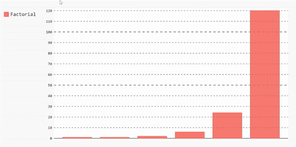

如果我们想要绘制不同种类的图表，我们将遵循相同的步骤。您可能已经注意到，将数据链接到图表的主要方法是`add`方法。

现在，让我们开始建立一些基于现实生活中的数据。

## 应用

在[这篇](https://www.kaggle.com/fireballbyedimyrnmom/us-counties-covid-19-dataset)文章的剩余部分，我将使用美国新冠肺炎案例的数据集来解释 Pygal 库的不同方面。

首先，为了确保一切顺利进行，我们需要确保两件事:

*   我们已经安装了熊猫和 Pygal。
*   在 Jupyter Notebook 中，我们需要启用 IPython 显示和 HTML 选项。

```
from IPython.display import display, HTMLbase_html = """
<!DOCTYPE html>
<html>
  <head>
  <script type="text/javascript" src="[http://kozea.github.com/pygal.js/javascripts/svg.jquery.js](http://kozea.github.com/pygal.js/javascripts/svg.jquery.js)"></script>
  <script type="text/javascript" src="[https://kozea.github.io/pygal.js/2.0.x/pygal-tooltips.min.js](https://kozea.github.io/pygal.js/2.0.x/pygal-tooltips.min.js)""></script>
  </head>
  <body>
    <figure>
      {rendered_chart}
    </figure>
  </body>
</html>
"""
```

现在我们都设置好了，我们可以开始用 Pandas 探索我们的数据，然后使用不同种类的图表操作和准备它。

```
import pygal
import pandas as pd
data = pd.read_csv("[https://raw.githubusercontent.com/nytimes/covid-19-data/master/us-counties.csv](https://raw.githubusercontent.com/nytimes/covid-19-data/master/us-counties.csv)")
```

该数据集包含关于新冠肺炎病例、基于日期、县和州的死亡的信息。我们可以看到，使用`data.column`来了解数据的形状。执行该命令将返回:

```
Index(['date', 'county', 'state', 'fips', 'cases', 'deaths'], dtype='object')
```

我们可以得到一个 10 行的样本，看看我们的数据框是什么样的。

```
data.sample(10)
```


数据集的前十行

## 条形图

让我们首先绘制一个条形图，显示每个州的案件数量的平均值。为此，我们需要执行以下步骤:

*   将我们的数据按州分组，提取每个州的案例号，然后计算每个州的平均值。

```
mean_per_state = data.groupby('state')['cases'].mean()
```

*   开始构建数据并将其添加到条形图中。

```
barChart = pygal.Bar(height=400)
[barChart.add(x[0], x[1]) for x in mean_per_state.items()]
display(HTML(base_html.format(rendered_chart=barChart.render(is_unicode=True))))
```

瞧，我们有一个条形图。我们可以通过从图例列表中取消选择来删除数据，也可以通过再次重新选择来重新添加数据。

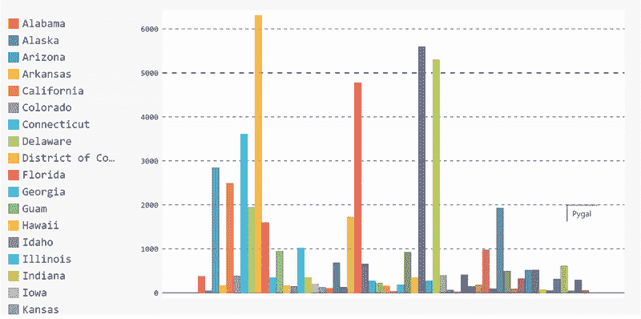

条形图的完整代码

## 树形图

条形图有助于显示整体数据，但如果我们想得到更具体的数据，我们可以选择不同类型的图表，即*树形图*。树状图对于显示数据中的类别很有用。例如，在我们的数据集中，我们有基于每个州每个县的案例数。条形图能够显示每个州的平均值，但我们无法看到每个州每个县的病例分布。一种方法是使用树形图。

假设我们想要查看案例数量最多的 10 个州的详细案例分布。然后，我们需要在绘制数据之前先处理数据。

*   我们需要根据案例对数据进行排序，然后按州对它们进行分组。

```
sort_by_cases = data.sort_values(by=['cases'],ascending=False).groupby(['state'])['cases'].apply(list)
```

*   使用排序列表获得案例数量最多的前 10 个州。

```
top_10_states = sort_by_cases[:10]
```

*   使用这个子列表来创建我们的树形图。

```
treemap = pygal.Treemap(height=400)
[treemap.add(x[0], x[1][:10]) for x in top_10_states.items()]
display(HTML(base_html.format(rendered_chart=treemap.render(is_unicode=True))))
```

然而，这个树状图没有被标记，所以当我们悬停在块上时，我们看不到县名。我们会在这个州的所有县区看到这个州的名字。为了避免这种情况，并将县名添加到我们的树形图中，我们需要标记我们提供给图表的数据。

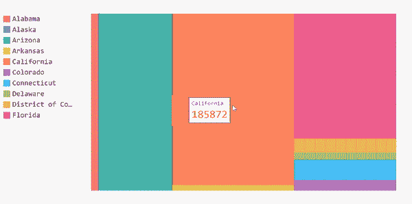

无标签树形图

在此之前，我们的数据每天都会更新。因此，每个县将有几次重复。因为我们关心每个县的病例总数，所以在将数据添加到树形图之前，我们需要清理数据。

```
#Get the cases by county for all states
cases_by_county = data.sort_values(by=['cases'],ascending=False).groupby(['state'], axis=0).apply(
    lambda x : [{"value" : l, "label" : c } for l, c in zip(x['cases'], x['county'])])
cases_by_county= cases_by_county[:10]
#Create a new dictionary that contains the cleaned up version of the dataclean_dict = {}
start_dict= cases_by_county.to_dict()
for key in start_dict.keys():
    values = []
    labels = []
    county = []
    for item in start_dict[key]:
        if item['label'] not in labels:
            labels.append(item['label'])
            values.append(item['value'])
        else:
            i = labels.index(item['label'])
            values[i] += item['value']

    for l,v in zip(labels, values):
        county.append({'value':v, 'label':l})
    clean_dict[key] = county
#Convert the data to Pandas series to add it to the treemapnew_series = pd.Series(clean_dict)
```

然后我们可以将这个系列添加到树形图中，并绘制一个带标签的版本。

```
treemap = pygal.Treemap(height=200)
[treemap.add(x[0], x[1][:10]) for x in new_series.iteritems()]
display(HTML(base_html.format(rendered_chart=treemap.render(is_unicode=True))))
```

厉害！现在我们的树形图被标记了。如果我们现在将鼠标悬停在街区上，我们可以看到县、州的名称以及该县的病例数。

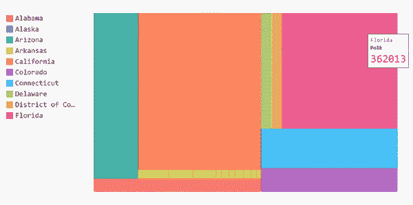

标签树形图

树形图的完整代码

## 圆形分格统计图表

我们可以呈现此信息的另一种形式是使用饼图来显示病例数最多的 10 个州。使用饼图，我们可以看到一个州相对于其他州的病例数的百分比。

由于我们已经完成了所有的数据框操作，我们可以使用它来立即创建饼图。

```
first10 = list(sort_by_cases.items())[:10]
[pi_chart.add(x[0], x[1]) for x in first10]
display(HTML(base_html.format(rendered_chart=pi_chart.render(is_unicode=True))))
```

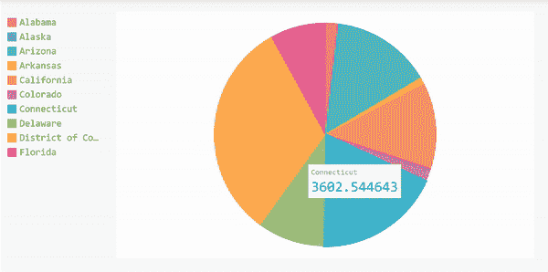

饼状图的完整代码

## 仪表图

我们要讨论的最后一种图表是仪表图。仪表图看起来像甜甜圈，对于比较少量变量之间的值很有用。因此，我们将比较数据集中的前 5 个州。

仪表图有两种形状，圆环形状或 Pygal 中的`SolidGauge`，以及指针形状或`Gauge`。

**甜甜圈形状**

```
gauge = pygal.SolidGauge(inner_radius=0.70)
[gauge.add(x[0], [{"value" : x[1] * 100}] ) for x in mean_per_state.head().iteritems()]
display(HTML(base_html.format(rendered_chart=gauge.render(is_unicode=True))))
```

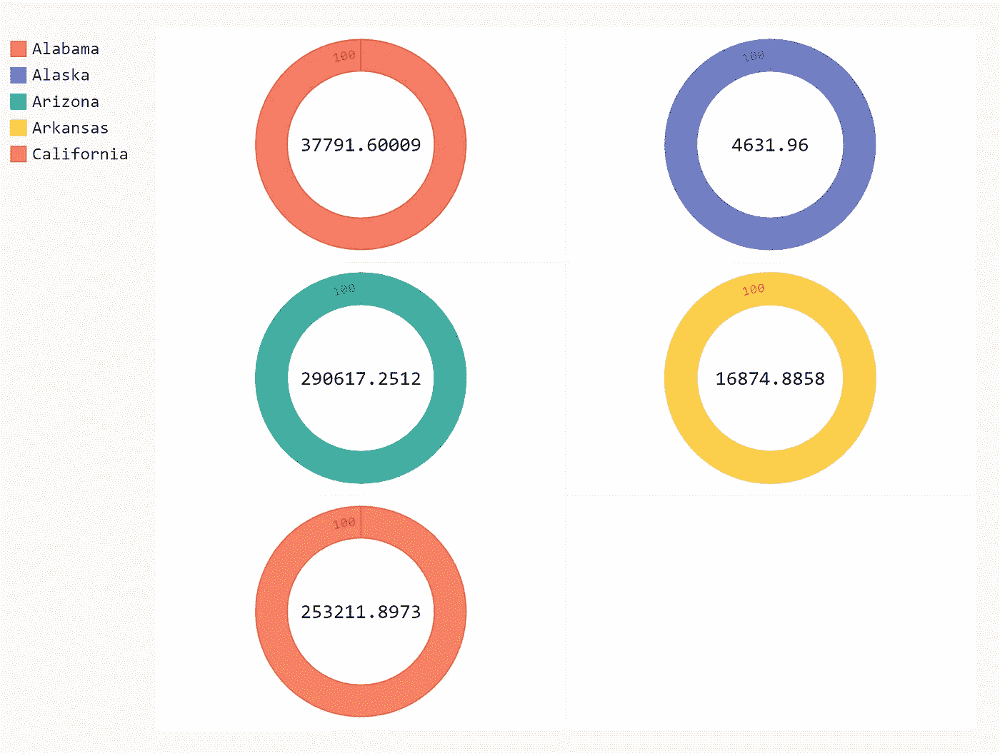

**针形**

```
gauge = pygal.Gauge(human_readable=**True**)
[gauge.add(x[0], [{"value" : x[1] * 100}] ) **for** x **in** mean_per_state.head().iteritems()]
display(HTML(base_html.format(rendered_chart=gauge.render(is_unicode=**True**))))
```

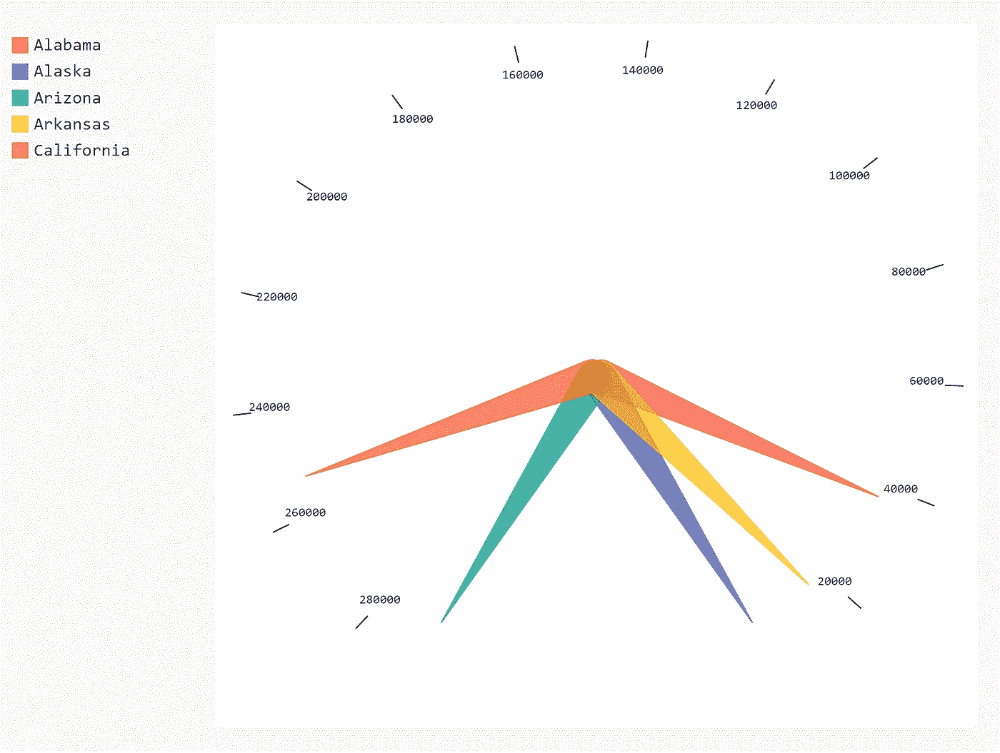

仪表图的完整代码

## 式样

Pygal 也让我们有机会玩图表的颜色；库中已定义的样式有:

*   [默认](http://www.pygal.org/en/stable/documentation/builtin_styles.html#default)
*   [深色风格](http://www.pygal.org/en/stable/documentation/builtin_styles.html#darkstyle)
*   [霓虹灯](http://www.pygal.org/en/stable/documentation/builtin_styles.html#neon)
*   [黑暗曝晒](http://www.pygal.org/en/stable/documentation/builtin_styles.html#dark-solarized)
*   [光照曝光](http://www.pygal.org/en/stable/documentation/builtin_styles.html#light-solarized)
*   [灯](http://www.pygal.org/en/stable/documentation/builtin_styles.html#light)
*   [清洁](http://www.pygal.org/en/stable/documentation/builtin_styles.html#clean)
*   [红色蓝色](http://www.pygal.org/en/stable/documentation/builtin_styles.html#red-blue)
*   [深色化](http://www.pygal.org/en/stable/documentation/builtin_styles.html#dark-colorized)
*   [浅色化](http://www.pygal.org/en/stable/documentation/builtin_styles.html#light-colorized)
*   [绿松石](http://www.pygal.org/en/stable/documentation/builtin_styles.html#turquoise)
*   [浅绿色](http://www.pygal.org/en/stable/documentation/builtin_styles.html#light-green)
*   [深绿色](http://www.pygal.org/en/stable/documentation/builtin_styles.html#dark-green)
*   [深绿色蓝色](http://www.pygal.org/en/stable/documentation/builtin_styles.html#dark-green-blue)
*   [蓝色](http://www.pygal.org/en/stable/documentation/builtin_styles.html#blue)

要使用内置样式，您需要导入您想要的样式，或者您可以全部导入。

```
from pygal.style import *
```

下面是一些不同内置风格的例子。

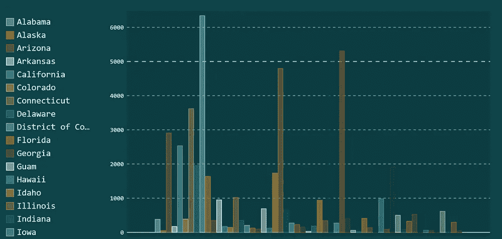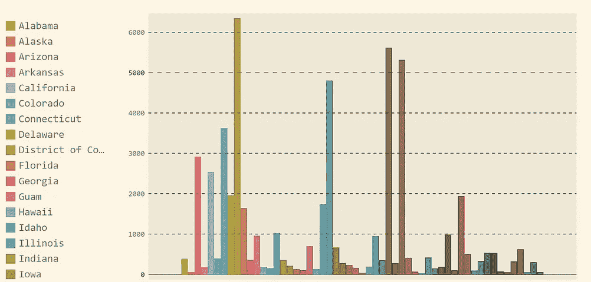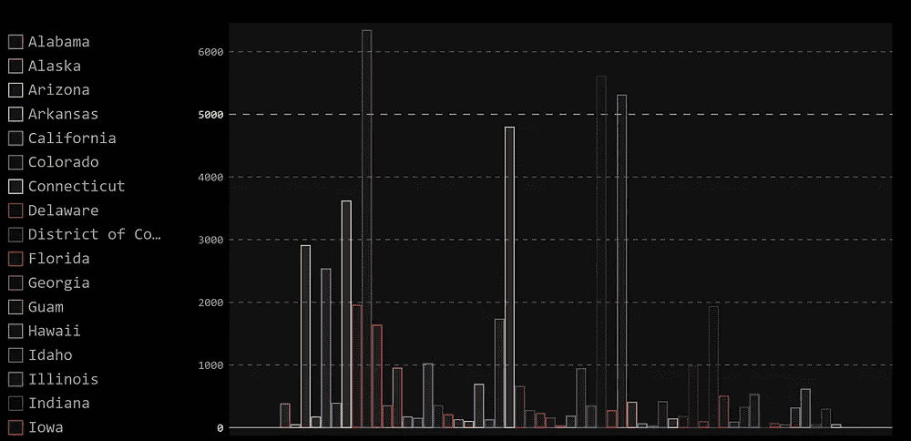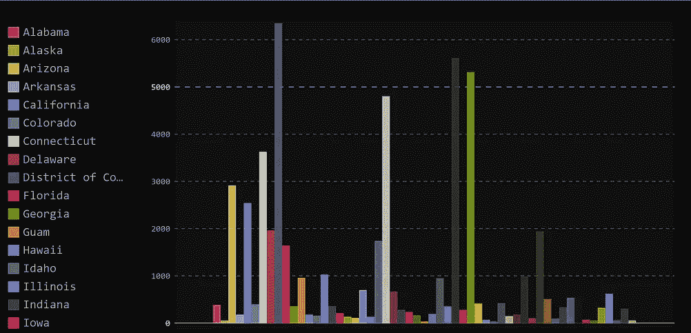

不同的内置样式(从左上开始:TurquoiseStyle、LightSolarizedStyle、NeonStyle、DarkStyle)

除了这些样式，您还可以通过设置 style 对象的参数来定义自定义样式。可以编辑的一些属性有代表系列颜色的`color` 、`background`和分别代表图表背景和前景颜色的`foreground` 。您还可以编辑图表的`opacity` 和`font` 属性。

这是我的自定义样式的样式对象😄

```
from pygal.style import Style
custom_style = Style(
  background='transparent',
  plot_background='transparent',
  font_family = 'googlefont:Bad Script',
  colors=('#05668D', '#028090', '#00A896', '#02C39A', '#F0F3BD'))
```

注意:如果您直接包含 SVG，font-family 属性将不起作用，您必须嵌入它，因为 google 样式表被添加到 XML 处理指令中。

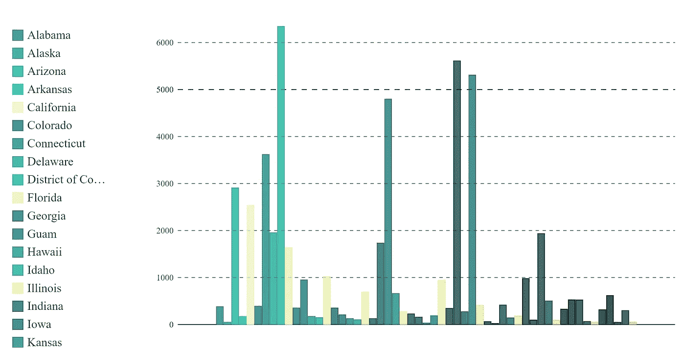

我的定制风格

唷…

有很多图表和颜色…

Pygal 库提供了如此多的选项，更多的图形类型，以及更多的选项来在不同的网站上嵌入结果图形的 SVG。我非常喜欢使用 Pygal 的原因之一是，它允许用户释放他们的创造力，创建交互式的、清晰的、多彩的迷人图形。

# 参考

[1] Pygal 文档[http://www.pygal.org/en/stable/index.html](http://www.pygal.org/en/stable/index.html)