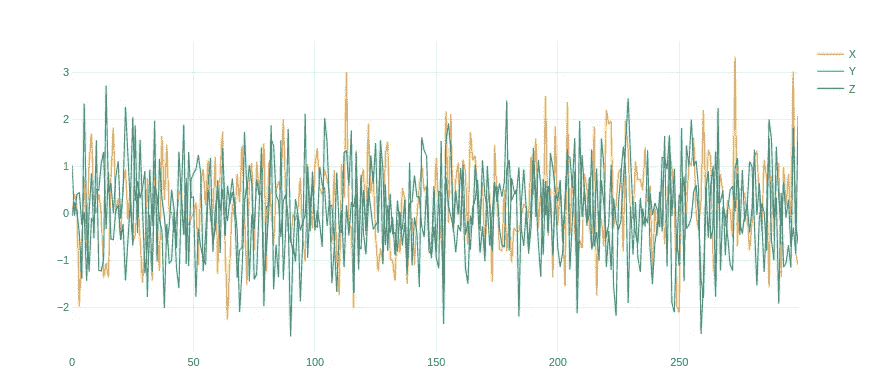
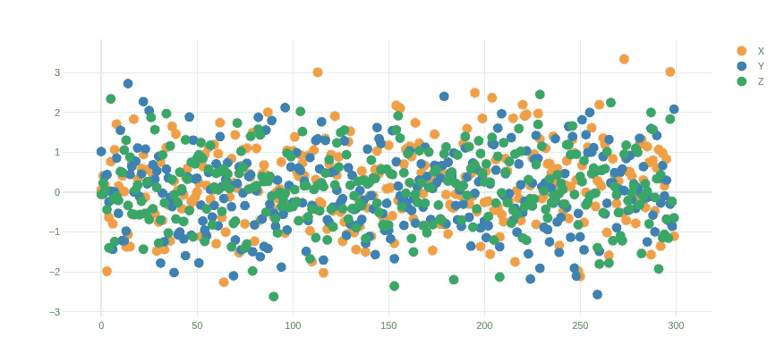
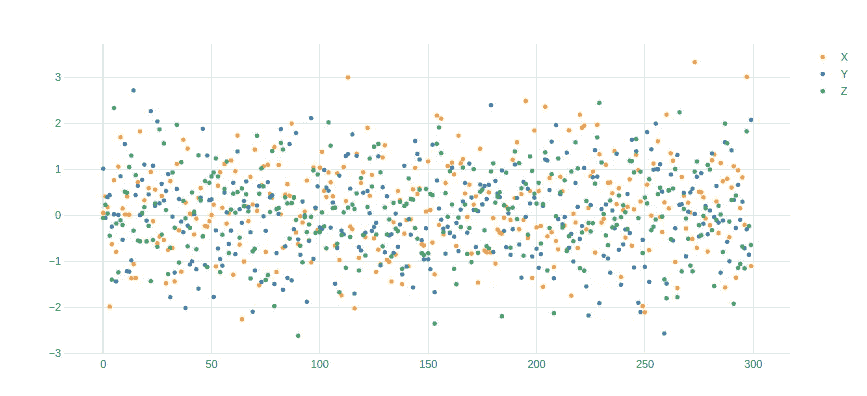
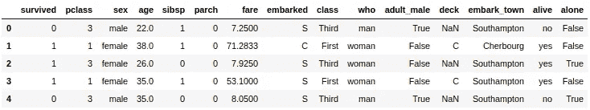
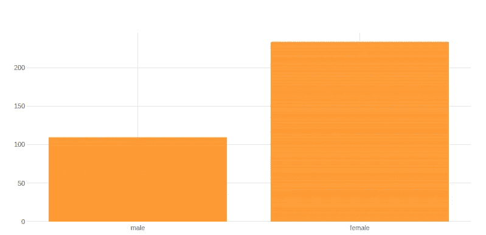
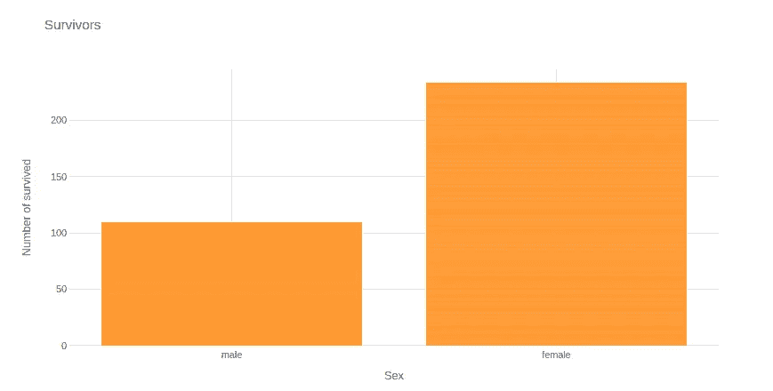
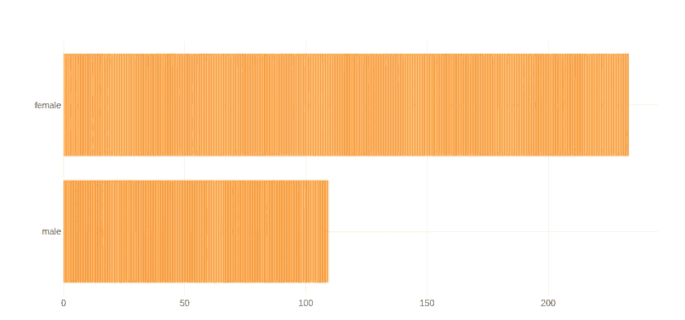
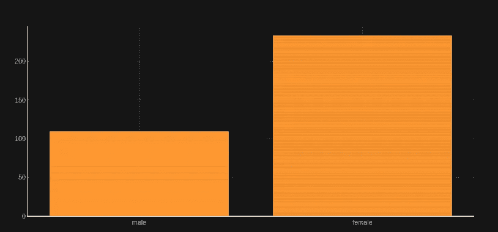
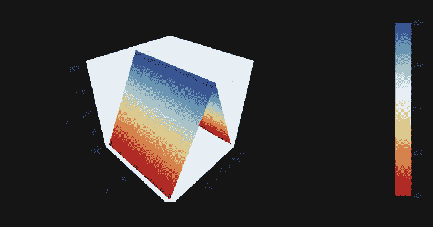

# 使用 Plotly 和 Python 的交互式数据可视化

> 原文：<https://towardsdatascience.com/interactive-data-visualization-using-plotly-and-python-4846dd510678?source=collection_archive---------54----------------------->

## 使用 Plotly 在 Jupyter 笔记本中构建交互式数据可视化


马库斯·温克勒在 [Unsplash](https://unsplash.com/s/photos/analytics?utm_source=unsplash&utm_medium=referral&utm_content=creditCopyText) 上的照片

Python 非常适合数据探索和数据分析，这都要归功于像 numpy、pandas、matplotlib 和许多其他库的支持。在我们的数据探索和数据分析阶段，理解我们正在处理的数据是非常重要的，为此，我们的数据的可视化表示可能是极其重要的。

对于我们来说，使用 Jupyter 笔记本进行这些项目是很常见的，因为它们非常棒、快速、简单，并且允许我们与数据进行交互和处理。然而，我们所能做的有一些限制，通常当我们处理图表时，我们使用像 matplotlib 或 seaborn 这样的库，但是这些库呈现我们的图表和图形的静态图像。但是很多东西在细节中丢失了，因此我们需要微调我们的图表来探索我们数据的各个部分。如果我们可以通过放大来与我们的图表进行交互，向我们的数据点添加上下文信息，比如悬停交互，这不是很好吗？这就是 Plotly 可以帮助我们的地方。

Plotly 是一个 python 库，可以制作交互式的、出版物质量的图形，如折线图、散点图、面积图、条形图、误差线、箱线图、直方图、热图、支线图等等。

但是我们已经谈得够多了，让我们开始制作一些图表吧…

# 安装依赖项

在我们构建任何东西之前，让我们安装依赖项。我喜欢使用`pipenv`，但这同样适用于 anaconda 或其他包管理器。

这是我们需要的依赖项列表

*   jupyter:一个 Web 应用程序，允许你创建和共享包含实时代码、公式等的文档。你知道的！
*   pandas:非常强大的数据分析库，我们将在项目中使用它来处理我们的数据
*   numpy:Python 的科学计算，在我们的数学和生成随机数项目中使用
*   seaborn:基于 matplotlib 的统计数据可视化，我们将使用它来加载库中的一些样本数据
*   袖扣:允许 plotly 和熊猫一起工作
*   plotly:交互式图表库

以下是安装它们的命令:

```
pipenv install jupyter
pipenv install plotly cufflinks pandas seaborn numpy
```

# 入门指南

首先，我们需要启动 jupyter 笔记本并创建一个新文档:

```
pipenv run jupyter notebook
```

一旦我们到了那里，我们就可以开始添加一些代码。因为这篇文章不是关于 Jupyter 笔记本的教程，所以我只关注代码，而不是如何使用文档。

让我们开始导入库:

```
import pandas as pd
import numpy as np
import seaborn as sns
import cufflinks as cf
```

在其他库的帮助下，Plotly 可以在不同的上下文中渲染图，例如在 jupyter 笔记本上，在线在 plotly 仪表板上，等等。默认情况下，库以离线模式工作，这正是我们想要的。然而，我们还需要告诉袖扣，我们将对图表使用离线模式。通过将以下单元格添加到我们的笔记本中，可以以编程方式完成此设置:

```
cf.go_offline()
```

现在我们准备好获取一些数据并开始绘图。

# 生成随机数据

我不想过多地关注如何加载或检索数据，因此，我们将简单地为图表生成随机数据，在一个新的单元格中，我们可以使用 pandas 和 numpy 来构建一个 3d 矩阵:

```
df = pd.DataFrame(np.random.randn(300, 3), columns = ["X", "Y", "Z"])
df.head()
```

太棒了，使用 numpy 我们可以生成我们的随机数，我们可以将它们加载到一个熊猫数据帧对象中。让我们看看我们的数据是什么样的:

```
df.head()
```

我们得到了:

```
 X              Y             Z
0      0.176117      1.221648      1.201206
1      1.931615      -2.303667     1.914741
2      1.213322      -0.434855     -0.639277
3      0.763220      0.118211      -0.838034
4      0.245442      0.697897      1.169540
```

太好了！是时候绘制一些图表了。

# 我们的第一个地块

绘制数据帧的一种简便方法是使用袖扣提供的系列和数据帧上可用的方法`iplot`。让我们从所有的默认值开始:

```
df.iplot()
```



乍一看，它看起来像任何其他图表，但如果你将鼠标悬停在图表上，你会开始看到一些神奇的东西。一个工具栏出现在屏幕右上角的 hover 上，允许你缩放、平移和其他操作。该图表还允许您通过在图表上绘制一个区域来放大，或者简单地查看每个数据点上的工具提示以及值等附加信息。

我们上面的图表当然比静态图表好，但是仍然不够好。让我们尝试使用散点图来呈现相同的图表。

```
df.iplot(mode = “markers”)
```



不可怕，但不伟大，点太大，让我们调整它们的大小:

```
df.iplot(mode = “markers”, size = 5)
```



好多了！接下来，让我们尝试一些不同的东西。

## 条形图

让我们暂时忘记我们随机生成的数据集，让我们从 seaborn 库中加载一个流行的数据集来呈现一些其他图表类型。

```
titanic = sns.load_dataset("titanic")
titanic.head()
```



我们将要处理的数据集名为“泰坦尼克号”，包含了关于泰坦尼克号上的乘客在悲惨的一天发生了什么的信息。

该数据集中的一个特殊变量是幸存变量，它包含布尔信息，0 表示死亡的人，1 表示事故中幸存的人。让我们制作一个柱状图来看看男人和女人是如何幸存下来的:

```
titanic.iplot(kind = “bar”, x = “sex”, y = “survived”)
```



趋势显而易见，但是，如果你只是分享这张图表，就不可能知道我们在谈论什么，因为它没有图例，也没有标题。让我们来解决这个问题:

```
titanic.iplot(kind = “bar”, x = “sex”, y = “survived”, title = “Survivors”, xTitle = “Sex”, yTitle = “Number of survived”)
```



现在好多了！

但是如果我们想画一个单杠图呢？很简单:

```
titanic.iplot(kind = “barh”, x = “sex”, y = “survived”)
```



太好了！让我们探索更多的功能

# 主题

到目前为止，我们的图表看起来很棒，但也许我们想为我们的图表使用不同的颜色模式。幸运的是，我们有一组主题可以用来渲染我们的情节。我们把它们列出来，换一个。

列出主题:

```
cf.getThemes()
```

它应该输出如下内容:

```
[‘ggplot’, ‘pearl’, ‘solar’, ‘space’, ‘white’, ‘polar’, ‘henanigans’]
```

我们可以通过简单地添加以下内容来切换所有未来图表的主题:

```
cf.set_config_file(theme=”solar”)
```

现在，如果我们再次渲染我们的条形图，我们会得到这样的结果:

```
titanic.iplot(kind = “bar”, x = “sex”, y = “survived”)
```



黑暗模式，我的最爱之一，但请检查他们，让我知道哪一个是你的最爱。

# 曲面图

到目前为止，我们渲染了令人惊叹的 2d 图表，但 plotly 也支持 3d 图表。让我们构建一些 3d 图表来找乐子。

下一个图，我们将使其成为 3D 表面图，为此，我们需要使用 pandas 创建一些数据，如下所示:

```
df = pd.DataFrame({“A”: [100, 200, 300, 200, 100], “B”: [100, 200, 300, 200, 100], “C”: [100, 200, 300, 200, 100]})
df.head()
```

您应该会看到这样的内容:

```
 A        B        C
0      100      100      100
1      200      200      200
2      300      300      300
3      200      200      200
4      100      100      100 
```

现在让我们使用“表面”类型将它放在 3d 图表上。

```
df.iplot(kind = “surface”)
```


看起来太棒了！和彩色，让我们改变色阶，使其更具视觉吸引力:

```
df.iplot(kind = “surface”, colorscale = “rdylbu”)
```



漂亮！但不是这个，你试过和笔记本里的图表互动吗？你甚至可以旋转它！

# 结论

Plotly 是您数据探索和分析的一个很好的图表选择。正如所见，它提供了交互式仪表板，可以帮助您更好地识别异常值，并通过导航更好地了解您的数据。

我可能不会对每个数据集都使用 plotly，但它是一个非常有趣的库，我们应该了解它。

感谢阅读！