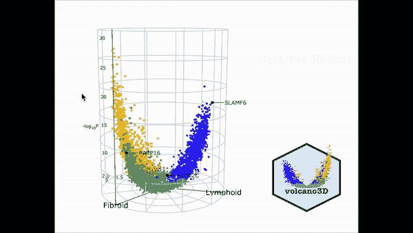
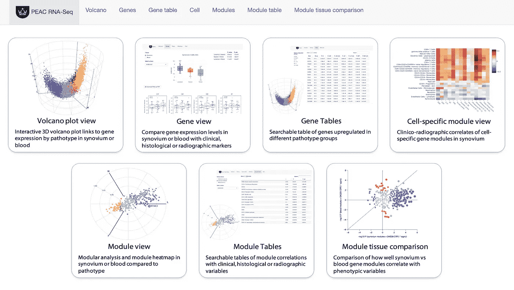
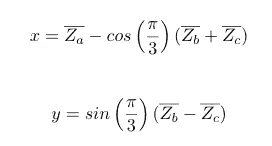
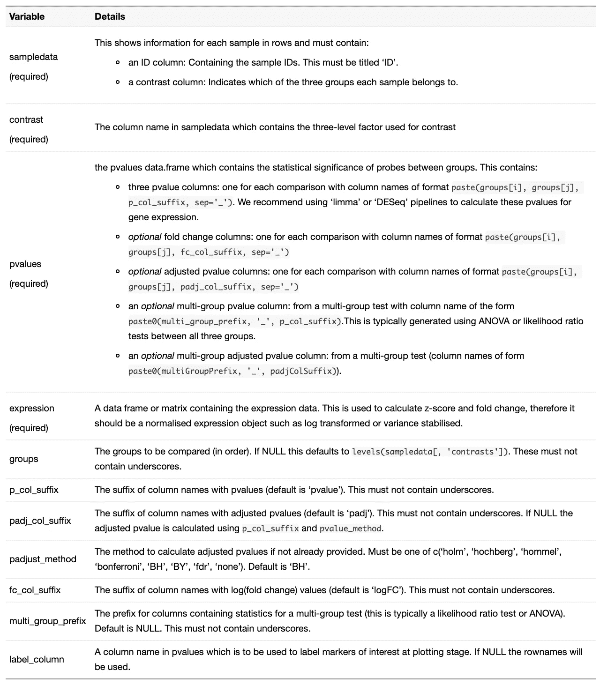
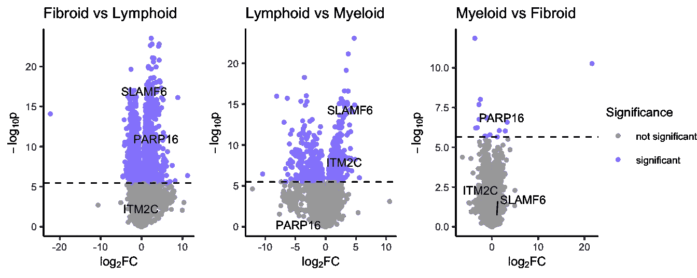
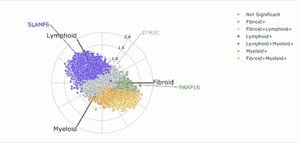
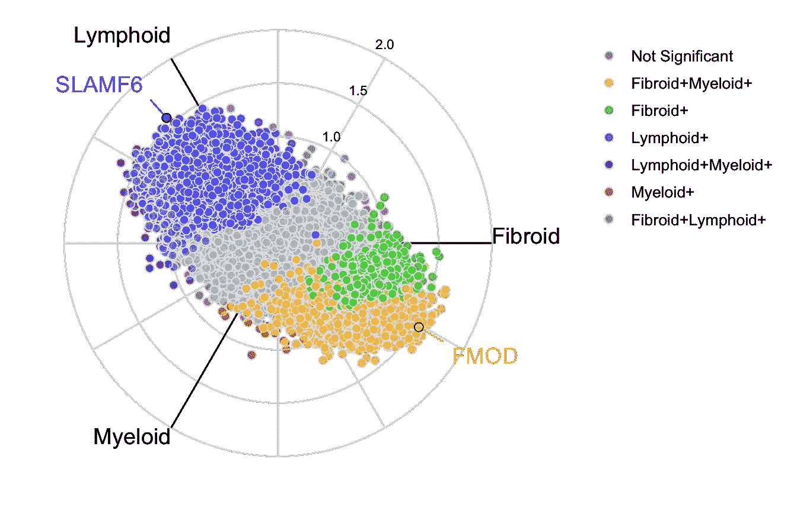
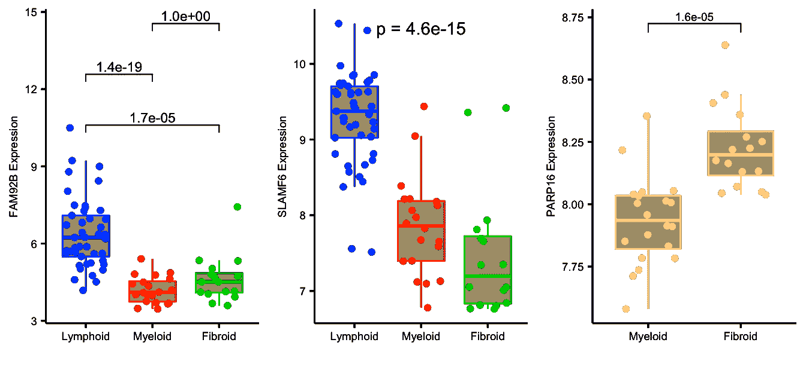
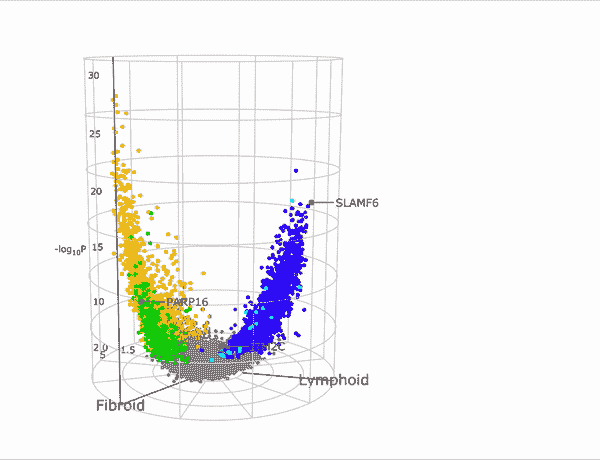
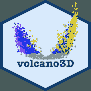

# volcano3D 交互式差异表达分析

> 原文：<https://towardsdatascience.com/interactive-differential-expression-analysis-with-volcano3d-cf6c37b5aa6a?source=collection_archive---------40----------------------->

我很高兴向大家介绍 volcano3D，一个 R 套装，现在已经在 [CRAN](https://cran.r-project.org/web/packages/volcano3D/index.html) 上发售！volcano3D 软件包能够探测三组之间差异表达的探针。其主要目的是在三维火山图中可视化差异表达的基因。使用 [plotly](https://plotly.com/r/) 可以将这些图转换为交互式可视化:



在这里，我将探讨一个来自 PEAC 类风湿性关节炎试验的案例研究(早期关节炎队列的病理生物学)。该方法已在 [Lewis，Myles J .等人*发表。早期类风湿性关节炎的分子画像确定了临床和治疗反应表型*。细胞报告 28.9(2019):2455–2470。(DOI:10.1016/j . cel rep . 2019 . 07 . 091)](https://doi.org/10.1016/j.celrep.2019.07.091)附带互动网站[https://peac . HPC . qmul . AC . uk](https://peac.hpc.qmul.ac.uk/):



PEAC RNAseq 网站托管使用 R 闪亮和特色火山三维绘图

该工具作为一个可搜索的界面，用于检查个体滑膜和血液基因转录水平与组织学、临床和影像学参数之间的关系，以及 6 个月时的临床反应。交互式界面允许探索基因模块分析模块和临床参数之间的关系。PEAC 互动网络工具被创建为一个闪亮的应用程序，并通过服务器部署到网络上。

# 入门指南

## 先决条件

*   [R ( > = 3.5)](https://www.r-project.org/)
*   [ggplot2](https://cran.r-project.org/web/packages/ggplot2/index.html)
*   [ggpubr](https://cran.r-project.org/web/packages/ggpubr/index.html)
*   [gg 击退](https://cran.r-project.org/web/packages/ggrepel/index.html)
*   [阴谋地](https://cran.r-project.org/web/packages/plotly/index.html)

## 从起重机安装

```
install.packages("volcano3D")
library(volcano3D)
```

## 从 Github 安装

```
library(devtools)
install_github("KatrionaGoldmann/volcano3D")
library(volcano3D)
```

# 火山 3D 数据

样本数据也可以从[源](https://github.com/KatrionaGoldmann/volcano3Ddata)安装或使用:

```
install_github("KatrionaGoldmann/volcano3Ddata")
[library](https://rdrr.io/r/base/library.html)(volcano3Ddata)
[data](https://rdrr.io/r/utils/data.html)("syn_data")
```

该群组中的样本分为三个病理类型组:

```
[table](https://rdrr.io/r/base/table.html)(syn_metadata$Pathotype)╔═══════════╦═══════╗
║ Pathotype ║ Count ║ 
╠═══════════╬═══════╣
║ Fibroid   ║ 16    ║
║ Lymphoid  ║ 45    ║
║ Myeloid   ║ 20    ║
╚═══════════╩═══════╝
```

在这个例子中，我们感兴趣的是每一组之间差异表达的基因。

首先，我们将使用 polar_coords 函数将表达式数据映射到笛卡尔坐标。这从每个组的平均缩放 Z 分数 Z 计算出 *x* 和 *y* :



然后通过以下方式转换为极坐标:


该功能使用输入:



有关如何创建这些 p 值数据框的更多信息，请参见[p 值生成器插图](https://katrionagoldmann.github.io/volcano3D/articles/pvalues_generator.html)。polar_coords 函数通过以下方式实现:

```
syn_polar <- [polar_coords](https://katrionagoldmann.github.io/volcano3D/reference/polar_coords.html)(sampledata = syn_metadata,
                          contrast = "Pathotype",
                          pvalues = syn_pvalues,
                          expression = syn_rld,
                          p_col_suffix = "pvalue",
                          padj_col_suffix = "padj",
                          fc_col_suffix = "log2FoldChange",
                          multi_group_prefix = "LRT",
                          non_sig_name = "Not Significant",
                          significance_cutoff = 0.01,
                          label_column = NULL,
                          fc_cutoff = 0.1)
```

并输出具有以下槽的 S4 极坐标类对象:样本数据、对比度、pvalues、多组测试、表达式、极坐标和非符号名称。pvalues 槽应有一个数据框，其中每个比较至少有两个统计数据(p 值和调整后的 p 值)和一个可选的对数倍数变化统计数据。

如果之前提供了折叠变化列，我们现在可以使用 volcano_trio 函数研究病理类型之间的比较。这产生了三个 [ggplot](https://ggplot2.tidyverse.org/reference/ggplot.html) 输出:

```
syn_plots <- 
     [volcano_trio](https://katrionagoldmann.github.io/volcano3D/reference/volcano_trio.html)(
                  polar = syn_polar,
                  sig_names = [c](https://rdrr.io/r/base/c.html)("not significant","significant",
                                "not significant","significant"),
                  colours = [rep](https://rdrr.io/r/base/rep.html)([c](https://rdrr.io/r/base/c.html)("grey60",  "slateblue1"), 2),
                  text_size = 9,
                  marker_size=1,
                  shared_legend_size = 0.9,
                  label_rows = [c](https://rdrr.io/r/base/c.html)("SLAMF6", "PARP16", "ITM2C"),
                  fc_line = FALSE,
                  share_axes = FALSE) syn_plots$All
```



显示每个比较的差异表达的火山图

# 径向图

现在可以使用 radial_plotly 在交互式雷达图上显示微分表达式。`labelRows`变量允许标记任何感兴趣的标记。

```
[radial_plotly](https://katrionagoldmann.github.io/volcano3D/reference/radial_plotly.html)(polar = syn_polar,
              label_rows = [c](https://rdrr.io/r/base/c.html)("SLAMF6", "PARP16", "ITM2C"))
```



显示所有三组之间探针差异表达的交互式放射状图。

通过悬停在某些点上，您还可以确定基因，以备将来询问。

同样，我们可以使用 radial_ggplot 创建静态 ggplot 图像:

```
[radial_ggplot](https://katrionagoldmann.github.io/volcano3D/reference/radial_ggplot.html)(polar = syn_polar,
              label_rows = [c](https://rdrr.io/r/base/c.html)("SLAMF6", "FMOD"),
              marker_size = 2.3,
              legend_size = 10) +
  theme(legend.position = "right")
```



使用 ggplot2 进行静态径向绘图

# 箱线图

然后我们可以询问任何一个特定的变量作为箱线图，来研究这些差异。这是使用 ggplot2 或 plotly 构建的，因此用户可以轻松编辑以添加功能。

```
plot1 <- [boxplot_trio](https://katrionagoldmann.github.io/volcano3D/reference/boxplot_trio.html)(syn_polar,
                      value = "FAM92B",
                      text_size = 7,
                      test = "polar_padj",
                      levels_order = [c](https://rdrr.io/r/base/c.html)("Lymphoid", "Myeloid", "Fibroid"),
                      box_colours = [c](https://rdrr.io/r/base/c.html)("blue", "red", "green3"),
                      step_increase = 0.1)

plot2 <- [boxplot_trio](https://katrionagoldmann.github.io/volcano3D/reference/boxplot_trio.html)(syn_polar,
                      value = "SLAMF6",
                      text_size = 7,
                      test = "polar_multi_padj",
                      levels_order = [c](https://rdrr.io/r/base/c.html)("Lymphoid", "Myeloid", "Fibroid"),
                      box_colours = [c](https://rdrr.io/r/base/c.html)("blue", "red", "green3"))

plot3 <- [boxplot_trio](https://katrionagoldmann.github.io/volcano3D/reference/boxplot_trio.html)(syn_polar,
                      value = "PARP16",
                      text_size = 7,
                      stat_size=2.5,
                      test = "t.test",
                      levels_order = [c](https://rdrr.io/r/base/c.html)("Myeloid", "Fibroid"),
                      box_colours = [c](https://rdrr.io/r/base/c.html)("pink", "gold"))

ggarrange(plot1, plot2, plot3, ncol=3)
```



显示特定探针或基因的差异表达的箱线图

# 三维火山图

最后我们可以看到的是 3D 火山图，它将不同的基因表达投射到圆柱坐标上。

```
p <- [volcano3D](https://katrionagoldmann.github.io/volcano3D/reference/volcano3D.html)(syn_polar,
               label_rows = [c](https://rdrr.io/r/base/c.html)("SLAMF6", "PARP16", "ITM2C"),
               label_size = 10,
               colour_code_labels = F,
               label_colour = "black",
               xy_aspectratio = 1,
               z_aspectratio = 0.9,
               plot_height = 800)p
```



交互式 volcano3D 显示了点与点之间的差异表达

此外，还有补充说明，提供以下方面的更多信息:

*   [设置输入 pvalues 数据帧](https://katrionagoldmann.github.io/volcano3D/articles/pvalues_generator.html)
*   [使用 volcano3D 软件包创建和部署闪亮的应用](https://katrionagoldmann.github.io/volcano3D/articles/shiny_builder.html)

## 参考

如果您使用此包，请注明:

```
citation("volcano3D")## 
## To cite package 'volcano3D' in publications use:
## 
##   Katriona Goldmann and Myles Lewis (2020). volcano3D: Interactive
##   Plotting of Three-Way Differential Expression Analysis.
##   https://katrionagoldmann.github.io/volcano3D/index.html,
##   https://github.com/KatrionaGoldmann/volcano3D.
## 
## A BibTeX entry for LaTeX users is
## 
##   @Manual{,
##     title = {volcano3D: Interactive Plotting of Three-Way Differential Expression
## Analysis},
##     author = {Katriona Goldmann and Myles Lewis},
##     year = {2020},
##     note = {https://katrionagoldmann.github.io/volcano3D/index.html,
## https://github.com/KatrionaGoldmann/volcano3D},
##   }
```

或者:

> *Lewis，Myles J .等*早期类风湿性关节炎的分子画像确定了临床和治疗反应表型*。细胞报告 28.9(2019):2455–2470。*

## 链接

💻源代码可以在:[KatrionaGoldmann/volcano 3d](https://github.com/KatrionaGoldmann/volcano3D)找到

🐛要报告错误或提出建议，请访问: [volcano3D/issues](https://github.com/KatrionaGoldmann/volcano3D/issues)

⬇️下载自[克兰](https://cran.r-project.org/web/packages/volcano3D/index.html)

📖类似的 R 帖子请访问 [r 博客](https://www.r-bloggers.com/)

## 开发商

volcano3D 由伦敦玛丽皇后大学[实验医学&风湿病学系](https://www.qmul.ac.uk/whri/emr/)和[转化生物信息学中心](https://www.qmul.ac.uk/c4tb/)的生物信息学团队开发；

*   卡特里纳·戈德曼:[🐦推特](https://twitter.com/_katriona)，[💻GitHub](https://github.com/KatrionaGoldmann) ，👤 [QMUL](https://www.qmul.ac.uk/c4tb/our-team/profiles/goldmann-katriona.html)
*   迈尔斯·刘易斯:👤 [QMUL](https://www.qmul.ac.uk/whri/people/academic-staff/items/lewismyles.html)

感谢阅读，希望你喜欢！🌋

