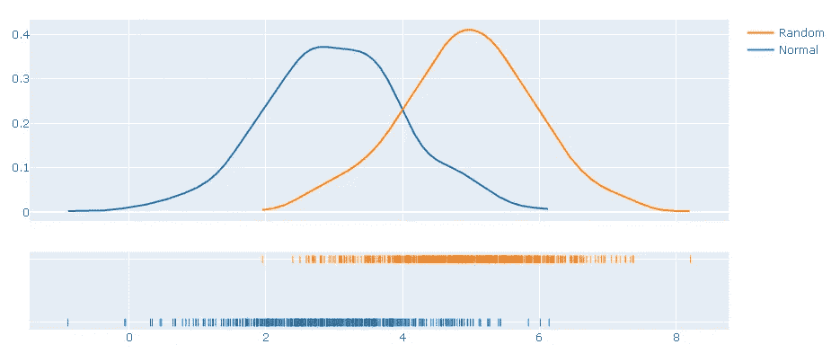

# 使用 Plotly 的交互式分布图

> 原文：<https://towardsdatascience.com/interactive-distribution-plots-with-plotly-ea58efc78885?source=collection_archive---------37----------------------->

## 如何创建信息分布图


照片由[金莎·艾利斯](https://unsplash.com/@kymellis?utm_source=unsplash&utm_medium=referral&utm_content=creditCopyText)在 [Unsplash](https://unsplash.com/s/photos/view?utm_source=unsplash&utm_medium=referral&utm_content=creditCopyText) 上拍摄

Plotly Python (plotly.py)是一个基于 plotly javascript (plotly.js)构建的开源绘图库。 **Plotly express** 是 plotly.py 的一个高级接口，它允许我们创建许多交互式和信息可视化。

在本帖中，我们将使用 plotly express 创建不同类型的**分布图**。分布图是非常有用的工具，广泛用于统计分析以及数据科学项目的探索性数据分析。顾名思义，分布图显示值的分布，并概述更有可能观察到的值、值分布的程度、值更密集的范围等。

我们将首先使用一个数据集，其中包括 Coursera 上课程的基本信息。数据集可在 Kaggle 上的[这里](https://www.kaggle.com/siddharthm1698/coursera-course-dataset)获得。让我们从将数据读入熊猫数据帧开始。

```
import numpy as np
import pandas as pdcoursera = pd.read_csv("coursera_data.csv")
print(coursera.shape)
coursera.head()
```


我们需要做一些数据清理和操作。“未命名:0”列只是一个 ID，因此我们可以删除它。

```
coursera.drop('Unnamed: 0', axis=1, inplace=True)
```

“课程 _ 学生 _ 注册”列的数字格式不正确。比如 5.3k 应该是 5300 等等。有不同的方法来完成这项任务。我们要做的是分离最后的字符，并将其转换为数值(k 代表千，m 代表百万)。然后乘以这些值，得到实际的注册人数。

```
coursera['unit'] = [x.strip()[-1] for x in coursera['course_students_enrolled']]unit_values = {'k':1000, 'm':1000000}
coursera.unit.replace(unit_values, inplace=True)
```


我们还需要从 course_students_enrolled 列中删除字母“k”和“m ”,这可以通过分割字符串以排除最后一个字符来完成。

```
coursera['course_students_enrolled'] = coursera['course_students_enrolled'].str.slice(0, -1)
```

然后我们可以将这两列相乘，创建一个“注册”列。为了能够多重化，两个列都必须具有数字数据类型。

```
coursera['course_students_enrolled'] = coursera['course_students_enrolled'].astype("float")coursera['enrollment'] = coursera['course_students_enrolled'] * coursera['unit']coursera.drop(['course_students_enrolled','unit'], axis=1, inplace=True)coursera.head()
```


让我们首先在注册栏上创建一个基本直方图。为了让图看起来更好，我删除了登记值超过 500k 的离群值。

```
df = coursera[coursera.enrollment < 500000]fig = px.histogram(df, x="enrollment")
fig.show()
```


大多数课程的注册人数不到 10 万。我们还可以检查课程难度对注册是否有任何影响。

```
fig = px.histogram(df, x="enrollment", color="course_difficulty", 
                   facet_col="course_difficulty",
                   title="Course Enrollment Numbers")
fig.show()
```


初级课程的报名人数最多，随着难度的增加，报名人数会减少。然而，在每个难度级别内，有一个相似的分布趋势。

我们可以创建一个类似的图来可视化课程评级。这一次，我们还将 y 轴用于不同的目的。通过将 enrollment 列传递给 y 参数，我们可以看到注册的总人数以及课程评级的分布情况。

```
fig = px.histogram(df, x="course_rating", y="enrollment",
                   color="course_difficulty", 
                   facet_col="course_difficulty",
                   title="Course Ratings")
fig.show()
```


我们可以使用 plotly 的**图形工厂**在一个图形上有多个分布。Numpy 可用于创建具有不同分布类型的合成变量。

```
x1 = np.random.normal(3, size=500)
x2 = np.random.normal(5, size=500)
```

让我们把这些变量放在图上:

```
variables = [x1, x2]labels = ['Normal', 'Random']fig = ff.create_distplot(variables, labels, show_hist=False)
fig.show()
```



我们有两个均值不同的正态分布变量。底部的图被称为“**地毯**”图，这是表示分布的另一种方式。在人口更稠密的地区，垂直线更密集。我们可以通过将 **show_rug** 参数设置为 false 来消除地毯图部分。

另一种表示分布的方式是**箱线图**。让我们回到 Coursera 数据集，使用箱线图来可视化注册人数。

```
fig = px.box(df, y="enrollment", 
             color="course_difficulty", 
             title="Course Enrollment Numbers")
fig.show()
```


Boxplot 给出了一个关于这些值如何分布的概念，同时也指出了异常值。当我们将鼠标悬停在箱线图上时，我们会看到箱线图的临界值，即最小值、第一个四分位数、中值、第三个四分位数、上围栏和最大值。如果没有异常值，那么上栏就是最大值。我们还能够看到异常值。

我们已经用 plotly 介绍了基本分布图。当然，这只是这个神奇的图书馆的一小部分功能。我们可以使用 plotly 动态创建许多其他绘图类型。它的语法也很容易理解。在接下来的帖子中，我会尝试涵盖更复杂的情节。你也可以查看 plotly 文档，我认为它有很多不同的例子。就像任何其他主题一样，熟悉 plotly 的最好方法就是实践。因此，我建议创造大量的情节来提高你的技能。

感谢您的阅读。如果您有任何反馈，请告诉我。