# 使用 Python 中的 Geoviews 进行交互式地理空间数据可视化

> 原文：<https://towardsdatascience.com/interactive-geospatial-data-visualization-with-geoviews-in-python-7d5335c8efd1?source=collection_archive---------5----------------------->

## 如何开始使用 Geoviews 的初学者指南。

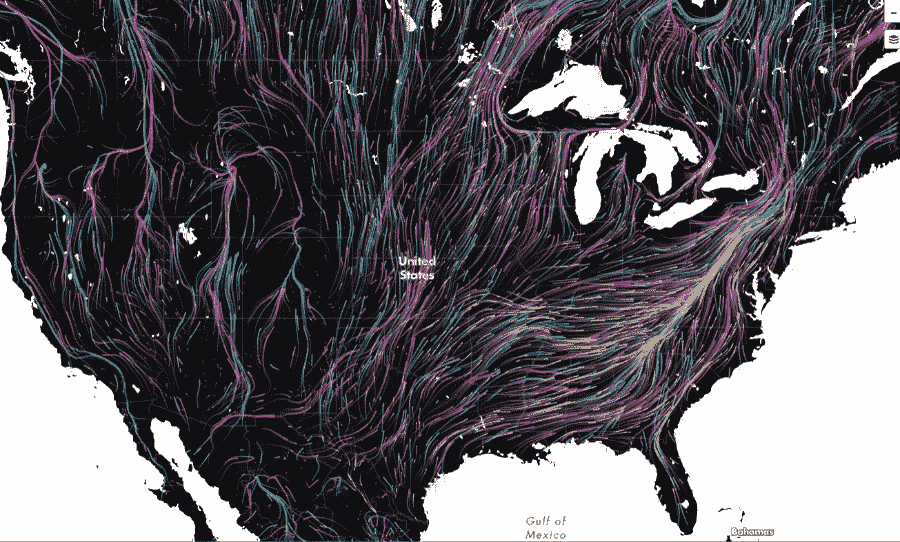

[互动地图](http://maps.tnc.org/migrations-in-motion/#4/19.00/-78.00)

交互式数据可视化已经成为数据科学过程中不可或缺的一部分，以便试验和执行数据科学中的第一个探索过程。在 Python 生态系统中，很少有交互可视化地理数据的选项，但是，我认为 Geoviews 提供了易于使用的高级 API 和广泛的灵活性。

> G [eoViews](https://geoviews.org/#) 是一个 [Python](http://python.org/) 库，它使得探索和可视化地理、气象和海洋数据集变得容易，例如那些用于天气、气候和遥感研究的数据集。

在本教程中，我们将介绍使用 Geoviews 进行交互式地理数据可视化的基本组件。

首先，让我们导入本教程使用的库。

```
import pandas as pd
import geopandas as gpdimport geoviews as gv
import geoviews.feature as gffrom geoviews import opts
from cartopy import crs 
import geoviews.tile_sources as gtsgv.extension(‘bokeh’, ‘matplotlib’)
```

接下来，我们从一个简单的示例开始，展示如何使用 Geoviews 库绘制坐标。

## 点地图

让我们为这四个城市创建一个元组，保存城市的坐标和名称。

```
stockholm = ( 18.070625,59.320462, “Stockholm”)
london = ( -0.135593, 51.507020, “London”)
istanbul = ( 28.981856, 41.008327, “Istanbul”)
mogadishu = ( 45.299626, 2.042388, “Mogadishu”)
```

我们可以使用 Geoviews 功能创建简单的点。我们也可以用熊猫，但也没必要那样。一旦你创建了一个 Geoviews 特征，你可以通过`dframe()`来创建一个数据框，如下所示。

```
cities = gv.Points([stockholm, london, istanbul, mogadishu], vdims=”City”)
cities.dframe()
```

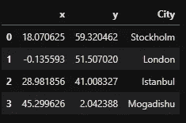

城市积分

现在，我们准备好了我们的第一张地图。你可以简单地调用这些特性，它会绘制点。然而，在这种情况下，我们使用`opts` 选项设置一些属性，如颜色和大小。

```
cities.opts(opts.Points(global_extent=True, width=500, height=475, size=12, color=’black’))
```

下面显示的是点的地图。这是一个简单的情节，以后会修改。然而，我们的点是用它们的纬度和经度绘制的。

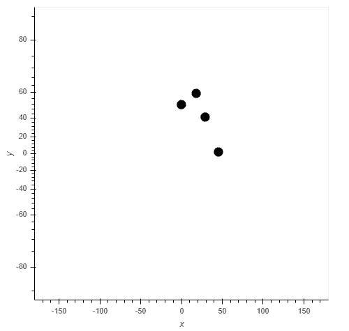

带地理视图的简单地图

然而，这些点缺乏背景，而这正是我们需要底图的地方。在下一节中，我们将看到如何在绘图中包含底图。

## 底图

Geoviews 提供了一些简洁的底图。让我们看看有什么可用的。

```
gv.Layout([ts.relabel(name) for name, ts in gts.tile_sources.items()]).opts(
 ‘WMTS’, xaxis=None, yaxis=None, width=225, height=225).cols(6)
```

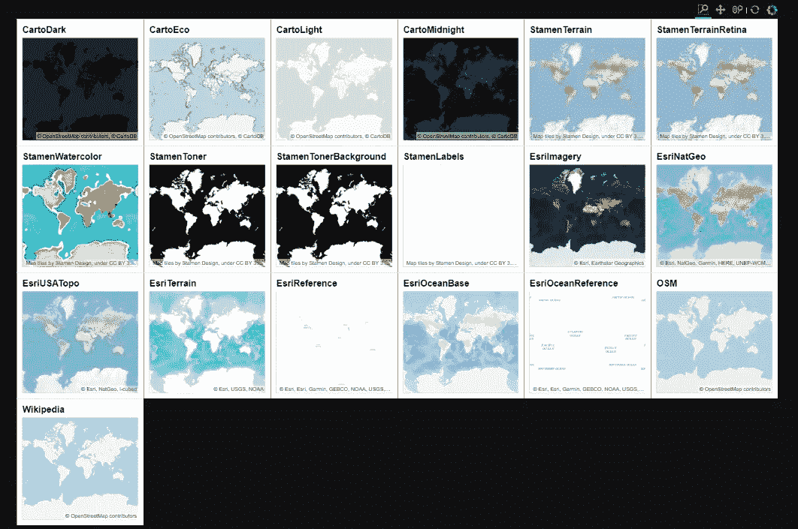

Geoviews 中可用的底图

到目前为止，有 19 种不同的底图可以在 Geoviews 中使用，所以让我们尝试其中的一些。

```
gv.tile_sources.OSM.opts( width=800, height=600)
```

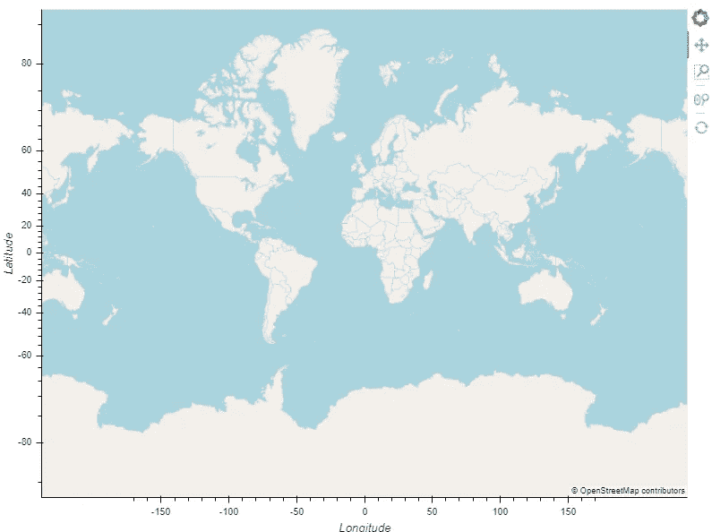

OpenStreetMap 底图

上图显示了全世界的 OpenStreetMap(OSM)底图。虽然它现在是空的，但它是一个交互式地图。

接下来，我们叠加基础地图和我们上面创建的城市点。

```
(gv.tile_sources.CartoDark * cities).opts(opts.Points(global_extent=True, width=800, height=600, size=8, color=’red’))
```

在 Geoviews 中，这与使用*叠加任意两个(或更多)要素一样简单。在我们的例子中，我们覆盖了底图和城市点。

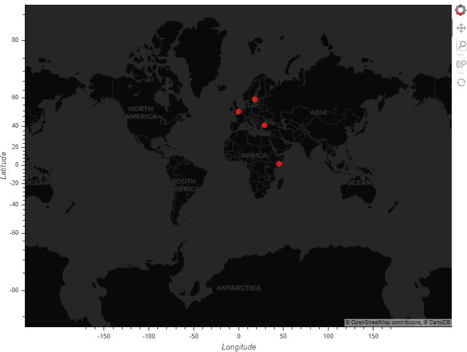

Geoviews 中带有底图的城市点

如上图所示，我们可以看到城市点在底图的帮助下处于正确的位置。在下一节中，我们将介绍地理数据科学中一个非常重要的组成部分——投影。

## 预测

当我们在地图制作中将地球变平时，我们会引入一些扭曲。有不同的预测，有些熟悉，有些不熟悉。让我们看看投影是如何扭曲地图的。

```
projections = [crs.RotatedPole, crs.LambertCylindrical, crs.Geostationary, 
 crs.AzimuthalEquidistant, crs.OSGB, crs.EuroPP, crs.Gnomonic,
 crs.Mollweide, crs.OSNI, crs.Miller, crs.InterruptedGoodeHomolosine,
 crs.SouthPolarStereo, crs.Orthographic, crs.NorthPolarStereo, crs.Robinson,
 crs.LambertConformal, crs.AlbersEqualArea]proj_layout = gv.Layout([gf.coastline.relabel(group=p.__name__).opts(projection=p(), backend=’matplotlib’)
 for p in projections])gv.output(proj_layout, backend=’matplotlib’)
```

下图显示了一些可用的不同投影。

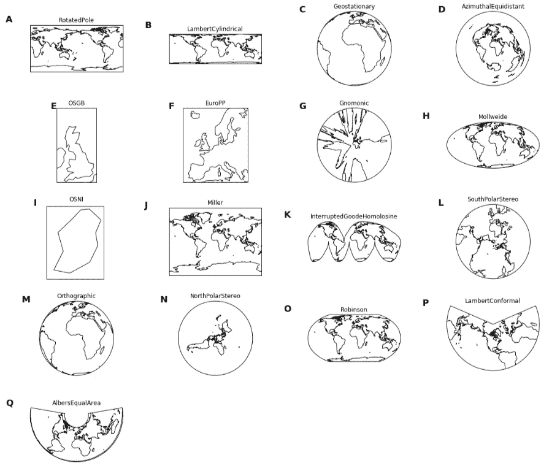

地理预测

我们选择正交(M)投影来可视化失真。但是首先，我们用 Geopandas 读取世界各国的数据。Reviews 与 Geopandas 库很好地集成在一起，可以随时使用。

```
world = gpd.read_file(gpd.datasets.get_path(‘naturalearth_lowres’))
world.head()
```

世界数据包含国家的多边形和一些其他特征，如 pop_estimate、洲等..

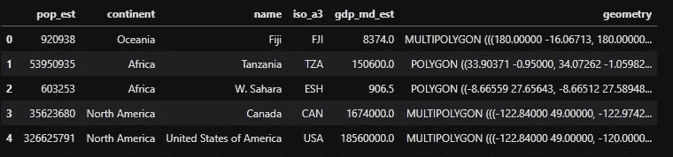

世界人口地理数据框架

要绘制多边形数据，我们只需调用`gv.Polygon()`并传递 Geopandas GeodataFrame。

```
world_poly = gv.Polygons(world).opts(color=”gray”, line_color=”white” ) 
```

我们也创建城市点，但是这次做了一些调整。我们将点的大小减少到 8，并给它一个红色。

```
cities_points = gv.Points(cities).opts(opts.Points(global_extent=True, width=800, height=600, size=8, color=’red’, tools=[‘hover’]))
```

现在，我们可以叠加点和多边形。此外，我们提供了我们希望在`opts`参数中使用的投影。

```
(world_poly * gf.ocean * cities_points).opts(projection=crs.Orthographic(central_longitude=0.1, central_latitude=22), global_extent=True, width=600, tools=[‘hover’])
```

下图描绘了以非洲为中心的正投影。

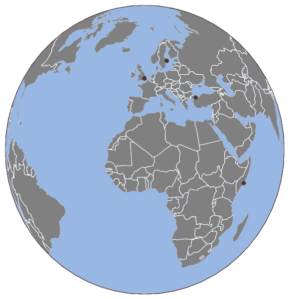

带有城市点的正投影

接下来，我们学习如何用 Geoivews 绘制 Choropoleth 地图

## 等值区域图

您已经看到了如何绘制多边形，我们只添加一个组件来绘制 choropleth 地图。我们只提供希望用于 choropleth 的列的名称。

```
gv.Polygons(world, vdims=[‘name’, ‘pop_est’, ‘gdp_md_est’], label=”World Population”).opts(color=’pop_est’,cmap=’blues’, colorbar=True, xaxis=None, yaxis=None,toolbar=’above’, width=1000, height=700, tools=[‘hover’])
```

下面显示的 choropleth 地图使用蓝色对每个国家的世界人口进行分类。

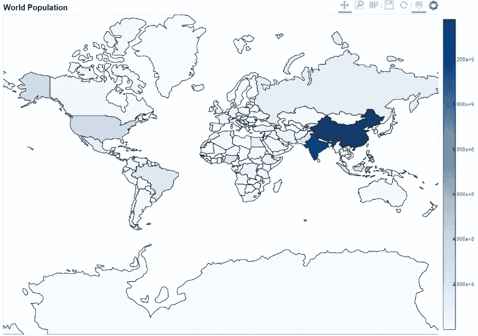

等值区域图

最后，我们将介绍 Geoviews 的一些简洁功能，即交互式小部件。

## 交互式小工具

交互式小部件提供了一些灵活的方法来可视化数据。多亏了 Geoviews，你现在可以用大量复杂的代码创建微件。在本例中，我们学习了如何对数据进行分组并只显示一个组。让我们说，我们想要显示我们想要可视化的大陆。

首先，我们按大陆分组，与`gv.Polygon()`一起策划。

```
coountries_grouped = gv.Polygons(world, vdims=[‘name’, ‘continent’],label=”Continent”).groupby(“continent”) 
```

接下来，我们绘图并提供绘图的宽度和高度选项。

```
continents = coountries_grouped.opts(width=600, height=400, tools=[‘hover’], infer_projection=True)
continents
```

下面的 GIF 展示了只用上面两行代码创建的小部件。图中只显示选定的洲。

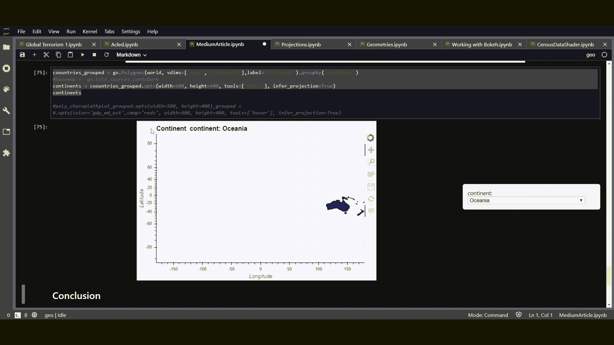

带有地理视图的 GIF 下拉微件

## 结论

在本教程中，我们已经了解了如何使用 Geoviews 交互式打印地理空间数据。本教程涵盖了一些展示 Geoviews 基础知识的示例。你可能会从[官方地理视图图库](https://geoviews.org/gallery/index.html)中找到一些有趣的教程，所以试试吧。

要安装 Geoviews，只需使用 Conda:

```
conda install -c pyviz geoviews
```