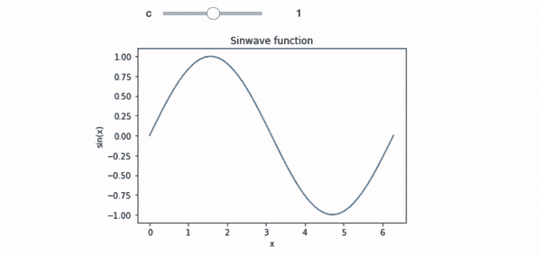
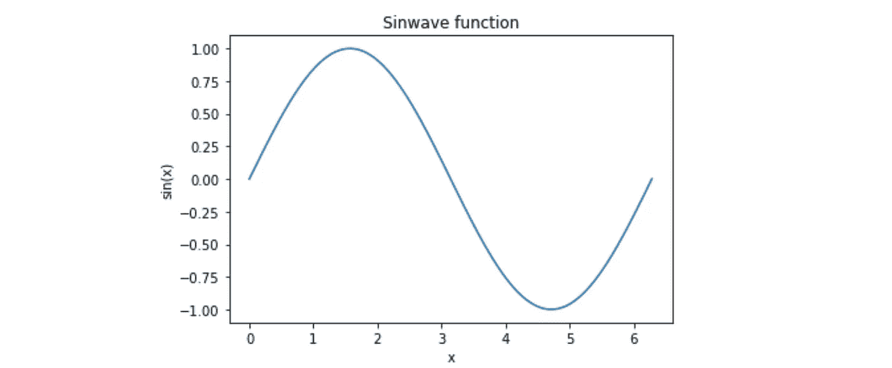

# Python 中的交互式图形

> 原文：<https://towardsdatascience.com/interactive-graphs-in-python-830b1e6c197f?source=collection_archive---------20----------------------->

## Matplotlib 的一个非常快速简单的扩展

Python 是我最喜欢的编程语言，取代了包括 Java 和 C++在内的低级语言以及 Matlab 和 r 等高级语言。除了大量的库及其易于实现之外，主要原因之一是其数据可视化。使用 Matplotlib 和相关的库绘制东西非常直观和容易。在本文中，我想介绍 ipywidgets，它是一个库，可以通过实时更新向您的图形添加一个交互式滑块(如上面的标题图所示)。您将需要安装以下库来阅读本文:

*   *笔记本* —在网络浏览器中显示我们的交互式图表
*   *ipywidgets —* 向我们的图表添加一个交互式滑块
*   *numpy —* 为我们的图表生成点
*   matplotlib——生成我们的图表

首先，让我们创建一个我们想要交互的图表。我将绘制一个正弦波，并添加一个滑块来改变函数的输入。为了创建图表，我将继续使用 linspace 函数在单位圆周围生成点，创建 x 值(输入)和 y 值(输出)。

现在我们已经有效地创建了我们的点集，我们可以使用 Matplotlib 来绘制它们。

显示该图(使用 *plt.show()* )将产生以下图形…

这是一个相当不错的正弦波！但是正如这篇文章的标题所暗示的，我们想让这个互动…

您会注意到我们的原始代码有一些细微的变化。我们包含了 ipywidgets 库中的@interact，并返回我们在正弦波函数中创建的图形。此外，我们还添加了一个新参数 c，默认值为 1。这是将被赋予一个滑块并允许用户与图形交互的值。在这种情况下，我们将正弦波函数的输入乘以 c，允许用户确定所绘制的正弦波的频率。

用 Python 创建交互式图形就是这么简单！您甚至可以通过在图形函数中包含更多参数来改变多个参数，将为每个参数创建一个滑块！当试图在二维空间中可视化多元方程时，这真的很方便。