# 🤖交互式机器学习实验

> 原文：<https://towardsdatascience.com/interactive-machine-learning-experiments-e9b29b0cb7b9?source=collection_archive---------28----------------------->

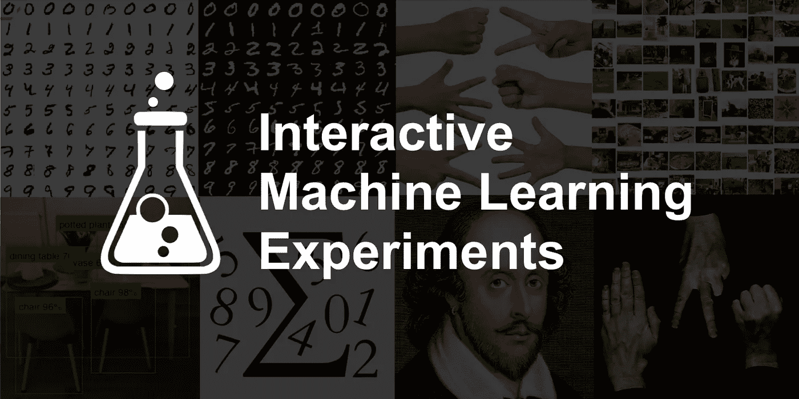

# TL；速度三角形定位法(dead reckoning)

嘿读者们！

我已经开源了新的[🤖GitHub 上的交互式机器学习实验](https://github.com/trekhleb/machine-learning-experiments)项目。每个实验包括🏋️ *Jupyter/Colab 笔记本*(看一个模特是如何被训练的)和🎨*演示页面*(在您的浏览器中查看模型运行情况)。

尽管模型可能有点笨(记住，这些只是实验，而不是生产就绪代码)，但它们会尽力:

*   🖌可以识别您在浏览器中绘制的数字或草图
*   📸检测并识别您要在相机上展示的对象
*   🌅对您上传的图像进行分类
*   📝和你一起写一首莎士比亚的诗
*   ✊🖐✌️和你一起玩石头剪刀布游戏
*   等等。

我已经使用 *TensorFlow 2* 和 *Keras* 支持在 *Python* 上训练了模型，然后使用 *React* 和 *JavaScript* 版本的 *Tensorflow* 在浏览器中使用它们进行演示。

# 模型性能

⚠️首先，让我们设定我们的期望。️该库包含机器学习实验，而不是生产就绪，可重复使用，优化和微调的代码和模型。这更像是一个学习和尝试不同机器学习方法、算法和数据集的沙箱或游乐场。模型可能表现不佳，存在过度拟合/欠拟合的情况。

因此，有时您可能会看到这样的情况:

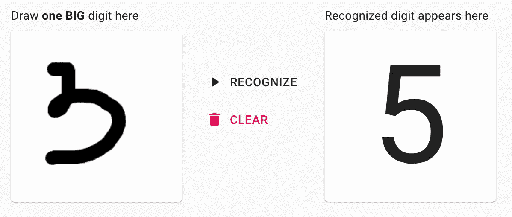

但是要有耐心，有时候模型可能会变得更聪明🤓给你这个:

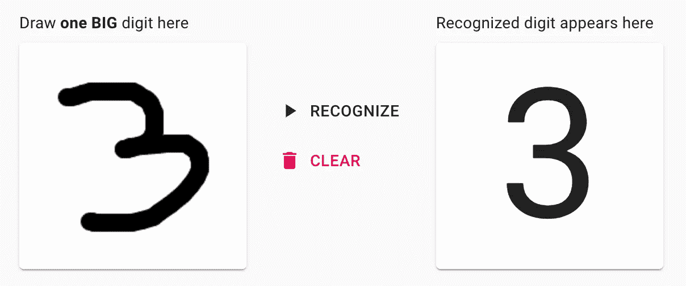

# 背景

我是一名软件工程师，在过去的几年里，我主要从事前端和后端编程。在我的业余时间，作为一种爱好，我决定挖掘机器学习的话题，让它对我自己来说不那么像魔法的*和更像数学*的*。*

1.  🗓因为 Python 可能是开始尝试机器学习的好选择，所以我决定先学习它的基本语法。结果一个[🐍学习 Python 的操场和 cheat sheet](https://github.com/trekhleb/learn-python)项目出来了。这只是为了练习 Python，同时在我需要的时候有一个基本语法的备忘单(比如`dict_via_comprehension = {x: x**2 for x in (2, 4, 6)}`等)。).
2.  🗓学了一点 Python 之后，我想深入研究机器学习背后的基本数学。所以在通过了由吴恩达在 Coursera[上开设的一门很棒的](https://github.com/trekhleb/homemade-machine-learning)[机器学习课程后🤖自制机器学习](https://www.coursera.org/learn/machine-learning)项目出来了。这一次，它是关于创建一个基本的机器学习数学算法的备忘单，如线性回归，逻辑回归，k-means，多层感知器等。
3.  🗓下一个尝试玩基本机器学习数学的是[🤖纳米神经元](https://github.com/trekhleb/nano-neuron)。它是关于 7 个简单的 JavaScript 函数，应该给你一种机器如何真正“学习”的感觉。
4.  🗓在 Coursera 上完成了 Andrew Ng 的另一个令人敬畏的深度学习专业后，我决定用多层感知器、卷积和递归神经网络(CNN 和 RNNs)多练习一点。这一次，我决定开始使用一些机器学习框架，而不是从头开始实现一切。我最后用 [TensorFlow 2](https://www.tensorflow.org/) 搭配 [Keras](https://www.tensorflow.org/guide/keras/overview) 使用。我也不想太专注于数学(让框架为我做这件事)，相反，我想做一些更实际、更适用的东西，一些我可以尝试在我的浏览器上玩的东西。结果新的[🤖交互式机器学习实验](https://github.com/trekhleb/machine-learning-experiments)出来了，我想在这里多描述一点。

# 技术堆栈

# 模特培训

*   🏋🏻‍我用 [Keras](https://www.tensorflow.org/guide/keras/overview) 里面的 [TensorFlow 2](https://www.tensorflow.org/) 进行建模和训练。由于我对机器学习框架毫无经验，我需要从一些东西开始。TensorFlow 的一个卖点是它既有 Python 的风格，又有类似 API 的 JavaScript 风格。所以最终我用 Python 版本做培训，用 JavaScript 版本做演示。
*   🏋🏻‍:我在本地使用 [Jupyter](https://jupyter.org/) 笔记本电脑在 Python 上训练 TensorFlow 模型，有时使用 [Colab](https://colab.research.google.com/) 让训练在 GPU 上更快。
*   💻大多数模型都是在旧 MacBook 的 Pro CPU(2.9 GHz 双核英特尔酷睿 i5)上训练的。
*   🔢当然，你不可能为了矩阵/张量运算而逃离[数字](https://numpy.org/)。

# 模型演示

*   🏋🏻‍:我用 [TensorFlow.js](https://www.tensorflow.org/js) 对之前训练过的模型进行预测。
*   ♻️将 *Keras HDF5* 模型转换为 *TensorFlow.js 图层*格式，我使用了 [TensorFlow.js 转换器](https://github.com/tensorflow/tfjs/tree/master/tfjs-converter)。将整个模型(数兆字节的数据)传输到浏览器，而不是通过 HTTP 请求进行预测，这可能是低效的，但是请再次记住，这些只是实验，而不是生产就绪的代码和架构。我想避免使用专用的后端服务来简化架构。
*   👨🏻‍🎨使用[create-React-app](https://github.com/facebook/create-react-app)starter 在 [React](https://reactjs.org/) 上创建了[演示应用程序](http://trekhleb.github.io/machine-learning-experiments)，并使用默认[流](https://flow.org/en/)风味进行类型检查。
*   💅🏻为了造型，我用了[材质 UI](https://material-ui.com/) 。正如他们所说，这是“一箭双雕”，尝试一种新的风格框架(抱歉， [Bootstrap](https://getbootstrap.com/) 🤷🏻‍).

# 实验

简而言之，您可以通过以下链接访问演示页面和 Jupyter 笔记本:

*   🎨[启动 ML 实验演示](http://trekhleb.github.io/machine-learning-experiments)
*   🏋️ [检查 ML 实验 Jupyter 笔记本](https://github.com/trekhleb/machine-learning-experiments)

# 多层感知器实验(MLP)

> *[*【MLP】*](https://en.wikipedia.org/wiki/Multilayer_perceptron)*多层感知器是一类前馈人工神经网络(ANN)。多层感知器有时被称为“香草”神经网络(由多层感知器组成)，尤其是当它们只有一个隐藏层时。**

## *手写数字识别*

*你画一个数字，模型试图识别它。*

*   *🎨[演示](https://trekhleb.github.io/machine-learning-experiments/#/experiments/DigitsRecognitionMLP)*
*   *🏋️ [在 Jupyter 训练](https://nbviewer.jupyter.org/v2/gh/trekhleb/machine-learning-experiments/blob/master/experiments/digits_recognition_mlp/digits_recognition_mlp.ipynb)*
*   *️🏋️ [在 Colab 的培训](https://colab.research.google.com/github/trekhleb/machine-learning-experiments/blob/master/experiments/digits_recognition_mlp/digits_recognition_mlp.ipynb)*

*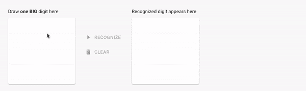*

## *手写草图识别*

*你画了一张草图，模特试图识别它。*

*   *🎨[演示](https://trekhleb.github.io/machine-learning-experiments/#/experiments/SketchRecognitionMLP)*
*   *🏋️ [在 Jupyter 训练](https://nbviewer.jupyter.org/v2/gh/trekhleb/machine-learning-experiments/blob/master/experiments/sketch_recognition_mlp/sketch_recognition_mlp.ipynb)*
*   *️🏋️ [在 Colab 的培训](https://colab.research.google.com/github/trekhleb/machine-learning-experiments/blob/master/experiments/sketch_recognition_mlp/sketch_recognition_mlp.ipynb)*

*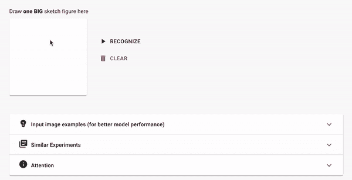*

# *卷积神经网络(CNN)实验*

> **一种* [*卷积神经网络(CNN，或 ConvNet)*](https://en.wikipedia.org/wiki/Convolutional_neural_network) *是一类深度神经网络，最常用于分析视觉图像(照片、视频)。它们被用于检测和分类照片和视频上的物体，风格转换，人脸识别，姿态估计等。**

## *手写数字识别(CNN)*

*你画一个数字，模型试图识别它。这个实验类似于 MLP 的实验，但是它使用了 CNN。*

*   *🎨[演示](https://trekhleb.github.io/machine-learning-experiments/#/experiments/DigitsRecognitionCNN)*
*   *🏋️ [在 Jupyter 训练](https://nbviewer.jupyter.org/v2/gh/trekhleb/machine-learning-experiments/blob/master/experiments/digits_recognition_cnn/digits_recognition_cnn.ipynb)*
*   *️🏋️ [在 Colab 的训练](https://colab.research.google.com/github/trekhleb/machine-learning-experiments/blob/master/experiments/digits_recognition_cnn/digits_recognition_cnn.ipynb)*

**

## *手写草图识别(CNN)*

*你画了一张草图，模特试图识别它。这个实验类似于 MLP 的实验，但是它使用了 CNN。*

*   *🎨[演示](https://trekhleb.github.io/machine-learning-experiments/#/experiments/SketchRecognitionCNN)*
*   *🏋️ [在 Jupyter 训练](https://nbviewer.jupyter.org/v2/gh/trekhleb/machine-learning-experiments/blob/master/experiments/sketch_recognition_cnn/sketch_recognition_cnn.ipynb)*
*   *️🏋️ [在 Colab 的培训](https://colab.research.google.com/github/trekhleb/machine-learning-experiments/blob/master/experiments/sketch_recognition_cnn/sketch_recognition_cnn.ipynb)*

**

## *石头剪刀布(CNN)*

*你和模特玩石头剪子布游戏。这个实验使用的是从零开始训练的 CNN。*

*   *🎨[演示](https://trekhleb.github.io/machine-learning-experiments/#/experiments/RockPaperScissorsCNN)*
*   *🏋️ [在 Jupyter 训练](https://nbviewer.jupyter.org/v2/gh/trekhleb/machine-learning-experiments/blob/master/experiments/rock_paper_scissors_cnn/rock_paper_scissors_cnn.ipynb)*
*   *️🏋️ [在 Colab 的培训](https://colab.research.google.com/github/trekhleb/machine-learning-experiments/blob/master/experiments/rock_paper_scissors_cnn/rock_paper_scissors_cnn.ipynb)*

*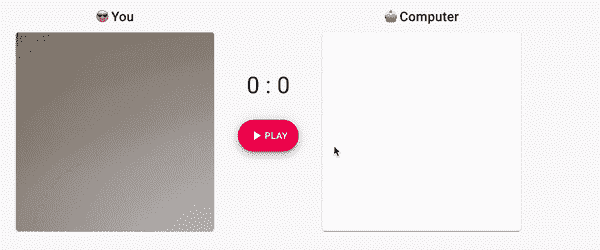*

## *石头剪刀布(MobilenetV2)*

*你和模特玩石头剪子布游戏。该模型使用迁移学习，基于 [MobilenetV2](https://www.tensorflow.org/api_docs/python/tf/keras/applications/MobileNetV2) 。*

*   *🎨[演示](https://trekhleb.github.io/machine-learning-experiments/#/experiments/RockPaperScissorsMobilenetV2)*
*   *🏋️ [在 Jupyter 训练](https://nbviewer.jupyter.org/v2/gh/trekhleb/machine-learning-experiments/blob/master/experiments/rock_paper_scissors_mobilenet_v2/rock_paper_scissors_mobilenet_v2.ipynb)*
*   *️🏋️ [在 Colab 的训练](https://colab.research.google.com/github/trekhleb/machine-learning-experiments/blob/master/experiments/rock_paper_scissors_mobilenet_v2/rock_paper_scissors_mobilenet_v2.ipynb)*

*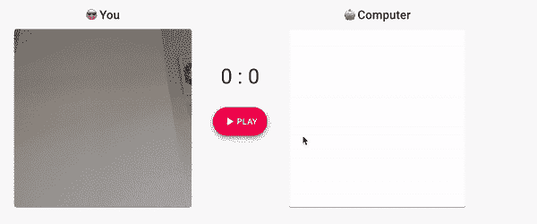*

## *对象检测(MobileNetV2)*

*你通过你的相机向模型展示你的环境，它会试图检测和识别物体。这个模型使用迁移学习，基于 [MobilenetV2](https://www.tensorflow.org/api_docs/python/tf/keras/applications/MobileNetV2) 。*

*   *🎨[演示](https://trekhleb.github.io/machine-learning-experiments/#/experiments/ObjectsDetectionSSDLiteMobilenetV2)*
*   *🏋️ [在 Jupyter 训练](https://nbviewer.jupyter.org/v2/gh/trekhleb/machine-learning-experiments/blob/master/experiments/objects_detection_ssdlite_mobilenet_v2/objects_detection_ssdlite_mobilenet_v2.ipynb)*
*   *️🏋️ [在 Colab 的培训](https://colab.research.google.com/github/trekhleb/machine-learning-experiments/blob/master/experiments/objects_detection_ssdlite_mobilenet_v2/objects_detection_ssdlite_mobilenet_v2.ipynb)*

*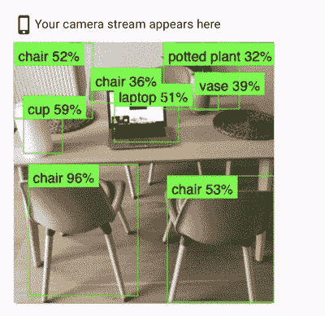*

## *图像分类(MobileNetV2)*

*你上传一张图片，模型试图根据它在图片上“看到”的东西对它进行分类。这个模型使用迁移学习，基于 [MobilenetV2](https://www.tensorflow.org/api_docs/python/tf/keras/applications/MobileNetV2) 。*

*   *🎨[演示](https://trekhleb.github.io/machine-learning-experiments/#/experiments/ImageClassificationMobilenetV2)*
*   *🏋️ [在 Jupyter 训练](https://nbviewer.jupyter.org/v2/gh/trekhleb/machine-learning-experiments/blob/master/experiments/image_classification_mobilenet_v2/image_classification_mobilenet_v2.ipynb)*
*   *️🏋️ [在 Colab 的培训](https://colab.research.google.com/github/trekhleb/machine-learning-experiments/blob/master/experiments/image_classification_mobilenet_v2/image_classification_mobilenet_v2.ipynb)*

*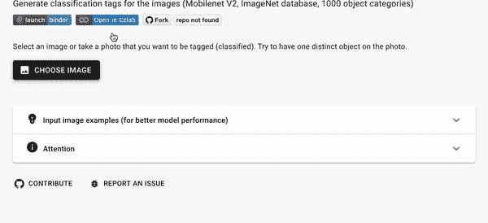*

# *递归神经网络实验(RNN)*

> **A* [*递归神经网络(RNN)*](https://en.wikipedia.org/wiki/Recurrent_neural_network) *是一类深度神经网络，最常用于基于序列的数据，如语音、声音、文本或音乐。它们用于机器翻译、语音识别、语音合成等。**

## *数字求和*

*你输入一个求和表达式(即`17+38`)，模型预测结果(即`55`)。这里有趣的部分是，该模型将输入视为一个*序列*，这意味着它知道当你键入一个序列`1` → `17` → `17+` → `17+3` → `17+38`时，它会将其“翻译”到另一个序列`55`。你可以把它想象成把西班牙语`Hola`序列翻译成英语`Hello`。*

*   *🎨[演示](https://trekhleb.github.io/machine-learning-experiments/#/experiments/NumbersSummationRNN)*
*   *🏋️ [在 Jupyter 训练](https://nbviewer.jupyter.org/v2/gh/trekhleb/machine-learning-experiments/blob/master/experiments/numbers_summation_rnn/numbers_summation_rnn.ipynb)*
*   *️🏋️ [在 Colab 的培训](https://colab.research.google.com/github/trekhleb/machine-learning-experiments/blob/master/experiments/numbers_summation_rnn/numbers_summation_rnn.ipynb)*

*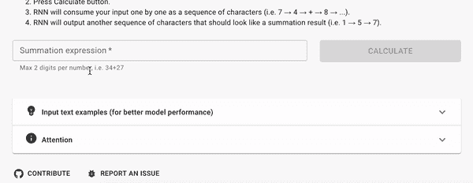*

## *莎士比亚文本生成*

*你开始像莎士比亚一样键入一首诗，模型会像莎士比亚一样继续它。至少它会尝试这样做😀。*

*   *🎨[演示](https://trekhleb.github.io/machine-learning-experiments/#/experiments/TextGenerationShakespeareRNN)*
*   *🏋️ [在 Jupyter 训练](https://nbviewer.jupyter.org/v2/gh/trekhleb/machine-learning-experiments/blob/master/experiments/text_generation_shakespeare_rnn/text_generation_shakespeare_rnn.ipynb)*
*   *️🏋️ [在 Colab 的培训](https://colab.research.google.com/github/trekhleb/machine-learning-experiments/blob/master/experiments/text_generation_shakespeare_rnn/text_generation_shakespeare_rnn.ipynb)*

*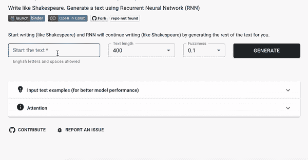*

## *维基百科文本生成*

*你开始键入一篇维基文章，模型试图继续下去。*

*   *🎨[演示](https://trekhleb.github.io/machine-learning-experiments/#/experiments/TextGenerationWikipediaRNN)*
*   *🏋️ [在 Jupyter 训练](https://nbviewer.jupyter.org/v2/gh/trekhleb/machine-learning-experiments/blob/master/experiments/text_generation_wikipedia_rnn/text_generation_wikipedia_rnn.ipynb)*
*   *️🏋️ [在 Colab 的训练](https://colab.research.google.com/github/trekhleb/machine-learning-experiments/blob/master/experiments/text_generation_wikipedia_rnn/text_generation_wikipedia_rnn.ipynb)*

*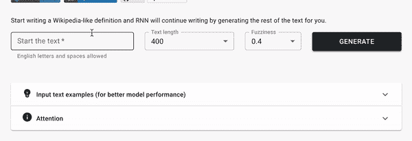*

# *未来计划*

*正如我上面提到的，[库](https://github.com/trekhleb/machine-learning-experiments)的主要目的是更像一个学习的游乐场，而不是生产就绪模型。因此，主要计划是继续学习和试验深度学习挑战和方法。下一个有趣的挑战可能是:*

*   *情绪检测*
*   *风格转移*
*   *语言翻译*
*   *生成图像(即手写数字)*
*   *等等。*

*另一个有趣的机会是调整现有的模型，使它们更有性能。我相信它可能会更好地理解如何克服过度拟合和欠拟合，以及如果模型只是停留在训练集和验证集的`60%`精度水平上，而不想再改进的话，该如何处理模型🤔。*

*不管怎样，我希望你能从[资源库](https://github.com/trekhleb/machine-learning-experiments)中找到一些对模型训练有用的见解，或者至少能从演示中获得一些乐趣！*

*快乐学习！🤖*