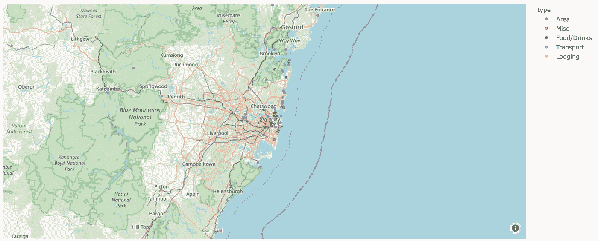
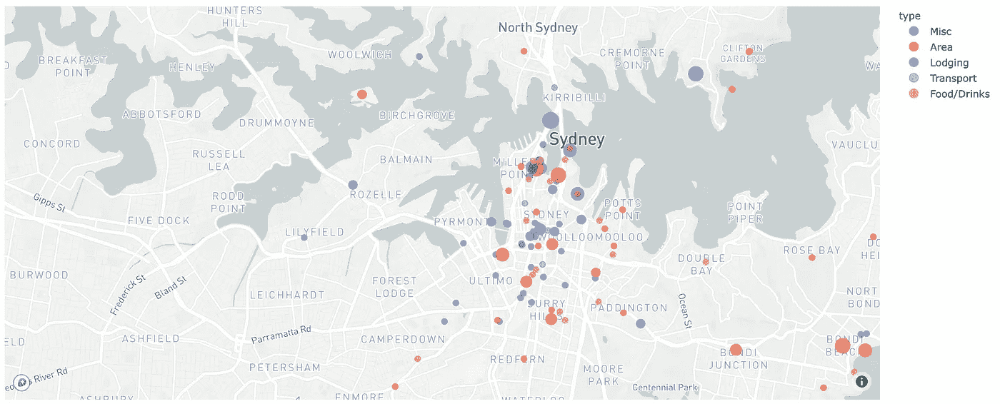
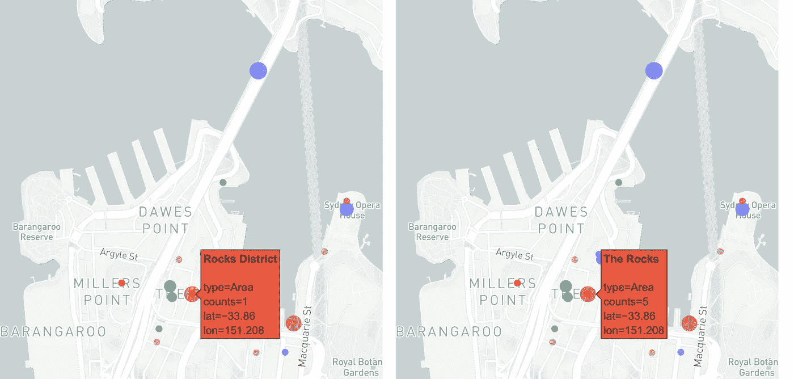
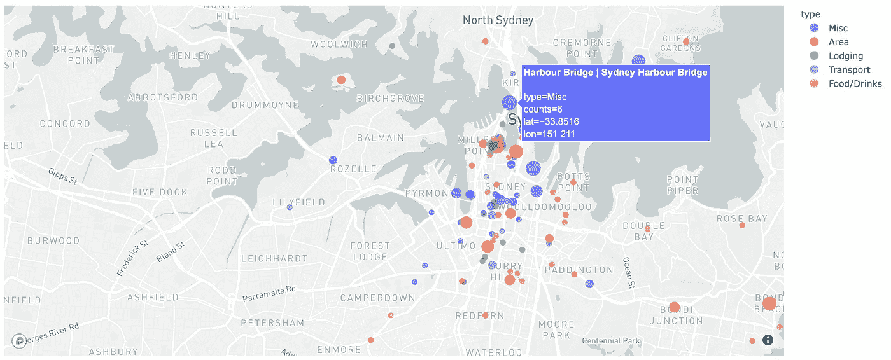
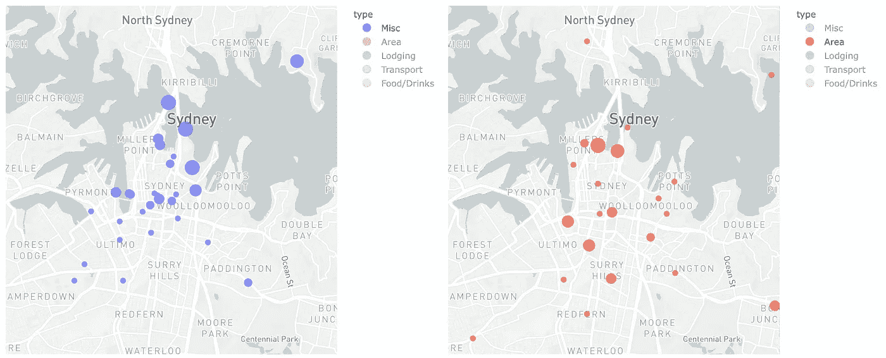

# Python、Pandas 和 Plotly 的交互式地图

> 原文：<https://towardsdatascience.com/interactive-maps-with-python-pandas-and-plotly-following-bloggers-through-sydney-c24d6f30867e?source=collection_archive---------12----------------------->

## 跟随博主在悉尼的足迹

在这篇文章和其他几篇文章中，我将探索 Python 和 Plotly，把一些不同的看起来很棒的图表放在一起。Plotly.js 是一个基于 Javascript 的可视化库，由一家名为 Plotly 的公司构建，他们也为各种语言提供了包装器，包括一个名为… plotly 的 python 包装器。

尽管它们的命名模式不尽如人意，但它们确实构建了一个非常强大、但仍非常可定制的库，我很想探索它能做什么。

> *你可以跟随我使用的源代码和数据，从这个* [*GitLab 库*](https://gitlab.com/jphwang/online_articles) *。*

# 位置，位置，位置

经常看文章，像美食博客，或者旅游博客，想:*这些地方到底在哪里*？

在去年的圣诞假期，我有机会和我的伴侣一起回到悉尼，她从未去过澳大利亚，更不用说悉尼了。我来自悉尼，我想帮助她看到悉尼的“最好”，并像我们许多人一样欣赏它。

所以我读了一些旅游博客，看看第一次来的游客喜欢悉尼的什么。我突然意识到这样做会让游客很容易搞不清东西在哪里，哪些景点值得一看。计划每一天的日程将是一件痛苦的事，因为永远不清楚一个地方与另一个地方相比有多远。

我的解决方案是绘制一张地图，心中有三个目标:

*   第一，建立一个互动地图，包括每一个标记的位置。
*   第二，地图会有不同的标记来表示位置的类型。无论它是一个地标，一个位置(像一个郊区)，还是一个交通枢纽。
*   第三，显示有多少博客提到了这个位置，这样我们就可以筛选出更“重要”的。

Plotly 有我定制的可视化库。我已经看到它包含了一个惊人的地图框集成，这是我以前没有尝试过的。所以我想我会一石二鸟。

# 在开始之前

我假设您熟悉 python。即使你相对较新，这个教程也不应该太难。

你需要用一个简单的`pip install [PACKAGE_NAME]`将`pandas`和`plotly`安装到你的虚拟环境中。

如果你没有地图框令牌，[给他们设置一个](https://www.mapbox.com)——我们会需要它。他们提供了一个非常自由的帐户，有非常合理的访问限制。

我将密钥保存在一个文件中，并使用以下命令加载它:

```
with open('mapbox_tkn.txt', 'r') as f: 
    mapbox_key = f.read().strip()
```

# 地图很有趣

## 介绍

尽管使用了 NLP 工具，整理这些信息还是有点困难，因为人们坚持在博客上拼错名字，或者只是用不同的名字称呼事物。(‘海港大桥’还是‘悉尼港湾大桥’？维多利亚女王大厦还是 QVB？)

本教程侧重于情节，而不是刮，所以我会提供`loc_data.csv`(所有数据和脚本可在我的 [repo 这里](https://gitlab.com/jphwang/online_articles))。该文件包含我们要查看的所有独特位置的数据。每个博客的数据都包含在名为`blog_file[N].csv`的`data_csvs`子目录中。

将 csv 文件加载到数据帧中，并查看其内容:

```
loc_df = pd.read_csv('mapping_blogs/loc_data.csv', index_col=0) print(loc_df.head())
```

您将看到有五列:索引、位置、纬度、经度和类型。

它们是索引号、位置名称字符串、以小数表示的纬度和经度以及位置类型。

## 数据清理

第一次检查时,“类型”列看起来是绝对的。一列中的所有唯一值都可以通过`loc_df.type.unique()`进行整理。它显示的是`['Area', nan, 'Food/Drinks', 'Transport', 'Lodging']`。的确如此！我记得 NaN 值是那些我无法归类的值。先给它们起个名字，`Misc`为杂。

最简单的方法是使用 pandas 的`.fillna`方法和`inplace`参数。`loc_df.type.fillna('Misc', inplace=True)`将完成此操作，并填入任何 NaN 值。

## 我们的第一张地图

到这个阶段，我们实际上已经有足够的信息来设计一些东西了！通过 plotly 的魔力，我们只需要为我们的第一张地图添加以下代码行:

```
import plotly.express as px 
fig = px.scatter_mapbox(loc_df, lat="lat", lon="lon", color="type")
fig.update_layout(mapbox_style="open-street-map") 
fig.show()
```



我们的第一张地图！

类似这样的东西应该已经在你的浏览器上(或者在你的 Jupyter 笔记本上)打开了。是不是很酷？仅仅用了三行代码就画出了这个。Plotly Express 可以更快地创建情节。地图是交互式的，因此可以通过单击图例来缩放、平移、查看标记和隔离每个地块。

我们在这里做的是将整个数据帧传递给`.scatter_mapbox`函数，并指定数据所在的列。然后我们使用`update_layout`指定`open-street-map`样式(本指南中的[列出了可用的样式)。](https://plot.ly/python/mapbox-layers/)

如果您想知道我们是如何将之前加载的`mapbox_key`变量传递给 Plotly 的，答案是我们没有。使用`open-street-map`风格意味着不需要地图框键，开放街道地图是一个免费的合作项目。

现在我们知道了如何制作一个基本的地图，让我们进入杂草中，仔细观察数据，并添加一些附加功能。

# 严肃的映射

## 鼠标悬停

在玩地图的时候，你可能注意到了鼠标悬停工具提示。它们很棒，但不是特别有用。所以让我们解决这个问题。我们想看看这个地方的名字，不太在乎确切的坐标。让我们指定参数`hover_name='location'`，而不是`hover_data=['type']`。

我还认为彩色地图有点分散了叠加的注意力，所以我把地图框样式改成了`light`，现在我们需要提供地图框键。最后，当我对悉尼市区最感兴趣的时候，我认为地图一开始就太高了。因此，让我们通过指定`zoom`参数来更改默认的映射区域。代码和生成的地图如下:

```
fig = px.scatter_mapbox(loc_df, lat="lat", lon="lon", color="type", hover_name='location', hover_data=['type'], zoom=12) 
# Now using Mapbox 
fig.update_layout(mapbox_style="light", mapbox_accesstoken=mapbox_key) 
fig.show()
```


鼠标悬停弹出窗口很棒，但是(还)不太能提供信息

好吧，这是一个巨大的进步。现在我们已经实现了三个目标中的两个。对于最后一个，我们将不得不编译位置的计数。所以，回到数据框架。

## 寻找最受欢迎的目的地

我想看看哪些目的地或地点最受博客作者的欢迎。因此，在本节中，我们将统计每个位置被包含的次数。

第一步是统计主列表中的哪些位置在每个博客中，并对结果数据帧进行排序:

```
data_dir = 'data_csvs' 
data_files = [i for i in os.listdir(data_dir) if i.endswith('.csv')] for csv_file in data_files: 
    with open(os.path.join(data_dir, csv_file), 'r') as f: 
        locs_txt = f.read() 
    temp_locs = locs_txt.split('\n') 
    locs_bool = [loc_in_list(i, temp_locs) for i in list(loc_df['location'])] 
    loc_df = loc_df.assign(**{csv_file: locs_bool}) loc_df = loc_df.assign(counts=loc_df[data_files].sum(axis=1))
loc_df.sort_values(by='counts', inplace=True, ascending=False)
```

`loc_in_list`函数是我写的用来比较位置名称和列表的东西，考虑了包括/省略单词‘the’和各种撇号/引号的各种组合。

```
def loc_in_list(loc, loc_list): loc_list = list(set([i.strip().lower() for i in loc_list if len(i.strip().lower()) > 0])) 
loc_list += ['the ' + i for i in loc_list if i[:4] != 'the '] 
loc_list += [i[4:] for i in loc_list if i[:4] == 'the '] for t_char in ["'", "-"]: 
    loc_list += [i.replace(t_char, "") for i in loc_list if t_char in i] 
    loc_list += [i.replace(t_char, " ") for i in loc_list if t_char in i] loc = loc.replace("'", "'") 
loc = loc.strip().lower() loc_in_list_bool = (loc in loc_list) or (loc.replace("'", "") in loc_list) return loc_in_list_boolprint(loc_df.head())
```

再次查看数据帧，看起来我们得到了一个按出现次数排序的数据帧。《海港大桥》在每个榜单上都出现了 6 个！

我们可以添加一个`sizing`参数(和`max_size`来控制符号大小)，并再次绘制地图:

```
fig = px.scatter_mapbox( loc_df, lat="lat", lon="lon", color="type", size="counts", hover_name='location', hover_data=['type'], zoom=12, size_max=15) 
fig.update_layout(mapbox_style="light", mapbox_accesstoken=mapbox_key) 
fig.show()
```



# 重叠位置

你们当中眼尖的人可能已经注意到了这些重叠的位置。



对于像这样的地方，我将查看重叠的位置，只查看计数较高的名称的位置。

我简单地遍历每一行，寻找距离小于阈值的行:

```
loc_df = loc_df.assign(dup_row=0) 
loc_thresh = 0.0001 for i in range(len(loc_df)): 
    src_ind = loc_df.iloc[i].name 
    for j in range(i+1, len(loc_df)): 
        tgt_ind = loc_df.iloc[j].name 
        lat_dist = loc_df.loc[src_ind]['lat'] - loc_df.loc[tgt_ind]['lat'] 
        lon_dist = loc_df.loc[src_ind]['lon'] - loc_df.loc[tgt_ind]['lon'] 
        tot_dist = (lat_dist ** 2 + lon_dist ** 2) ** 0.5 
        if tot_dist < loc_thresh: 
            print(f'Found duplicate item "{loc_df.loc[tgt_ind]["location"]}", index {tgt_ind}') 
            for csv_file in data_files: 
                if loc_df.loc[tgt_ind, csv_file]: 
                    loc_df.loc[src_ind, csv_file] = True 
                if loc_df.loc[tgt_ind, 'location'] not in loc_df.loc[src_ind, 'location']: 
                    loc_df.loc[src_ind, 'location'] = loc_df.loc[src_ind, 'location'] + ' | ' + loc_df.loc[tgt_ind, 'location'] 
                    loc_df.loc[tgt_ind, 'dup_row'] = 1 loc_df = loc_df[loc_df.dup_row == 0] 
loc_df = loc_df.assign(counts=loc_df[data_files].sum(axis=1))
loc_df.sort_values(by='counts', inplace=True, ascending=False)
```

现在可以绘制数据了！我还关闭了显示栏和禁用编辑，这是我在所有绘图中使用的。

```
fig = px.scatter_mapbox(loc_df, lat="lat", lon="lon", color="type", size="counts", hover_name='location', hover_data=['type'], zoom=12, size_max=15) 
fig.update_layout(mapbox_style="light", mapbox_accesstoken=mapbox_key) 
fig.show( config={ 'displayModeBar': False, 'editable': False, }, )
```



看那个——桥上的点已经被连接起来，名字彼此相加，计数增加了！

因此，我们有一个交互式的，可按类别过滤的工具提示！



这就完成了这篇关于在地图上绘制散点图的文章。希望你对此感兴趣。

如果你喜欢这个，比如说👋/在 [twitter](https://twitter.com/_jphwang) 上关注，或关注更新。