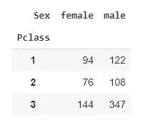
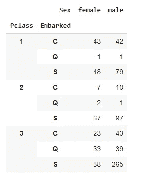
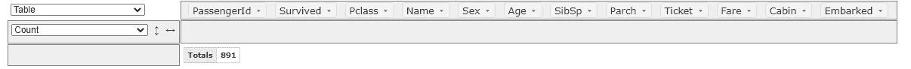
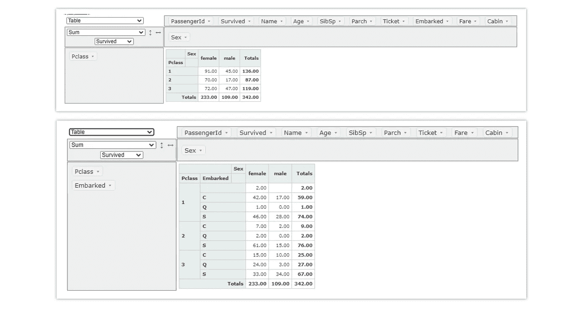
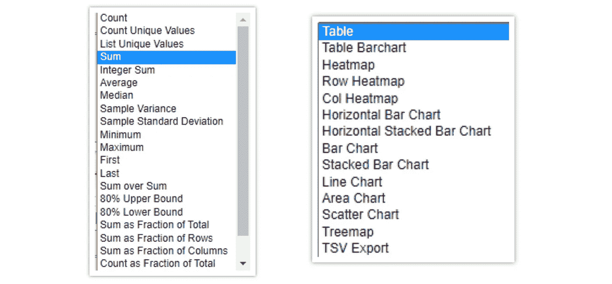
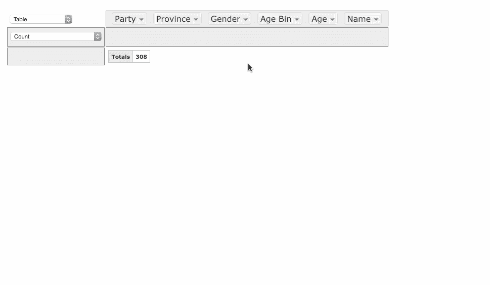

# Jupyter 笔记本中的交互式数据透视表

> 原文：<https://towardsdatascience.com/interactive-pivot-tables-in-jupyter-notebook-fc74bad8aa67?source=collection_archive---------11----------------------->

## 使用 PivotTable.js 创建交互式数据透视表


图片由 [Pixabay](https://pixabay.com/?utm_source=link-attribution&amp;utm_medium=referral&amp;utm_campaign=image&amp;utm_content=341147) 的 [Mudassar Iqbal](https://pixabay.com/users/kreatikar-8562930/?utm_source=link-attribution&amp;utm_medium=referral&amp;utm_campaign=image&amp;utm_content=341147) 提供

Python 在很短的时间内获得了普及，但在某些情况下，它与数据的交互还不够，这正是 excel 领先的地方。对于模型的开发，最初的步骤是数据理解和探索性数据分析(EDA)。

对于 EDA，你需要灵活处理数据的能力。在创建数据透视表的情况下，Python 在与数据交互方面有所欠缺。在创建数据透视表方面，Excel 处于领先地位，因为它提出了表格的交互式和动态开发。

在 pandas 中创建数据透视表是一个燃烧过程。数据透视表的结构需要提前决定，相应地，脚本需要开发。要在数据透视表中进行一些操作，需要再次更改代码并运行脚本。这是一个燃烧过程，以产生洞察力，从而继续进行模型构建。

```
**pd.pivot_table(df, 
               values='Survived',
               index=['Pclass'],
               columns=['Sex'],
               aggfunc='sum'
              )**
```



```
**pd.pivot_table(df, 
               values='Survived',
               index=['Pclass','Embarked'],
               columns=['Sex'],
               aggfunc='sum'
              )**
```



数据透视表用于在 EDA 过程中获得关于数据的见解，要在 pandas 中生成数据透视表，需要为每个表操作代码，这使它有点燃烧。

在这里，PivotTable.js 发挥了作用，它有助于创建交互式数据透视表。

# 数据透视表. js:

**PivotTable.js** 是一个开源的 Javascript 数据透视表(又名**数据透视网格、数据透视图表、交叉选项卡**)实现，具有**拖放**功能。

## 安装:

```
**pip install pivottablejs**
```

## 用法:

(作者代码)



(图片由作者提供)，泰坦尼克号数据集的初始交互界面

现在尝试生成与本文前面使用 pandas 开发的相同的数据透视表。



(图片由作者提供)，

## 特点:

*   PivotTable.js 提供了从下拉列表中选择聚合函数的权限。
*   数据透视表和热图的不同表示。
*   几种类型的图，包括条形图、堆积条形图、折线图、面积图、散点图、树状图等。



(图片由作者提供)

# 使用结果:



([来源](https://pivottable.js.org/examples/))

# 结论:

在工作流中包含 PivotTable.js 使我们能够轻松地生成关于数据的见解。这个库提供了从数据透视表实时生成几个图的特性，这使我们能够在数据争论期间加快工作速度。

你可以在这里找到 PivotTable.js 的 GitHub 库。

# 参考资料:

[1] PivotTable.js 示例:【https://pivottable.js.org/examples/ T2

> 感谢您的阅读