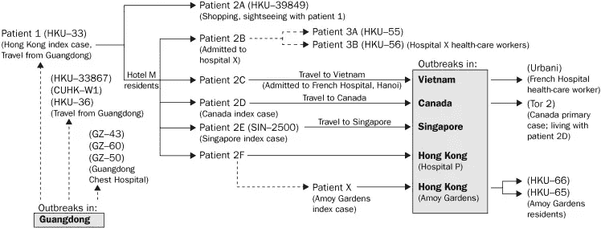
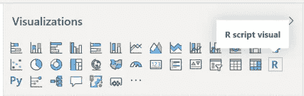
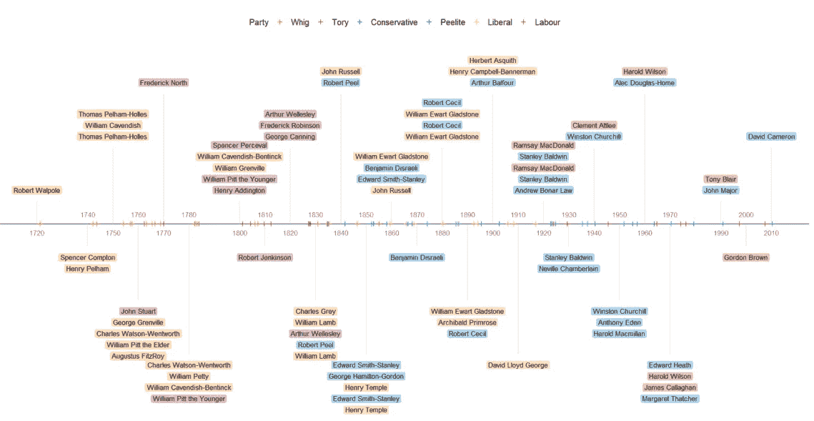
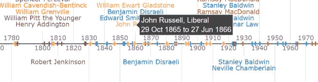
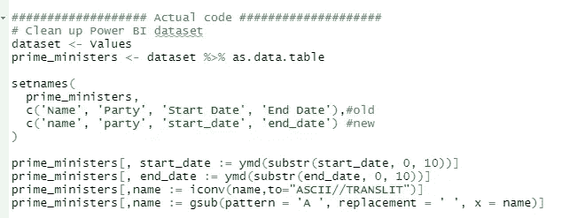
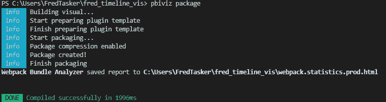
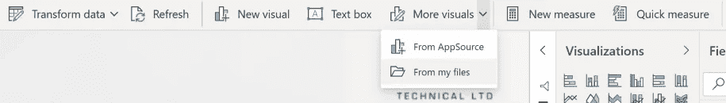
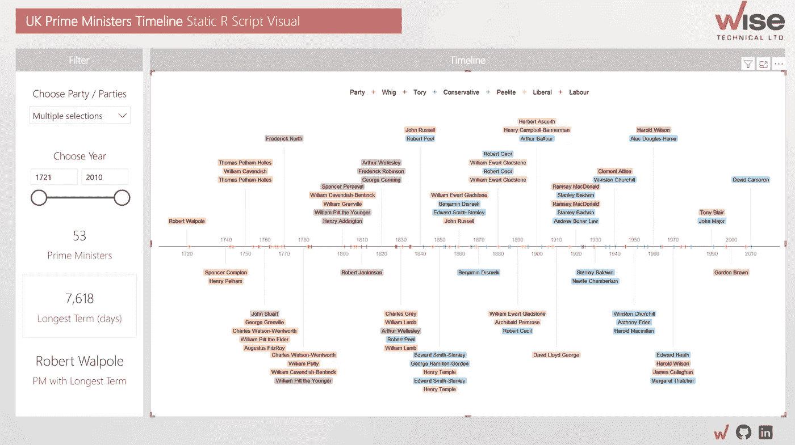

# 交互式 Power BI 定制视觉效果，带 R

> 原文：<https://towardsdatascience.com/interactive-power-bi-custom-visuals-with-r-a6a4ac998710?source=collection_archive---------10----------------------->

## 使用 ggplot、plotly 和 Power BI CLI 实现交互式视觉效果

有时候，正确的权力 BI 视觉就是不存在。最近，在尝试创建项目管理数据的执行摘要时，我碰到了这堵墙。

这个想法是一个报告页面，它将成为用户的首页——在他们进入其他报告页面的细节之前的一个快速路标，并且可以很容易地转换成演示文稿中的幻灯片。精简甘特图的尝试都是混乱而笨拙的。



2003 年 SARS 爆发的一个很好的例子，因果联系的信息可能是强大的，但项目管理数据经常会使计算机屏幕超载。[引起严重急性呼吸综合征的新型冠状病毒的分子流行病学(The Lancet)](https://www.thelancet.com/journals/lancet/article/PIIS0140-6736(03)15259-2/fulltext)

# Power BI R 脚本可视化

经过一番深思熟虑(玩)，一个基本的水平时间线似乎工作得很好。它将关注项目里程碑，使用颜色来描述项目状态，并尽最大努力使项目相关文本尽可能易读。



R script 可视化，开发快速，可定制(有时令人恼火)

在[微软的 AppSource](https://appsource.microsoft.com/en-GB/marketplace/apps?product=power-bi-visuals) 中似乎没有现成的可视化工具可以做到这一点，所以转向了 R Script 可视化工具。有了一点 R 知识，这些可以快速开发，并允许使用无限定制的 ggplot 来得到你想要的样子(注意，其他 R 绘图包是可用的)。



事情是这样结束的。项目数据已经被英国首相取代，项目状态颜色现在告诉我们他们属于哪个政党。这在你下一次变焦测验中可能会很有用。[代码在这里](https://github.com/fredwise/PM_timeline/blob/master/pm_timeline_ggplot.R)。感谢 [Ben Alex Keen，](https://benalexkeen.com/creating-a-timeline-graphic-using-r-and-ggplot2/)他有一篇关于在 r 中构建这种时间线的精彩文章。

正如预期的那样，R 视觉进入了报告。从直接在 R 中访问 JSON 数据转移到处理来自 Power BI R Script Visual 的数据需要一些变量重命名和格式化。视觉系统[的 Power BI 友好代码在这里](https://github.com/fredwise/PM_timeline/blob/master/pm_timeline_ggplot_powerbi.R)。

这些 R 图唯一缺少的是一点交互性。你可以使用 Power BI 的切片器和过滤器来限制数据进入，但你不能悬停在上面并获得工具提示，或者放大感兴趣的部分。

# Plotly

多亏了 [plotly 包](https://plotly.com/r/)，我们可以将我们的 ggplot 对象转换成一些 html，并至少增加一些交互性。

```
g = ggplotly(p, tooltip = 'text') %>%
  layout(legend = list(
    orientation = 'h',
    y = 1.1,
    x = 0.1
  ));
```

Plotly 也会托管这些图表，你可以从 r 内部把它们推上来。

```
Sys.setenv(plotly_username = 'xxx')
Sys.setenv(plotly_api_key = 'xxxxxxxxxxx')api_create(g)
```

[](https://chart-studio.plotly.com/~fred_tasker/7.embed) [## 辉格党，保守党，保守党，贵族党，自由党，工党，辉格党，保守党，贵族党，自由党…

### 弗雷德·塔斯克的互动图表和数据“辉格党，保守党，保守党，贵族党，自由党，工党，辉格党，保守党…

chart-studio.plotly.com](https://chart-studio.plotly.com/~fred_tasker/7.embed) 

## 工具提示

[和许多其他的剧情特色](https://plotly-r.com/improving-ggplotly.html)一样，我们现在有了一个悬停工具提示。在这个相当紧凑的图表中提供更多信息非常有用。这是在 geom_text 调用中使用虚拟美学定义的，名为“text”(gg plot 忽略此美学)。

```
#Tooltip for plotly
prime_ministers[,text:=paste0(
  name, ', ',  party, '<br>'
  ,format(start_date,'%d %b %Y'),' to ',format(end_date,'%d %b %Y')
)]# Show project text
p <- p +  geom_text(aes(label = name,
                        **text=text**,x=decade
                         ,y = text_position,colour=party), 
                     size = 3, family = 'sans',show.legend = F, fontface='bold')
```



在对 geom_text 的最终调用中，使用虚拟“文本”美学将自定义工具提示从 ggplot 传递到 plotly 对象

## 古怪的行为

关于使用 ggplotly 完成这项任务的快速补充说明。

**geom_label:** 在我们使用 ggplotly 从 ggploty 到 plotly 的转换中，geom_label 不受支持，因此每个文本标签后面的透明矩形已被替换为字体颜色。

传说的命名也有一些奇怪的行为，比如“辉格党”变成了“辉格党，1”等等。这是由于 ggplot 对象同时具有颜色比例(用于文本和点)和填充比例(未使用，因为没有 geom_label)。手动填充比例被删除，但如果需要填充比例，这将是令人讨厌的。唯一的解决方案似乎是手动调整 plotly 对象 json。

# 将 R 代码打包到 Power BI 自定义可视化中

最后一步是让这个 plotly 对象进入 Power BI。

我们不能把我们的 R 代码直接粘贴到 R 脚本中。ggplotly 函数输出一个 HTML 对象，Power BI 需要一个 R plot 对象。

事实证明，不需要太多的工作，我们就可以创建我们自己的自定义视觉效果来导入到 Power BI 中。这里有一个快速的步骤。

**1** - [安装 node.js](https://nodejs.org/en/)

**2** -用 Powershell 安装 powerbi-visuals-tools 包

```
*npm install -g powerbi-visuals-tools*
```

**3** -创建一个 rhtml 模板

```
pbiviz new fredTimelineVis -t rhtml
```

**4** -查找该命令创建的文件夹和文件(这取决于您的 Powershell 的工作目录)。然后找到 script.r 文件，用您自己的代码替换 ggplot 代码

在我的电脑上，rhtml 文件输出到 C:/Users/Fred tasker/fredTimelineVis。剧本。r 有一个示例 ggplot 块和一个 ggplotly 行，我用上面的替换了它们。



包装总理们。替换脚本的 ggplot / ggplotly 位。powerbi-visuals-tools 创建的 r 文件。

几个注意事项:

*   确保在脚本的顶部有正确的库声明。记住 R 包[需要存在于 Power BI online](https://docs.microsoft.com/en-us/power-bi/connect-data/service-r-packages-support) 中，如果你打算在那里使用它的话
*   来自 Power BI 的数据在 r 中被称为 Values 对象。

这是[的剧本。本例中使用的 R](https://github.com/fredwise/PM_timeline/blob/master/fredTimelineVis/script.r) 文件。

**5 -** 向 pbiviz.json 添加作者、描述和支持 URL

这很重要，因为如果不这样做，包编译将会失败。pbviz.json 将与您的脚本在同一个目录中。r 文件。

```
...
"description":***"Horizontal timeline visual build using ggplot and plotly in R"***,
"supportUrl":***"***[**https://medium.com/@fredtasker/interactive-power-bi-custom-visuals-with-r-a6a4ac998710**](https://medium.com/@fredtasker/interactive-power-bi-custom-visuals-with-r-a6a4ac998710)***"***,
"gitHubUrl":**"**[**https://github.com/fredwise/PM_timeline**](https://github.com/fredwise/PM_timeline)**"**},
...
"author":{"name":***"Fred Tasker"*,**"email":***"xxxx.com"***}
...
```

**6**——回到 PowerShell，导航到您的 script.r 目录并打包，准备好供 Power BI 使用。

就我而言:

```
cd C:\Users\FredTasker\fred_timeline_vispbiviz package
```



成功！

如果你遇到问题，这里有 R HTML 的[微软帮助页面。](https://github.com/microsoft/PowerBI-visuals/blob/master/RVisualTutorial/CreateRHTML.md)

# 导入到 Power BI

既然定制的可视化已经打包，我们只需要将它导入到 Power BI 中，并将我们的数据字段放到可视化中。



从编译包的 dist 目录中导入 pbiz vis 文件

这一切都非常令人兴奋。在 Power BI 中构建交互式自定义视觉效果的快速方法。

看看 Power BI 服务上的结果仪表板[，您会看到 Power BI 的发布到 Web 目前不支持静态 R visual。要查看 PBIX 文件中的静态图和这里提到的所有其他脚本，请访问](https://app.powerbi.com/view?r=eyJrIjoiOWEyYjJlYTYtNWQwNi00NGU1LTliNDEtODg2YzhhODQxYzY3IiwidCI6IjMyZTk3MjNkLWY2YjMtNDE5NS05MjlhLTkyZGFkMzIwNmRiMiJ9) [GitHub。](https://github.com/fredwise/PM_timeline)



我们做的不仅仅是首相！随时联系我们聊天[https://www.wisetechltd.com/](https://www.wisetechltd.com/)