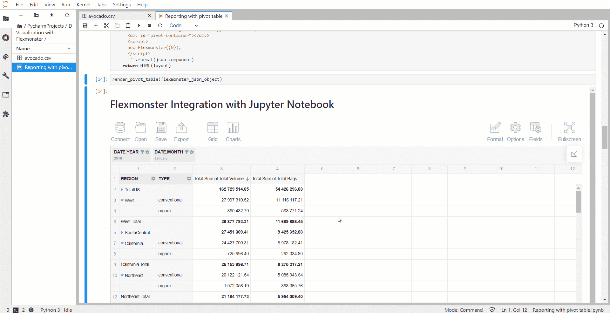
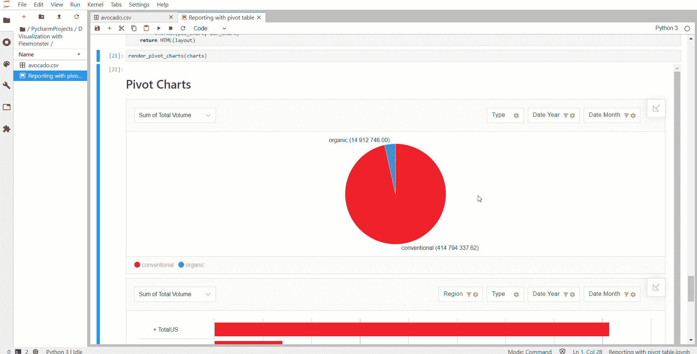

# Jupyter 笔记本中的交互式报告

> 原文：<https://towardsdatascience.com/interactive-reporting-in-jupyter-notebook-92a4fa90c09a?source=collection_archive---------3----------------------->

> 从新的角度看《纽约时报》的报道

**Jupyter 笔记本**是数据科学家箭囊中的重要一箭。这个开源应用程序是*灵活*，最重要的是*交互*。这是一个基本数据科学任务所需的工具，如数据清理、构建可视化、创建机器学习模型等。您可以在这里编写 Python 或 R 代码(取决于您使用的内核)，将代码执行的结果保存在单元格中，并与其他人共享。

我无法想象没有 Jupyter 笔记本的工作。它们可以共享，设置快速，使用简单，即使您刚刚开始进入数据分析领域或学习 Python。

# 用 Python 分析数据

如果您经常使用 Python 处理数据，您可能会经常看到以**汇总**形式出现的数据。在 Python 中，你可以使用 [pandas](https://pandas.pydata.org/pandas-docs/stable/index.html) 库中的内置函数**分组**或**透视**你的**数据**。

*一种经典的旋转方式是使用古老的*[***pivot _ table***](https://pandas.pydata.org/pandas-docs/stable/reference/api/pandas.pivot_table.html)*方法*。至于大多数 Python 方法，其语法简单易懂。

然而，数据透视表布局的逻辑越复杂，编写代码所需的时间就越多。此外，由此产生的**透视表始终是**静态的**而不是交互式的**。每次需要在透视网格上排列数据以便从不同的角度查看时，都需要重写代码。是的，这可能不涉及太多的变化，但是相反，你可以花时间关注你的数据，并对其有更好的理解。

今天，我将向您展示另一种在 Jupyter 笔记本中透视数据的方法**。掌握这种方法后，您将很快轻松地生成交互式报告。**

# 如何使 Python 中的透视数据具有交互性

我将要展示的方法最棒的一点是，您可以*将生成的带有交互式数据可视化组件的笔记本保存到* **HTML** 中，并将其发送给您的朋友和队友。他们可以在浏览器中打开它，玩数据透视表和数据透视图，获得他们个人的见解，保存他们配置的报告并重新发送给您。这可能会使整个*数据分析体验更有成效*。

我们将在 **JupyterLab** 工作，因为在那里运行笔记本电脑非常舒适。JupyterLab 只是 Jupyter 笔记本的一个用户界面。你在古典笔记本中使用的所有东西都在这里:笔记本、文件浏览器。但是 JupyterLab 提供了更多的扩展功能:你可以安装扩展，展开和折叠单元格，拖放它们——这是 Jupyter 可能缺少的功能。此外，文本编辑器提供了制表符自动完成功能。

# 在 JupyterLab 中构建报表

所以，运行你的 JupyterLab，让我们开始吧！

首先，让我们导入我们需要的 Python 库。其中包括 pandas、json 和 IPython 的显示模块。所有这些库都是 Anaconda 发行版附带的，但是如果您不使用它，您可能需要在全局范围内或者在您的虚拟环境中安装这些库。

*   [pandas](https://pandas.pydata.org/pandas-docs/stable/index.html) 是用 Python 处理数据结构的必备库。
*   [IPython](https://ipython.org/install.html) 是 Python 中用于交互式并行计算的 API。 [display](https://ipython.readthedocs.io/en/stable/api/generated/IPython.display.html) 是它的模块，为 IPython 中的显示工具呈现 API。
*   [json](https://docs.python.org/3/library/json.html) 库提供了 json 编码和解码的 API。如果你曾经使用过“marshal”或“pickle”模块，你应该对它的 API 很熟悉。

对于数据可视化，我们将使用 [**Flexmonster 数据透视表&图表**](https://www.flexmonster.com/?r=td2) ，这是一个 JavaScript 库。

**数据**呢？出于演示的目的，我选择了一个来自 T21 Kaggle 的[‘牛油果价格’数据集。它是轻量级的，包含合理数量的字段。相反，你可以选择任何你喜欢的数据集。](https://www.kaggle.com/neuromusic/avocado-prices)

**加载你的数据**。使用 pandas，将 CSV 数据读入 dataframe。删除列“未命名:0”—读取 CSV 文件时经常出现的索引列。

调用 dataframe 上的`to_json()`方法，将其转换为 JSON 字符串，并保存到`json_data`变量中。

'`orient'` '参数定义了预期的 JSON 字符串格式。这里我们将其设置为“记录”值。该值将对象转换为类似列表的结构，即[{column - > value}，…，{column - > value}]。这正是 Flexmonster 使用的格式。

现在让我们使用*嵌套字典*创建 Flexmonster 的**实例。在这里，我们指定所有必要的初始化参数，并将解码后的数据传递给组件。对于解码 JSON，我们使用`json.loads()`的方法。**

如你所见，我们一次设置**切片**、**选项**和**格式**。我们可以跳过这一步，然后数据透视表将显示默认切片，但我认为最好从一开始就学习如何做。

现在我们使用`json.dumps()`将 Python 对象编码成 JSON :

下一步是定义一个函数**，该函数将数据透视表**直接呈现在单元格中。为此，我们将定义一个多行字符串，并将其传递给导入的 HTML 函数:

最后，我们可以将 JSON 传递给这个渲染函数，并调用它:

瞧吧！你看到的是页面上的**交互透视表。数据集已准备就绪:您可以重新排列网格上的字段，更改聚合，设置筛选和排序，设置值的格式，并做一切事情来创建您独特的报表。此外，如果您错过了记录在数据框中显示的方式，您可以*从透视模式切换到平面视图*。通过这种方式，您将看到来自数据源的数据，但具有交互功能。**

下面是数据透视表现在的样子:

此外，您可以尝试应用条件格式来关注最重要的值。

# 在 Jupyter 笔记本中制作仪表板

现在，让我们通过*向笔记本*添加更多元素来使我们的逻辑变得复杂一点。两个**数据透视图**将使我们的数据可视化更加通用。为此，我们将定义一个额外的函数，该函数接受多个 JSON 组件并将它们呈现在页面上。其逻辑与单个数据透视表相同。数据透视表组件的定义方式与数据透视表相同。

在数据透视表的报表切片中，我们可以设置 **Top X filters** ，它可以方便地限制数据透视表上显示的类别数量。这使得它们更加整洁和紧凑。

万岁！现在你可以在你的 Jupyter 笔记本中享受一个**交互式仪表盘**！不要犹豫，生成一份关于你的数据分析报告，并与他人分享。

# 最后的想法

今天我们尝试了一种在 Jupyter 笔记本中操作和呈现数据的新方法，**使用 Python 和 JavaScript 数据可视化库**。如您所见，设置一切并不需要太多的代码和时间。

一旦你这样做了，你就可以在你已经习惯的工作空间中探索你的数据。

这种方法使您不必在每次需要以不同的方式查看数据时重写代码。*与 Jupyter 笔记本* — *的中心思想* *齐头并进，使数据可视化和数据分析互动灵活。*

你可以在 [GitHub](https://github.com/veronikaro/Interactive-Reporting-In-Jupyter-Notebook) 上找到完整代码。👈

# 高级选项

为了满足您对仪表板中还可以增强哪些功能的好奇心，这里有一个主要功能的简要列表，您可以使用这些功能来改善您的报告:

*   **映射**

很多时候，真实世界的数据既不整洁也不一致。字段可以用不同的大小写来命名，它们也可能包含不明显的缩写，等等。为了美化它，我们可以使用 [**映射**](https://www.flexmonster.com/api/mapping-object/?r=td2)——设置应用于数据源的视图配置的报表属性。其格式化功能带来的另一个好处是数据类型的显式**设置。通过设置类型，您可以告诉组件按照您想要的方式处理字段，例如字符串、数字或日期。这将影响对字段层次结构可用的聚合的选择。**

[在 GitHub 示例中，](https://github.com/veronikaro/Interactive-Reporting-In-Jupyter-Notebook/blob/master/Reporting%20with%20pivot%20table.ipynb)您可以看到如何定义一个映射对象并将其设置到数据透视表。

*   **出口**

数据透视表带有 JavaScript API 方法和事件。您可以使用`[exportTo](https://www.flexmonster.com/api/exportto/?r=td2)`方法在本地配置不同格式的保存报告或将报告保存到远程目的地，如服务器。

*   **计算值**

要在报告中引入新的公式，您可以添加[计算值](https://www.flexmonster.com/doc/calculated-values/?r=td2)。