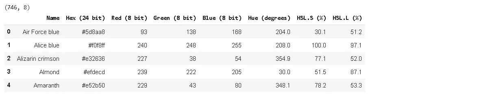
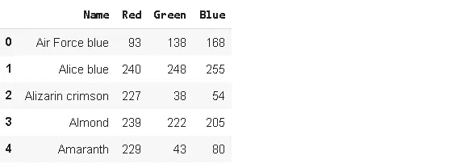
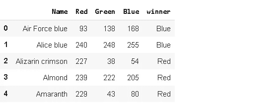
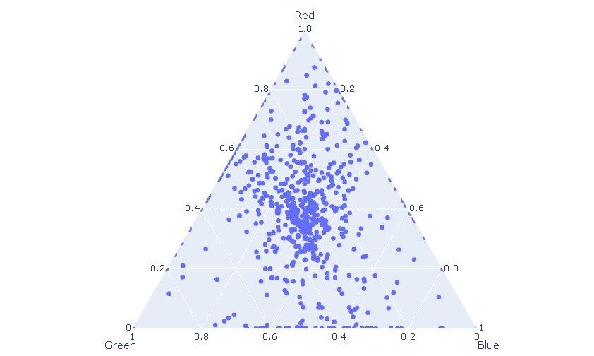
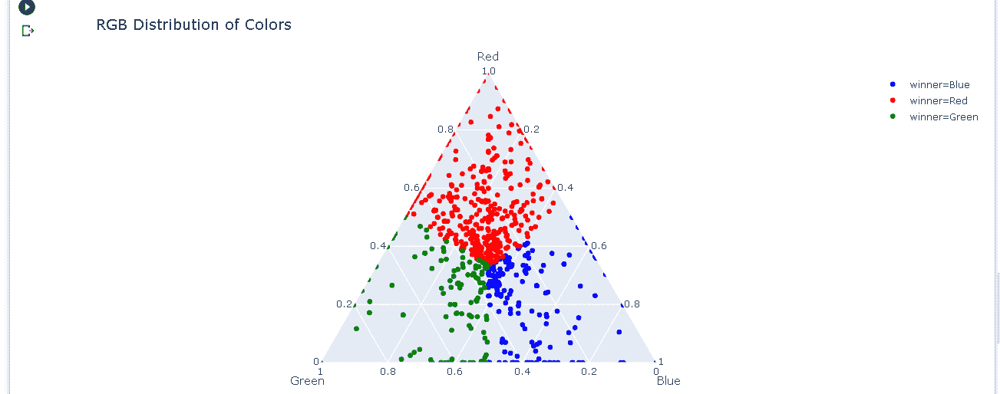
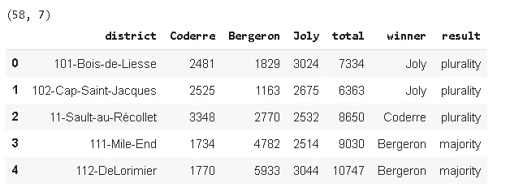
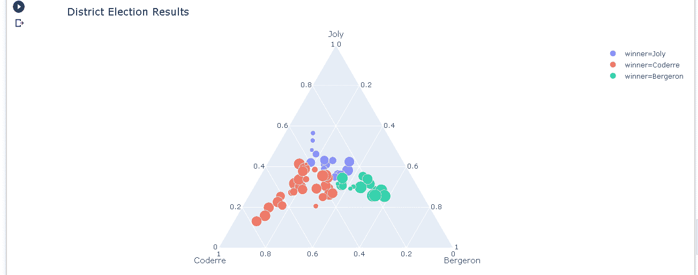
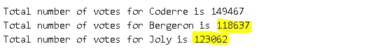
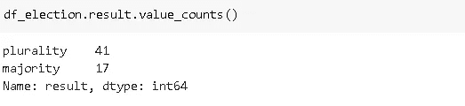
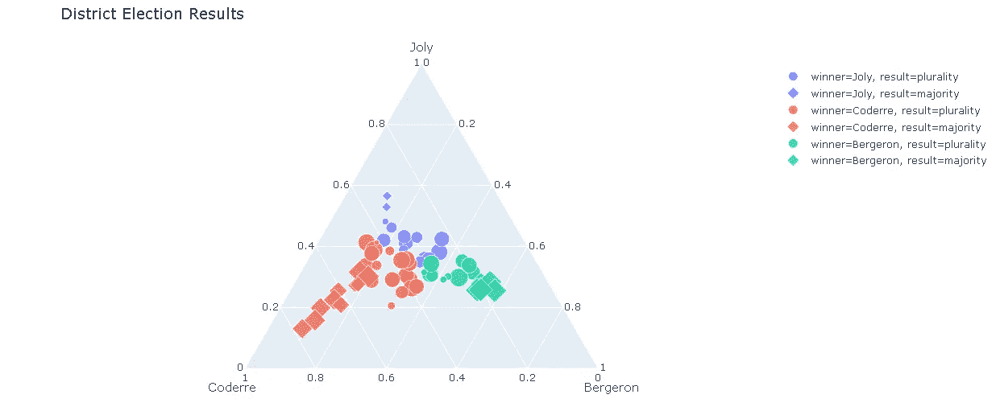

# 与 Plotly 交互的三元图

> 原文：<https://towardsdatascience.com/interactive-ternary-plots-with-plotly-2af21e22e716?source=collection_archive---------43----------------------->

## 你知道多少种不同的颜色？


里卡多·雷森德在 [Unsplash](/s/photos/colorful?utm_source=unsplash&utm_medium=referral&utm_content=creditCopyText) 上拍摄的照片

**Plotly Python** (plotly.py)是基于 plotly javascript (plotly.js)构建的开源绘图库。我喜欢 plotly.py 的一点是，它提供了一个高级 API ( **plotly express** )和一个低级 API ( **graph objects** )来创建可视化。使用 plotly express，我们可以用很少的代码行创建一个动态的、信息丰富的图。另一方面，我们需要用图形对象编写更多的代码，但是对我们创建的内容有更多的控制权。

在本帖中，我们将使用 plotly express 创建**三元图**。三元图通过将数据点相应地放置在三角形中来描绘三个变量的比率。它给了我们一个观察值是否倾向于某个变量的概览。三角形的每个角都标有一个变量。因此，我们只能比较三个变量。

假设我们正在对三个汽车品牌进行大量测量。每个品牌在每个测量上都有一个等级。通过在三元图上绘制这些测量值，我们可以了解一个品牌是否比其他品牌更占优势。例如，一个品牌在安全相关措施方面可能很突出。

我找不到以多种不同方式比较汽车品牌的数据集，但我找到了一个有趣的数据集，它是一个具有 RGB 颜色值的数据集。每种颜色都由红、绿、蓝(RGB)组合而成。颜色根据这三种主色的比例而变化。

在 data.world 网站上的[这里](https://data.world/dilumr/color-names)可以获得的数据集包括 **746** 种不同颜色的 RGB 值。我甚至不知道这些颜色是否存在。还有一些怪异的颜色名称，如“茜素深红”、“芭莎”、“木炭”。我们将使用三元图来了解这一大系列颜色的 RGB 成分。

让我们首先将数据集读入一个熊猫数据帧并查看它。

```
import numpy as np
import pandas as pddf = pd.read_csv("/content/colorhexa_com.csv")
print(df.shape)
df.head()
```



现在，我只对颜色和 RGB 组件的名称感兴趣，所以我将只获取那些列并更改颜色的名称。

```
new_cols = {'Red (8 bit)':'Red', 'Green (8 bit)':'Green', 
'Blue (8 bit)':'Blue'}df.rename(columns=new_cols, inplace=True)
df = df[['Name', 'Red', 'Green', 'Blue']]df.head()
```



我还想为每个颜色名称添加一个标记，指示贡献最大的 RGB 颜色。我将使用嵌套循环，但也可以尝试自己的方式。

```
winners = []for i in range(len(df)):
  if df.iloc[i,1] > df.iloc[i,2] and df.iloc[i,1] > df.iloc[i,3]:
    winner = "Red"
  elif df.iloc[i,2] > df.iloc[i,3]:
    winner = "Green"
  else:
    winner = "Blue"
  winners.append(winner)df['winner'] = winners
df.head()
```



让我们首先创建一个简单的三元图，根据 RGB 分量值定位每种颜色。我们将使用 plotly express，它是 plotly python 的高级 API。

```
import plotly.express as pxfig = px.scatter_ternary(
df, a="Red", b="Green", c="Blue", hover_name="Name"
)fig.show()
```



大多数颜色都在三角形的中心附近，但有一点倾向于红色。我们也有位于三角形边缘的颜色。这些颜色只包括三种 RGB 颜色中的两种。毫不奇怪，角上的颜色只包含一种成分。例如，海军蓝只有蓝色成分。

我们传递“名称”列 **hover_name** 参数，该参数允许在悬停在某个点上时查看颜色的名称。

我们可以通过使用**颜色**参数来使绘图看起来更好。有个头衔也不错。

```
fig = px.scatter_ternary(df, a="Red", b="Green", c="Blue", 
hover_name="Name",
color="winner", 
color_discrete_map = {"Blue": "blue", "Green": "green", "Red":"red"},
title="RGB Distribution of Colors")fig.show()
```



代表数据点(数据帧中的行)的点具有相同的大小，但 plotly 也允许为点的大小增加信息能力。让我们使用一个内置数据集来展示如何使用**大小**参数。

```
df_election = px.data.election()
print(df_election.shape)
df_election.head()
```



这个选举数据集包含 58 个地区的三位候选人获得的票数。“总数”一栏包括该区的总票数，我认为与该区的人口成比例。我们可以将“total”列传递给 **size** 参数，并看到某个特定的候选人赢得了更多的大选区。

```
fig = px.scatter_ternary(df_election, a="Joly", b="Coderre", c="Bergeron",
hover_name="district",
color="winner", size="total", size_max=15,
title="District Election Results")fig.show()
```



“Coderre”遥遥领先。“乔利”赢得的选区面积相对较小。我意识到的一件有趣的事情是，Coderre 赢得的选区更倾向于乔利，而不是 Bergeron。当我们停留在数据点上时，我们看到乔利通常是第二个候选人。因此，乔利可能会得到更多的选票，尽管乔利赢得的选区似乎更小。让我们通过计算每位候选人的总票数来核实一下。

```
print("Total number of votes for Coderre is {}".format(df_election.Coderre.sum()))print("Total number of votes for Bergeron is {}".format(df_election.Bergeron.sum()))print("Total number of votes for Joly is {}".format(df_election.Joly.sum()))
```



是啊！乔利的票数比贝杰龙多。

除了大小，我们还可以使用数据点的形状来传递信息。例如，“结果”列有两个值:



我们可以将该列作为参数传递给**符号**参数。

```
fig = px.scatter_ternary(df_election, a="Joly", b="Coderre", c="Bergeron",
hover_name="district",
color="winner", size="total", size_max=15,
title="District Election Results", 
symbol="result")fig.show()
```



我们知道某个候选人是以多数还是多数获胜。

我们已经用 plotly 覆盖了三元图。当然，这只是这个神奇的图书馆的一小部分功能。我们可以使用 plotly 动态创建许多其他绘图类型。它的语法也很容易理解。在接下来的帖子中，我会尝试涵盖更复杂的情节。你也可以查看 plotly 文档，我认为它有很多不同的例子。就像任何其他主题一样，熟悉 plotly 的最好方法就是实践。因此，我建议创造大量的情节来提高你的技能。

感谢您的阅读。如果您有任何反馈，请告诉我。