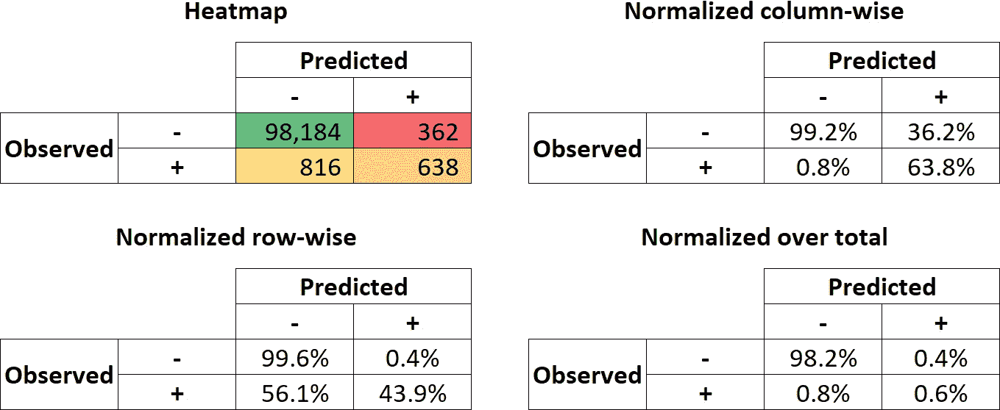
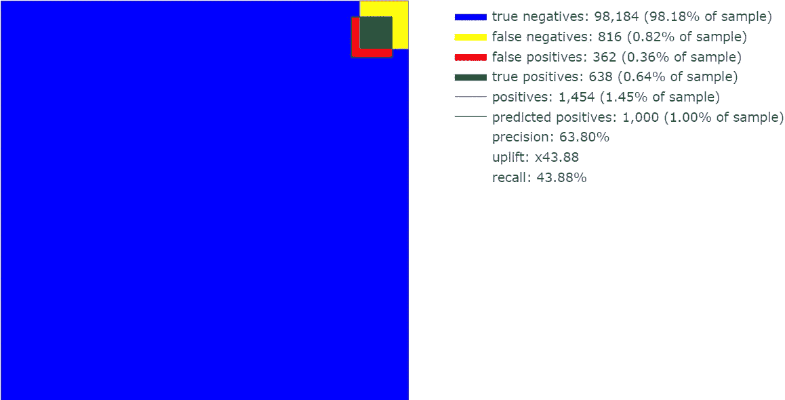
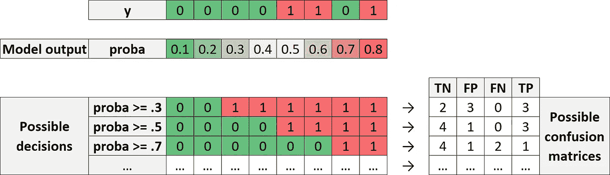
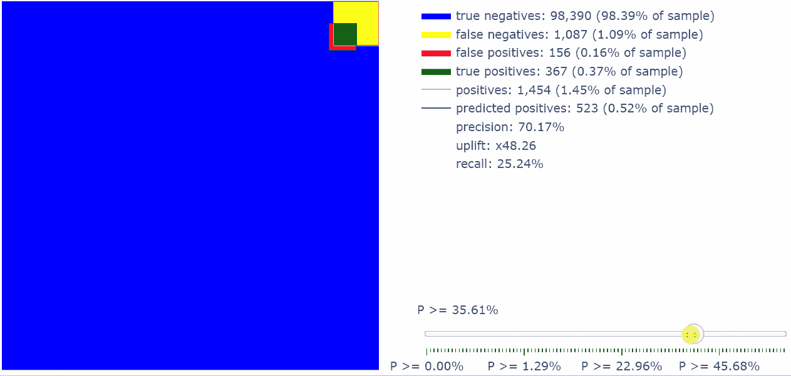

# 任何二元分类器结果的交互式可视化——用 5 行 Python 代码

> 原文：<https://towardsdatascience.com/interactive-visualization-of-binary-classification-in-5-lines-of-python-9c1f627ded8?source=collection_archive---------31----------------------->

## 用“混淆 _viz”制作一个有影响力的模型结果图

[图片由作者提供]

## **TL；博士**

给匆匆忙忙的人的 5 行代码:

片段:混淆的用法

# **简介**

二进制分类是机器学习中最常见的任务。它也很通用，因为 n 类问题和回归问题都可以简化为二元情况(当然会丢失一些信息)。

假设您已经收集了数据，清理了数据并安装了分类器。可惜，工作结束的时候，工作才刚刚开始！事实上，你仍然需要处理很多东西:真阳性、假阳性、假阴性、准确度、精确度、召回率……而且，所有这些都要乘以可能的阈值数(很容易有数千个)。

这就是为什么我开始寻找**一个单一的(可能是图形化的和交互式的)表示，包含关于二进制分类任务**的所有相关信息。鉴于这种可视化是建立在混淆矩阵之上的，我把它叫做“*混淆 _viz* ”。

# 来自混乱的知识(矩阵)

用来评估分类优劣的最初级工具(可能是机器学习模型，也可能是确定性规则)叫做[混淆矩阵](https://en.wikipedia.org/wiki/Confusion_matrix)。这是一个表格，显示了每个班级有多少人被正确或错误地分类。

例如，让我们对一些模拟数据做一个简单的分类问题:

片段:生成数据、拟合分类器和打印混淆矩阵。

这是混淆矩阵:

二元分类器的混淆矩阵。[图片由作者提供]

数字是“原始的”这一事实构成了混淆矩阵的优点和缺点。

*   **优势**:因为——与更具体的度量标准(如精确度、召回率或提升率)相比——**混淆矩阵的含义是任何人都能立即理解的，包括非技术利益相关者**。
*   **缺点**:因为**原始数字不那么容易解读**。

因此，可以采用几个选项来使混淆矩阵更具“表现力”。例如:

1.  热图
2.  按列规范化
3.  按行规范化
4.  总计标准化

混淆矩阵“操作”的一些简单例子。[图片由作者提供]

# 混淆矩阵的图形可视化

这些操作给出了模特表演的多面肖像。然而，问题是人类并不擅长存储大量的信息。这就是为什么我开始想知道如何得到一个有效的混乱矩阵的可视化，它可以“一目了然”地显示所有相关信息。

这种可视化的要求是:

*   情节应该是二维的(当然)，
*   涉及真阳性、假阳性、真阴性和假阴性的绘图区域应该与它们的数量成比例。

经过一些尝试后，我开始定义一个对我的目标来说足够直观的可视化。根据它，上面的混淆矩阵应该是这样的:

混乱矩阵的静态图。[图片由作者提供]

带有粉红色边框的正方形代表阳性总数(即真阳性+假阴性)。这就像仪表板的靶心:我们希望我们的模型能够在这里投出大部分飞镖。

带黑边的正方形准确地代表了模型的猜测:这些都是被标记为阳性的个体。因此，粉边方块和黑边方块之间的公共区域用绿色填充，代表真正的阳性。剩下的部分是由假阳性构成的，并被涂上红色。

# 一个问题，多个矩阵

但是事情要比这复杂一些。事实上，对于每个模型，我们并不只有一个混淆矩阵。其实我们有很多。这怎么可能呢？对于非技术涉众来说，这通常难以理解。

这完全取决于“概率阈值”这个概念。大多数分类算法的输出实际上不是每个个体的 0/1，而是一个介于 0 和 1 之间的数字，表示该个体成为阳性的可能性，我们称之为“概率”。

因此，最终的分类 0/1 不是自动的，而是从(商业)决策中派生出来的。决策在于确定概率阈值，高于该阈值的个体应被分类为 1。

让我们更清楚地说明这一点:

一个模型输出，许多混淆矩阵。[图片由作者提供]

**每一个可能的决策都与一个 0/1 的数组相关联。反过来，每个数组与不同的混淆矩阵相关联。**这就是为什么，对于一个单一的模型，我们可能有数千(甚至数百万！)的可能混淆矩阵:每个阈值一个。

因此，问题变成:**我们能在一个单独的图中表示不同的混淆矩阵(或者至少它们的一个代表子集)吗？**

通过使用 [Plotly](https://plotly.com/python/) ，它可以通过一个滑块来完成:这就是交互图帮助我们的地方。这个想法是，当我们从左向右移动滑块时，相关的阈值增加，因此选择变得越来越“限制性”，也就是说，我们归类为阳性的观察数量越来越少。

许多混淆矩阵的交互图(每个概率阈值一个)。注意:由于从 html 到 gif 的转换，一些颜色可能会改变。[图片由作者提供]

滑块指示什么是当前概率阈值(“P ≥阈值”)。

如果你留意精度和回忆，你会注意到它们有相反的行为:当滑块向右移动时，回忆减少，而精度提高。这很有意义:如果你只选择最危险的个体，你可能会更精确，但代价是识别出更小部分的阳性(即更小的回忆)。

一般来说，图形的交互特性允许您选择一个适合您的特定用例的阈值。

# 我可以用我自己的数据做这个吗？

其实很简单！

你所要做的就是在你的环境中 pip-安装包*混淆 _ 即*。

片段:安装混淆 _viz。

这个包包含一个名为 ConfusionViz 的类，所以您只需在 Python 代码中导入它。下一个片段展示了如何使用 ConfusionViz:在笔记本模式下显示交互情节(命令*)。show()* )或将其导出为 html 文件(命令*)。to_html()* )，然后可以用任何浏览器打开。

片段:混淆的用法。

你只需要把 *y_test* 和 *probas_test* 换成你自己的数据，游戏就做好了！

感谢您的阅读！我希望这篇文章对你有用。

我感谢反馈和建设性的批评。如果你想谈论这篇文章或其他相关话题，你可以发短信给我[我的 Linkedin 联系人](https://www.linkedin.com/in/samuelemazzanti/)。