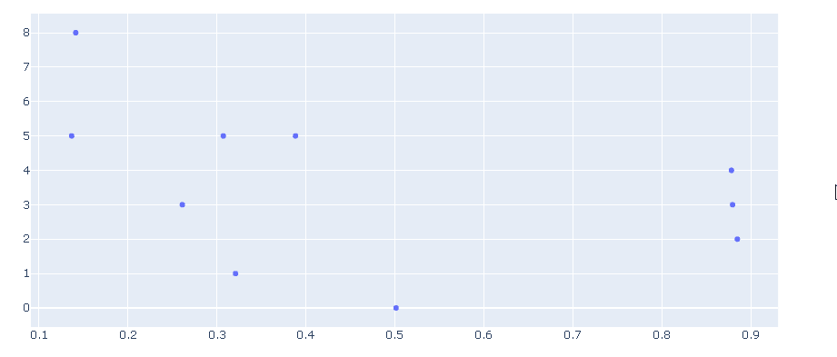
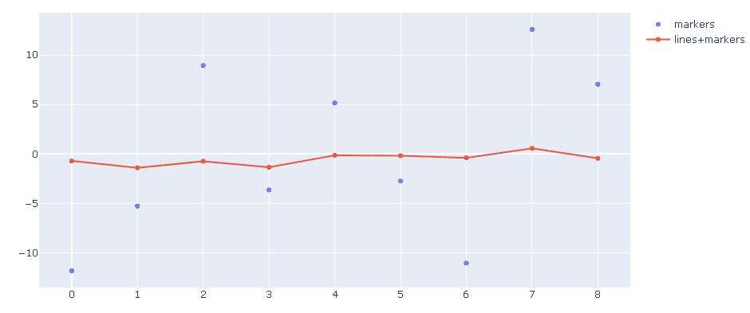
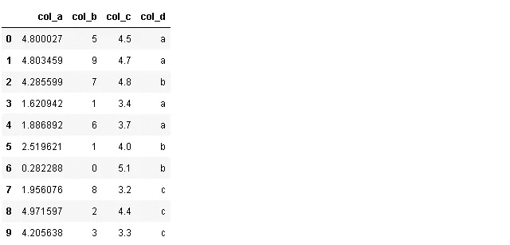
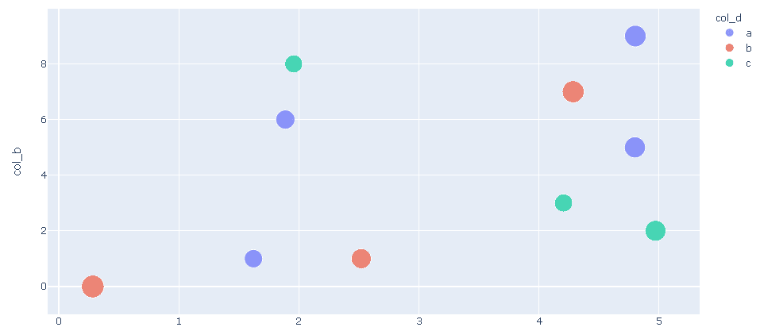
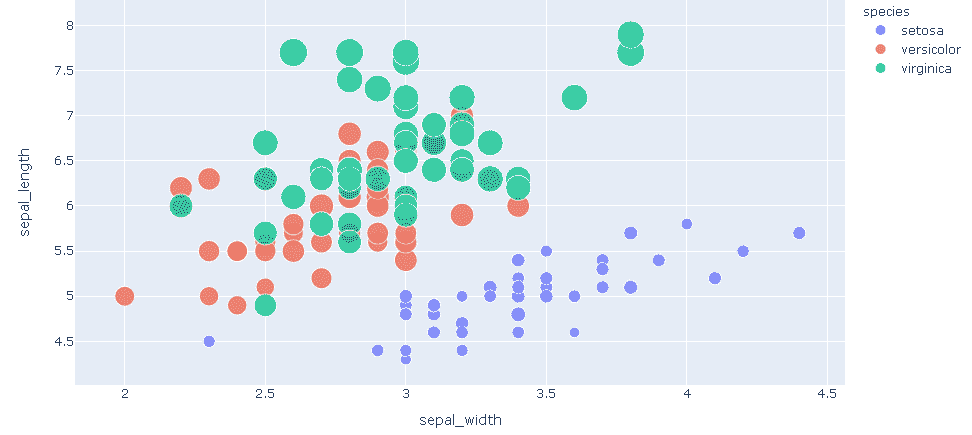
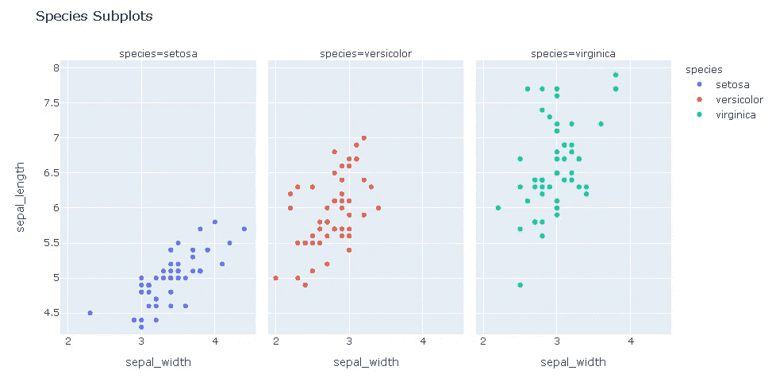
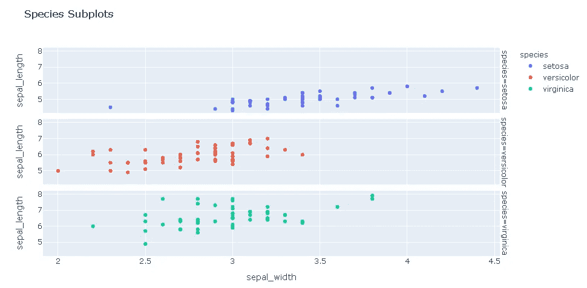
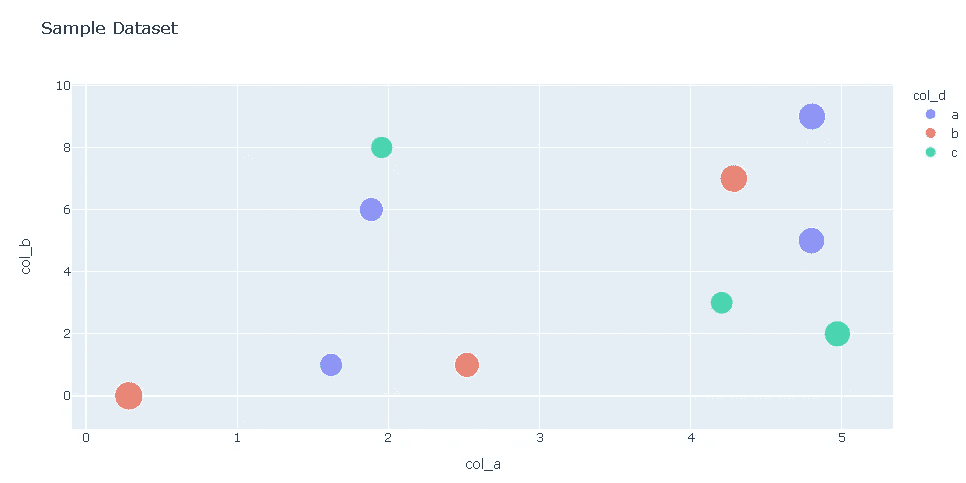
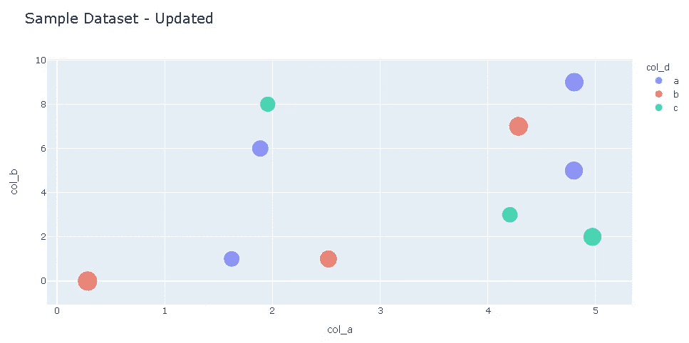
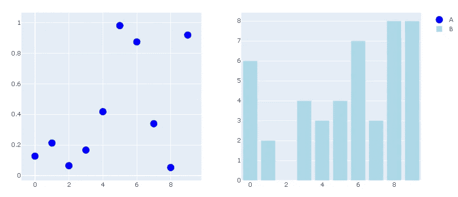

# 使用 Plotly 进行交互式可视化

> 原文：<https://towardsdatascience.com/interactive-visualizations-with-plotly-ea3f8feb87d1?source=collection_archive---------43----------------------->

## plotly.py 库简介


照片由[金莎·艾利斯](https://unsplash.com/@kymellis?utm_source=unsplash&utm_medium=referral&utm_content=creditCopyText)在 [Unsplash](https://unsplash.com/s/photos/view?utm_source=unsplash&utm_medium=referral&utm_content=creditCopyText) 上拍摄

Plotly Python (plotly.py)是一个基于 plotly javascript (plotly.js)构建的开源绘图库。它允许创建可以在 Jupyter 笔记本上显示的交互式可视化。可以使用 pip 或 conda 进行安装:

```
$ pip install plotly==4.8.0$ conda install -c plotly plotly=4.8.0
```

使用 plotly.py 创建图形基本上有两种方法:

*   数字作为字典
*   作为图形对象的图形

在本帖中，我们将介绍如何使用**图形对象**创建许多不同种类的绘图。安装后，我们可以导入图形对象:

```
import plotly.graph_objects as go
```

创建图形对象图形有不同的方法。一种方法是使用图形对象的**图形构造器**。让我们创建一个简单的散点图:

```
import numpy as npa=np.random.random(10)
b=np.random.randint(10, size=10)fig = go.Figure(data=go.Scatter(x=a, y=b, mode='markers'))fig.show()
```



我们还可以使用 **add_trace** 在同一个图形上添加额外的轨迹:

```
fig = go.Figure(data=go.Scatter(x=np.arange(9), y=10*np.random.randn(10),mode='markers', name='markers'))fig.add_trace(go.Scatter(x=np.arange(9), y=np.random.randn(10),
mode='lines+markers', name='lines+markers'))fig.show()
```



另一种创建图形的方法是 **plotly express** ，它是一个高级 API，用于生成图形对象图形。我们可以用下面的代码行导入它:

```
import plotly.express as px
```

让我们创建一个示例数据帧:

```
import pandas as pddf = pd.DataFrame({
'col_a':np.random.random(10)*5,
'col_b':np.random.randint(10, size=10),
'col_c':[4.5, 4.7, 4.8, 3.4, 3.7, 4., 5.1, 3.2, 4.4, 3.3],
'col_d':['a','a','b','a','a','b','b','c','c','c']
})df
```



我们可以在一个散点图上了解整个数据框架:

```
fig = px.scatter(df, x="col_a", y="col_b", color="col_d", size='col_c')fig.show()
```



x 轴代表“col_a”，y 轴代表“col_b”。标记的大小给出了关于“col_c”的概念，而标记的颜色表示“col_d”中的信息。因此，一个散点图能够告诉我们关于数据集的很多信息。每个点(或标记)代表数据帧中的一行，我们可以将鼠标悬停在各个数据点上，以查看所有列的值。这是一个简单随机的数据集。当我们处理真实数据集时，图形交互可视化的特性变得更加有用。

Plotly 包含著名的**虹膜数据集**，我们可以通过一行代码访问它:

```
df_iris = px.data.iris()fig = px.scatter(
df_iris, x="sepal_width", y="sepal_length", color="species",
size='petal_length', hover_data=['petal_width']
)fig.show()
```



上面的散点图告诉我们不同的物种是如何聚集在一起的，以及物种之间的差异。

也有可能在单独的支线剧情中表现不同的物种。我们需要做的就是添加 **facet_col** 或 **facet_row** 参数。顾名思义，facet_col 将支线剧情创建为列，而 facet_row 将支线剧情创建为行。

```
fig = px.scatter(
df_iris, x="sepal_width", y="sepal_length", color="species", facet_col="species", title="Species Subplots"
)fig.show()
```



```
fig = px.scatter(
df_iris, x="sepal_width", y="sepal_length", color="species", facet_row="species", title="Species Subplots"
)fig.show()
```



在一个图形被渲染之后，我们可以使用 **update_layout()** 来更新布局。请考虑下图:



我们可以用下面的代码更新标题的字体大小:

```
fig.update_layout(title_text="Sample Dataset - Updated",
                  title_font_size=20)
```



另一种创建支线剧情的方法是使用**make _ 支线剧情**:

```
from plotly.subplots import make_subplotsfig = make_subplots(rows=1, cols=2)fig.add_scatter(y=np.random.random(10), mode="markers",
                marker=dict(size=15, color="Blue"),
                name="A", row=1, col=1)fig.add_bar(y=np.random.randint(10, size=10),
            marker=dict(color="LightBlue"),
            name="B", row=1, col=2)fig.show()
```

我们使用**行**和**列**参数指定了支线剧情的数量和它们的位置。然后，我们添加定义地块并指定位置。我们还可以通过将字典传递给**标记**参数来指定标记的大小和颜色。用上面的代码段生成的图形是:



我们已经介绍了 plotly.py 库的一些基本组件。当然，这只是用 plotly 可以做到的一点点。我们可以使用 plotly 动态创建许多其他绘图类型。它的语法也很容易理解。在接下来的帖子中，我会尝试涵盖更复杂的情节。你也可以查看 plotly 文档，我认为它有很多不同的例子。就像任何其他主题一样，熟悉 plotly 的最好方法就是实践。因此，我建议创造大量的情节来提高你的技能。

感谢您的阅读。如果您有任何反馈，请告诉我。