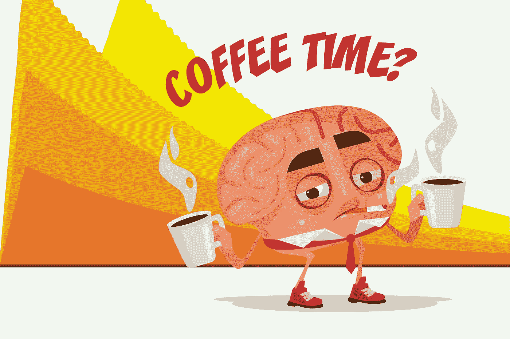
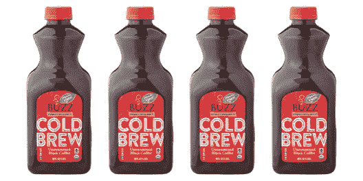
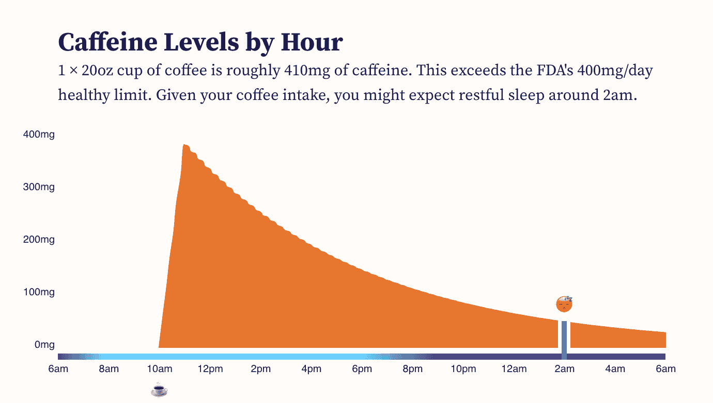
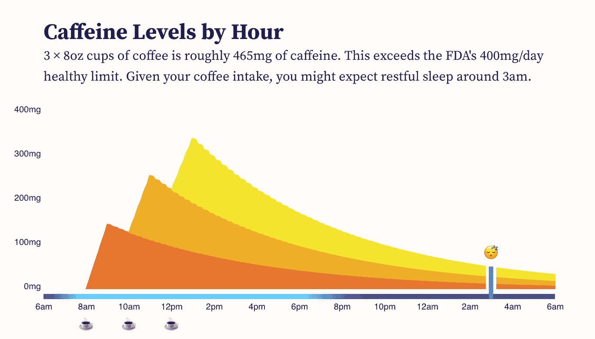
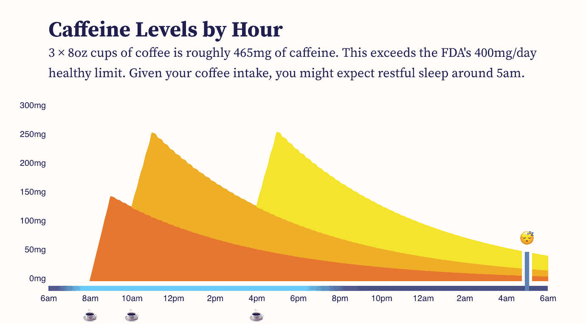
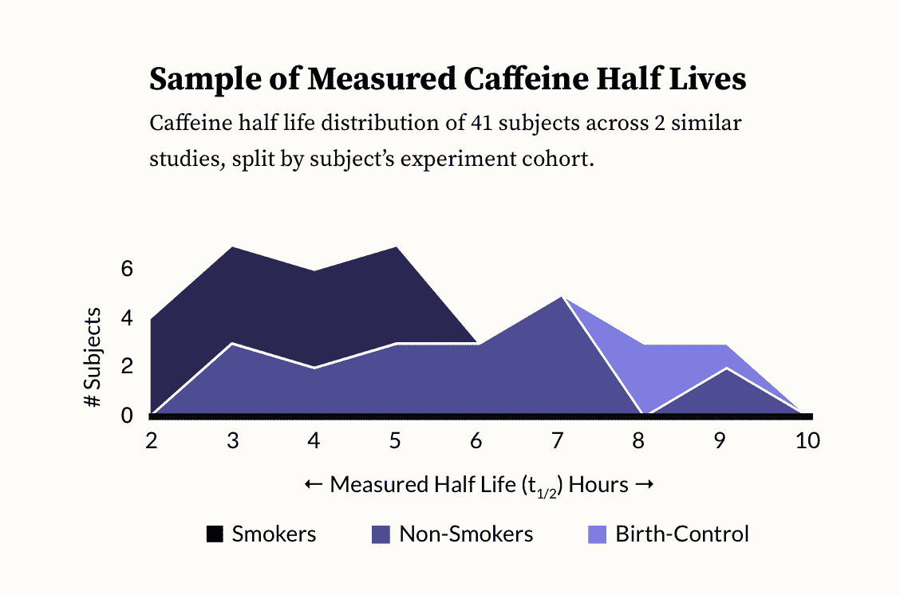

# 互动:可视化咖啡因和就寝时间

> 原文：<https://towardsdatascience.com/interactive-visualizing-caffeine-bedtime-4c256d562193?source=collection_archive---------6----------------------->

## 咖啡因会在你体内停留多久？早上喝咖啡影响晚上睡眠吗？

大脑喜欢咖啡。(图片来自作者+ [VectorStock](https://www.vectorstock.com/royalty-free-vector/sleepy-tired-office-worker-brain-character-drink-vector-14661904) )

我睡眠有问题。医生经常警告我，咖啡因可能是罪魁祸首。有一次，2015 年，我甚至还听了他们的话。我戒了大约 3 周的咖啡。后来我意识到，不喝咖啡的时候，我是一个非常令人讨厌的人。所以我又回到了酱汁。

我没有完全戒掉咖啡，而是定下了一个折中的规则:
***下午 3 点以后不喝咖啡***

采用这个规则并没有明显地帮助我的睡眠，但至少它给了我一个对医生有效的反驳。更好的是:我不需要改变任何行为来适应这个规则。

大多数日子，早上晚些时候，我会走到咖啡店，点一杯我能拿的最大杯的冰咖啡。然后，我会走回我的办公桌，等待液体“焦点”发挥作用。偶尔，当会议礼仪要求时，我也会喝一杯下午茶。

这个惯例完全符合下午 3 点的规则。

## **Covid…**

然后 Covid 发生了。显然 Covid 是可怕的，但对我来说，一线希望是打乱了我的咖啡日常生活。

当纽约关闭时，我的鱼缸大小的咖啡就不容易买到了。如果没有步行去咖啡店或与同谋喝咖啡的习惯，吸引力就丧失了。所以我换成了茶，在早上早些时候。

进入疫情大约一个月后，我注意到我睡得更好了！

这又持续了几个星期，直到我们发现了终极懒人咖啡:威格曼的辉煌预制壶。

突然我又睡不着了。肯定不是因为咖啡吧？下午 3 点的规则有问题吗？

## 咖啡因会一直伴随着你。

我明白，至少在理智上，咖啡因的半衰期意味着一天中的晚些时候，一些咖啡因可能仍会在我的大脑中浮动，但直到 Covid 中断之前，我从未多想它。

当不眠之夜回来时，我开始怀疑。我在 Observable 上画了一个粗略的半衰期模型，调整了参数，加入了我平时喝咖啡的习惯……很明显，我的下午 3 点规则完全是垃圾。

显然，喝一杯热浴缸大小的咖啡感觉很棒，至少现在是这样。但是早上的咖啡因仍然会干扰你晚上的睡眠。直到我亲眼看到它的表演，它才真正被理解。

为了让咖啡因的动力学更深入人心(这样你就不必等到下一个疫情来学习我学到的课程)，我制作了一个模拟器，模拟咖啡因在你体内停留多长时间，以及它如何影响预计的“就寝时间”

# 自己试试这里:[咖啡因模拟器](https://observablehq.com/@elibryan/caffeine-simulator)

让我们看几个熟悉的场景…

上午 10 点喝下 20 盎司咖啡后，全天的咖啡因水平。在这种情况下，到凌晨 2 点，咖啡因含量才会降到 50 毫克以下。([这里可以试试这个](https://observablehq.com/@elibryan/caffeine-simulator?state=eyJjYWZmZWluZVBlckN1cE1nIjo0MTAsImNhZmZlaW5lSGFsZkxpZmVIcnMiOjUsImNhZmZlaW5lU2xlZXBUaHJlc2hvbGQiOjUwLCJkb3NlcyI6eyIxMCI6MX19)。)

上面的图表近似于我以前喝咖啡的习惯。上午 10 点，我会喝一大杯 20 盎司的冰咖啡。这在接下来的一个小时里会大大增加咖啡因的含量，并持续一整天(直到晚上)。相比之下，20 盎司相当于一杯星巴克“大杯”，其中含有高达 410 毫克的咖啡因。(顺便说一句，这超过了美国食品和药物管理局推荐的每日限量 10 毫克。)

表情符号的蓝线表示咖啡因含量低于 50 毫克。这是一个宽松的估计，当你的身体已经“清除”了足够的物质，可以不受干扰地睡觉。(更多关于这个 50 毫克的“睡眠阈值”在下面。)

我从未充分体会到的是:半衰期为 5 小时，在`10am (400mg caffeine, assuming Starbucks equivalent)`喝 20 盎司的咖啡就像在`3pm (200mg caffeine)`喝 10 盎司的咖啡。这就像在`8pm (100mg caffeine)`喝一杯 5oz 的咖啡。也就是说，你的身体需要 5 个小时来过滤掉最初一半的咖啡因，然后再用 5 个小时来清除下一个季度，再用 5 个小时来清除下一个八分之一，以此类推。

在早上 8 点、10 点和 12 点喝下 3 杯 8 盎司的咖啡后，全天的咖啡因水平。在这种情况下，到凌晨 3 点，咖啡因含量才会降到 50 毫克以下。([这里可以试试](https://observablehq.com/@elibryan/caffeine-simulator?state=eyJjYWZmZWluZVBlckN1cE1nIjoxNTUsImNhZmZlaW5lSGFsZkxpZmVIcnMiOjUsImNhZmZlaW5lU2xlZXBUaHJlc2hvbGQiOjUwLCJkb3NlcyI6eyI4IjoxLCIxMCI6MSwiMTIiOjF9fQ%3D%3D)。)

这不一定是超大号杯子的问题。在上面的场景中，不是一次喝完所有的咖啡，而是在上午 8 点、10 点和中午将大致相同量的咖啡因分散到 3 个较小的 8 盎司的杯子中。结果是一样的，因为每杯咖啡都增加了你体内已经存在的咖啡因。在上面的场景中，咖啡因(400 毫克)的峰值出现在下午 1 点左右，所以在你清除足够的咖啡因进入良好睡眠之前，已经是凌晨 3 点了。

在早上 8 点、10 点和下午 4 点喝下 3 杯 8 盎司的咖啡后，全天的咖啡因水平。在这种情况下，到早上 5 点，咖啡因水平才降到 50 毫克以下。([你可以试试这里](https://observablehq.com/@elibryan/caffeine-simulator?state=eyJjYWZmZWluZVBlckN1cE1nIjoxNTUsImNhZmZlaW5lSGFsZkxpZmVIcnMiOjUsImNhZmZlaW5lU2xlZXBUaHJlc2hvbGQiOjUwLCJkb3NlcyI6eyI4IjoxLCIxMCI6MSwiMTYiOjF9fQ%3D%3D)。)

然后是死亡之吻:下午茶。假设你早上很自律，限制自己在早上 8 点和 10 点只喝两杯。但是你会在下午 4 点和一个朋友一起喝咖啡。即使是一小杯咖啡，你现在也要看到凌晨 5 点，直到咖啡因含量回落到 50 毫克以下。

# 咖啡因的最佳含量是多少？

为了赢得咖啡因游戏，你想让你的水平在白天“足够高”，然后在睡觉前“足够低”。这取决于几个因素:

*   什么叫“够高？”你到底需要多少咖啡因？
*   你的半衰期是多少？你代谢咖啡因的速度有多快？
*   什么叫“够低？”你对咖啡因的睡眠阈值是多少？

# 250 毫克的好消息。

一项研究( [src](https://doi.org/10.1002/j.1552-4604.1997.tb04356.x) )比较了服用 250 毫克和 500 毫克咖啡因的效果。据作者称:

> “较低剂量的咖啡因比较高剂量产生更有利的主观效果(兴奋、平静、愉快)，而 500 毫克剂量后的不愉快效果(紧张、紧张、焦虑、兴奋、易怒、恶心、心悸、不安)超过了 250 毫克剂量。与安慰剂相比，较低剂量的咖啡因提高了数字符号替代测试和敲击速度测试的表现；高剂量的咖啡因产生的效果不如低剂量的好。”

因此，250 毫克似乎是一个很好的时间，500 毫克不太多。

如何达到 250 毫克？下面是一些*通用的*经验法则。(选择这些例子是因为在我的脑海中，我仍然是 14 岁，试图整夜保持清醒来玩 Everquest)。

*   FDA 的悲伤咖啡:80-100 毫克
*   [星巴克派克现烤](https://www.starbucks.com/menu/product/480/hot?parent=%2Fdrinks%2Fhot-coffees%2Fbrewed-coffees)(8 盎司):155 毫克
*   [4 Loko](https://www.nytimes.com/2010/10/27/us/27drink.html?_r=1)(24 盎司)—135 毫克
*   [5 小时能量](https://5hourenergy.com/faq/#caffeine)(2oz)——未知？！
*   [红牛](https://www.redbull.com/us-en/energydrink/red-bull-energy-drink-ingredients-list)(8.4 盎司)——80 毫克
*   [浪涌](https://www.surge.com/surge/)(16 盎司)—69 毫克

棘手的是:这些报道的数字并不十分可靠:

*   例如，5 小时能量似乎特别含糊不清:*“常规强度的 5 小时能量饮料含有大约 8 盎司顶级咖啡的咖啡因。”当你考虑到“顶级咖啡”中咖啡因的易变性时，这是令人担忧的…*
*   你可能会从星巴克更确定的答案(16 盎司= 310 毫克)中得到安慰，但你会失望的。2003 年，佛罗里达大学的一组研究人员连续 6 天去同一家星巴克，他们每次都点了同样的 16 盎司星巴克混合早餐，然后测量咖啡的咖啡因含量。在这 6 个样品中，咖啡因含量从 259 毫克到 564 毫克不等。所以这有点像赌博:一大杯混合早餐会带来“兴奋、平静、愉快”还是“烦躁、恶心、心悸”？
*   这两家公司都比麦当劳好，麦当劳只会做出如下承诺:*“我们目前不会报告我们咖啡中的咖啡因含量——但我们可以向你保证一杯明亮而平衡的咖啡。”* ( [src](https://www.mcdonalds.com/us/en-us/about-our-food/our-food-your-questions/22949-how-much-caffeine-is-in-your-coffee.html) )

所以，如果你想要更稳定的咖啡因剂量，为什么不从一罐冰镇的 Surge 开始你的一天呢？

# 代谢咖啡因。

如前所述，你的身体代谢咖啡因的半衰期是一个时间表。虽然咖啡因的典型半衰期是 5 个小时，但这可能因人而异，在 1.5 到 9.5 小时之间。

为了更好地感受这种分布，我们将查看两项不同研究的半衰期测量结果( [src](https://doi.org/10.1038/clpt.1987.126) 、 [src](https://doi.org/10.1002/cpt197824140) )，探索咖啡因对 41 人的影响，这些人被分为吸烟者、非吸烟者和服用口服避孕药的人群。在这两项研究中，研究人员给受试者一剂咖啡因，做一些科学研究来确定一段时间后还有多少咖啡因，然后报告半衰期。

从 [src](https://doi.org/10.1038/clpt.1987.126) 、 [src](https://doi.org/10.1002/cpt197824140) 测得的半衰期直方图。

41 名参与者的平均半衰期约为 5.5 小时。正如你在上面看到的，测量的半衰期在实验组内部和实验组之间是不同的。在两组之间，我们可以看到吸烟者代谢咖啡因最快(2 至 6 小时)，而采取避孕措施的人代谢最慢(7 至 9 小时)。

如果你既不吸烟也不避孕(或者，如果你是吸烟者*和避孕者*),以上并没有给你太多的指导。但如果你怀疑自己对咖啡因特别敏感，你可能会代谢得更慢，这意味着半衰期更长(反之亦然)。

# 咖啡因的睡眠阈值

许多研究(和讨厌的医生)表明咖啡因会对你的睡眠有害。但是，我们到底能承受多少，同时还能睡个好觉呢？我们需要保持的咖啡因阈值是多少？我们已经从 3 篇论文和 FDA 的一般建议中获得了一些不同的数据点，可以用来对这个数字进行三角测量。

第一项研究( [src](https://doi.org/10.5664/jcsm.3170) )让受试者在典型的就寝时间前 0、3 和 6 小时服用 400 毫克咖啡因，然后观察他们的睡眠。他们发现，即使在就寝前 6 小时，咖啡因也“相对于安慰剂对睡眠障碍有显著影响”例如，受试者需要两倍的时间才能入睡，每晚平均少睡 41 分钟。

*   鉴于咖啡因的半衰期为 5 小时，睡前 6 小时摄入 400 毫克咖啡因意味着受试者在就寝时体内仍有约 217 毫克咖啡因。所以我们想在睡觉前体重至少低于 217 毫克。

第二项研究( [src](https://doi.org/10.1111/j.1365-2869.2006.00518.x) )让受试者在睡前 3 小时服用 100 毫克，然后在睡前 1 小时再服用 100 毫克。这个*“睡眠潜伏期延长，睡眠效率降低，睡眠持续时间减少。”*

*   同样，假设咖啡因的半衰期为 5 小时，睡前 3 小时摄入 100 毫克咖啡因就意味着还剩 75 毫克。睡前 1 小时再摄入 100 毫克咖啡因是 94 毫克。所以在就寝时，这些受试者体内仍有 72 毫克+94 毫克= 166 毫克的咖啡因。所以我们想在 166mg 以下。

第三项研究( [src](https://doi.org/10.1016/0006-8993(95)00040-W) )在就寝前 16 小时给受试者服用 200 毫克咖啡因*，而*仍然*报告*“睡眠效率和总睡眠时间明显减少”*vs .安慰剂。*

*   假设半衰期为 5 小时，200 毫克咖啡因在 16 小时后还剩 24 毫克。因此，为了避免这项研究中提到的睡眠影响，我们希望我们体内剩余的咖啡因低于 24 毫克。

后一项研究大致符合 FDA 的指导方针( [src](https://www.fda.gov/consumers/consumer-updates/spilling-beans-how-much-caffeine-too-much) )。"晚餐时喝杯咖啡可能会让你在就寝时保持清醒."在美国食品和药物管理局的奇妙世界里,“一杯咖啡”不是星巴克的庞然大物，它是一杯 8 盎司的咖啡，含有 90 毫克咖啡因。如果我们假设晚餐时间是下午 6 点，就寝时间是晚上 11 点，那么 5 小时后 90 毫克的咖啡在就寝时间仍有 49 毫克的咖啡因在你的体内。(因此模拟器的默认“睡眠阈值”参数为 50 毫克)。

你对咖啡因的耐受力可能会有所不同，但根据上述研究，我们可以看到，即使只有 24 毫克的咖啡因残留也会影响你的睡眠。

# 那么，什么对你最合适呢？

自己去发现吧！现在你知道了参数，你可以使用模拟器来尝试不同的咖啡摄入场景，看看这对你的预期就寝时间意味着什么。

# 自己试试这里:[咖啡因模拟器](https://observablehq.com/@elibryan/caffeine-simulator)

**我是谁？不，不，你是谁？！**

嗨！我是伊莱·霍德。[我帮助客户设计和开发忙碌的人和他们杂乱的数据之间的有效接口](https://3isapattern.com/?utm_source=medium)。如果你是一名创始人、创客、讲故事者、非营利行善者或商业领袖，正在思考数据、设计和用户心理的交集，我很乐意联系并聆听你的故事。

你可以给我发电子邮件到 eli@3isapattern.com T21，或者在推特上关注我。