# 互动:可视化新冠肺炎测试的准确性

> 原文：<https://towardsdatascience.com/interactive-visualizing-covid-19-test-accuracy-4a24b4e1ffbf?source=collection_archive---------23----------------------->

## 最常见的新冠肺炎测试有多准确？“准确”到底是什么意思？

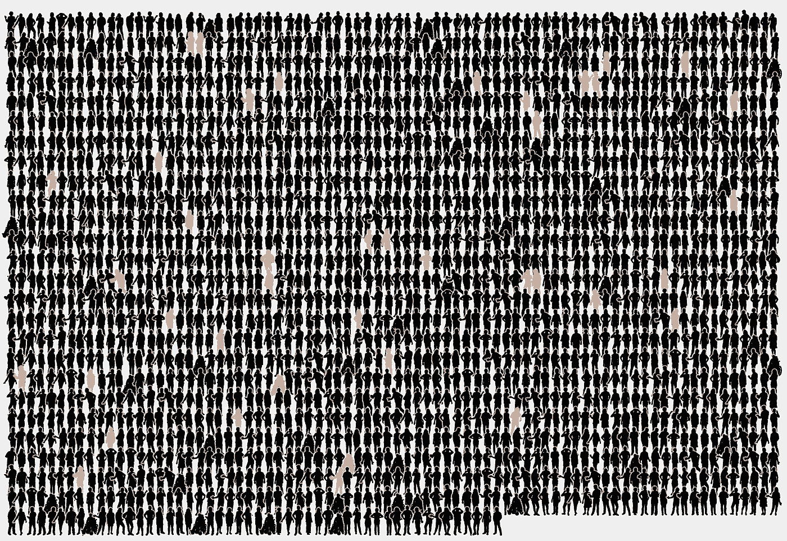

(图片鸣谢:作者+ ProPublica 可爱的 [Wee People](https://github.com/propublica/weepeople) 项目)

不久前我和我爸爸聊天。他听说了一些关于新冠肺炎测试准确性的古怪事情:它们是如此不准确，以至于“你还不如抛硬币”

这听起来不对，但我意识到我自己对测试准确性的理解有点模糊。

因此，为了澄清，让我们了解一下新冠肺炎测试，它们是如何测量的，以及这对检测人群中的感染意味着什么。

# 在这里自己试试:[新冠肺炎测试模拟器](https://observablehq.com/@elibryan/covid-19-test-accuracy-simulator)

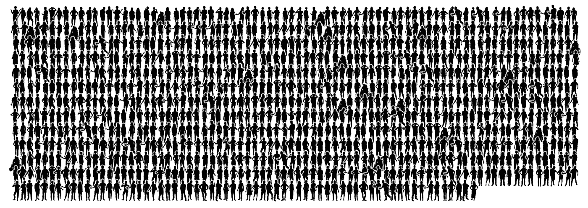

1000 人

为了了解测试准确性的影响，我们将在一小部分人群中进行一些实验。以上是 1000 人。

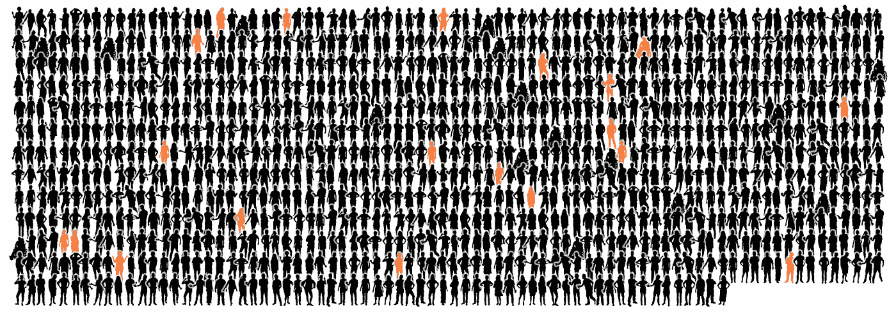

1000 人，其中 2%有新冠肺炎(橙色)。

为了便于统计，我们假设 2%的人口患有新冠肺炎。这是这种疾病的“患病率”你可以看到上面这组中大约有 2%的人被感染了(橙色)。

(注:2%偏高。相比之下，北达科他州是“热点地区”，虽然我们不知道该州目前的实际流行情况，但在过去 10 天里，北达科他州的 762，062 名公民(或人口的 0.7%)有 5，793 例[新病例。](https://www.nytimes.com/interactive/2020/us/north-dakota-coronavirus-cases.html)

为了了解最常见的新冠肺炎测试之间的准确性差异，我们将模拟如果我们测试我们人口中的所有 1，000 人，这些测试可能会如何执行。我们来看看 5 种不同的测试:

*   RT-PCR:“金标准”
*   快速抗原:快速，但不稳定
*   快速分子:快速但可靠(也许)
*   抗体:用于几周后检测 Covid
*   抛硬币:如果我们只是抛硬币呢？

# 测试准确度

在我们进入测试本身之前，让我们了解一下检测感染的“准确性”意味着什么。测试的准确性由两部分组成:敏感性和特异性。

*   敏感度衡量的是实际患有该疾病的人检测报告为“阳性”的频率。
*   特异性衡量没有患病的人检测报告为“阴性”的频率。

为了理解这些指标，我们将把我们的人口分为实际上健康的人和实际上感染的人(注:这在现实生活中显然是不可能的，因此首先需要进行测试)。

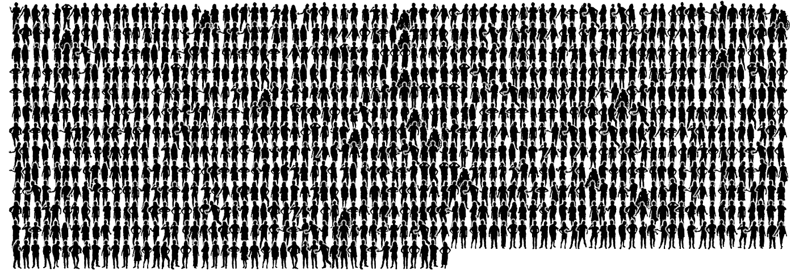

上面是所有 980 名健康人。再说一遍，黑色是健康的。

这里有 20 名感染者。橙色表示受感染。

## 特征

特异性衡量测试对未感染的人(即健康人)的诊断准确度。换句话说:特异性衡量一项测试区分“真阴性”和“假阳性”的能力。

要理解“特异性”，我们只需要看看我们的健康人群。下面我们将看到一个 95%特异性的假设测试是如何将我们的 980 名健康人分开的。

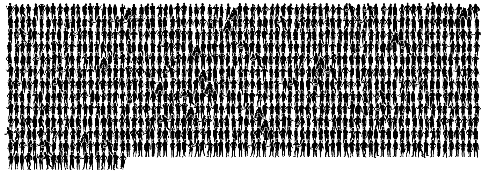

931 真阴性。这些是被正确诊断为阴性的健康人。

给定一个 95%特异性的测试，我们的 980 个健康人中的 931 个(95%)将被正确诊断为阴性(如上)。这些是“真正的否定”

49 次误报。这些是被错误诊断为阳性的健康人。

不幸的是，在 95%的特异性测试中，我们的 980 名健康人中有 49 人(5%)会被**错误地**诊断为阳性。这些是“误报”

假阳性是坏消息，因为这些人会被不必要地隔离，并可能从实际患病的患者那里夺走大量医疗资源。

## 灵敏度

敏感度衡量的是一项测试对 T4 实际上被感染的人的诊断有多准确。换句话说:敏感度衡量的是一项测试区分“真阳性”和“假阴性”的能力。

要理解“敏感”，我们只需要看看我们的感染者。下面我们将看到一个 80%灵敏度的假设测试如何将我们的 20 名感染者分开。

16 个真阳性。这些是被正确诊断为阳性的感染者。

给定一个 80%敏感的测试，我们的 20 个感染者中的 16 个(80%)将被正确诊断为阳性(如上)。这些是“真正的积极因素”

4 假阴性。这些感染者被错误地诊断为阴性。

不幸的是，在 80%的敏感性测试中，20 名感染者中有 4 人(20%)会被错误地诊断为阴性。这些是“假阴性”

假阴性很麻烦，因为如果有人认为他们实际上被感染时是健康的，他们可能会放松警惕，不知不觉地感染周围的人。

## 分析与临床表现

最后要考虑的是测量是指测试的“分析”还是“临床”表现。

*   “分析”性能是测试在理想条件下的表现。
*   “临床”表现是测试在实践中的表现。

临床表现取决于许多因素，例如样本的采集方式。例如，当 PCR 测试基于鼻咽拭子(用棉签穿过你的鼻子戳你的大脑)时，它们的灵敏度较低(73%的灵敏度)，而基于唾液样本的聚合酶链式反应测试([咳痰](https://youtu.be/92dT_1kbbek?t=117))则更灵敏(97.2%的灵敏度)( [src](https://www.ncbi.nlm.nih.gov/pmc/articles/PMC7350782/) )。

下面，我尽可能报告分析和临床测量。但是为了我们的实验，我们将使用“分析”性能，因为该度量更容易获得。

## 实际结果可能有所不同…

当测试一个 1000 人的实际样本时，结果会有很大差异。比如说…

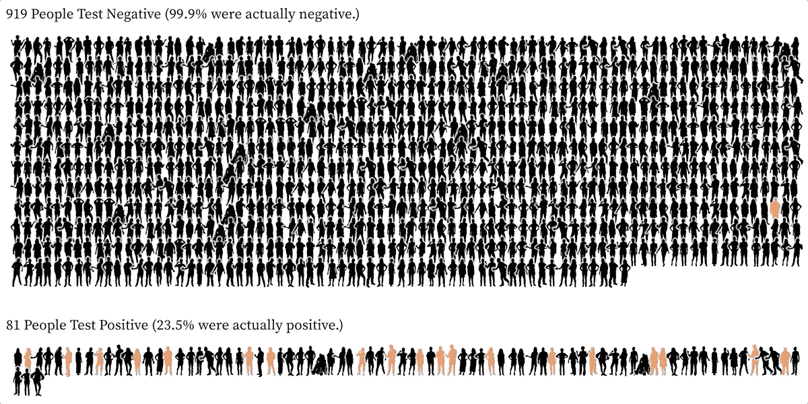

我们对 1000 人进行假设性测试(80%灵敏度，95%特异性)的测试结果示例。最上面一组测试为阴性(包括真阴性和假阴性)。底部组测试为阳性(包括真阳性和假阳性)。

上面你可以看到我们的 1，000 人除以他们的测试结果(对于我们的假设测试)。测试结果呈阴性的人在第一组。测试呈阳性的人在最底层。

你会注意到在最上面的一组中有几个受感染的(橙色)人。这些是假阴性。这是测试灵敏度不理想的结果。当一项检测的灵敏度较低时，更多实际被感染的人会得到不正确的阴性结果。

你还会注意到底层群体中有一些健康的(黑人)人；这些都是假阳性，这是测试特异性不完善的结果。当一项检测的特异性较低时，更多未被感染的人会得到不正确的阳性结果。

# 测试测试

现在我们已经了解了测试准确性的不同度量标准(特异性和敏感性)，让我们来看看真实测试的一些测量方法，看看它们在我们的人群中表现如何。

# 诊断测试(针对当前感染)

诊断测试告诉你在测试时疾病是否存在。

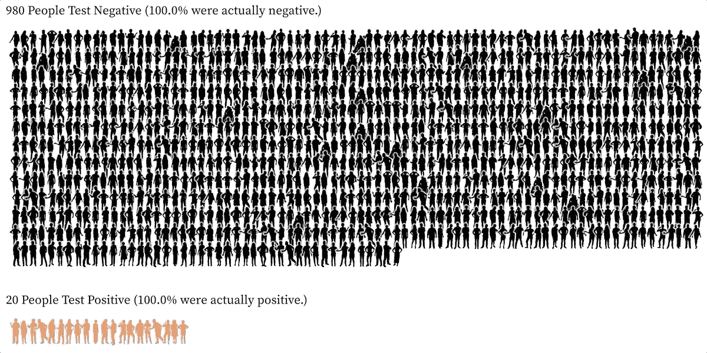

示例测试结果，在我们 1000 人的人口中模拟 RT-聚合酶链式反应测试(w/ 99%灵敏度，99%特异性)。最上面一组测试为阴性(包括真阴性和假阴性)。底部组测试为阳性(包括真阳性和假阳性)。

## **RT-PCR (** “逆转录聚合酶链反应”)

PCR 测试是最常见的测试类型。尽管 CDC 在这些方面的第一次尝试是错误的( [src](https://www.technologyreview.com/2020/03/05/905484/why-the-cdc-botched-its-coronavirus-testing/) )，PCR 测试被认为是“黄金标准”和最准确的。缺点:它们需要训练有素的人员、昂贵的设备和几个小时才能完成( [src](https://www.nature.com/articles/d41586-020-02140-8) )。

*   准确性:分析性能接近 100%的灵敏度、100%的特异性( [src](https://www.cap.org/member-resources/articles/how-good-are-covid-19-sars-cov-2-diagnostic-pcr-tests) 、 [src](https://www.ncbi.nlm.nih.gov/pmc/articles/PMC7498299/) )，而临床灵敏度的范围可以是 66% - 97% ( [src](https://en.wikipedia.org/wiki/COVID-19_testing#Sensitivity_and_specificity) 、 [src](https://www.ncbi.nlm.nih.gov/pmc/articles/PMC7350782/) )，这取决于样本的采集方式和采集时间。
*   费用 **:** $60 - $300，无保险( [src](https://www.wsj.com/articles/covid-19-tests-answers-on-cost-accuracy-and-turnaround-time-11599134378) )
*   时机:在夏季，这些可能需要几个星期才能收回。最近，如果你去纽约的紧急护理中心，你可以在 3 - 4 天内得到结果
*   工作原理:PCR 测试是一种“分子”测试。它们与新冠肺炎的 DNA 序列相匹配。
*   示例系统: [BD Max](https://moleculardiagnostics.bd.com/bd-max-system/) 、[雅培 m2000](https://www.molecular.abbott/us/en/products/instrumentation/m2000-realtime-system) 、[赛默飞世尔 TaqPath](https://www.thermofisher.com/us/en/home/clinical/clinical-genomics/pathogen-detection-solutions/sars-cov-2-covid-19.html) 、[罗氏科巴斯](https://diagnostics.roche.com/us/en/products/params/cobas-sars-cov-2-test.html)

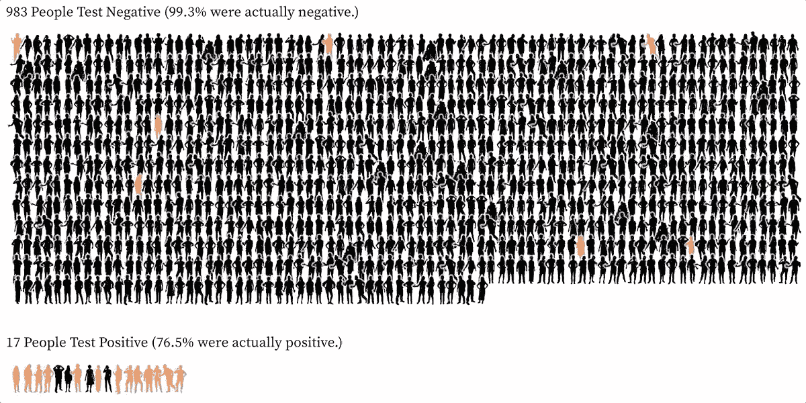

示例测试结果，模拟对我们 1000 人的人口进行的快速抗原测试(灵敏度为 56%，特异性为 99%)。最上面一组测试为阴性(包括真阴性和假阴性)。底部组测试为阳性(包括真阳性和假阳性)。

## **快速抗原检测**

从 5 月份开始，快速抗原检测在最近变得可行。它们在现场更容易操作，并且可以在大约 15 分钟内返回结果( [src](https://www.wsj.com/articles/covid-19-tests-answers-on-cost-accuracy-and-turnaround-time-11599134378) )，但是它们通常不太准确。这些测试的部分假设是它们可以更频繁地执行；即使他们不太敏感，更频繁的测试从长远来看也是有效的( [src](https://www.nejm.org/doi/full/10.1056/NEJMp2025631) )。

*   准确性:荟萃分析显示平均分析性能为 56.2%的敏感性和 99.5%的特异性( [src](https://pubmed.ncbi.nlm.nih.gov/32845525/) )。在另一项关于临床表现的研究中，敏感度下降至 30.2% ( [src](https://www.ncbi.nlm.nih.gov/pmc/articles/PMC7240272/) )。
*   费用:25-100 美元，不含保险
*   计时:大约 15 分钟
*   工作原理:抗原测试寻找新冠肺炎蛋白。
*   示例系统: [BD 验证器](https://www.bdveritor.com/)， [Abbott BinaxNow](https://www.abbott.com/BinaxNOW-Test-NAVICA-App.html)

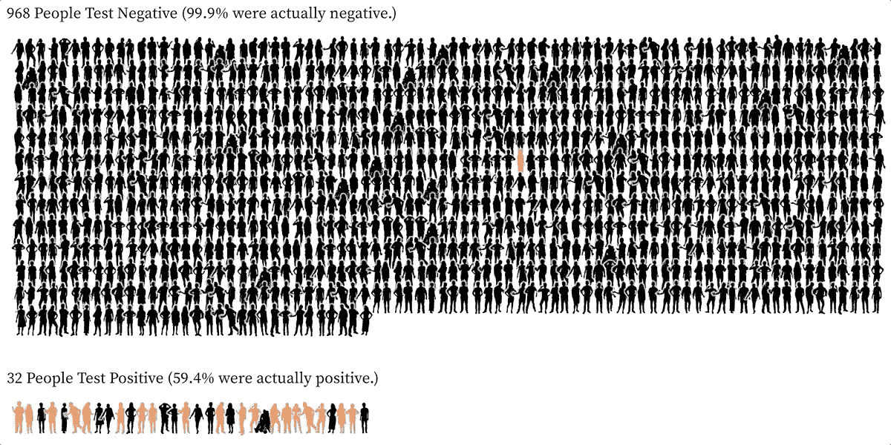

示例测试结果，模拟对我们 1000 人的人口进行的快速分子测试(灵敏度为 95%，特异性为 99%)。最上面一组测试为阴性(包括真阴性和假阴性)。底部组测试为阳性(包括真阳性和假阳性)。

## **快速分子检测**

FDA 早在三月份就批准了 Abbot ID NOW 测试。这是他们在白宫用的测试( [src](https://www.nytimes.com/interactive/2020/05/12/us/coronavirus-testing-white-house.html) )。(我们都知道结果如何。)与其他快速测试一样，这些测试在现场进行，可在 5-13 分钟内返回结果。他们也应该比抗原测试更准确，但一些研究表明，它并不像广告宣传的那样准确。

*   准确性:荟萃分析显示典型的分析性能为 95.2%的敏感性和 98.9%的特异性( [src](https://pubmed.ncbi.nlm.nih.gov/32845525/) )。NYU 的一项实验显示，灵敏度可以低至 52% ( [src](https://www.nbcnews.com/health/health-news/live-blog/2020-05-13-coronavirus-news-n1205916/ncrd1206626#blogHeader) 、 [src](https://www.biorxiv.org/content/10.1101/2020.05.11.089896v1) )。
*   时间:5 - 13 分钟
*   工作原理:像 PCR 测试一样，快速分子测试与新冠肺炎 DNA 序列相匹配。
*   示例系统:[方丈 ID 现](https://www.abbott.com/IDNOW.html)

# 抗体测试(针对既往感染)

抗体测试确定病人是否在过去某个时候被感染。

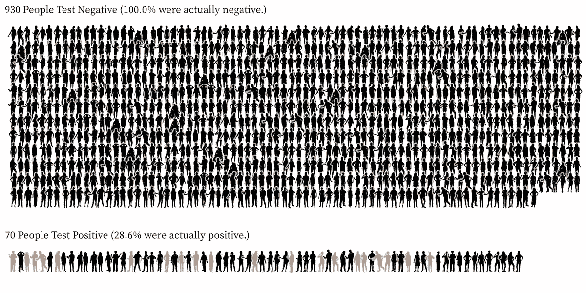

示例测试结果，模拟对我们 1000 人的人口进行的抗体测试(灵敏度为 93%，特异性为 95%)。最上面一组测试为阴性(包括真阴性和假阴性)。底部组测试为阳性(包括真阳性和假阳性)。

## **血清学/抗体/血液测试**

血清测试在初次感染后 1 至 3 周检测疾病( [src](https://www.cdc.gov/coronavirus/2019-ncov/lab/serology-testing.html) )。它们通常是准确的，您将在 3 到 7 天内得到结果。

*   准确性:对于血清学/抗体测试(ELISA)，一项研究显示敏感性在 86% - 100%之间，特异性在 89% - 100%之间( [src](https://www.ncbi.nlm.nih.gov/pmc/articles/PMC7498299/#CR78) )。
*   费用:50-135 美元，不含保险
*   时间:3 - 7 天
*   工作原理:抗体测试检测你身体用来对抗新冠肺炎病毒的抗体。

# 抛硬币测试

显然抛硬币不是探测新冠肺炎的有效方法(爸爸！)，但是让我们看看那看起来像什么:

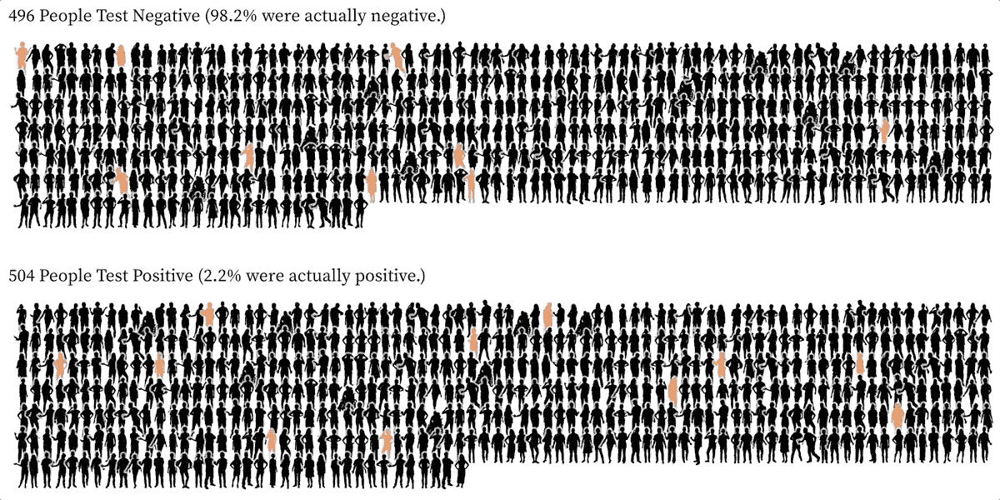

示例测试结果，模拟对我们 1000 人的人口进行硬币翻转测试(50%灵敏度，50%特异性)。最上面一组测试为阴性(包括真阴性和假阴性)。底部组测试为阳性(包括真阳性和假阳性)。

正如所料，您可以看到大约相同数量的人测试为阳性和测试为阴性，受感染的人(橙色)均匀地混合在两组中。

# “抛硬币”

这种“抛硬币”的想法从何而来？如果你用谷歌搜索“covid 测试抛硬币”，你会看到几个[可信的](https://www.npr.org/transcripts/834497497) [来源](https://medical.mit.edu/faqs/faq-testing-covid-19)使用这个类比。

例如，这位[科学美国人解说](https://blogs.scientificamerican.com/observations/beware-of-antibody-based-covid-19-immunity-passports/)写道:

> “如果有一个灵敏度和特异性都达到 99%的近乎完美的测试会怎么样？看起来很棒，不是吗？如果在一个患病率为 1%的国家使用这种测试，那么阳性测试的预测值将只有 50%——扔硬币决定！”

从[提交](https://medical.mit.edu/faqs/faq-testing-covid-19):

> “但即使是这些测试的准确性也取决于人口中实际接触过病毒的人的百分比。例如，在感染率为 5%的人群中，一项特异性为 95%、灵敏度为 95%的测试将返回与真阳性相同数量的假阳性，这使得任何单个结果都不会比掷硬币更有用。”

这些例子是真实的，但有点令人困惑。重要的是要看看他们如何限定“抛硬币”的说法。在这两个例子中，他们指的是测试的阳性预测值，即“如果我得到阳性测试结果，我实际上有 covid 的概率是多少？”

这不同于说“测试提供的信息并不比医生向空中扔硬币多”，但它确实提出了一个关于测试在实践中如何使用的重要问题。

在现实生活中，仅凭测试结果不足以诊断一个人。您还必须考虑他们的背景和此人先前感染的可能性(例如，患者是否有可能已经被感染？他们是否接触过其他确诊患者？他们有症状吗？).

例如，假设事先不知道患者接触情况的阳性结果有 50%的机会是真阳性，但如果你知道那个人以前接触过，阳性测试结果更有可能是真的。或者，在一个低患病率的人群中，如果一个以前没有接触过的患者得到了阳性结果，你可能会有点怀疑这是假阳性。

这也解释了为什么你可能会看到疾病控制中心改变他们的筛选标准；随着 Covid 患病率的上升和下降，我们之前的暴露概率和检测策略也会随之改变。

# 外卖食品

*   评估测试准确性需要考虑两个方面:敏感性和特异性。
*   每种测试都有不同的权衡，但即使是最不敏感的测试(快速抗原测试)也比掷硬币好得多。
*   为了真正理解检测的有效性，你必须考虑它在临床实践和人群先前感染概率中的准确性。

我是谁？不，不，*你是谁？！*

嗨！我是伊莱·霍德。[我帮助客户设计和开发忙碌的人和他们杂乱的数据之间的有效接口](https://3isapattern.com/?utm_source=medium)。如果你是一名创始人、创客、讲故事者、非营利行善者或商业领袖，正在思考数据、设计和用户心理的交集，我很乐意联系并聆听你的故事。

你可以发电子邮件到 eli@3isapattern.com 给我，或者在推特上关注我。

特别感谢 [Laura Gast](https://www.linkedin.com/in/laurabgast) 的流行病学观点和患者反馈！