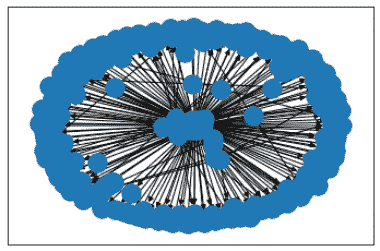
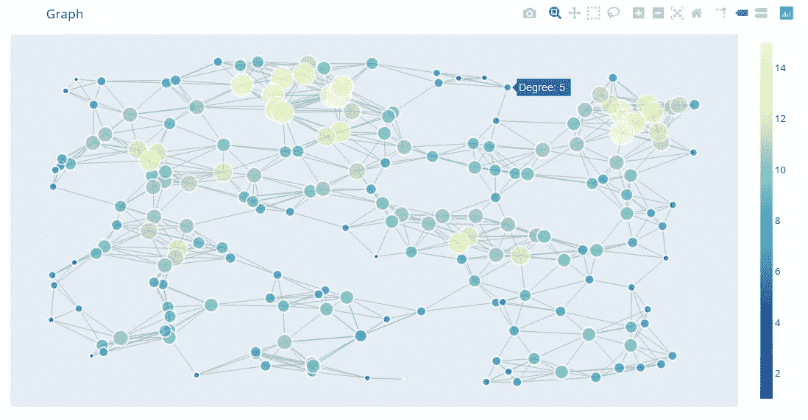
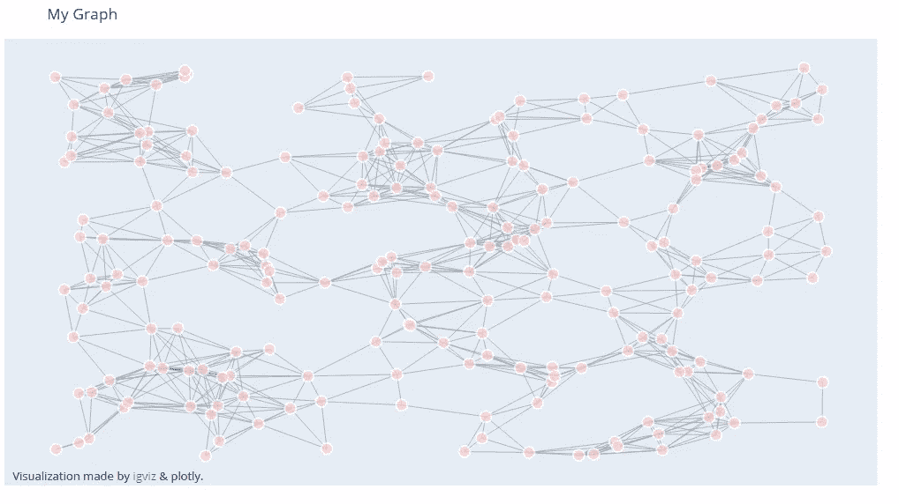
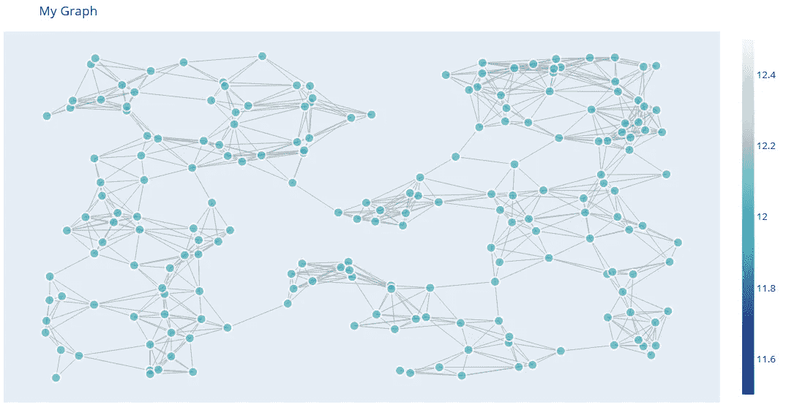
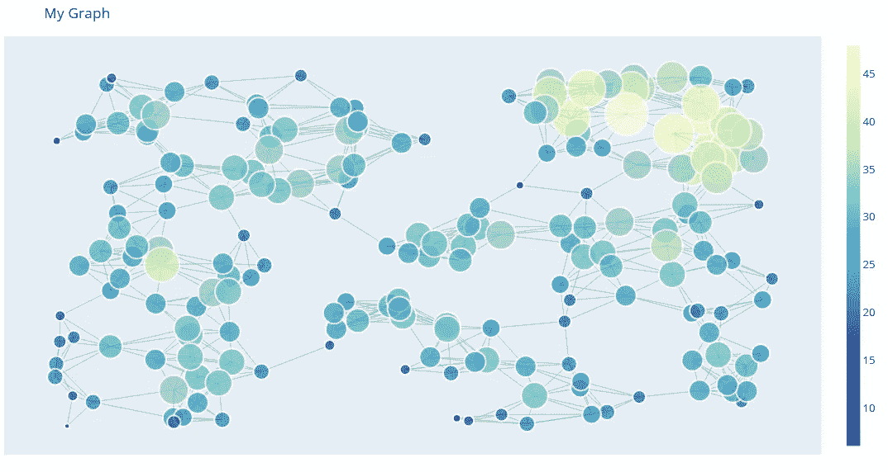
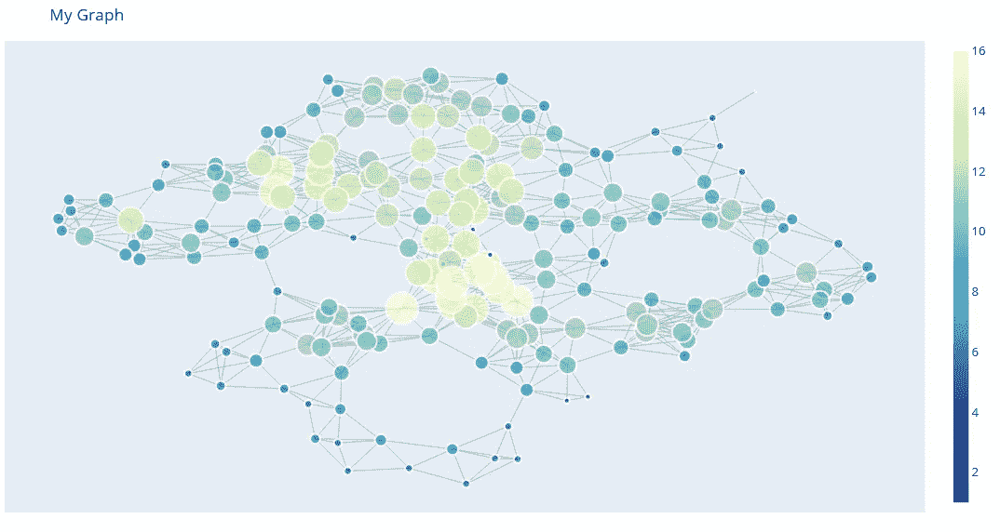

# 用 IGViz 交互式绘制图形网络

> 原文：<https://towardsdatascience.com/interactively-plot-graph-networks-with-igviz-c75da26858ec?source=collection_archive---------44----------------------->

## 使用 Plotly 轻松查看图形网络


来自 [@jusspreme](https://www.instagram.com/jusspreme/?hl=en) 的 Justin Jairam 拍摄的照片

在过去的几个月里，我开始探索使用图形网络来检测网络安全中的恶意和非恶意行为。我发现处理图形的一个主要难点是以简洁、视觉上吸引人的方式可视化网络、节点属性和边。默认的绘图选项建立在 Matplotlib 上，这对于这种类型的可视化来说是次优的。



使用 Matplotlib 的默认图形绘制

我不想摆弄 Matplotlib axes API，手动定制图表或创建一次性函数，而是想要一些更健壮、开箱即用、视觉上更吸引人和简洁的东西，同时最大限度地增加图表上可以显示的信息量。

进来的是我最喜欢的可视化库 Plotly。Plotly 已经有了一些关于如何可视化图形的[文档](https://plotly.com/python/network-graphs)，但这仍然是一个相当漫长的过程，并且只针对非定向图形。目标是找到(或创建)一个遵循`.plot`标准的统一 API，并对图形进行一些定制。因此，我做了这个叫做[交互式图形可视化(igviz)](https://github.com/Ashton-Sidhu/plotly-graph) 的包。

> **注意:**目前仅支持 Networkx，但下一步将扩展到 Apache 的`Graphx`。

要查看任何情节的交互性，您可以在这里查看[。](https://ashton-sidhu.github.io/Blog/jupyter/graph/visualization/2020/03/27/intro-to-igviz.html#The-Basics)

# 使用

安装运行`pip install igviz`

```
import networkx as nx
import igviz as ig
```

出于演示目的，创建一个随机图，为每个节点分配一个名为`prop`的属性，并将值设为 12。

```
G = nx.random_geometric_graph(200, 0.125)
nx.set_node_attributes(G, 12, "prop")
```

默认情况下，节点的大小和颜色由其自身的度数决定。节点的度就是它拥有的边(连接两个节点的线)的数量。悬停在节点上可以看到节点的度数！

> **注意:**这也适用于有向图和多重图。有向图将显示从节点到节点的箭头。

```
fig = ig.plot(G)
fig.show()# ig.plot(G) also works.
```



使用 IGViz 的默认图形绘制

> **提示:**谈到可定制性，您可以将节点的大小(`size_method`)更改为静态的，基于节点的属性或您自己的定制大小方法。
> 
> **提示:**颜色可以改变(`color_method`)为静态颜色(十六进制、纯文本等)。)，基于节点的属性或您自己的自定义颜色方法。

还有更多的选项，还会有更多的选项，但这些选项会极大地影响图表的可视化和信息。

# 自定义图形外观

这里所有的节点都被设置为相同的大小，颜色被设置为浅红色，同时在悬停时显示`prop`属性。

> **提示:**要在悬停时显示节点的属性，请为您想要显示的节点属性的`node_text`参数指定一个列表。默认情况下，仅显示度数。

```
fig = ig.plot(
    G, # Your graph
    title="My Graph",
    size_method="static", # Makes node sizes the same
    color_method="#ffcccb", # Makes all the node colours black,
    node_text=["prop"], # Adds the 'prop' property to the hover text of the node
    annotation_text="Visualization made by <a href='https://github.com/Ashton-Sidhu/plotly-graph'>igviz</a> & plotly.", # Adds a text annotation to the graph
)

fig.show()
```



> **提示**:如果你想在一条边上悬停时显示边属性，调用`ig.plot`时添加`show_edgetext=True`！

这里，调整大小和颜色的方法基于每个节点的`prop`属性，我们在悬停时显示`prop`属性。

```
fig = ig.plot(
    G,
    title="My Graph",
    size_method="prop", # Makes node sizes the size of the "prop" property
    color_method="prop", # Colors the nodes based off the "prop" property and a color scale,
    node_text=["prop"], # Adds the 'prop' property to the hover text of the node
)

fig.show()
```



要添加您自己的大小和颜色方法，请将与图中每个节点相关的颜色或大小列表传递给`size_method`和`color_method`参数。

> **提示:**要改变色阶，改变`colorscale`参数！

```
color_list = []
sizing_list = []for node in G.nodes():
    size_and_color = G.degree(node) * 3 color_list.append(size_and_color)
    sizing_list.append(size_and_color)fig = ig.plot(
    G,
    title="My Graph",
    size_method=sizing_list, # Makes node sizes the size of the "prop" property
    color_method=color_list, # Colors the nodes based off the "prop" property and a color scale
    node_text=["prop"], # Adds the 'prop' property to the hover text of the node
)fig.show()
```



# 布局

您可以通过指定布局类型来更改图表的组织和布局方式。Networkx 附带了可以使用的预定义布局，我们可以通过`layout`应用它们。

默认情况下，igviz 寻找`pos`节点属性，如果它不存在，它将默认为随机布局。

支持的布局有:

*   **随机(默认)**:在单位正方形内随机均匀放置节点。对于每个节点，通过在区间[0.0，1.0]上均匀随机地选择每个 dim 坐标来生成位置。
*   **圆形**:在一个圆上定位节点。
*   **kamada** :使用 Kamada-Kawai 路径长度成本函数定位节点。
*   **平面**:如果可能的话(如果图形是平面的)，定位没有边相交的节点。
*   **spring** :使用 Fruchterman-Reingold 力定向算法定位节点。
*   **谱**:使用图拉普拉斯的特征向量定位节点。
*   **螺旋**:在螺旋布局中定位节点。

```
fig = ig.plot(
    G,
    title="My Graph",
    layout="kamada"
)

fig.show()
```

要添加您自己的`pos`属性，您可以通过`nx.set_node_attributes`功能进行设置。

```
pos_dict = {
    0: [1, 2], # X, Y coordinates for Node 0
    1: [1.5, 3], # X, Y coordinates for Node 1
    ...
}

nx.set_node_attributes(G, pos_dict, "pos")

fig = ig.plot(G)

fig.show()
```



# 反馈

我鼓励所有关于这个帖子或 Igviz 的反馈。你可以给我发电子邮件到 sidhuashton@gmail.com 或者在帖子上留言。

如果你喜欢这个项目，请给它一个[星](https://github.com/Ashton-Sidhu/plotly-graph)以及关注我在[推特](https://twitter.com/ashtonasidhu)上的更多更新！

任何错误或功能请求，请在 Github repo 上创建一个问题。我欢迎所有功能请求和任何贡献。如果你想为一个开源项目做贡献，这个项目是一个很好的开端——如果你需要帮助，可以随时给我发消息。