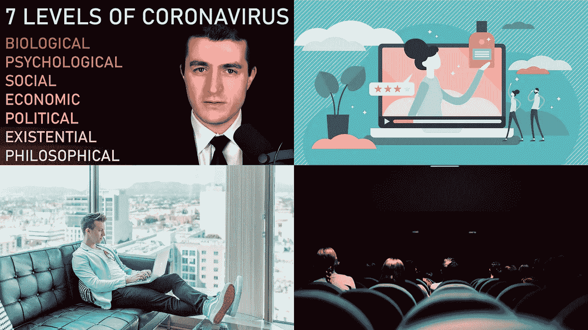

# 我本周(4 月 11 日)看到的有趣的 AI/ML 相关文章

> 原文：<https://towardsdatascience.com/interesting-ai-ml-articles-i-came-across-this-week-18a1cde18629?source=collection_archive---------35----------------------->

## 由于我们大多数人都有更多的空闲时间，高亮显示的文章对那些想学习新东西或只想寻找分散注意力的内容的人来说是有用的

包括文章的封面图片

与 2020 年的其他任何一周相比，我在媒体上花了更多的时间，对于许多读者来说也是如此。

我们中的许多人目前都处于禁闭状态，正在寻找打发时间的方法。我们中的一些人在寻找关于正在进行的疫情的可靠信息和建议，而我们中的大多数人宁愿分心。

下面是我在 Medium 上看到的一些文章，它们符合我上面提到的标准。我建议在这篇文章中找到一两篇适合你的文章，并探究它们的内容。

所选文章写得很好，结构清晰，包含不同类型的机器学习爱好者感兴趣的内容。

享受吧。

## 14 天隔离期间要做的 14 个数据科学项目

随着全球主要国家和城市实施封锁，这一时期是数据科学家和机器学习从业者提高现有技能和研究投资组合的绝佳机会。

这就是为什么 [Terence Shin 的](https://medium.com/u/360a9d4d19ab?source=post_page-----18a1cde18629--------------------------------)文章是一篇适时的文章。特伦斯为读者提供了 14 个项目，他们可以在这个不确定的时期着手处理。

特伦斯在文章的开头表达了对全球成千上万正在抗击疫情冠状病毒的医疗专业人员的感谢。

本文中的项目分为三个部分，即:可视化、探索性数据分析和预测建模。每个项目的难度也有记录。初学者可以完成至少七个标有“简单”的项目。

文章中的项目主题的变化非常相关，准备探索冠状病毒和基于全球气候的数据集。

我将把这篇特别的文章推荐给数据科学领域的初学者，或者任何想在他们的投资组合中增加一些项目的人。

 [## 14 天隔离期间要做的 14 个数据科学项目

### 2020 年发展新技能和强化你的投资组合的终极项目清单

towardsdatascience.com](/14-data-science-projects-to-do-during-your-14-day-quarantine-8bd60d1e55e1) 

## 冠状病毒:我们的立场和我们下一步该做什么 [Lex Fridman](https://medium.com/u/119b8eb57f8e?source=post_page-----18a1cde18629--------------------------------)

Lex Fridman 是一个许多机器学习实践者可能已经熟悉的人。

他最近写了一篇文章，提供了关于冠状病毒疫情的重要统计信息。书面材料中的统计数据主要集中在美国，包括疫情对美国经济影响的信息。它还强调了美国医疗机构面临的困难。

在他的最新文章中，Lex 提供了宝贵的信息和建议，告诉我们作为个人，如何在帮助整个人类度过疫情方面发挥作用。阅读这篇文章，显而易见，我们都有一个角色要扮演，每个人都间接对周围人的健康和安全负责。

文章中提供的信息附有大量可信的资源。这些资源为读者提供了关于持续使用口罩及其有效性的问题的深入细节。他甚至包括视频，提供更多关于口罩使用和有效性的信息。

我强烈推荐这篇文章被阅读和分享；所提供的知识可以在这个前所未有的时代保护你和你的家人的安全。

 [## 冠状病毒:我们的立场和下一步该做什么

### 一些观点基于现有的最佳科学和数据，关于我们的立场和我们下一步应该做什么。

medium.com](https://medium.com/@lexfridman/coronavirus-where-we-stand-and-what-we-should-do-next-2da929dbdab4) 

## 关于人工智能和大数据的前 20 部电影

许多媒体作家已经意识到，人们现在在封锁期间有更多的空闲时间。

[Benedict Neo](https://medium.com/u/9a24cc840494?source=post_page-----18a1cde18629--------------------------------) 就是其中之一，他写了一篇有趣的文章，列出了面向人工智能和数据科学的电影。

我自己看了列表，我已经看了 90%的电影，我很感激《黑客帝国》被包括在内(*额外鼓掌！*)。

《星球大战》、《机械战警》和《终结者》等经典作品都包括在内，还有《查皮》、《星际穿越》和《她》等更现代的杰作。

对于每一部呈现的电影，本尼迪克特都写了一个总结，没有任何剧透。此外，每个摘要中都包含一个声明，说明每部电影探索了人工智能和数据科学的哪个方面；有些是基于人工智能的社会影响和其他焦点技术的影响。

*我有点震惊的是* [*改碳*](https://www.imdb.com/title/tt2261227/) *竟然没有列入名单。然而，这是一本好书。*

 [## 关于人工智能和大数据的 20 大电影。

### 这里有一些人工智能和大数据电影，你应该在新冠肺炎封锁期间在家观看。

towardsdatascience.com](/top-20-movies-about-machine-learning-ai-and-data-science-8382d408c8c3) 

## 脸书开源架构的个性化神经推荐系统

这篇文章是面向更专业的读者的。

[Jesus Rodriguez](https://medium.com/u/46674a2c9422?source=post_page-----18a1cde18629--------------------------------) 对脸书用于个性化推荐系统的深度神经网络(DNN)架构进行了深入的总结和评估。

这篇文章提到了这样一点，当谈到个性化推荐系统的实现时，没有一种标准化的方法可以利用。

Jesus 提到脸书发布了他们的 DNN 推荐系统架构:RMC1、RMC2 和 RMC3 对于任何着手实现推荐系统的人来说都是合适的可配置蓝图。

我觉得这篇特别的文章很有见地，因为它包括了视觉插图，突出了脸书的三个 DNN 主题架构之间的差异，并提供了关键差异的文本解释。

 [## 个性化神经推荐系统的脸书开源架构

### 一份新的研究报告和参考架构总结了评估用于个性化服务的 DNN 系统的经验

towardsdatascience.com](/facebook-open-sources-architecture-for-personalized-neural-recommendation-systems-4f3668876660)