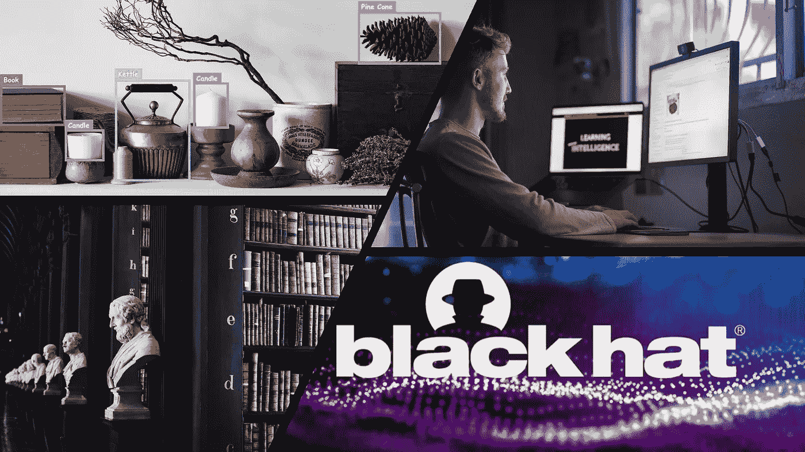

# 本周(8 月 15 日)你应该阅读的有趣的人工智能/人工智能文章

> 原文：<https://towardsdatascience.com/interesting-ai-ml-articles-you-should-read-this-week-aug-15-a050217b1c42?source=collection_archive---------34----------------------->

## 安全性、数据隐私和对象检测只是本周有趣的 AI/ML 相关文章中涵盖的几个主题，您不应错过。

随着直观的、新的和侵入性的技术的出现，安全和隐私将永远是人们讨论的话题，这些技术模糊了隐私的界限。

安全是国家一级的优先事项，隐私被视为个人的基本人权。

尽管数据科学家和机器学习工程师可能不是强制实施安全措施的必要倡导者，但我们确实应该对这一主题有一个高层次的认识。

## 关于这一点，本周的文章涉及以下内容:

*   ***数据隐私的大网及其失手***

*   *****详细探索解决物体检测的流行深度学习方法*****
*   *****一个机器学习工程师历程的回顾。从学习者到教育者。*****

****

**提到的有趣文章的封面图片**

# **[阿伦·卡彭特](https://medium.com/u/f940c24a2ebf?source=post_page-----a050217b1c42--------------------------------)的数据收集伦理**

> **了解数据隐私法不断变化的面貌，以及普遍存在的漏洞。**

**阿伦·卡彭特揭示了数据隐私监管中适应性的重要性，他展示了监管机构在处理个人和私人数据方面众所周知的失误。**

**阿伦的文章深入研究了数据隐私法从 HIPAA (1996 年)综合最终规则(2013 年)到更现代的 GDPR 的演变。**

**阿伦发表声明，暗示模糊的界限和模糊的隐私法导致的模糊性，使一个组织难以跨越患者隐私的界限。**

**尽管如此，本文的第一部分阐述了政府和监管机构为与技术进步和信息收集同步更新数据隐私法所做的努力。**

**本文的第二部分揭示了最初提出的数据隐私法的明显不适应性，这些法律对卫生组织持有的数据施加了限制。**

**阿伦讨论了过时的数据隐私法的失败，因为这些法律没有考虑到几十年后将出现的社交媒体网络和组织，这些网络和组织将聚合这些平台用户的健康数据和信息。**

**阿伦在文章的最后提到了不可避免的即将到来的数据隐私疏忽，这主要源于技术的不断发展，而不是管理机构的疏忽。**

**这篇文章向读者传达的最后一个信息是，数据保护的责任从管理机构转移到了个人身上。Aren 提供了一套指导方针，数据科学家和个人可以利用这套指导方针来培养对道德来源数据标准的认识。**

## **非常适合阅读:**

*   *****对数据隐私感兴趣的个人*****
*   *****数据科学家/数据分析师*****

** [## 数据收集的伦理

### 您的数据来源是否符合道德规范？

towardsdatascience.com](/the-ethics-of-data-collection-9573dc0ae240)** 

# **我们在黑帽 2020 上看到的最可怕的事情**

> **一篇文章形式的展览，介绍了读者和安全专家在今年的 BlackHat 活动中应该了解的有价值的演讲、工具和技术。**

**安全和隐私始终是一个随着更先进的技术和工具的发展而变化的话题。**

**在 2020 年，我们观察到了基于国家安全和数据隐私问题对大量使用的移动应用程序的审查。**

**由于新冠肺炎的限制和安全措施，一年一度的黑帽安全会议在网上广泛举行。 [PCMag](https://medium.com/u/b3ca0a39a185?source=post_page-----a050217b1c42--------------------------------) 撰写了一篇文章，简要介绍了在此次活动中脱颖而出的演讲、技术和工具。**

**准备阅读一些工具的汇编，这些工具颠倒了被跟踪者和跟踪者之间的角色；或者探索卫星无线网络安全漏洞的工具。**

**PCMag 汇编文章还包括安全专家的一系列演讲，传达他们在国家层面的安全担忧和经验。其中一些会谈包括探讨美利坚合众国选举期间与安全有关的话题。**

**在 PCMag 的编辑列表中，最让我印象深刻的是类似间谍的设备的亮相，这些设备采用日常用品的形状，如灯。**

## **非常适合阅读:**

*   *****安全爱好者*****
*   *****安全专家*****

** [## 我们在黑帽 2020 看到的最恐怖的事情

### 每年，黑客和研究人员都聚集到拉斯维加斯参加黑帽安全会议(有些人留下来参加…

medium.com](https://medium.com/pcmag-access/the-scariest-things-we-saw-at-black-hat-2020-7406f8f1d19a)** 

# **你应该阅读的 12 篇论文，以了解深度学习时代的对象检测，作者:[伊森·颜佳·李](https://medium.com/u/60ef96b05d56?source=post_page-----a050217b1c42--------------------------------)**

> **解决物体检测的流行深度学习方法的详细探索**

**对象检测是基于计算机视觉的重要任务之一，研究人员和学者已经设计了算法和基于启发式的方法。**

**最近，用于解决对象检测的大多数解决方案都植根于深度学习技术和方法的利用。**

**[伊森·颜佳·李](https://medium.com/u/60ef96b05d56?source=post_page-----a050217b1c42--------------------------------)撰写了一篇文章，探讨了过去十年来解决物体检测的深度学习方法的发展。**

**Ethan 的文章首先简要解释了对象检测问题；还包括正确理解文章内容所需的必备知识。**

**每个包含的深度学习方法都配备了以下内容:它被引入的年份；该技术的相应研究论文的链接，更重要的是对该方法如何工作和实现的详细解释。**

**Ethan 能够压缩与所展示的技术相关的重要信息，而不会创建让大多数普通读者感到厌烦的冗长的技术分析，这给我留下了非常深刻的印象。**

**每一种介绍的方法都用图像来补充，说明一种技术的对象检测方法或算法过程。**

**本文中包含的对象检测技术的示例有 Yolo、RCNN、Overfeat 和 RetinaNet。**

**为了结束这篇写得很好的文章，Ethan 包括了一些值得注意的深度学习方法，这些方法补充了前面提到的技术，或者提供了对对象检测问题的进一步见解，并提出了解决方案。**

## **非常适合阅读:**

*   *****数据科学家*****
*   *****深度学习从业者*****

** [## 你应该阅读的 12 篇论文，以了解深度学习时代的对象检测

### 快速浏览十年来最好的物体检测论文，帮助你学习更高级的计算机视觉

towardsdatascience.com](/12-papers-you-should-read-to-understand-object-detection-in-the-deep-learning-era-3390d4a28891)** 

# **我将如何重新开始学习机器学习(3 年内)作者[丹尼尔·伯克](https://medium.com/u/dbc019e228f5?source=post_page-----a050217b1c42--------------------------------)**

> **回顾机器学习工程师从学习者到教育者的历程。**

**丹尼尔·伯克在在线机器学习社区中迅速成为一个熟悉的名字。多年来，丹尼尔发布了许多文章、视频、课程和材料，为机器学习学生和从业者提供了对机器学习行业不同方面的见解。**

**丹尼尔已经经历了三年多事的机器学习之旅，他写了一篇文章，回顾性地分析了他的旅程和经历中的关键事件。**

**本文的前半部分是以讲故事的方式讲述的，普通读者会喜欢。丹尼尔提到了他旅程的开始，从他卑微的学识到他的职业经历。**

**Daniel 讨论了想要转移到下一个闪亮框架、构建更多工具以及进行研究的感觉。他还包括一个关于积累机器学习相关证书问题的论述。**

**文章的后半部分是 Daniel 将如何处理他在机器学习相关主题中学习和获取知识的整个经历的蓝图。**

**这个蓝图对于那些可能被互联网上的大量可用资源淹没的初学者来说是一个有用的资源。充斥着资源链接，后半部分侧重于用时间测量指标来指导读者如何进行机器学习研究，他提到，应该用个人项目来补充。**

## **非常适合阅读:**

*   *****数据科学家*****
*   *****机器学习工程师*****

** [## 本周(8 月 9 日)你应该阅读的有趣的人工智能/人工智能文章

### 本周值得一读的文章汇编

towardsdatascience.com](/interesting-ai-ml-articles-you-should-read-this-week-aug-9-dddbb25bb69c)** 

# **我希望这篇文章对你有用。**

**要联系我或找到更多类似本文的内容，请执行以下操作:**

1.  **订阅我的 [**邮件列表**](https://richmond-alake.ck.page/c8e63294ee) 获取每周简讯**
2.  **跟着我上 [**中**](https://medium.com/@richmond.alake)**
3.  **通过 [**LinkedIn**](https://www.linkedin.com/in/richmondalake/) 联系我**