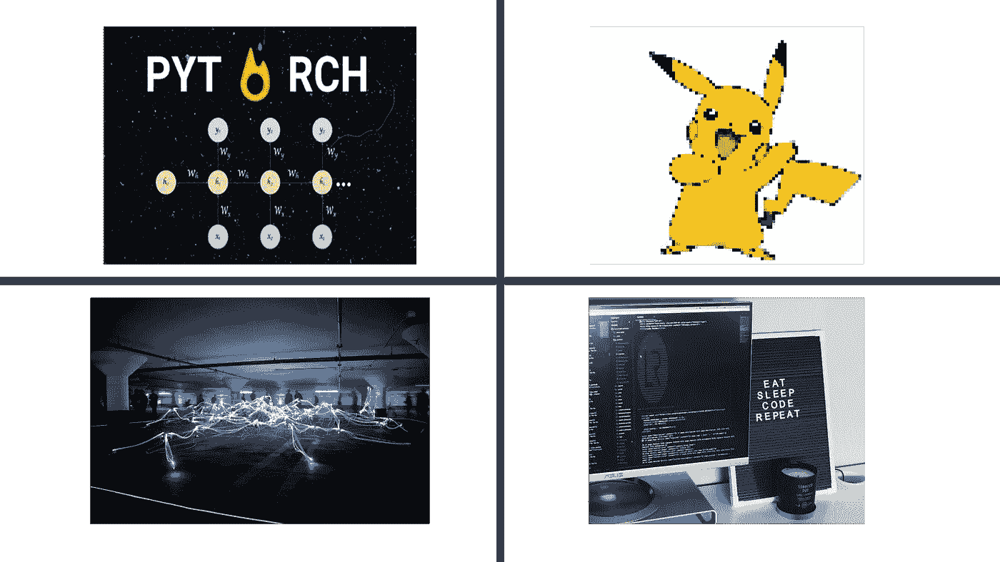

# 本周(8 月 22 日)你应该阅读的有趣的人工智能/人工智能文章

> 原文：<https://towardsdatascience.com/interesting-ai-ml-articles-you-should-read-this-week-aug-22-f62a7b7a48b7?source=collection_archive---------28----------------------->

封面图片本周封面文章

## 分析和意见

## 学机器学习还是深度学习？看看这篇文章，它可以指导你的学习之旅

大约一年前，我的机器学习和计算机视觉理学硕士学位接近尾声。

虽然我获得了一些有用的理论知识，但我的实践经验仍然不足。

所以我做了你们大多数人会做的事，我在 PyTorch 和 TensorFlow 上买书，看视频和阅读大量媒体文章。

## 本周的一堆文章献给那些在机器学习行业起步并寻求方向、建议或简单学习材料的人。

## 以下是所涵盖文章的概述:

*   *py torch 中的递归神经网络简介*
*   *免费大学十五章讲授深度学习话题*
*   *讲述一名医学专业人士成为数据科学家的历程*
*   *超分辨率简介*

# 我如何在 COVID(作为一名医生)期间成为一名数据科学家

> “你只和你的前三个项目一样优秀”——克里斯·洛夫乔伊

[Chris Lovejoy](https://medium.com/u/c155ffc8de0e?source=post_page-----f62a7b7a48b7--------------------------------) 写了从医疗领域的职业过渡到机器学习相关职业的经验。

克里斯给那些想从非技术行业转行的人的第一个建议是去社交网络。

本文指出了早期开发人员容易陷入的常见陷阱。这些陷阱可以通过向经验丰富的开发人员寻求帮助来避免。据 Chris 称，他通过在技术活动、聚会上与个人会面，以及通过 LinkedIn 联系，找到了技术指导。

拥有一流的投资组合是科技行业的古老建议。尽管如此，Chris 还是提供了可操作的步骤，可以用来为投资组合积累一系列项目。从参加基于项目的课程到黑客马拉松，Chris 似乎已经利用了所有为他的项目获取想法的可能性。

训练营已经迅速成为来自非传统背景的个人获得必要技能以在技术型职位中生存的快速途径。这篇文章包括克里斯在训练营的经历的简短个人描述，并包含了关于训练营和价格的细节。

机器学习相关专业有一个持续的学习过程。理想情况下，成功的关键是理解基本面，这是克里斯向读者传递的信息。

Chris 提供了几个指向数学学习资源的链接，并总结了有抱负的数据科学家应该具备的专业知识。

获得理学硕士学位是获取专业领域知识的传统方法。根据 Chris 的说法，如果不打算攻读数据科学的理学硕士学位，就很难受到重视。

有很多文章都是针对有技术背景的人过渡到机器学习相关角色的。Chris account 与众不同，吸引的是非技术背景的个人。

## 推荐用于:

*   *考虑转行到 ML 相关职位的个人*
*   *机器学习学生*

 [## 我是如何在 COVID(作为医生)期间成为数据科学家的

### 非传统职业转型的 5 点启示

towardsdatascience.com](/first-data-science-job-coronavirus-doctor-b8cf074bae96) 

# 超级分辨率及其在深度学习方面的最新进展——第一部分，作者[希瓦尼·拉波尔](https://medium.com/u/2ef4c16b6ebd?source=post_page-----f62a7b7a48b7--------------------------------)

> 超分辨率及其应用简介。

Shivani Rapole 通过使用相关的用例以及描述良好的场景来证明技术方法的合理性，为大多数人可能会感到畏惧的主题提供了简单的解释。这个题目超解析。

超分辨率(SR)是一种应用于大量行业和应用的技术。Shivani 通过提供关于如何在各种用例中利用软件无线电的简要细节，向读者介绍了软件无线电的一些典型应用。

这篇文章并不是 SR 内部工作的全面背景，这就是为什么我推荐这篇文章作为信息源或复习文章。

读者需要用外部资源补充从本文中获得的知识。

也就是说，Shivani 提供了超分辨率的概述，而没有包含算法或复杂的图像，这使得这篇文章成为机器学习学生的绝佳资源。

 [## 深度学习中的超分辨率及其最新进展(一)

### 在本文中，我将简要介绍超分辨率的概念及其在各种图像处理中令人困惑的应用

medium.com](https://medium.com/analytics-vidhya/super-resolution-and-its-recent-advances-in-deep-learning-part-1-c6d927914d32) 

## 非常适合阅读:

*   *计算机视觉/深度学习从业者*

# 关于深度学习你想知道的一切

> 机器学习爱好者和学生关于深度学习主题的视频内容的宝贵资源

[Andreas Maier](https://medium.com/u/b1444918afee?source=post_page-----f62a7b7a48b7--------------------------------) 是德国[FAU](https://www.fau.eu/)大学的教授，并撰写了一篇通过博客和视频展示的深度学习主题的汇编文章。

读者可以将这篇文章视为各种深度学习主题的内容页，如神经网络、强化学习、对象检测等。

共有 15 章，每一章都配有描述课程内容的图片。章节被分成几个部分，这些部分补充了指向视频内容和课堂讲稿的资源链接。

对于机器学习的学生和读者来说，这是一个完全免费接受大学水平教育的机会。

## 非常适合阅读:

*   *机器学习学生*

 [## Fau 课堂笔记——走向数据科学

### 阅读《走向数据科学》中关于 Fau 的讲稿。共享概念、想法和代码的媒体出版物。

towardsdatascience.com](https://towardsdatascience.com/tagged/fau-lecture-notes)  [## 关于深度学习你想知道的

### 在综合视频和博客文章中

towardsdatascience.com](/all-you-want-to-know-about-deep-learning-8d68dcffc258) 

# 让我们建立一个 RNN，Pytorch 风格！由 [Nishil Madhani](https://medium.com/u/1dd37630c9c0?source=post_page-----f62a7b7a48b7--------------------------------)

> 用 PyTorch 实现递归神经网络

Nishil Madhani 写了一个简短但有用的指南来理解 PyTorch 中递归神经网络的实现。

在现实世界中，数据有各种形式和大小。接收各种输入的应用程序的输出在大小上也有可变性。考虑到这一点，我们要求神经网络可以处理和产生的数据类型具有灵活性。递归神经网络(RNN)满足这一要求。

Nishil 提供了一个典型的 RNN 建筑的描述性概述，并辅以图解示意图。

这篇初学者友好的文章解释了用于实现和训练 RNN 的技术术语和库。了解文章的内容需要一些先决条件，但快速的谷歌搜索应该能为读者提供所需的知识。

本文探讨了以下主题、工具和主题领域:Python、PyTorch、深度学习、时间序列预测、递归神经网络、Numpy 等。

## 推荐用于:

*   *机器学习从业者*

 [## 建立一个 RNN，Pytorch 风格！

### 你有没有想过深度学习是如何试图模仿人脑的记忆概念的？我猜答案是肯定的…

medium.com。](https://medium.com/@nishilmadhani/lets-build-a-rnn-pytorch-style-c960207f1fb3) 

# 我希望这篇文章对你有用。

要联系我或找到更多类似本文的内容，请执行以下操作:

1.  订阅我的 [**邮件列表**](https://richmond-alake.ck.page/c8e63294ee) 获取每周简讯
2.  跟我上[中型 ](https://medium.com/@richmond.alake)
3.  通过 [**LinkedIn**](https://www.linkedin.com/in/richmondalake/) 联系我