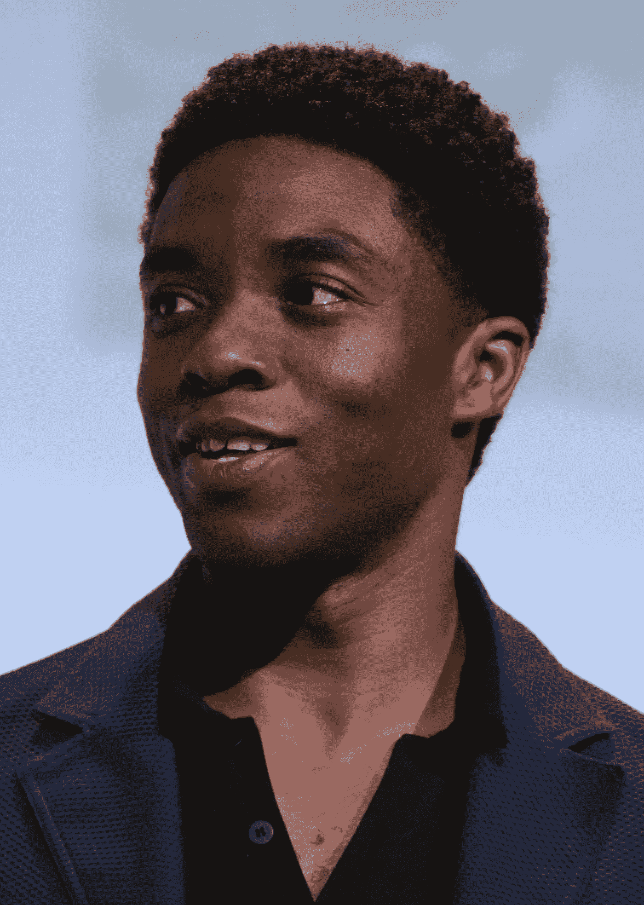
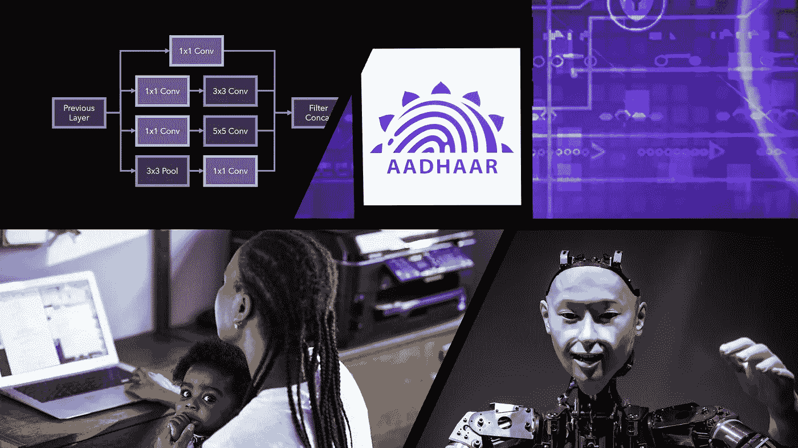

# 本周(8 月 31 日)你应该阅读的有趣的人工智能/人工智能文章

> 原文：<https://towardsdatascience.com/interesting-ai-ml-articles-you-should-read-this-week-aug-31-d65d79b172de?source=collection_archive---------78----------------------->

## 分析和意见

## 不要错过这些关于人工智能和机器学习主题的写得很好、内容丰富的文章。

来自美国亚利桑那州皮奥里亚的 Gage Skidmore 查德维克·博斯曼，CC BY-SA 2.0，[https://commons.wikimedia.org/w/index.php?curid=67164061](https://commons.wikimedia.org/w/index.php?curid=67164061)

2020 年 8 月 28 日，世界失去了一位英雄，查德威克·亚伦·博斯曼。

他在银幕上扮演“黑豹”，是一个英雄，但他最非凡的英雄壮举却是在银幕之外。

他激励了一代又一代的黑人，包括我自己，深入内心，寻找力量，在逆境中坚持下去，并向世界展示他们的才华。

他通过塑造几个非虚构和虚构的人物来达到这一目的，如詹姆斯·布朗、杰基·罗宾森、黑豹等。

尽管如此，他塑造的最伟大的英雄还是他自己，查德维克·博斯曼。

这里是我本周在 Medium 上偶然发现的基于人工智能和机器学习的文章，应该会给你提供一些价值。

## 在我的推荐文章列表中，您会找到提供以下内容的文章:

*   *解释广泛使用的卷积神经网络架构中的整体组件*
*   *理性看待艾对人类生存威胁的可信尝试。*
*   *有色人种试图创造真正财富道路上的算法路障*
*   *在一个我们已经看到面部识别技术大清洗的世界里，一些部分开始大规模采用。*

左上:图片由[安德烈叶](https://medium.com/u/be743a65b006?source=post_page-----d65d79b172de--------------------------------)拍摄。右上:照片说明。来源:SOPA 图片/盖蒂图片。左下:照片:10000 小时/Getty Images。右下:Maximalfocus 在 Unsplash 上拍摄的照片

# 谷歌盗梦空间背后的聪明绝招:安德烈·叶的 1×1 卷积

> 对广泛使用的卷积神经网络架构中的整体组件的解释。

[Andre Ye](https://medium.com/u/be743a65b006?source=post_page-----d65d79b172de--------------------------------) 写了 Google 的 Inception 架构以及它在图像分类和检测方面成功的原因。

Andre 在这篇文章中解释说，Inception 架构的成功主要是由于通过合并 1x1 卷积有效地利用了神经网络架构计算资源。

这篇文章深入探究了为什么 1x1 卷积是 Inception CNN 架构不可或缺的组成部分。

通过包含详细的描述和创造性的插图，Andre 能够指出卷积如何对不同格式的图像(灰度和 RGB)进行操作。

在解释 1x1 卷积的好处的同时，Andre 还包括一些常见深度学习术语的定义和解释，如卷积、过滤器、步幅、通道等。

深度学习实践者不仅要理解常见的 CNN 架构，还要掌握研究人员选择特定架构设计的判断背后的原因，这一点至关重要。

## 非常适合阅读:

*   *深度学习从业者*

 [## 谷歌盗梦空间背后的聪明绝招:1×1 卷积

### 一个 1×1 的 conv 到底能做什么？

towardsdatascience.com](/the-clever-trick-behind-googles-inception-the-1-1-convolution-58815b20113) 

# 人工智能会统治世界，奴役人类吗？由[凯南·科尔迪](https://medium.com/u/f687fc49cdf?source=post_page-----d65d79b172de--------------------------------)

> 理性地对待艾对人类的生存威胁*的可信尝试*。

[Kenan Kolday](https://medium.com/u/f687fc49cdf?source=post_page-----d65d79b172de--------------------------------) 在这篇文章的开头指出，人类对人工智能的恐惧根植于好莱坞电影对人工智能能够做到的“邪恶”的描述。

凯南的文章试图通过清晰地描述各种形式的人工智能及其对生存威胁的潜在性，来重新梳理读者可能持有的对人工智能的无知看法。

这篇文章以分层的方式介绍了人工智能的各种形式；人工狭义人工智能(ANI)、人工通用智能(AGI)和人工超级智能(ASI)。

在文章的前面，凯南举例说明了人工智能可以应用的场景，这些场景是可行的，甚至是目前正在使用的；在文章的最后，我们正在探索具有意识并渴望成为神的人工智能的形式。

我推荐这篇文章，因为它包括了对我们目前拥有的和尚未创造的各种形式的人工智能的简短但信息丰富的描述和应用。

## 非常适合阅读:

*   *未来学家/技术专家*

 [## 人工智能会统治世界，奴役人类吗？

### 人们认为 AI 是威胁，其实真的不是。危险在别的地方。

medium.com](https://medium.com/the-innovation/will-artificial-intelligence-rule-the-world-and-enslave-humans-96c78d2a8588) 

# 凯西·马修斯说，一个算法的一些改变可以让贷款少很多种族歧视

> 有色人种试图创造真正财富的道路上的算法路障

Kasey Matthews 的文章为金融建模算法提供了丰富的信息，金融贷方使用这些算法来确定是否应该根据种族批准向个人发放贷款。

通过使用个人轶事和基于研究的研究，Kassey 提供了一个很好的例子来描述为什么像 BISG(一种广泛使用的种族建模算法)这样的技术并不像它们看起来那样健壮或可靠。

改进建模技术和算法的一个更好的方法是包含更多的数据点，这就是 Race Predictor 所做的。

根据 Kassey 文章中的信息，种族预测器是对 BISG 的改进，包括更多相关的非种族数据点来预测种族。

Race Predictor 是使用机器学习方法构建和训练的，与它的前辈相比，它显示出更有前途的结果。

## 这篇文章非常适合阅读:

*   *金融领域的机器学习从业者*

 [## 一个算法中的一些变化可以让贷款少很多种族歧视

### 美国信贷经济的软件中有一个缺陷，这个缺陷可能会阻碍有色人种…

momentum.medium.com](https://momentum.medium.com/a-few-changes-in-one-algorithm-can-make-lending-a-lot-less-racist-4afaafba2b01) 

# 4 亿印度人可能很快需要使用面部识别来访问他们的银行账户[戴夫·格什戈尔](https://medium.com/u/dc17621a577f?source=post_page-----d65d79b172de--------------------------------)

> 在一个我们已经看到面部识别技术大清洗的世界里，一些部分开始大规模采用。

2020 年，我看到的关于放弃面部识别设备和技术的文章比过去几年都多。

但是，Dave Gershgorn 的文章指向了印度，印度政府正在寻求将面部识别摄像头应用到金融系统中。

根据 Dave 的文章，印度国家政府正在试验利用虹膜和面部识别来获得财政资源。

这种从获取金融资源的最初生物特征数据到面部特征的转变是由于冠状病毒疫情。

冠状病毒只是迫使印度变得更加依赖基于人工智能的技术吗？

嗯，看起来是这样的，正如戴夫所说的，目前有四家银行正在实施这个得到大型全国性组织支持的项目。

## 这篇文章非常适合阅读:

*   *对人工智能应用感兴趣的技术专家*
*   *计算机视觉从业者*

 [## 4 亿印度人可能很快需要使用面部识别来访问他们的银行账户

### 四家银行目前正在测试面部识别系统，为期两周

onezero.medium.com](https://onezero.medium.com/access-to-welfare-programs-in-india-could-soon-depend-on-facial-recognition-scans-a09d21a96b1d) 

# 我希望这篇文章对你有用。

要联系我或找到更多类似本文的内容，请执行以下操作:

1.  订阅我的 [**邮件列表**](https://richmond-alake.ck.page/c8e63294ee) 获取每周简讯
2.  跟我上[中型 ](https://medium.com/@richmond.alake)
3.  通过 [**LinkedIn**](https://www.linkedin.com/in/richmondalake/) 联系我