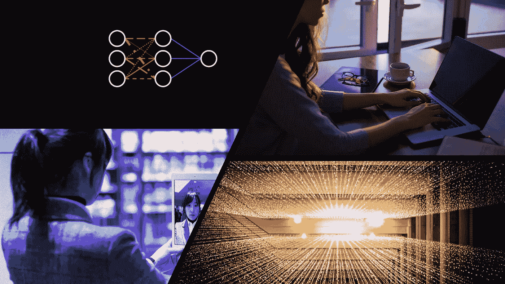

# 本周(7 月 18 日)你应该阅读的有趣的 AI/ML 文章

> 原文：<https://towardsdatascience.com/interesting-ai-ml-articles-you-should-read-this-week-july-18-5326e7aec179?source=collection_archive---------34----------------------->

## 分析和意见

## 发现一些文章，这些文章提供了关于如何撰写数据科学博客以及身份盗窃如何使用基于人工智能的技术发展的信息

人工智能技术和系统发展迅速，每周都有新的发明和技术出现。然而，人们仍然不满意我们目前拥有的人工智能水平。

了解为什么人工智能没有达到我们的预期，以及身份盗窃如何演变为利用 deepfakes 和面部识别数据。

## 本周的封面文章介绍了:

*   **关于如何在媒体上撰写专注于数据科学的文章的技巧和建议**
*   **身份盗窃在中国变得多么创新和廉价。**
*   **缺乏对当前人工智能水平的欣赏**
*   **一种你可能没听说过的神经网络架构**

包括文章的封面图片

# 我如何写一个数据科学博客

如果你正在读这篇文章，那么你对 Medium 并不陌生，你也很有可能，是一个对 AI 感兴趣或者从事 AI 相关工作的人。可能在某个时候，你想在媒体上写文章。

丽贝卡·维克里写了一篇文章，详细介绍了她写文章的过程。

你为什么要接受丽贝卡在文章中分享的建议和提示呢？Rebecca 已经在 Medium 上写了两年了，并且每周都会发表一到两篇文章。如果这还不够，她目前还被认为是教育、技术和人工智能领域的顶级作家。

*那么丽贝卡是如何写数据科学文章的呢？*

据丽贝卡说，她倾向于将她的写作生涯与目标和目的联系起来。也就是说，Rebecca 的目的是向他人传授数据科学知识，同时巩固自己的知识。这是任何人都可以采用的目的，因为机器学习是一个不断增长的领域，每天都有新的技术和工具出现。

撰写数据科学文章可能会很乏味，需要一个稳健的过程，那么 Rebecca 如何保持动力呢？

她在文章中指出，她不是受金钱激励或社会认可的驱使。根据丽贝卡的说法，不要把经济或社会认可作为动力的来源，你可以拥有成功而长久的写作生涯。

在写作过程中，金钱和社会的验证不会很快到来。因此，你需要一些能激励你坚持写作多年的东西。

我从丽贝卡的文章中得到的最好的建议是她的文章提炼技巧和过程。丽贝卡没有坐下来，炮制出值得策展的文章。她对一篇文章反复推敲。每一次迭代都从一系列想法到围绕这些想法的解释…再到一篇完整的文章。

迭代技术的关键是丽贝卡可以随时随地进行写作。

如果你想从这篇文章中得到灵感，开始在媒体上写作，请读一读这篇文章。也许很快，我会读到你的一篇文章。

## 这篇文章非常适合:

*   ***数据科学博主***
*   ***数据科学从业者***

 [## 我如何写数据科学博客

### 撰写数据科学(或任何其他主题)的顶级技巧

towardsdatascience.co](/how-i-write-a-data-science-blog-62e4108fe478) 

# 你可以在中国的黑市上以 0.07 美元的价格买到戴夫·格什戈恩(Dave Gershgorn)的随机面部识别照片。

我似乎每周都会阅读一两篇戴夫·格什根的文章，我认为人工智能行业的每个人都应该这样做。戴夫涵盖了人工智能和技术相关的相关和当前的主题；这是一剂有益的当代信息，可以平衡你可能每周阅读的所有研究和技术媒体文章。

*未来十年，身份盗窃会是什么样子？*

好吧，戴夫的文章涵盖了中国对先进人工智能技术的众多滥用之一的最新发展。戴夫写道，中国黑市上正在出现包含人脸图像和附带个人数据的数字包销售。

这些出售的软件包是在中国许多广泛使用的金融、商业和生活应用中绕过许多面部认证系统的所有要求。

从戴夫文章的标题，你可以看到获取数据是多么可笑的便宜。

Dave 写了一个高级包，让整个故事更加离奇。只要支付几美元，你就可以得到一个“deepfake like”软件，它可以移动静止图像的内容来模仿微妙的头部运动。

几年前，戴夫在他的文章中所涵盖的一切，将会出现在一部以 2079 年为背景的电影剧本中，讲述一个先进的犯罪集团。但是我们看到这将在 2020 年实时展开。

Dave 还提到，这种身份盗窃方法可能不太容易适用于美国境内的系统。他还表示，IPhones 拥有先进的面部识别过程，可以测量面部特征的深度。

但有人以低于 1 美元的价格成为数字版的你只是时间问题吗？

## 这篇文章非常适合:

*   **未来学家和技术专家:简要了解非法活动和犯罪是如何随着先进的技术和人工智能而发展的。**
*   ****机器学习实践者*** *:了解世界上一些最聪明的人开发的工具和应用程序的误用是如何导致严重问题的。**

* [## 你可以在中国的黑市上花 0.07 美元买到一张随机的面部识别照片

### 卖家提供多达 20，000 张人脸图像的套装

onezero.medium.com](https://onezero.medium.com/you-can-buy-facial-random-recognition-photos-on-chinas-black-market-c54ab219580f)* 

# *AI 革命来了。这与我们对托比亚·图迪诺的预期不同*

> *我们想要会飞的汽车，他们却给了我们假的。*

*Tobia Tudino 的最新文章是基于没有意识到人工智能目前的状态是多么具有革命性。这种缺乏欣赏是由于科幻小说中人工智能的呈现导致的高期望的结果。*

*Tobia 指出，我们在科幻电影和动作中观察到的人工智能可以采取的几种形式的未来主义描述，遮蔽了我们的视线，使我们无法认识到我们期待已久的人工智能革命就在这里，就在我们面前。*

**但是我没有看到会飞的汽车；没有传送…我们确实有一些很酷的* [*飞船*](https://www.spacex.com/vehicles/starship/) *。**

*Tobia 开始用 Micheal I. Jordan 的扩展声明来解释为什么 AI 没有满足我们对电影的期望(*人工智能——革命尚未发生】*)。该语句传递 AI 是通配符术语的消息。术语“AI”用于描述任何消除或模拟人类干预或参与的技术进步。*

*基于对人工智能的描述，可以有把握地说，我们周围到处都有人工智能。*

*我得到的印象是，Tobia 希望我们读者欣赏我们现在拥有的人工智能水平。Tobia 提到了医疗保健、商业、咨询和时尚行业在决策和数据收集方面的进步。*

*也许人们担心对当前人工智能的欣赏可能会导致内容。或者，人们尚未接受我们已经实现了值得骄傲的“人工智能”这一事实，这也许不是一件坏事，因为这可以推动研究人员、工程师和创新者发明和创造更好的人工智能系统和技术。*

## *这篇文章令人兴奋，因为:*

*   ****机器学习从业者*** *:这篇文章将鼓励你去欣赏你投入到这个世界中的工作，即使这个世界不一定会表现出欣赏。**

* [## AI 革命来了。只是和我们预想的不一样。

### 仅仅因为人工智能还不足以成为科幻小说，并不意味着它已经不是革命性的了

towardsdatascience.com](/the-ai-revolution-is-here-its-just-different-than-we-expected-5022c23aaeee)* 

# *有人称之为天才，有人称之为愚蠢:安德烈·叶创造的最有争议的神经网络*

*我从来没有遇到过“极限学习机(ELM)”这个话题，所以安德烈·叶的文章对我来说既有教育意义又有启发性。*

*你们中的一些人可能也没有听说过 ELM，Andre 在他的文章中给出了原因。主要原因是机器学习社区没有采用它，深度学习专家批评和质疑它的性能。*

*Andre 的文章非常有教育意义，因为它在初级水平上介绍了 ELM，所以任何具有机器学习基本背景的人都可以理解 ELM 的描述和好处。*

*Andre 通过陈述 ELM 的内部组件对其进行了介绍；如何训练神经网络结构以及其他更具体的特征和属性。*

*我从这篇文章中得到的总体想法是，榆树是有效的，因为它的随机性。如 Andre 所述，ELMs 由两个律师组成，其中第一层被随机初始化，而权重参数是固定的。*

*在神经网络架构中融入随机性元素是我们在各种深度学习神经网络架构中看到的；权重可以被随机初始化，并且之后的丢弃也为架构提供了随机性特征。*

*Andre 还介绍了 elm 被机器学习社区中有声望的个人抛弃的主要原因。Andre 还提供了一些关于 elm 所面临的限制的信息，以及为什么它们没有被广泛采用或利用的原因。*

# *这篇文章非常适合:*

*   ****机器学习从业者****

* [## 有人称之为天才，有人称之为愚蠢:有史以来最有争议的神经网络

### 极限学习机

towardsdatascience.com](/some-call-it-genius-others-call-it-stupid-the-most-controversial-neural-network-ever-created-2224ed22795a)* 

# *我希望这篇文章对你有用。*

*要联系我或找到更多类似本文的内容，请执行以下操作:*

1.  *订阅我的 [**YouTube 频道**](https://www.youtube.com/channel/UCNNYpuGCrihz_YsEpZjo8TA) 即将上线的视频内容 [**这里**](https://www.youtube.com/channel/UCNNYpuGCrihz_YsEpZjo8TA)*
2.  *跟我上 [**中**](https://medium.com/@richmond.alake)*
3.  *通过 [**LinkedIn**](https://www.linkedin.com/in/richmondalake/) 联系我*