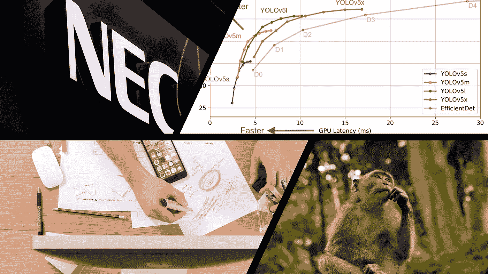

# 本周(7 月 4 日)你应该阅读的有趣的人工智能/人工智能文章

> 原文：<https://towardsdatascience.com/interesting-ai-ml-articles-you-should-read-this-week-july-4-cad0d162e108?source=collection_archive---------32----------------------->

## 找出为什么你应该换工作，成为一名哲学家

本周，我看到了几篇文章，挑战基于人工智能的系统在几个领域的开发和利用。

作为一名机器学习从业者，我从来没有真正反思过我所做贡献的哲学和法律方面，但在阅读了一些有趣的文章后，这种情况发生了变化，这些文章展示了人工智能进步现在正在发生的后果，以及那些尚未发生的后果。

我们今天的生活明天可能会完全不同。

# 本周我感兴趣的文章涵盖了以下主题:

*   **为什么哲学家会是最后站着的人**
*   **法律聚光灯下的面部识别**
*   **如何开发有效的数据科学产品组合**
*   **物体检测算法之间的较量**

包括文章的封面图片

# 一家面部识别巨头拒绝分享其算法数据集的细节

你会让一个失败率 98%、误报率 81%的机器学习模型投入生产吗？

嗯，这些声称的性能数据来自一个面部识别系统，该系统被南威尔士和英国其他地区的警察部队使用。

Dave Gershgorn 的文章以一个类似于反乌托邦未来的场景开始，在这个场景中，一个监管系统监控着所有人；歇斯底里地预示着可预见的未来。

南威尔士警方自 2017 年以来一直在使用面部识别系统，并在公众面前毫不隐瞒地做到了这一点。他们通过面部识别系统逮捕了一些人。

从表面上看，利用该技术打击犯罪和帮助有效维持治安并没有敲响任何警钟，但这些用于实施逮捕的系统的准确性指标和性能审计结果描绘了一幅更令人吃惊的画面。

Dave 的文章包含了一项针对使用面部识别软件的管理机构的诉讼信息。这起诉讼是由于面部识别系统固有的算法种族偏见和无效性——这是最近成为头条新闻的一个主题。

但是，Dave 对该事件的报道的要点是揭示 NEC technology(面部识别工具的提供商)不愿意透露他们数据集的细节。

甚至使用该工具的警察也不知道该系统是如何被训练的。在我看来，公开用于训练对公众有直接/间接影响的系统的数据是有意义的，特别是在公共警务方面。

戴夫的文章提到了英国对欧洲其他国家和世界的影响。它指出，他们对面部识别的行动和观点可以为欧洲其他国家如何采用和利用面部识别技术开创先例。

Dave 文章的后半部分简要介绍了解决自动驾驶汽车中复杂问题的文章。

阅读这篇文章，了解针对开发用于公共场合的人工智能系统的公司所采取的法律后果和行动。

## 这篇文章非常适合:

*   机器学习从业者
*   技术专家

 [## 一家面部识别巨头拒绝分享其算法数据集的细节

### NEC 声称其系统没有偏见——但拒绝透明的呼吁

onezero.medium.com](https://onezero.medium.com/a-facial-recognition-giant-refuses-to-share-details-about-its-algorithm-dataset-df27a208683d) 

# 忘掉编码吧，未来的工作是哲学，作者[卢卡·罗西](https://medium.com/u/ca5ddd580088?source=post_page-----cad0d162e108--------------------------------)

本周我读过的最有趣的文章之一。[卢卡·罗西](https://medium.com/u/ca5ddd580088?source=post_page-----cad0d162e108--------------------------------)写了一篇文章，会让大多数读者走上自我和环境意识的道路。

读完这篇文章后，我发现自己在质疑我的行为和贡献的影响，这些行为和贡献会导致这篇文章中所创造的想象世界。

Luca 的文章首先陈述了农业、工业和技术革命等全球性革命周期性发生所造成的失业影响。

然后，随着自动化使传统的手工劳动过时，他描绘了引入新的角色和工作的一线希望。但这一丝希望被他的个人意见挡住了。

卢卡在他的文章中指出，自动化和人工智能不会导致大量失业，这并不能保证或确保未来所有人都有大量工作。卢卡还表达了他对未来的担忧，在未来，自动化将主宰生活的方方面面，让我们变得一无是处；他表达了对人类幸福和满足感的关注。

Luca 列出了一些最终将被淘汰的职业，当我往下读列表时，我很欣慰没有看到任何机器学习的角色。卢卡明确指出，由于机器和自动化，没有提到的职位仍然是即将到来的就业市场末日的受害者，这种宽慰很快就消失了。他甚至提供了一个人工智能通过艺术模仿人类创造力的例子来进一步支持他的观点。

没有人是真正安全的。除了哲学家

卢卡认为人工智能不能取代哲学家，因为哲学是人类对存在和生命的本质的模糊性的表达，这与“纯智能”无关。这是一个我不完全赞同的观点。在这个问题上，我可能会和卢卡好好辩论一番。

不管我对卢卡观点的反对意见，我仍然欣赏他对四个越来越相关的哲学主题的结构化方法:道德、意识、生命的意义和对齐问题。

卢卡将每个提出的哲学主题与当前技术(如自动驾驶汽车)和假设的未来技术(如心灵传输和心灵传输)的发生结合起来。

通过创建基于简单和复杂事件的场景，Luca 展示了人类可能做出的选择之间的差异，并展示了人工智能系统做出相同决定的可能性。

Luca 的文章可能不同于许多机器学习从业者习惯阅读的更具技术性和更直接的文章。但是我推荐定期阅读探索技术进步的哲学方面的文章。我知道的一本很好的书是[尼克·博斯特罗姆的](https://en.wikipedia.org/wiki/Nick_Bostrom)[超级智慧:路径、危险、策略](https://en.wikipedia.org/wiki/Superintelligence:_Paths,_Dangers,_Strategies)。

在结束一篇有趣的文章时，卢卡大胆地指出，世界的命运掌握在哲学家手中，这一观点令我着迷。

## 这篇文章很有意思，适合:

*   技术专家
*   对与人工智能交织在一起的哲学话题感兴趣的人

 [## 忘掉编码吧，未来的工作是哲学

### 人工智能在不久的将来会带来四大问题。只有哲学可以拯救我们。

medium.com](https://medium.com/predict/forget-about-coding-the-job-of-the-future-is-philosophy-33acadcee05a) 

# 如何建立有效的数据科学投资组合 [Harshit Tyagi](https://medium.com/u/4530efc184cb?source=post_page-----cad0d162e108--------------------------------)

想要一份让你从其他求职者中脱颖而出的“一流”投资组合，那么 [Harshit Tyagi](https://medium.com/u/4530efc184cb?source=post_page-----cad0d162e108--------------------------------) 的文章可以被视为建立投资组合以实现这一目标的蓝图。

我将诚实地声明，在面试阶段，我没有任何作品集可以展示给我现在的雇主，但是正如 Harshit 非常正确地指出的，拥有高学历会给你带来优势。所以 Harshit 的文章非常适合没有理学硕士或博士学位的数据科学家。

文章中提出的第一个建议是自我认同。哈什特建议求职者了解自己目前的技能和自身的局限性。通过这种了解，他们会更清楚自己最适合做什么工作。

没有项目目录的数据科学家组合是不完整的。在这篇文章中，有一些特定形式的项目，希望从人群中脱颖而出的读者应该渴望完成。Harshit 对求职者可以探索的各种项目给出了近乎完美的解释，甚至包括几个投资组合的例子。

后面的步骤探讨了在线展示的重要性，以帮助提升数据科学家的声誉。Harshit's 推荐了 GitHub、LinkedIn、Medium 和 Twitter 等平台，以及他如何利用这些平台的一些个人轶事。

这篇文章最后提供了一些关于简历中关键内容的信息。老实说，这篇文章充满了很棒的技巧和信息，如果你是一个视觉学习者，你也可以查看他的 YouTube 频道，了解更多很棒的内容。

## 这篇文章非常适合:

*   数据科学学生
*   数据科学求职者

 [## 如何构建有效的数据科学产品组合

### 创建一流投资组合的全面指南

towardsdatascience.com](/how-to-build-an-effective-data-science-portfolio-56d19b885aa8) 

# YOLOv5 与更快的 RCNN 相比。谁赢了？由 [Priya Dwivedi](https://medium.com/u/b040ce924438?source=post_page-----cad0d162e108--------------------------------)

如果你是一个非常视觉化的学习者，你会喜欢由 [Priya Dwivedi](https://medium.com/u/b040ce924438?source=post_page-----cad0d162e108--------------------------------) 撰写的文章，该文章探索了与两种广为人知的对象检测算法的性能比较:YOLOv5 和更快的 RCNN。

这不是一篇关于每种算法如何处理目标检测的分解文章，所以一些读者可能会失望地发现，没有解释所包含的算法如何工作。也就是说，Priya 提供了大量的资源链接，这些资源提供了算法内部工作的信息。

Priya 用来衡量每个算法性能的比较场景是真实的。本文以视频的形式呈现了三种场景:汽车视频、篮球比赛和拥挤的公共场景。

在这篇文章中，Priya 提供了对对象检测算法结果的并排视频评估，然后附有对每个算法进行评估的性能和精度标准表。

我不会透露哪种对象检测算法是最好的，请阅读文章了解一下。

这篇文章的视觉本质使得它对于所有水平的深度学习实践者来说都是容易阅读的。

# 这篇文章非常适合:

*   深度学习从业者
*   机器学习从业者

 [## YOLOv5 与更快的 RCNN 相比。谁赢了？

### 用数据做很酷的事情！

towardsdatascience.com](/yolov5-compared-to-faster-rcnn-who-wins-a771cd6c9fb4) 

# 我希望这篇文章对你有用。

要联系我或找到更多类似本文的内容，请执行以下操作:

1.  订阅我的 [**YouTube 频道**](https://www.youtube.com/channel/UCNNYpuGCrihz_YsEpZjo8TA) 即将上线的视频内容 [**这里**](https://www.youtube.com/channel/UCNNYpuGCrihz_YsEpZjo8TA)
2.  跟我上 [**中**](https://medium.com/@richmond.alake)
3.  通过 [**LinkedIn**](https://www.linkedin.com/in/richmondalake/) 联系我