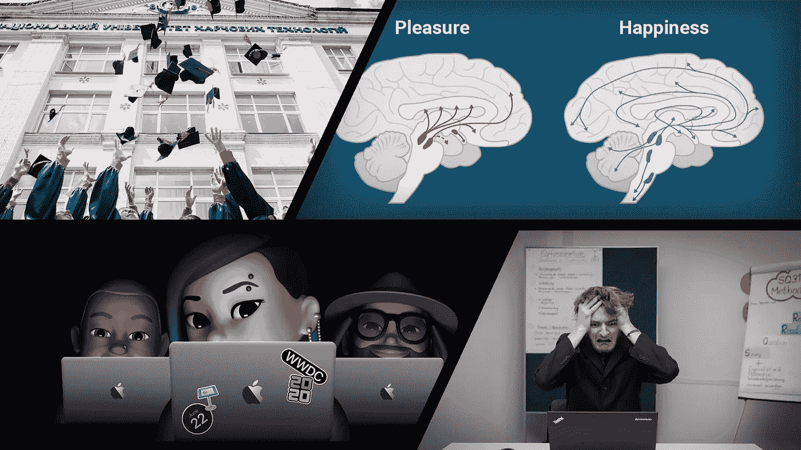

# 本周(6 月 20 日)你应该阅读的有趣的 AI/ML 文章

> 原文：<https://towardsdatascience.com/interesting-ai-ml-articles-you-should-read-this-week-june-20-dccdf630d623?source=collection_archive---------49----------------------->

## 意见

## 这四篇文章涵盖了我本周感兴趣的机器学习主题…包括许多数据科学家可能会感到沮丧的原因

有趣文章的封面图片

*又是一周，又一批有趣的媒体文章要通过了。*

媒体文章的质量变得越来越令人兴奋和迷人。这周我读了一些围绕学习主题的文章。学习可能是人工智能的中心主题，这应该是相当明显的，因为它是人工智能(机器学习、深度学习、强化学习)大多数领域的最终结论。

学习不仅仅是为我们构建的人工智能系统保留的；我们机器学习实践者必须不断地用正确的工具来装备自己，以加快我们自己的学习。我提到的一些文章为你提供了促进学习游戏的方法和心态。

# 本周我感兴趣的文章涵盖了以下主题:

*   免费在线资源，来自以学术成就闻名全球的机构
*   对下周备受期待的苹果开发者大会的预测
*   为什么许多数据科学家感到沮丧
*   人脑与人工智能的持续战斗

# 由[丽贝卡·维克里](https://medium.com/u/8b7aca3e5b1c?source=post_page-----dccdf630d623--------------------------------)从顶尖大学免费学习数据科学

免费的教育资源是互联网的礼物， [Rebecca Vickery](https://medium.com/u/8b7aca3e5b1c?source=post_page-----dccdf630d623--------------------------------) 为有抱负的数据科学家或任何对机器学习领域感兴趣的人打包了一个学习资源包。

丽贝卡通过参考一本名为《超学习》的书开始了这篇文章。加速你的职业生涯*并提到了作者能够“超学习”的关键因素，即免费在线课程的可用性。*

*这就引出了丽贝卡写这篇文章的主要原因，那就是揭示学术机构如麻省理工学院和斯坦福大学所提供的精心设计的课程的存在。*

*本文的主体包括一系列基于课程的机器学习相关主题的学习资源，供喜欢结构化学习方法和知识积累的学习者使用。*

*读者不仅仅是提供这些免费资源的链接，丽贝卡提供的是已识别资源的背景，使读者能够了解资源提供者的起源、作者和使命。*

*我向数据科学和机器学习的新老学生推荐这篇文章。*

> *丽贝卡为读者提供了超过 11 种免费的在线资源，将它们加入书签可以在未来为你节省一笔昂贵的学费。*

## *这篇文章是优秀的:*

*   ***数据科学/机器学习学生***

* [## 免费从顶尖大学学习数据科学

### 在哪里可以找到麻省理工学院、斯坦福大学和哈佛大学的免费讲座、研讨会和完整课程

towardsdatascience.com](/learn-data-science-from-top-universities-for-free-ee3387ad88ac)* 

# *一位资深 iOS 开发者对 WWDC 220 的预测由 [Anupam Chugh](https://medium.com/u/9833cc01f515?source=post_page-----dccdf630d623--------------------------------)*

*距离 [WWDC 2020](https://developer.apple.com/wwdc20/?&mtid=20925rc739929&aosid=p238&mnid=sx7pjJq3x-dc_mtid_20925rc739929_pcrid_442898695567_pgrid_98069227850_&cid=wwa-uk-kwgo-features--slid---productid--Brand-AppleLive-AppleLive-&anonymizeip=set) 只有几天了；这是最令人期待的苹果开发者大会之一。它持续了将近一周，尤其是今年，它从 6 月 20 日开始，到 6 月 26 日结束。*

*Anupam 已经写了一篇文章，其中包含了他对苹果在 2020 年 WWDC[事件中的预期的结构化收集。](https://developer.apple.com/wwdc20/?&mtid=20925rc739929&aosid=p238&mnid=sx7pjJq3x-dc_mtid_20925rc739929_pcrid_442898695567_pgrid_98069227850_&cid=wwa-uk-kwgo-features--slid---productid--Brand-AppleLive-AppleLive-&anonymizeip=set)*

*你可以告诉 [Anupam Chugh](https://medium.com/u/9833cc01f515?source=post_page-----dccdf630d623--------------------------------) 非常激动地见证了这次大会和重要的进展，因为他提到了 2019 年 WWDC 大会上介绍和改进的苹果开发生态系统。*

*本文的主要内容包括 Anupam 对苹果生态系统中现有应用和平台的见解和功能要求，如 [CoreML](https://developer.apple.com/machine-learning/core-ml/) 、 [CreateML](https://developer.apple.com/machine-learning/create-ml/) 、 [RealityKit](https://developer.apple.com/augmented-reality/reality-composer/) 和 [SwiftUI](https://developer.apple.com/documentation/swiftui) 。*

*文章的上半部分专注于围绕苹果生态系统内机器学习相关应用的预测，而后半部分则更倾向于苹果开发者生态系统的实用和设计部分。*

> *如果你等不及下周即将发生的激动人心的事情，请快速阅读这篇文章。*

## *这篇文章是优秀的:*

*   *Swift 开发人员*
*   *CoreML 开发者*
*   *应用程序开发人员/软件工程师*

* [## 一位资深 iOS 开发者对 WWDC 2020 的预测

### 我认为在不久的将来，苹果公司将会推出

medium.com](https://medium.com/better-programming/a-senior-ios-developers-predictions-for-wwdc-2020-fb727a4b45e6)* 

# *当你试图成为一名数据科学家时感到沮丧的原因*

*[Kurtis Pyke 的](https://medium.com/u/5ba760786877?source=post_page-----dccdf630d623--------------------------------)文章旨在揭示定义最成功的数据科学家的实际个性特征。通过识别这些特征，任何人都可以成为成功的数据科学家*

*Kurtis 在他的文章中提出了一个很好的观点，即满足该领域的学术要求是很重要的，但这并不能定义该领域的成功。*

*我从这篇文章中得到的一个信息是，成功不是通过学习的内容来实现的，而是学习如何不断地学习新的内容。*

*根据我的个人经验，我发现理解学习的过程很重要，因为在一个内容和方法都在不断变化的领域，唯一不变的是学习的方法，不管内容如何。*

*学习如何学习是我每周从 Medium 上的各种作者那里听到的信息，Kurtis 以数据科学家可以理解的方式定制了一般信息，主要包括他的个人经历和机器学习领域内受人尊敬的人物的片段。*

## *这篇文章是优秀的:*

*   *所有级别的数据科学家*

* [## 当你试图成为一名数据科学家时感到沮丧的原因

### 将最优秀的人与众不同的隐藏技能

towardsdatascience.com](/the-reason-youre-frustrated-when-trying-to-become-a-data-scientist-2d2b8b402811)* 

# *元学习告诉我们，大脑比人工智能有独特的学习优势*

*文章的开头是承认人工智能在许多任务上开始超过人类的表现。尽管如此，Jesus [Rodriguez](https://medium.com/u/46674a2c9422?source=post_page-----dccdf630d623--------------------------------) 承认需要大量的训练数据和计算资源来实现人工智能系统的卓越性能。*

*这篇文章的主要内容是围绕人脑和人工智能之间的对比展开的。更具体地说，是大脑调节化学物质以实现身体功能的独特能力。这篇文章引用了 Deepminds 的[关于一种促进人脑学习过程的神经递质](https://www.nature.com/articles/s41593-018-0147-8)的研究论文。*

*Jesus 很好地解释了这篇文章和参考资料研究集中的神经递质，他甚至使用*金·卡戴珊*来确保读者得到这种特殊神经递质的作用的说明。*

*这篇文章本身是对 DeepMind 研究的一个非常简短的总结，涵盖了研究中进行的实验的方法和结果。*

## *这篇文章是优秀的:*

*   *强化学习爱好者*
*   *机器学习工程师(对人脑功能和神经科学感兴趣)*

* [## 元学习告诉我们，大脑比人工智能有独特的学习优势:它必须…

### 没有一个星期我们不在这里谈论人工智能取得的另一个令人印象深刻的里程碑…

medium.com](https://medium.com/dataseries/meta-learning-teaches-us-that-the-brain-has-a-unique-learning-advantage-over-ai-and-it-has-to-do-f6bed5a825f6)* 

# *我希望这篇文章对你有用。*

*要联系我或找到更多类似本文的内容，请执行以下操作:*

1.  *订阅我的 [**YouTube 频道**](https://www.youtube.com/channel/UCNNYpuGCrihz_YsEpZjo8TA) 即将发布的视频内容 [**这里**](https://www.youtube.com/channel/UCNNYpuGCrihz_YsEpZjo8TA)*
2.  *跟着我上 [**中**](https://medium.com/@richmond.alake)*
3.  *通过 [**LinkedIn**](https://www.linkedin.com/in/richmondalake/) 联系我*