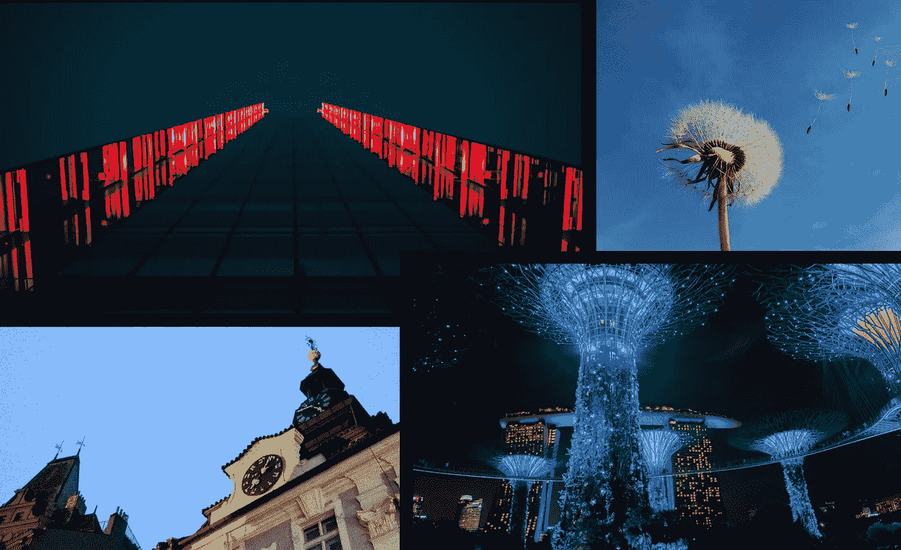

# 本周(6 月 28 日)你应该阅读的有趣的 AI/ML 文章

> 原文：<https://towardsdatascience.com/interesting-ai-ml-articles-you-should-read-this-week-june-28-65ff4d8a05f5?source=collection_archive---------56----------------------->

## 四篇文章涵盖了我本周感兴趣的机器学习主题…其中一篇文章涵盖了你可能不喜欢的未来

再过一周，又一批媒体文章要通过了。

我这周读的文章很吸引人，因为许多作家都表达了他们对我们未来的看法。

除了我在 Medium 上遇到的常见技术文章，我觉得探索未来可能会发生什么很重要，特别是像 AI 这样的快节奏领域可能会产生的影响。

我们今天的生活明天可能会完全不同。

# 本周我感兴趣的文章涵盖了以下主题:

*   **新兴技术带来的未来会是什么样子**
*   **如何让你的机器学习模型退出开发**
*   **如何度过 10，000 小时的数据科学家指南**
*   **人工智能及其对医疗保健的影响**

包括文章的封面图片

# 9 项可怕的技术将塑造你的未来

生命、死亡、艺术、激情、性、选择、心智、人工智能和完美的孩子，这些仅仅是 Luca Rossi 在他写得非常好的关于技术的文章中提到的一半话题，这些技术将很快控制我们生活的许多方面。

首先，卢卡提供了一个免责声明和警告读者，因为文章的内容围绕伦理和道德的细线跳舞。卢卡敦促读者在消化文章中呈现的内容时要有开放的心态。但读完之后，我会说，你不一定需要一个开放的心灵才能理解卢卡所展示的技术的现实。

Luca 将遥不可及的未来假设与我们可用的当今技术之间的相似之处联系起来，这种方式让我认为，是的，所有这些未来技术都只需要几代人的时间。

如果你想知道为什么将来只有穷人会死，或者为什么未来的社会会充满“完美”的人类，那么这篇文章是一个很好的读物。

Luca 讨论了与提到的未来技术相关的恐惧。每一部分还包括一个片段，合理化了人类对即将到来的不可预防的未来的恐惧。

这篇文章充满了提供组织证据的资源，暗示了创造提到的未来技术的途径。因此，对于那些怀疑的读者来说，他们觉得我们离提到的一些未来技术可能还有数百年的时间，卢卡的文章可能会改变你的想法。

## 这篇文章非常适合

*   **对未来技术感兴趣的个人**
*   **技术专家**

 [## 9 项可怕的技术将塑造你的未来

### 在接下来的几十年里，我们将见证新的不可思议的可怕技术的出现。多么害怕…

medium.com](https://medium.com/predict/9-terrifying-technologies-that-will-shape-your-future-befa688d247) 

# 10 分钟在谷歌云平台上部署深度学习模型 [Binh Phan](https://medium.com/u/ba6bd545bb5c?source=post_page-----65ff4d8a05f5--------------------------------)

Binh Phan 提供了关于机器学习实践者如何在线扩展他们的机器学习模型的信息，相对来说没有任何成本。这是通过利用全球最大的云服务提供商之一的计算资源实现的。

这篇文章包含了清晰简洁的一步一步的说明，使得最终目标非常容易实现；这与许多过时的文章形成对比，这不是作者的错，因为这仅仅是技术快速发展的结果。

Binh 推出了 Docker 和 GCP 等行业标准工具。

本文中的说明的最终结果是一个外部链接，用于访问经过训练的机器学习模型的公开功能。

## 这篇文章非常适合

*   **数据科学家**
*   **学生**
*   **机器学习工程师**

 [## 10 分钟在谷歌云平台上部署深度学习模型

### 如何在 GCP 部署深度学习模型，完全免费，永远免费

towardsdatascience.com](/10-minutes-to-deploying-a-deep-learning-model-on-google-cloud-platform-13fa56a266ee) 

# 10.000 小时的数据科学|通过 [Richard Michael](https://medium.com/u/7229c4f1db59?source=post_page-----65ff4d8a05f5--------------------------------) 获得熟练程度

假设你有 10，000 个小时致力于成为你能成为的最好的数据科学家，那么[理查德·迈克尔的](https://medium.com/u/7229c4f1db59?source=post_page-----65ff4d8a05f5--------------------------------)文章本质上将是你如何度过每个小时的蓝图。

Richard 总结了一种结构化的方法，通过提供涵盖统计学和数学基础的资源，从操作系统和编程语言的选择，一个完全的初学者如何成为一名熟练的数据科学家。

每个确定的主题领域都被分配了成为专家数据科学家所需的 10，000 小时中的一部分时间；所以你可以粗略估计完成每个主题领域需要多长时间。

Richard 文章的后半部分剖析了机器学习领域中的工作角色。

许多人会发现，机器学习中的大多数角色在其指定的职责和责任方面往往是重叠的。然而，了解你学习的最终目标是什么总是好的，因为这可以让你的学习道路更加透明。

**这篇文章很适合:**

*   **数据科学学生**

 [## 10.000 小时的数据科学|熟练掌握

### 从数据新手到专业人士的路。

towardsdatascience.com](/10-000-hours-in-data-science-gaining-proficiency-440387e723c1) 

# 人工智能、深度学习和医学[医学博士亚当·塔布里兹](https://medium.com/u/c456119985e2?source=post_page-----65ff4d8a05f5--------------------------------)

[Adam Tabriz，MD](https://medium.com/u/c456119985e2?source=post_page-----65ff4d8a05f5--------------------------------) 文章结合了人工智能和医疗保健的世界，描述了人工智能将如何影响各种医疗保健实践提供的日常角色和服务。

这篇文章的非技术方法使它成为所有读者的好读物。

Adam 首先对术语深度学习及其内涵进行了深入探讨。文章的早期内容可以看作是对人工智能相关的常见术语和短语的非技术性解释。

亚当又一次以非技术的方式进一步解释了人工智能是如何在工业中应用的。虽然人工智能在各种行业中被用于不同的任务，但亚当的文章解释说，每个人工智能系统的过程在各个行业中都是相同的。

我不会对 Adam 的文章进行任何剧透，但 Adam 提供了一个惊人的声明，总结了机器学习领域的首要目标。

当我们接近文章的主体时，Adam 开始以更快的节奏写作。本节中的文章内容开始更多地关注医疗保健行业中的人工智能。

Adam 介绍了几个有趣的想法和技术，例如，将人工智能与人类思维相结合，以及在医疗保健中利用人工智能进行诊断。

亚当文章的主要内容充满了人工智能在医疗保健行业的巨大潜力。这篇文章对于医疗保健行业中那些好奇他们的工作和实践在未来几年将如何开始改变的个人来说是一篇很好的读物。

Adam 文章的后半部分采取了与前一部分相反的观点，因为 Adam 介绍了人工智能对社会、个人和日常生活的负面影响。

主题包括隐私、工作保留、武器、算法偏见等等。亚当把引入人工智能应用和解决方案的负面、黑暗的一面包括进来，这是公平的。

Adam 通过关注医疗保健专业人员和他们拥抱人工智能和基于人工智能的解决方案的方法来结束他的文章。

我从文章的结论部分获得的一般信息是，医疗保健专业人员需要了解人工智能工具在医疗保健中的引入，并知道如何与人工智能结合，为患者和客户提供最佳服务。

# 这篇文章非常适合:

*   **技术专家**
*   **医护专业人员**

 [## 人工智能、深度学习和医学

### 积极的医生姿态将拯救医学艺术

medium.com](https://medium.com/datadriveninvestor/artificial-intelligence-deep-learning-and-medicine-ae0cdb7cb20) 

# 我希望这篇文章对你有用。

要联系我或找到更多类似本文的内容，请执行以下操作:

1.  订阅我的 [**YouTube 频道**](https://www.youtube.com/channel/UCNNYpuGCrihz_YsEpZjo8TA) 视频内容即将上线 [**这里**](https://www.youtube.com/channel/UCNNYpuGCrihz_YsEpZjo8TA)
2.  跟着我上 [**中**](https://medium.com/@richmond.alake)
3.  通过 [**LinkedIn**](https://www.linkedin.com/in/richmondalake/) 联系我