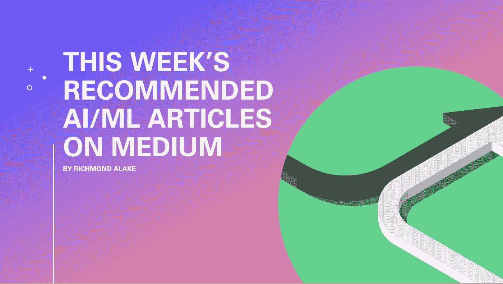

# 本周推荐的关于媒体的 AI/ML 文章(10 月 17 日)

> 原文：<https://towardsdatascience.com/interesting-ai-ml-articles-you-should-read-this-week-oct-17-b0fc3c8cf748?source=collection_archive---------35----------------------->

## 强烈推荐的文章，对人工智能和机器学习感兴趣的个人应该读一读。

我还没有决定我对媒体网络平台新设计的立场。不过不得不承认，看到一个与众不同的首页和文章呈现风格，还是挺让人耳目一新的。

更让人耳目一新的是我这周偶然看到的发人深省的文章，当然都是与人工智能和机器学习相关的。

以下是我本周推荐的文章的简要描述:

*   [维克多·BASU](https://medium.com/u/4dd47cfbee36?source=post_page-----b0fc3c8cf748--------------------------------)将数据科学和机器学习技术应用于网络安全用例。在他写得很好的文章中，Victor 详细介绍了使用 ML 检测 DDoS 攻击的实现和过程。
*   [Christopher Potts](https://medium.com/u/5fd85bd5c0c4?source=post_page-----b0fc3c8cf748--------------------------------) 写了一篇文章，邀请读者参与关于语言模型实现语言理解的可能性的讨论。
*   [Andre Ye](https://medium.com/u/be743a65b006?source=post_page-----b0fc3c8cf748--------------------------------) 描述了研究人员在开发算法和机器学习模型时采用的一种方法，这些算法和模型可以模拟人类用来学习的过程。
*   Duncan Riach 利用先进的人工智能形式对意识的概念提出了挑战，这种人工智能还将被开发为一个支持性的案例研究。

图片作者:Richmond Alake

***如果你在 Medium 上写 AI/ML 内容，你想让我阅读你的文章，并将其包含在我的每周/每月文章报道中，请随时在你的文章的评论部分给我加标签，或者连接并发送一个链接到***[***LinkedIn***](https://www.linkedin.com/in/richmondalake/)***上的文章。***

# [维克多 BASU](/an-approach-to-detect-ddos-attack-with-a-i-15a768998cf7)[用人工智能](https://medium.com/u/4dd47cfbee36?source=post_page-----b0fc3c8cf748--------------------------------)检测 DDoS 攻击的方法

> **推荐数据科学学生和对网络安全感兴趣的 ML 从业者阅读。**

Victor Basu 记录了一项研究实验，该实验探索了利用机器学习和深度学习技术对 DDoS(分布式拒绝服务)攻击进行分类。黑客使用的标准网络渗透方法。

Victor 的文章将 ML/数据科学技术应用于一个网络安全用例，这是一个随着基于人工智能的应用程序的采用而越来越受欢迎的计算领域。

从这篇文章中可以获得丰富的知识。其中包括人们可能会遇到的典型数据科学项目流程，如数据收集、探索性数据分析或模型实施。

Victor 还包括基本主题，如数据存储管理和培训可视化。

机器学习实践者将欣赏 Victor 实现的检测 DDoS 攻击的通用方法。实验涵盖了有监督和无监督的最大似然分类方法。

文章中提供了相关的代码片段和可视化材料。

 [## 一种利用人工智能检测 DDoS 攻击的方法

### DDoS 攻击是互联网上最强大的黑客技术之一。黑客使用的基本武器…

towardsdatascience.com](/an-approach-to-detect-ddos-attack-with-a-i-15a768998cf7) 

# 语言模型有可能实现语言理解吗？作者[克里斯托弗·波茨](https://medium.com/u/5fd85bd5c0c4?source=post_page-----b0fc3c8cf748--------------------------------)

> **NLP 从业者推荐读物。**

克里斯托弗的文章是他透露将于本月晚些时候举行的一次演讲的概要。演讲本身关注的是语言模型获得语言理解的能力。

克里斯托弗在他的文章中表示，他愿意参与可能会动摇他当前对该主题的思维过程的讨论。

除了本文对作者的个人意义之外，本文还提供了与作为机器学习任务的语言建模相关的主题的介绍性和上下文信息。出于这个原因，Christopher 的文章是一篇引人入胜的文章，超越了人们在撰写自然语言处理相关主题时会遇到的常见技术细节。

我恳求 NLP 从业者和好奇的 ML 爱好者参与 Chistoper 在他的文章中表达的观点和意见的讨论。

这篇文章出色地探索了可能的讨论点，即为什么语言模型的局限性限制了它们产生“T6”理解的能力。

 [## 语言模型有可能实现语言理解吗？

### 10 月底，我应邀在安海关于 OpenAI 的 GPT-3 项目的研讨会上发表了一些讲话。我选择了…

medium.com](https://medium.com/@ChrisGPotts/is-it-possible-for-language-models-to-achieve-language-understanding-81df45082ee2) 

# [深度学习迫切需要的人类大脑:零起点学习指南](https://medium.com/@andre_ye/what-the-human-brain-has-that-deep-learning-desperately-needs-a-guide-to-zero-shot-learning-2e296741ce51)作者[安德烈·叶](https://medium.com/u/be743a65b006?source=post_page-----b0fc3c8cf748--------------------------------)

> **向对探索未开发的研究领域感兴趣的机器学习从业者推荐 read】**

Andre Ye 的文章描述了研究人员在开发算法和机器学习模型时采用的方法，这些算法和模型可以模拟人类用来学习的过程。

更具体地说，安德烈在本文中描述的技术旨在以某种方式复制人类幼儿所拥有的理解和学习能力的有效衍生。

这篇信息丰富的描述性文章是对正在进行的研究的世界的一个可访问的介绍，这些研究还没有发展成成熟的可应用的技术。

也就是说，Andre 提出和描述的方法可能是机器学习中尚未发现的未来发展起源的一个窗口。

零拍学习技巧对我来说一直是个谜。尽管如此，Andre 还是展示了相关研究论文的关键要点，并通过简单易懂的例子将直觉归纳到技术范式中。

 [## 深度学习迫切需要的人类大脑:零射击学习指南

### 以及令人尴尬的简单 ZSL 算法

medium.com](https://medium.com/@andre_ye/what-the-human-brain-has-that-deep-learning-desperately-needs-a-guide-to-zero-shot-learning-2e296741ce51) 

# [为什么我不相信意识](https://medium.com/swlh/why-i-dont-believe-in-consciousness-4ae16e98bb8f)作者[邓肯·里亚奇](https://medium.com/u/a6fcad104abf?source=post_page-----b0fc3c8cf748--------------------------------)

> **推荐给那些准备挑战自己对现实的观点和想法的人。**

我必须承认，我对意识与水向山下流动的关系的描述感到惊讶。邓肯，在他这篇多少有些启发性的文章的第一段中(看一下评论部分)，将意识传达为存在的一种后续效果，而不是一种无法解释的现象，这种现象证明了人类在这个世界上的独特性。

媒介是一个平台，它展示了个人持有的各种形式的观点和观点，邓肯认为，关于为什么意识的概念不存在的书面解释是令人惊讶的非常翔实，可以作为驳回意识概念的有力论据。

如果你以开放的心态来阅读这篇文章，那将是最好的，因为邓肯非常雄辩地提出了一些可行的概念。邓肯拥有的心理学和人工智能背景的结合，为未来几十年人工智能领域的想法和观点提供了温床。

 [## 为什么我不相信意识

### 人工智能似乎揭示了什么

medium.com](https://medium.com/swlh/why-i-dont-believe-in-consciousness-4ae16e98bb8f) 

# 我希望这篇文章对你有用。

要联系我或找到更多类似本文的内容，请执行以下操作:

1.  订阅我的 [**邮件列表**](https://richmond-alake.ck.page/c8e63294ee) 获取每周简讯
2.  跟我上[中型 ](https://medium.com/@richmond.alake)
3.  通过 [**LinkedIn**](https://www.linkedin.com/in/richmondalake/) 联系我