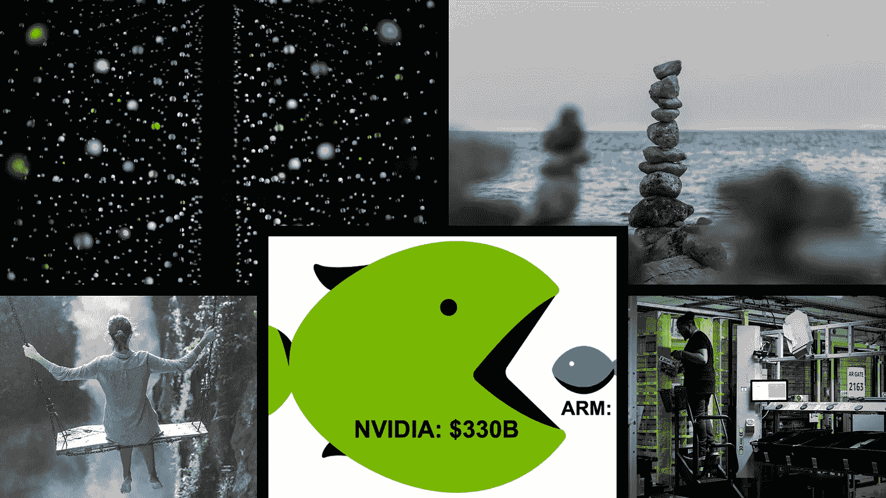

# 本周(10 月 3 日)你应该阅读的有趣的人工智能/人工智能文章

> 原文：<https://towardsdatascience.com/interesting-ai-ml-articles-you-should-read-this-week-oct-3-f113cf2ecbc1?source=collection_archive---------26----------------------->

## 强烈推荐的文章，对人工智能和机器学习感兴趣的个人应该读一读。

2020 年的最后一个季度即将到来，还有什么比阅读 Medium 上的作家写的一些关于 AI/ML 的精彩文章更好的方式呢？

本周的文章包括对英伟达和亚马逊等顶级科技公司的讨论；此外，一些文章关注深度学习主题领域，如项目和模型调整等。

**如果你在 Medium 上写 AI/ML 文章，你希望我阅读你的文章并将其收录到我的每周/每月文章报道中，请随时在文章的评论部分给我加标签，或者在** [**LinkedIn**](https://www.linkedin.com/in/richmondalake/) **上连接并发送文章链接。**

左上:照片由 [Jonas Denil](https://unsplash.com/@jonasdenil?utm_source=medium&utm_medium=referral) 在 [Unsplash](https://unsplash.com/?utm_source=medium&utm_medium=referral) 上拍摄。右上:Valentin Salja[在 Unsplash](https://unsplash.com/@valentinsalja?utm_source=medium&utm_medium=referral)[上的照片](https://unsplash.com/?utm_source=medium&utm_medium=referral)左下:Artem Beliaikin 在 Unsplash[上的照片](https://unsplash.com/photos/8AsKha7aIvk)右下:照片:Philippe Lopez/Getty Images 中:图片来自[文章](https://medium.com/@dmccreary/the-impact-of-nvidia-acquisition-of-arm-on-graph-technologies-76449c8b45f9)

# [英伟达收购 ARM 对 Graph Technologies](https://medium.com/@dmccreary/the-impact-of-nvidia-acquisition-of-arm-on-graph-technologies-76449c8b45f9) 的影响 [Dan McCreary](https://medium.com/u/a9aa135101f4?source=post_page-----f113cf2ecbc1--------------------------------)

Dan McCreary 写了一篇短文，重点介绍了 NVIDIA[最近收购](https://www.nvidia.com/en-gb/) [Arm Holding](https://www.arm.com/) 的好处。

NVIDIA 是大多数机器学习从业者熟悉的公司，另一方面，Arm 可能不那么知名，但 Dan 在这篇文章中做了很好的工作，简要介绍了 Arm 和该公司的目的。

大多数机器学习实践者并不完全关心 GPU 的硬件细节。无论如何，Dan 提供了深度学习领域中 GPU 应用的相关性和影响的简要历史。

Dan 阐述了 GPU 对图像数据处理加速的影响，包括当前硬件在处理稀疏矩阵方面的局限性。

丹在他的文章中提到，英伟达收购 Arm 的原因是，英伟达正在为开发硬件奠定基础，这些硬件可以处理人工智能等领域使用的更复杂的数据表示格式。

本文是广大机器学习从业者的必读之作。Dan 为 ML 工程师日常使用的硬件的未来状态提供了重要的见解和信息。

## 非常适合阅读:

*   *机器学习从业者*
*   *硬件架构师*

 [## 英伟达收购 ARM 对 Graph Technologies 的影响

### 在本文中，我们将关注 NVIDIA 最近以 400 亿美元收购 Arm Holdings。然后我们会看…

medium.com](https://medium.com/@dmccreary/the-impact-of-nvidia-acquisition-of-arm-on-graph-technologies-76449c8b45f9) 

# [作为一名数据科学家，我在 6 个月的时间里学到了什么](/6-months-data-science-e875e69aab0a)

六个月是很短的时间，但在机器学习行业，对于一个人来说，获得宝贵的知识以拥有成功的机器学习生涯已经足够了。 [Nicole Janeway Bills](https://medium.com/u/2caa691701c0?source=post_page-----f113cf2ecbc1--------------------------------) 与 Medium 读者分享了她作为数据科学家的六个月经验。

在这篇文章中，Nicole 谈到了通过阅读研究论文、探索 Github 资源库、听播客和理解机器学习领域的硬件组件所学到的经验。

其中一个让我印象深刻的要点是 Nicole 通过研究机器学习库和包的 Github 问题产生新想法的非正统方法。除了产生想法之外，Nicole 还分享了探索 Github 问题的额外好处，包括了解软件包的弱点，在承诺在项目中使用软件包之前评估软件包开发者社区的活动水平。

尽管大部分关键要点都是技术性的，但 Nicole 最终学到的是典型数据科学家工作互动中的人的因素。Nicole 提到，数据科学家需要识别特定行为的社会科学线索，这些线索在探索与人类或基于人类的活动相关的数据时可能不明显。对人类行为引起的外部因果关系和相关性的理解可以为开发机器学习解决方案的独特方法提供直觉。

## 强烈推荐用于:

*   *数据科学家*

 [## 作为一名数据科学家，我在 6 个月里学到了什么

### 我找到了我梦寐以求的工作。以下是一些关键要点。

towardsdatascience.com](/6-months-data-science-e875e69aab0a) 

# [亚马逊使用自动化来隐藏灾难性的工作场所伤害记录](https://onezero.medium.com/amazon-uses-automation-to-hide-a-disastrous-record-of-workplace-injuries-4920797d9301)作者[布莱恩·麦钱特](https://medium.com/u/21cb6c9e472?source=post_page-----f113cf2ecbc1--------------------------------)

Brian Merchant 写了一篇关于自动化对亚马逊仓库工人的影响的令人大开眼界的文章。

我们大多数人都渴望看到一个世界，在这个世界里，枯燥而平凡的任务被自动化，由机器人来处理。

对于大多数机器学习从业者来说，自动化的未来并非源于懒惰，而是来自于工程师对令人印象深刻的知识、技术和机械能力的应用，以解决重复性任务。

我们都听说过自动化和人工智能必将在未来几十年开始的工作启示录，但许多人可能忘记了人类目前在试图跟上机器人同行时所遭受的伤害。

布莱恩的文章探讨了自动化和亚马逊(Amazon)等企业巨头的努力导致的工作场所伤害这一主题，以压制受压迫者的声音，因为机器人和自动化提供了更高效、更快速的交付系统。

## 激动人心的读物:

*   *技术专家*
*   *未来学家*

 [## 亚马逊使用自动化来隐藏工作场所伤害的灾难性记录

### 随着机器人化规模的扩大，伤害也在增加

onezero.medium.com](https://onezero.medium.com/amazon-uses-automation-to-hide-a-disastrous-record-of-workplace-injuries-4920797d9301) 

# [最有趣的 5 个机器学习和深度学习项目](https://medium.com/@m.fortitudo.fr/5-mind-blowing-machine-learning-deep-tech-projects-b33479318986)作者[冉(Reine)](https://medium.com/u/441e7a0a4faa?source=post_page-----f113cf2ecbc1--------------------------------)

冉(Reine) 策划了一系列有趣的 ML/DL 项目，这些项目在应用方面独树一帜，显示出巨大的潜力。

每个包含的项目都由项目作者对直觉和方法的技术解释来补充。Ran 包含的资源提供了每个项目的更多信息和见解，因此好奇的读者可以进一步探索每个项目和细节。

包含的项目有各种各样的 ML 主题，例如自然语言处理(NLP)、语音识别、图像字幕和通过 GANs 生成图像。

机器学习实践者可以从这篇文章中受益，将其作为个人项目和学习的灵感来源。

## 非常适合阅读:

*   *机器学习从业者*

 [## 5 个令人兴奋的机器学习/深度技术项目

### 包括每个产品的技术摘要

medium.com](https://medium.com/@m.fortitudo.fr/5-mind-blowing-machine-learning-deep-tech-projects-b33479318986) 

# [通过观察偏差和方差](/systematically-tuning-your-model-by-looking-at-bias-and-variance-4986662315b2)系统地调整你的模型[塞巴斯蒂安·波利亚克](https://medium.com/u/7ef3d5041acc?source=post_page-----f113cf2ecbc1--------------------------------)

超参数调整和优化的主题在大多数机器学习实践者手册中很常见。

机器学习实践者通常训练一个神经网络，并遍历一组学习速率、批量大小、层数等的值。这个过程可以一丝不苟。

[Sebastian Poliak](https://medium.com/u/7ef3d5041acc?source=post_page-----f113cf2ecbc1--------------------------------) 写了一种不同的方法来调整模型，这种方法可能比传统的网格或随机搜索方法更容易搜索超参数值空间。

Sebastian 引入了观察偏差和方差的操作，以将模型调整到最佳性能。Sebastian 系统调整模型的方法补充了几个易于实现的代码片段，这些代码片段演示了通过几种方法减少偏差和方差的效果，如增加神经元的数量或向网络添加正则化。

## 推荐阅读:

*   *数据科学家*

 [## 通过观察偏差和方差来系统地调整你的模型

### 有没有想过是否有比盲目猜测超参数或…更系统的方法来调整您的模型

towardsdatascience.com](/systematically-tuning-your-model-by-looking-at-bias-and-variance-4986662315b2) 

# 我希望这篇文章对你有用。

要联系我或找到更多类似本文的内容，请执行以下操作:

1.  订阅我的 [**邮件列表**](https://richmond-alake.ck.page/c8e63294ee) 获取每周简讯
2.  跟我上[中型 ](https://medium.com/@richmond.alake)
3.  通过 [**LinkedIn**](https://www.linkedin.com/in/richmondalake/) 联系我