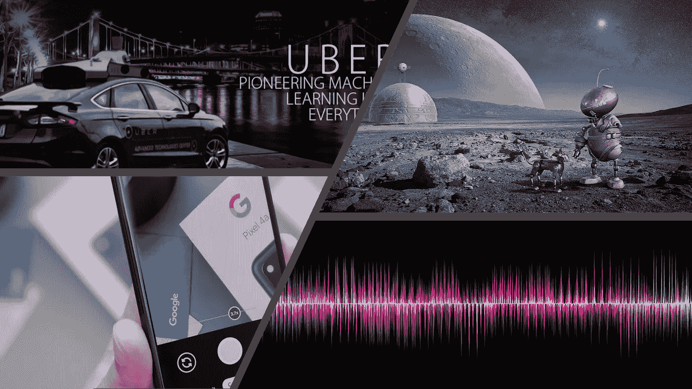

# 本周(9 月 12 日)你应该阅读的有趣的人工智能/人工智能文章

> 原文：<https://towardsdatascience.com/interesting-ai-ml-articles-you-should-read-this-week-sep-11-22904b312b8c?source=collection_archive---------50----------------------->

## 优步，谷歌，声音分类和空间探索人工智能，这些都是本周有趣的人工智能/人工智能文章的主题。

如果本周你还不能消费一些高质量的商品，那么我会帮你搞定的。

以下是我在 Medium 上看到的四篇文章。所有包含的文章都包含与人工智能或机器学习相关的内容。

下面列表中的一篇文章探讨了天外来客不是以小绿人的形式出现，而是更多地以人工形式出现的可能性。一想到宇宙中存在基于人工智能的高级文明，我就想起了电影《湮没》中的太空人工智能入侵者。

所有包含的文章都非常翔实，值得你花时间。

左上:来源:[https://neuro hive . io/en/news/manifold-visual-debugging-tool-for-machine-learning-at-Uber/](https://neurohive.io/en/news/manifold-visual-debugging-tool-for-machine-learning-at-uber/)。右上:(Pixabay，KELLEPICS)。左下:[丹尼尔·罗梅罗](https://unsplash.com/@rmrdnl?utm_source=unsplash&utm_medium=referral&utm_content=creditCopyText)在 [Unsplash](https://unsplash.com/?utm_source=unsplash&utm_medium=referral&utm_content=creditCopyText) 上的照片。右下:图片来自 [Pixabay](https://pixabay.com/?utm_source=link-attribution&utm_medium=referral&utm_campaign=image&utm_content=856771) 的 [CSTRSK](https://pixabay.com/users/CSTRSK-642467/?utm_source=link-attribution&utm_medium=referral&utm_campaign=image&utm_content=856771)

## 本周的文章包含以下内容:

*   *优步开发的 AI 开源工具和软件套件综述*
*   *简要了解人工智能在几款谷歌产品中是如何被利用的*
*   一篇发人深省的文章，探讨了外星生命的形式可能是人工的，而不是广为接受的生物形式。
*   *用神经网络进行声音分类的技术教程*

# [概述优步对开源机器学习的重大贡献，作者 Jesus Rodriguez](https://medium.com/dataseries/an-overview-of-ubers-impressive-contributions-to-open-source-machine-learning-cfb6eabd12ac)

> “优步开发的人工智能开源工具和软件套件述评”

[Jesus Rodriguez](https://medium.com/u/46674a2c9422?source=post_page-----22904b312b8c--------------------------------) 讲述了他最喜欢的优步开发的开源工具，这些工具专注于人工智能过程，如模型训练、模型实现、编程语言、解释和可解释性等。

根据 Jesus 的说法，优步是拥有企业实验室的科技公司之一，为人工智能开源社区贡献了大量的知识和工具。

专注于交通运输的科技公司优步遇到了一系列问题，这些问题可以通过使用技术和深度学习技术来解决。优步是应用深度学习技术解决自动驾驶汽车、车道检测、行人检测等交通相关问题的领先力量。

耶稣在他的文章中包括了优步开发的工具，如[路德维希](https://github.com/uber/ludwig)、[火神](http://pyro.ai/)、[歧管](https://github.com/uber/manifold)、[柏拉图](https://github.com/uber-research/plato-research-dialogue-system)等。

除了详细描述每个工具的用途，Jesus 还提供了机器学习从业者如何利用每个工具以及指导每个工具目标的一般原则。

## 非常适合阅读:

*   *机器学习工程师*
*   *AI 爱好者*

 [## 优步对开源机器学习的重大贡献概述

### 这家运输巨头为机器学习领域做出了重大的开源贡献。

medium.com](https://medium.com/dataseries/an-overview-of-ubers-impressive-contributions-to-open-source-machine-learning-cfb6eabd12ac) 

# [克莱尔·d·科斯塔的《为谷歌产品提供动力的人工智能》](/artificial-intelligence-powering-google-products-18e191da88d0)

> “简单了解人工智能在几个谷歌产品中是如何被利用的”

根据 Claire D. Costa 的说法，谷歌声称他们的旗舰搜索引擎和其他广泛使用的产品的大部分进步都源于采用基于人工智能的技术和技巧。

带着“*将人工智能的好处带给每个人*”的首要目标，克莱尔的文章简要探讨了谷歌投资人工智能的最初驱动力。

Claire 文章的主要内容探索了 12 个具有某种形式的嵌入式人工智能的谷歌知名产品。文章中包含的产品从硬件到软件都有，每个产品都以一个类似于简介的形式呈现，包括发布日期、开发语言、访问 URL 等等。

这篇文章简要介绍了人工智能在谷歌的几个产品中是如何被利用的。

每个产品的描述都是用通俗易懂的语言编写的，这使得大多数读者都可以轻松地阅读本文的内容。

## 适合阅读:

*   *技术专家*

 [## 人工智能为谷歌产品提供动力

### 看看 AI 是如何深度融入谷歌产品的

towardsdatascience.com](/artificial-intelligence-powering-google-products-18e191da88d0) 

# [外星生命会是人造的吗？贡纳尔·德温特](https://medium.com/predict/will-alien-life-be-artificial-4ea60c5082ba)

> "一篇发人深省的文章，探讨了外星生命的形式可能是人工的，而不是广为接受的生物形式。"

当你仰望星空时，你可能会想宇宙中还有多少文明。嗯，[贡纳尔·德温特](https://medium.com/u/fe5a78ad5b67?source=post_page-----22904b312b8c--------------------------------)在这篇文章中介绍了德雷克方程。德雷克方程提供了宇宙中外星文明数量的数字范围。

文章的主体介绍了这样一种思想，即人类可能不得不摆脱他们的生物形态来探索宇宙的深处。

贡纳还介绍了一项研究，该研究修改了德雷克方程，以适应一个参数，该参数指向一个发展了太空探索人工智能的高级文明。

这篇文章围绕人工智能、生物学和太空领域展开，但它保持了一种简单的方法来说明科幻般的场景和未来的结果。

## 有趣的读物:

*   *未来学家*

 [## 外星生命会是人造的吗？

### 德雷克方程是估算地外文明数量的一个(非常粗略的)指南，但它也可能…

medium.com](https://medium.com/predict/will-alien-life-be-artificial-4ea60c5082ba) 

# [舒巴姆·古普塔利用神经网络进行城市声音分类](/urban-sound-classification-using-neural-networks-9b6fcd8a9150)

> “用神经网络进行声音分类的优秀技术教程”

我一直想知道苹果的开发者是如何在苹果智能手表上创造出洗手功能的，当你洗手的时候，这个功能就会被激活；看起来，Shubham Gupta 的文章已经提供了一些答案。

Shubham 写了一篇技术文章，重点是指导读者如何为城市声音分类开发机器学习模型。实现的模型对声音进行分类，如警笛声、音乐、钻孔声和狗叫声。

Shubham 利用 Numpy、Pandas、Keras 等工具，通过神经网络实现声音分类的目标。

数据集源代码和代码片段的提供使本文成为许多机器学习实践者都可以从事的一个简单项目。

## 非常适合阅读:

*   *机器学习从业者*
*   *机器学习学生*

 [## 基于神经网络的城市声音分类

### 每天我们都会听到不同的声音，这是我们生活的一部分。人类可以很容易地区分声音，但是如何…

towardsdatascience.com](/urban-sound-classification-using-neural-networks-9b6fcd8a9150) 

# 我希望这篇文章对你有用。

要联系我或找到更多类似本文的内容，请执行以下操作:

1.  订阅我的 [**邮件列表**](https://richmond-alake.ck.page/c8e63294ee) 获取每周简讯
2.  跟我上 [**中**](https://medium.com/@richmond.alake)
3.  通过 [**LinkedIn**](https://www.linkedin.com/in/richmondalake/) 联系我