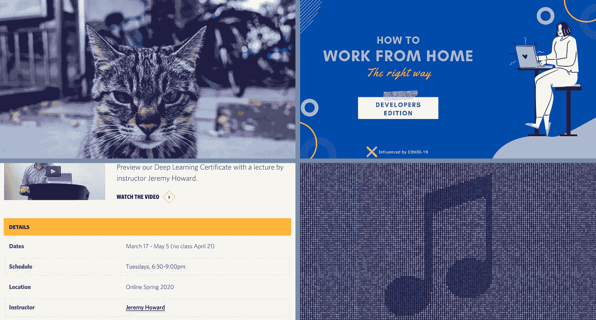

# 本周(5 月 2 日)偶然看到的有趣的 AI/ML 相关文章

> 原文：<https://towardsdatascience.com/interesting-ai-ml-related-articles-i-came-across-this-week-41b2f08a3531?source=collection_archive---------58----------------------->

## 由于我们大多数人都有更多的空闲时间，高亮显示的文章对那些想学习新东西或只想寻找分散注意力的内容的人来说是有用的

有趣的文章封面图片拼贴

人工智能的世界从不睡觉，Medium 上有更多好奇、聪明、有激情的作家写的有趣的文章。

由于封锁，许多人有了更多的空闲时间，我在媒体上看到的高质量和信息量也在增加。可悲的是，我只能写一些。

做好准备，迎接涵盖以下主题的作家:

*   **机器学习工程师的灭绝**
*   **非法音乐**
*   **我们都需要的在家工作小贴士**
*   **免费学习资料**

*享受。*

# 机器学习工程师 10 年后将不复存在

卢克·波西[关于软件行业中机器学习工程师角色的寿命问题的一篇有趣的观点文章。](https://medium.com/u/afde3432bf28?source=post_page-----41b2f08a3531--------------------------------)

老实说，当我看到标题时，我觉得有点被触发了。但是看了文章的内容，我就明白路加是从哪里来的了。

卢克对机器学习角色消失的看法是基于这样一个事实，即与 ML 工程相关的职责将合并到更广泛的软件工程角色中。

这篇文章是一个对话的开始，因为 ML 工程师的角色是广泛的，并且因公司而异。Luke 承认这个角色没有行业标准的描述，所以他提供了你在招聘信息中会遇到的 ML 工程角色的三个典型要求。

卢克还指出了一个很好的观点，那就是，由于机器学习本身所包含的模糊性，人工智能工程师的角色可能会存在。这就引出了这样一句话:“因此，在许多情况下，ML 工程师一半是研究员，一半是工程师”。

这是我每天生活中的一个事实，尽管有人可能会说平衡不一定是 50/50。

Luke 的观点集中在这样一个概念上，即随着越来越多的人开始理解 ML，对 ML 工程师这样的模糊角色的需求可能会减少，而这个角色本身将被更广泛的软件工程角色需求所吞没。

我仅仅触及了卢克·波西观点的皮毛。

 [## 10 年后机器学习工程师将不复存在。

### 景观正在迅速演变。

towardsdatascience.com](/machine-learning-engineers-will-not-exist-in-10-years-c9cbbf4472f3) 

# Deepfake 音乐太棒了，以至于可能被[戴夫·格什格恩](https://medium.com/u/dc17621a577f?source=post_page-----41b2f08a3531--------------------------------)非法播放

Deepfake 正在重新成为人们关注的焦点，特别是当世界著名的[说唱歌手 Jay Z 对 YouTube 上描述自己属性的 deepfake 内容采取行动](https://www.nme.com/news/music/jay-z-takes-legal-action-against-creator-of-deepfakes-of-him-rapping-hamlet-and-billy-joel-2657120)。

Dave Gershgorn 文章围绕 deepfakes 的法律方面以及过去针对不属于检察官的一方使用类似创作/音乐风格而采取的法律行动。

戴夫的文章提供了一首人工智能生成的歌曲的例子，它与人类生成的音乐难以区分(*听一听，你会感到惊讶*)。

人工智能生成的音乐和 deepfakes 的主要问题是保留在生成的音乐中的艺术风格的残余。这开启了法律行动和版权侵权诉讼的世界。

戴夫提供了现实生活中的法律案件场景，这些案件涉及由于人类音乐风格的相似性而对一方采取的法律行动。

决定人工智能是否不受人类法律约束是一条模糊的线。这绝对是一个灰色地带，没有坚实的联邦法律法规基础可以借鉴。目前，针对 deepfakes 和人工智能的法律诉讼已经结案。

 [## Deepfake 音乐太棒了，可能是非法的

### 和本周其他有趣的人工智能研究

onezero.medium.com](https://onezero.medium.com/deepfake-music-is-so-good-it-might-be-illegal-c11f9618d1f9) 

# 如何在家工作——Semi Koen[开发商版](https://medium.com/u/aabf98f9b9a?source=post_page-----41b2f08a3531--------------------------------)

我很高兴我看到了这篇文章，因为它是非常需要的。这篇文章的许多读者可能是开发人员，或者他们的工作性质使他们一天中的大部分时间都只能呆在电脑屏幕前。因此，这些信息对大多数人来说是无价的。

在家工作时，你不需要知道或做太多事情，你只需要坐在桌子上(*或躺在床上*)，像往常一样继续工作。对我和许多其他人来说，问题在于生产率和效率。

Semi 提供了五个小贴士，有助于让在家工作变得更加轻松和富有成效。她还包括有助于提供适当的在家工作环境的工具和技术。

在阅读了文章中的提示后，我意识到我可能没有最好的工作环境来提高工作效率和生产力。

但是，本文中不仅有一些容易立即实施的技巧，而且还有一些个人回忆和怪癖，它们会对你的工作成果产生很大的影响。

这篇文章帮助我设计了一个更好的工作环境，通常关注健康、沟通、生产力和时间管理。

如果你是一名开发人员，你会发现一两个可以改善你当前工作环境的技巧。

 [## 如何在家工作—开发者版

### 面向开发人员的 5 个 WFH 生产力技巧

towardsdatascience.com](/how-to-work-from-home-developers-edition-5bb4078cc6a3) 

# 价值 2000 美元的深度学习课程笔记本现在由 [B. Chen](https://medium.com/u/563d09da62a?source=post_page-----41b2f08a3531--------------------------------) 开源

下一篇文章并不像列表中的大多数文章那样发人深省。尽管如此，我发现这篇文章很有趣，因为信息和知识的曝光应该总是被广播，尤其是如果知识是免费的。

我不需要对这篇文章进行深入的分析，因为文章本身就有事实依据。

[B. Chen](https://medium.com/u/563d09da62a?source=post_page-----41b2f08a3531--------------------------------) 曝光了一个 [GitHub 知识库](https://github.com/fastai/fastbook)，其中包含来自 [Jermey Howard 的](https://www.linkedin.com/in/howardjeremy/)尚未发布的关于深度学习的书的代码片段。

2000 美元的价值基于[课程](https://www.usfca.edu/data-institute/certificates/deep-learning-part-one)，以及在杰瑞米·霍华德的帮助下成功完成深度学习课程后授予的证书。

GitHub 存储库包含补充课程关键信息的实现。

这篇文章提供了更多的信息并解释了存储库的本质。很多深度学习的学生应该对呈现的内容给予一定的关注。

 [## 价值 2000 美元的深度学习课程笔记本现已开源

### 这些笔记本构成了 fast.ai 创始人杰瑞米·霍华德新书的基础，并用于价值 2000 澳元的深度…

towardsdatascience.com](/deep-learning-course-notebooks-worth-2-000-are-now-open-source-7d6bc759ef47) 

# 其他有趣的文章

**了解 A.I .，ML，DL 的区别！！由** [到**鲁帕罗伊**到](https://medium.com/u/d2f9ffc25d66?source=post_page-----41b2f08a3531--------------------------------)

 [## 理解 A.I .，ML 和 DL 的区别！！

### 我很肯定我们大多数人可能对“人工智能”这个术语很熟悉，因为它一直是…

towardsdatascience.com](/understanding-the-difference-between-ai-ml-and-dl-cceb63252a6c) 

**斯普林格已经免费发布了 65 本机器学习和数据书籍，作者** [**尤里·埃里亚巴耶夫**](https://medium.com/u/96c2782d5c6e?source=post_page-----41b2f08a3531--------------------------------)

 [## 斯普林格已经免费发布了 65 本机器学习和数据书籍

### 数百本书现在可以免费下载

towardsdatascience.com](/springer-has-released-65-machine-learning-and-data-books-for-free-961f8181f189) 

**如果我必须重新开始学习数据科学，我会怎么做？由** [**圣地亚哥·巴斯克斯·塞古拉**](https://medium.com/u/85c82fdad717?source=post_page-----41b2f08a3531--------------------------------)

 [## 如果让我重新开始学习数据科学，我会怎么做？

### 几天前，我开始思考是否要重新学习机器学习和数据科学…

towardsdatascience.com](/if-i-had-to-start-learning-data-science-again-how-would-i-do-it-78a72b80fd93)