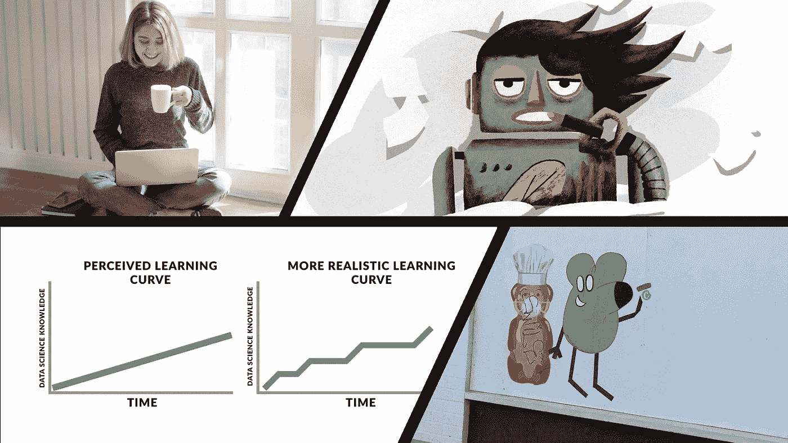

# 本周(5 月 16 日)偶然看到的有趣的 AI/ML 相关文章

> 原文：<https://towardsdatascience.com/interesting-ai-ml-related-articles-i-came-across-this-week-9a4bb2c8d973?source=collection_archive---------39----------------------->

## 意见

## 四篇文章涵盖了我本周感兴趣的机器学习主题…包括人工智能生成的性爱诗歌

从封面文章中收集封面图片

我仍然处于相对的封锁措施之下(*正在慢慢放松*)，所以我在媒体上消费的内容量仍然处于历史最高水平。

本周，我遇到了许多有创意的文章，展示了数据科学家和机器学习工程师的技能，以及该领域呈现的可能性。

我设法写了几篇有趣的文章，是我一个多星期来偶然发现的。

本周，我发现了许多有趣的文章，其中包括性爱诗歌、艺术技巧的解释和职业建议。我要感谢 Medium 上的这些作者，他们制作了高质量的内容，激发了灵感和指导……以及急需的分心。

## 我让人工智能给我写性爱诗，作者是[本杰明·戴维斯](https://medium.com/u/78527c9725fa?source=post_page-----9a4bb2c8d973--------------------------------)

有人用 AI 生成性爱诗只是时间问题；我唯一惊讶的是，有人没有更早这样做。本杰明·戴维斯在很少有人涉足的地方冒险。虽然 AI 产生诗意或小说般的内容也不是[闻所未闻](https://www.theatlantic.com/technology/archive/2018/10/automated-on-the-road/571345/)。

本杰明已经挖掘了之前被认为[太强大而无法发布](https://www.theguardian.com/technology/2019/feb/14/elon-musk-backed-ai-writes-convincing-news-fiction) GPT2 AI 模型的力量。

通过向网站 [TalkToTransformer](https://talktotransformer.com/) 中呈现的界面输入短语，本杰明生成了一系列完全由人工智能创作的诗歌和创造性写作。

通过向人工智能系统输入遵循“性别是 __”模式的短语，本杰明发现系统的反馈有时令人瞠目结舌。它回避了一个问题:什么训练数据被用来训练这个人工智能系统,《五十度灰》?

向人工智能提供挑衅性的短语，从而产生一系列有趣的富有想象力的、小说般的和诗意的结构，这些结构似乎散发出人类直觉和创造力的某些方面。多么奇怪。

如果你想从教程和研究论文中解脱出来，那么这篇文章是打发时间的绝佳读物，也许还能学到一两件关于创造性写作的事情。

 [## 我让一个人工智能给我写性爱诗

### 这些阴暗、肮脏、又出奇温柔的性爱诗，完全是安艾写的。

psiloveyou.xyz](https://psiloveyou.xyz/i-made-an-ai-write-me-sex-poems-7b124654e494) 

## 学习数据科学的阶段 [Ken Jee](https://medium.com/u/6ee1f7466557?source=post_page-----9a4bb2c8d973--------------------------------)

[肯吉](https://medium.com/u/6ee1f7466557?source=post_page-----9a4bb2c8d973--------------------------------)强调了学习时可以经历的五个阶段。通过他结构良好的书面文章，他设法将每个阶段与数据科学家可能经历的事情联系起来。

任何试图学习特定专业领域的思想和概念的人都会意识到学习者经历的困难和轻松的循环。Ken 的文章详细阐述了学习过程中的这些循环。

五个学习阶段中的四个阶段侧重于学习者的能力水平，并在相当罕见的“*精通*”水平结束。

我很高兴 Ken 打开了这篇文章，谈到新学习者的天真和无知，他们认为整个数据科学可以塞进一两门课程，viola 你是一名数据科学家！

认为数据科学或任何机器学习领域都是可以匆忙进行的想法是许多人的受害者，包括我在内。

通过在每个学习阶段加入自己的经验，Ken 补充了每个阶段的技巧和建议，以便在困难时刻保持并进入下一个阶段。

本文提出的建议包括建议学习者记住他们的学习目的；保持一致性，专注于基本技能。这个建议是相关的，甚至对于有经验的数据科学家也是如此。

这篇文章适合所有级别的数据科学家阅读。如果你是一个喜欢 YouTube 视频的视觉型人士，那么这里有一个涵盖本文内容的[链接](https://youtu.be/hpMc6TgT34I)。

 [## 学习数据科学的阶段

### 如何在关键学习点“摆脱困境”

towardsdatascience.com](/the-stages-of-learning-data-science-3cc8be181f54) 

## YOLOv4 作者[乔纳森·许](https://medium.com/u/bd51f1a63813?source=post_page-----9a4bb2c8d973--------------------------------)

[Jonathan Hui](https://medium.com/u/bd51f1a63813?source=post_page-----9a4bb2c8d973--------------------------------) 是人工智能和深度学习领域的知名作家。他的最新文章基于最近发布的 YOLOv4，这是一种最先进的对象检测方法。

对于那些可能不知道的人来说，对象检测是一项常见的计算机视觉任务，涉及到开发一个可以识别图像或一系列图像中的内容(如猫、狗、汽车)的系统。

Jonathan 的文章对 YoloV4 对象检测技术中的思想和技术进行了分析。他触及了神经网络架构的基本组成，同时在必要的地方提供了解释。这篇文章有丰富的图像和图表，有助于说明神经网络架构设计。

这是一篇文章，提供了深度学习术语和概念的信息和一些基本定义，您一定会在其他艺术技术中遇到，如密集块、空间金字塔池层、正则化技术等。

对于一般的深度学习实践者来说，这篇文章可能需要一段时间才能看完，但它是一篇值得重温并保存到您的阅读列表中的文章。

 [## YOLOv4

### 虽然对象检测在过去几年中逐渐成熟，但竞争仍然激烈。如下图，YOLOv4 声称…

medium.com](https://medium.com/@jonathan_hui/yolov4-c9901eaa8e61) 

## 马丁·安德松·阿伯格用 7 个数据点编制成功媒体作家的神奇公式

有什么比使用 Medium writers 作为案例研究更好的方式来展示您的数据科学和分析技能呢？

[马丁·安德松·阿伯格](https://medium.com/u/864fda338dba?source=post_page-----9a4bb2c8d973--------------------------------)通过巧妙利用特定媒体作者的统计数据和指标，成功吸引了媒体数据科学和写作社区的关注。

马丁提出了一个有数据支持的公式，根据从一些受欢迎的媒体作家那里收集和分析的数据点，在媒体上创作成功的文章，这些作家包括[祖列·雷恩](https://medium.com/u/14d5c41e0264?source=post_page-----9a4bb2c8d973--------------------------------)、[蒂姆·丹宁](https://medium.com/u/b6d641be1066?source=post_page-----9a4bb2c8d973--------------------------------)和[香农·阿什利](https://medium.com/u/be08b013cc2a?source=post_page-----9a4bb2c8d973--------------------------------)。

配备了 Python 和一些可视化工具，Martin 专注于数据点，如作者的兴趣、标题字数、帖子阅读时间和发布频率。所有这些数据点为每个作家的理想文章提供了一个个人的“神奇公式”。

也许 Martin 可以创建一个 web 界面，提供对其程序功能的简单访问。

这篇文章发表在《更好的营销》杂志上。尽管如此，我还是忍不住认为，通过接触本文中数据分析方法的代码实现，它会在《走向数据科学》出版物中找到自己的位置。我确信数据科学界将会被这种展示个人技能的创造性方法所鼓舞。

这篇文章不是机器学习或数据科学文章，但马丁程序的壮举足以激励数据科学家探索更具创造性的数据分析方法。

 [## 7 个数据点编译成功媒体作家的神奇公式

### 用数据分析为什么三位顶级作家如此成功

medium.com](https://medium.com/better-marketing/7-ways-you-can-find-the-magic-formula-of-great-successful-writers-d32001d6ac4e) 

# 希望这篇文章对你有用。

要联系我或找到更多类似本文的内容，请执行以下操作:

1.  订阅我的 [**YouTube 频道**](https://www.youtube.com/channel/UCNNYpuGCrihz_YsEpZjo8TA) 即将上线的视频内容 [**这里**](https://www.youtube.com/channel/UCNNYpuGCrihz_YsEpZjo8TA)
2.  跟我上 [**中**](https://medium.com/@richmond.alake)
3.  通过 [**LinkedIn**](https://www.linkedin.com/in/richmondalake/) 联系我